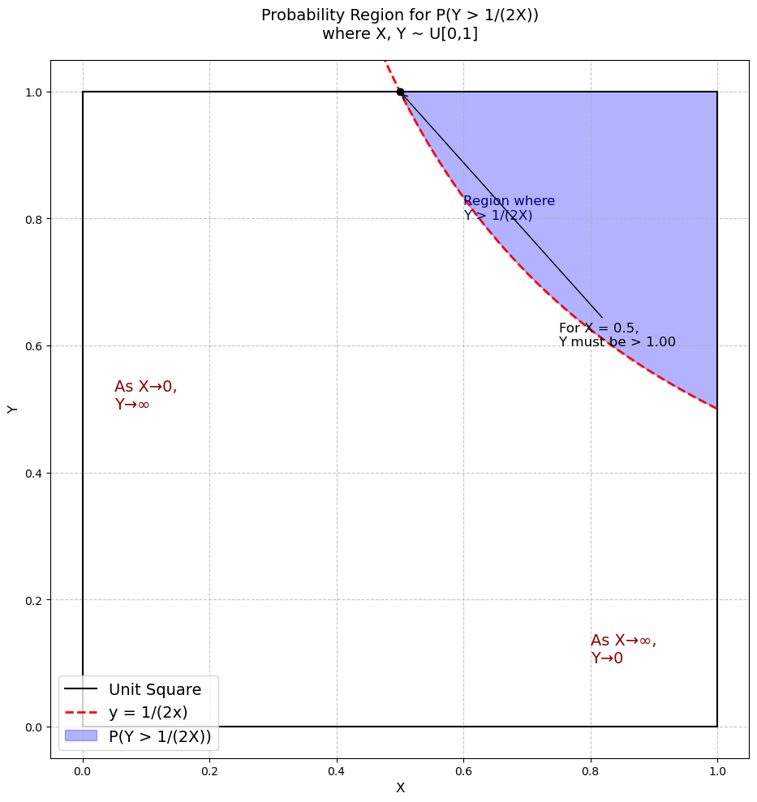

# Question 1:

> $$ \text{If we have two independent random variables, } X \text{ and } Y, \text{ each drawn from a uniform distribution on } [0, 1], \text{ what is the probability that their product is greater than } \frac{1}{2}? $$
> _*Ref: Heard on the Street 4.2*_

## Solution

Let $X$ and $Y$ be independent random variables, each uniformly distributed on $[0, 1]$. The joint probability density function (PDF) of $X$ and $Y$ is given by:

$$
 f_{X,Y}(x, y) = 1, \quad 0 \leq x \leq 1, \; 0 \leq y \leq 1.
$$

We need to calculate the probability:

$$
 P(X \cdot Y > \frac{1}{2}).
$$

The region $X \cdot Y > \frac{1}{2}$ can be described geometrically in the unit square $[0, 1] \times [0, 1]$. The inequality $X \cdot Y > \frac{1}{2}$ corresponds to the area below the hyperbolic curve $x \cdot y = \frac{1}{2}$.

We calculate the probability by integrating the joint PDF over this region:

$$
 P(X \cdot Y > \frac{1}{2}) = \int_{0}^{1} \int_{\frac{1}{2x}}^{1} f_{X,Y}(x, y) \, dy \, dx.
$$

Since $f_{X,Y}(x, y) = 1$, this simplifies to:

$$
 P(X \cdot Y > \frac{1}{2}) = \int_{0}^{1} \int_{\frac{1}{2x}}^{1} 1 \, dy \, dx.
$$

1. The bounds of integration depend on the hyperbolic curve $x \cdot y = \frac{1}{2}$.
   - For $0 < x \leq \frac{1}{2}$, $y$ ranges from $0$ to $1$.
   - For $\frac{1}{2} < x \leq 1$, $y$ ranges from $\frac{1}{2x}$ to $1$.

Thus, the probability becomes:

$$
 P(X \cdot Y > \frac{1}{2}) = \int_{0}^{\frac{1}{2}} \int_{0}^{1} 1 \, dy \, dx + \int_{\frac{1}{2}}^{1} \int_{\frac{1}{2x}}^{1} 1 \, dy \, dx.
$$

2. Compute each term separately:

   - For the first term:

   $$
   \int_{0}^{\frac{1}{2}} \int_{0}^{1} 1 \, dy \, dx = \int_{0}^{\frac{1}{2}} \left[ 1 - 0 \right] \, dx = \int_{0}^{\frac{1}{2}} 1 \, dx = \left[x\right]_{0}^{\frac{1}{2}} = \frac{1}{2}.
   $$

   - For the second term:

   $$
   \int_{\frac{1}{2}}^{1} \int_{\frac{1}{2x}}^{1} 1 \, dy \, dx = \int_{\frac{1}{2}}^{1} \left[1 - \frac{1}{2x}\right] \, dx = \int_{\frac{1}{2}}^{1} \left(1 - \frac{1}{2x}\right) \, dx.
   $$

   Split the integral:

   $$
   \int_{\frac{1}{2}}^{1} \left(1 - \frac{1}{2x}\right) \, dx = \int_{\frac{1}{2}}^{1} 1 \, dx - \int_{\frac{1}{2}}^{1} \frac{1}{2x} \, dx.
   $$

   Compute each term:

   $$
   \int_{\frac{1}{2}}^{1} 1 \, dx = \left[x\right]_{\frac{1}{2}}^{1} = 1 - \frac{1}{2} = \frac{1}{2}.
   $$

   $$
   \int_{\frac{1}{2}}^{1} \frac{1}{2x} \, dx = \frac{1}{2} \int_{\frac{1}{2}}^{1} \frac{1}{x} \, dx = \frac{1}{2} \left[\ln(x)\right]_{\frac{1}{2}}^{1} = \frac{1}{2} \left(\ln(1) - \ln(\frac{1}{2})\right) = \frac{1}{2} \left(0 - (-\ln(2))\right) = \frac{1}{2} \ln(2).
   $$

   Combine the results:

   $$
   \int_{\frac{1}{2}}^{1} \left(1 - \frac{1}{2x}\right) \, dx = \frac{1}{2} - \frac{1}{2} \ln(2).
   $$

3. Add the results:

$$
 P(X \cdot Y > \frac{1}{2}) = \frac{1}{2} + \left(\frac{1}{2} - \frac{1}{2} \ln(2)\right) = 1 - \frac{1}{2} \ln(2).
$$

#### Final Answer:

$$
 \boxed{P(X \cdot Y > \frac{1}{2}) = 1 - \frac{1}{2} \ln(2). \approx 0.1534}
$$

