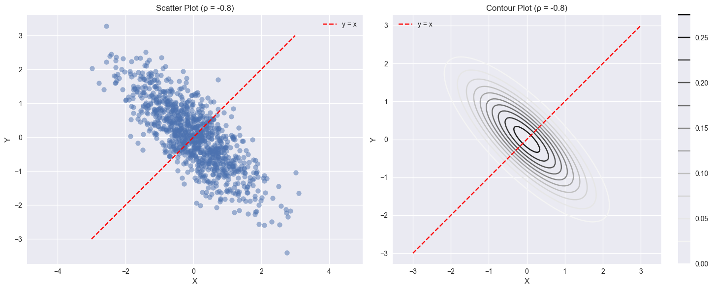
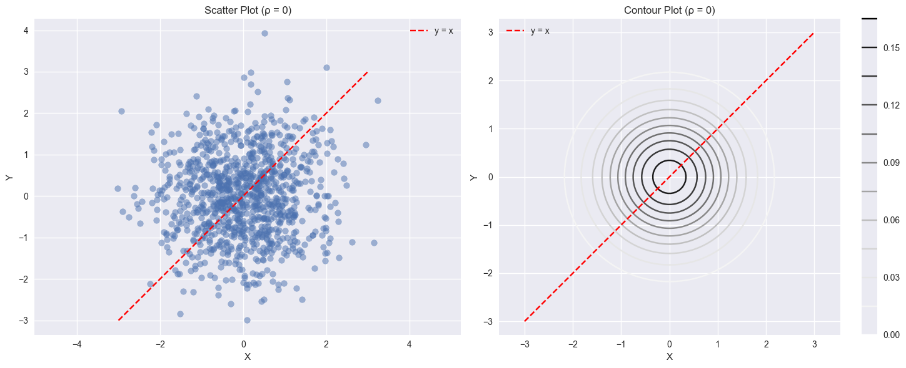
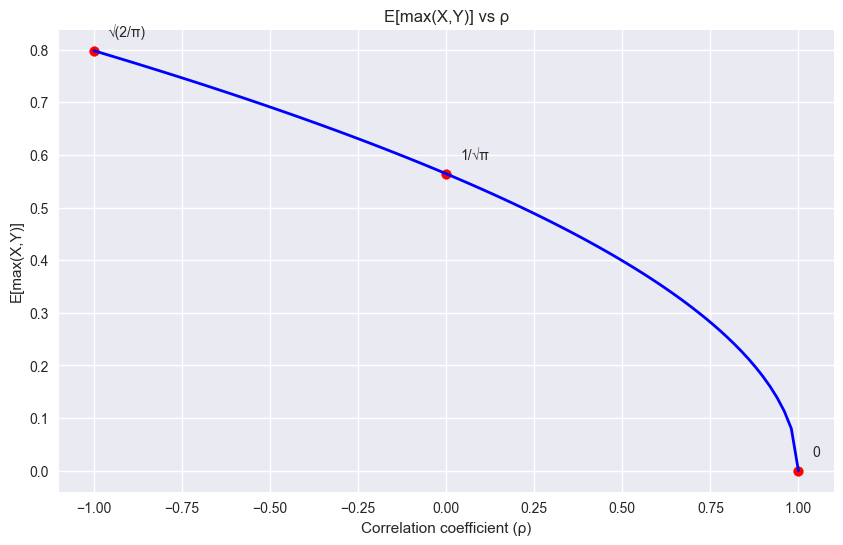

# Question 3: $E[max(X,Y)]$ in Bivariate Normal Distribution

Given:

If

$$
\begin{bmatrix}
X \\
Y
\end{bmatrix} \sim \text{MultivariateNormal}\left(\begin{bmatrix} 0 \\ 0 \end{bmatrix}, \begin{bmatrix} 1 & \rho \\ \rho & 1 \end{bmatrix}\right)
$$

find $E[\max(X,Y)]$.

## Solution 1: Without Using the Known Formula

### Intuitive Understanding

1. First, let's understand what $\max(X,Y)$ means geometrically:

   - In the $X$-$Y$ plane, $\max(X,Y)$ divides the plane along the line $Y=X$
   - When $X>Y$, we take the $X$ value
   - When $Y>X$, we take the $Y$ value

2. Key Properties:
   - Both $X$ and $Y$ are standard normal (mean 0, variance 1)
   - Their correlation is $\rho$
   - The difference $Z=X-Y$ is also normally distributed

### Step-by-Step Derivation

1. Let's express $\max(X,Y)$ using indicator functions:
   $$\max(X,Y) = X\cdot 1(X>Y) + Y\cdot 1(Y>X)$$

2. Taking expectation:
   $$E[\max(X,Y)] = E[X\cdot 1(X>Y)] + E[Y\cdot 1(Y>X)]$$

The version with multiplication $(\cdot)$ works differently:

- $1(X>Y)$ is an indicator function that equals 1 when $X>Y$ and 0 otherwise
- $X\cdot 1(X>Y)$ means we multiply $X$ by this indicator function
- This multiplication effectively "picks" the value of $X$ when $X>Y$ and gives 0 otherwise

3. Consider $Z = X-Y$. Since X and Y are jointly normal:

   - $E[Z] = E[X] - E[Y] = 0$
   - $\text{Var}(Z) = \text{Var}(X) + \text{Var}(Y) - 2\text{Cov}(X,Y) = 2(1-\rho)$
   - Therefore, $Z \sim N(0, 2(1-\rho))$

4. Now, $1(X>Y) = 1(Z>0)$. Using the properties of normal distribution:
   $$P(Z>0) = P(Z<0) = \frac{1}{2}$$

5. Using the fact that for a standard normal variable $W$ and any constant $c$:
   $$E[W\cdot 1(W>c)] = \phi(c)$$
   where $\phi$ is the standard normal PDF.

6. After standardizing and applying this result:
   $$E[X\cdot 1(X>Y)] = E[Y\cdot 1(Y>X)] = \frac{\sqrt{1-\rho}}{\sqrt{2\pi}}$$

7. Therefore:
   $$E[\max(X,Y)] = \sqrt{\frac{1-\rho}{\pi}}$$

### Intuition Behind the Result

- As $\rho \to 1$, X and Y become more similar, so their maximum approaches either value
- As $\rho \to -1$, X and Y become opposites, making their maximum larger
- The $\sqrt{1-\rho}$ term captures this relationship
- The $\frac{1}{\sqrt{\pi}}$ factor comes from the normal distribution's properties

## Solution 2: Using the Known Formula

### Direct Application

For bivariate normal variables, the expectation of $\max(X,Y)$ has a known formula:
$$E[\max(X,Y)] = \mu_x P(X > Y) + \mu_y P(Y > X) + E[X\cdot 1(X > Y)] + E[Y\cdot 1(Y > X)]$$
Given $\mu_x = \mu_y = 0$, this simplifies to:
$$E[\max(X,Y)] = E[X\cdot 1(X > Y)] + E[Y\cdot 1(Y > X)]$$
For standard bivariate normal variables, this further simplifies to:
$$E[\max(X,Y)] = \sigma\phi(0)$$
Where:

$\sigma = \sqrt{2(1-\rho)}$

$\phi(0) = \frac{1}{\sqrt{2\pi}}$

Therefore:
$$E[\max(X,Y)] = \frac{\sqrt{2(1-\rho)}}{\sqrt{2\pi}} = \sqrt{\frac{1-\rho}{\pi}}$$

This is our final answer: $E[\max(X,Y)] = \sqrt{\frac{1-\rho}{\pi}}$

### Understanding the Formula

- The formula $\sigma\phi(0)$ comes from the properties of "Mills ratio" in normal distribution
- $\sigma$ represents the standard deviation of the difference $X-Y$
- $\phi(0)$ appears because we're dealing with symmetric standard normal variables

### Special Cases

1. When $\rho = 1$:

   - X and Y are perfectly correlated
   - $E[\max(X,Y)] = 0$ (relative to their mean)

2. When $\rho = -1$:

   - X and Y are perfectly negatively correlated
   - $E[\max(X,Y)] = \sqrt{\frac{2}{\pi}}$ (maximum value)

3. When $\rho = 0$:
   - X and Y are independent
   - $E[\max(X,Y)] = \frac{1}{\sqrt{\pi}}$

### Visual Interpretation

- The result can be visualized as the average "height" above the diagonal $Y=X$
- The correlation $\rho$ affects how spread out the joint distribution is around this diagonal
- Lower correlation means more spread, leading to larger expected maximum values

## Solution Using Conditional Probability

### Step 1: Breaking Down the Expected Value

Using the law of total expectation, we can write:

$$E[\max(X,Y)] = E[X|X>Y]P(X>Y) + E[Y|Y>X]P(Y>X)$$

Due to symmetry in the bivariate normal distribution with equal variances:

- $P(X>Y) = P(Y>X) = \frac{1}{2}$
- $E[X|X>Y] = E[Y|Y>X]$

### Step 2: Understanding $X-Y$ Relationship

Let's define $Z = X - Y$. Since $X$ and $Y$ are jointly normal:

$$Z \sim N(0, 2(1-\rho))$$

This is because:
$$\text{Var}(Z) = \text{Var}(X) + \text{Var}(Y) - 2\text{Cov}(X,Y) = 1 + 1 - 2\rho = 2(1-\rho)$$

### Step 3: Finding Conditional Expectations

For bivariate normal variables, we can use the following properties:

1. The conditional distribution of X given Z is normal:
   $$X|Z \sim N\left(\frac{Z}{2}, \frac{1-\rho}{2}\right)$$

2. Given X > Y is equivalent to Z > 0, so:
   $$E[X|X>Y] = E[X|Z>0]$$

3. Using properties of truncated normal distributions:
   $$E[X|Z>0] = E\left[\frac{Z}{2}|Z>0\right]$$
   $$= \frac{E[Z|Z>0]}{2}$$

4. For a normal distribution with mean 0 and variance $\sigma^2$, if W > 0:
   $$E[W|W>0] = \sigma\sqrt{\frac{2}{\pi}}$$

### Step 4: Calculating E[max(X,Y)]

Applying these properties:

1. For Z ~ N(0, 2(1-ρ)):
   $$E[Z|Z>0] = \sqrt{2(1-\rho)}\sqrt{\frac{2}{\pi}}$$

2. Therefore:
   $$E[X|X>Y] = \frac{\sqrt{2(1-\rho)}\sqrt{\frac{2}{\pi}}}{2} = \sqrt{\frac{1-\rho}{\pi}}$$

3. Finally:
   $$E[\max(X,Y)] = E[X|X>Y]P(X>Y) + E[Y|Y>X]P(Y>X)$$
   $$= \sqrt{\frac{1-\rho}{\pi}} \cdot \frac{1}{2} + \sqrt{\frac{1-\rho}{\pi}} \cdot \frac{1}{2}$$
   $$= \sqrt{\frac{1-\rho}{\pi}}$$

## Understanding the Solution

This conditional probability approach gives us the same result as the indicator function method, but it provides different insights:

1. The symmetry of the problem is more apparent, showing why $P(X>Y) = \frac{1}{2}$

2. We see clearly how the correlation ρ affects the variance of Z = X - Y, which determines how different X and Y tend to be

3. The $\sqrt{\frac{2}{\pi}}$ term comes from the expected value of a truncated standard normal distribution

4. The final result $\sqrt{\frac{1-\rho}{\pi}}$ can be interpreted as:
   - The square root of (1-ρ) measures how different X and Y can be
   - The π term comes from the properties of normal distributions
   - When ρ = 1, X = Y always, so max(X,Y) = X
   - When ρ = -1, X and Y are opposites, maximizing their maximum

## Advantages of the Conditional Probability Approach

1. It provides clear probabilistic interpretation at each step

2. It makes use of well-known properties of conditional normal distributions

3. It helps understand why the result has its particular form

4. It connects to the broader theory of truncated normal distributions

The conditional probability approach reveals the deep connection between the geometry of the bivariate normal distribution and the expected maximum of its components.
