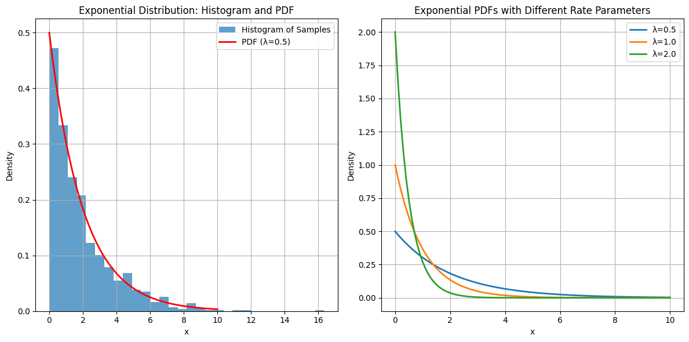

# Question: The Exponential Distribution

What is the exponential distribution? What are the mean and variance of the exponential distribution?

## Solution

The exponential distribution is a continuous probability distribution that describes the time between events in a Poisson point process, i.e., a process in which events occur continuously and independently at a constant average rate.

### Probability Density Function (PDF)

The probability density function of an exponential distribution with rate parameter λ > 0 is:

$f(x; λ) = \begin{cases} 
λe^{-λx} & \text{for } x ≥ 0 \\
0 & \text{for } x < 0
\end{cases}$

### Cumulative Distribution Function (CDF)

The cumulative distribution function is:

$F(x; λ) = \begin{cases}
1 - e^{-λx} & \text{for } x ≥ 0 \\
0 & \text{for } x < 0
\end{cases}$

### Mean (Expected Value)

The mean or expected value of an exponential distribution is:

$E[X] = \frac{1}{λ}$

This can be derived using the definition of expected value:

$E[X] = \int_0^∞ xλe^{-λx} dx$

### Variance

The variance of an exponential distribution is:

$Var(X) = \frac{1}{λ^2}$

This can be derived using the second moment and the formula:
$Var(X) = E[X^2] - (E[X])^2$

The exponential distribution has the interesting property that its standard deviation (σ = 1/λ) is equal to its mean, making it a special case among probability distributions.

