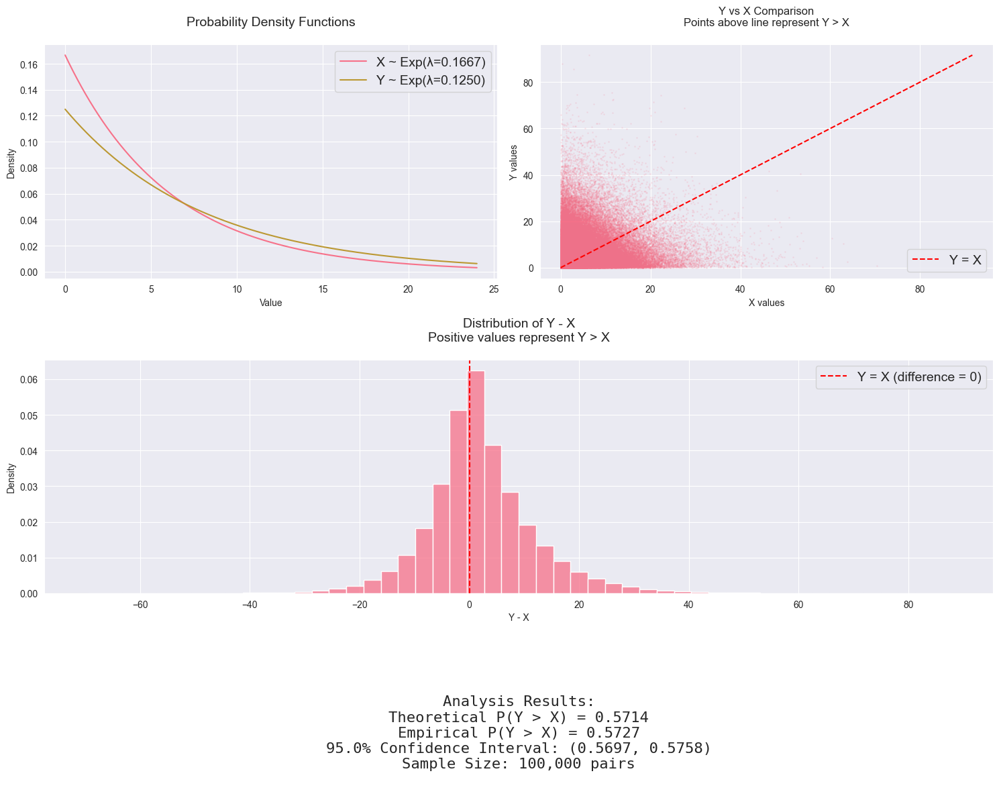

# Question: Solving for P(Y > X) with Independent Exponential Distributions

If $X$ and $Y$ are independent exponential random variable with mean 6 and 8, what is the probability that $Y$ is greater than $X$?

## Solution:

Let's solve this step by step, building our understanding of how to work with independent exponential distributions.

- $X$ ~ Exponential(λ₁), where $E[X] = 6$
- $Y$ ~ Exponential(λ₂), where $E[Y] = 8$
- $X$ and $Y$ are independent

Recall that for an exponential distribution, $E[X] = 1/λ$. Therefore:

For X: $6 = \frac{1}{λ₁} \implies λ₁ = \frac{1}{6}$

For Y: $8 = \frac{1}{λ₂} \implies λ₂ = \frac{1}{8}$

### Deriving P(Y > X)

For independent continuous random variables, we can find $P(Y > X)$ using:

$P(Y > X) = \int_0^∞ \int_x^∞ f_X(x)f_Y(y)\ dy\ dx$

where $f_X(x)$ and $f_Y(y)$ are the respective probability density functions:

$f_X(x) = λ₁e^{-λ₁x}$ and $f_Y(y) = λ₂e^{-λ₂y}$

Let's substitute:

$P(Y > X) = \int_0^∞ \int_x^∞ \frac{1}{6}e^{-x/6} \cdot \frac{1}{8}e^{-y/8}\ dy\ dx$

### Solving the Double Integral

First, solve the inner integral with respect to y:

$P(Y > X) = \int_0^∞ \frac{1}{6}e^{-x/6} \cdot \left[-8 \cdot \frac{1}{8}e^{-y/8}\right]_x^∞\ dx$

$= \int_0^∞ \frac{1}{6}e^{-x/6} \cdot \left[0 - (-e^{-x/8})\right]\ dx$

$= \int_0^∞ \frac{1}{6}e^{-x/6} \cdot e^{-x/8}\ dx$

$= \frac{1}{6}\int_0^∞ e^{-x(\frac{1}{6} + \frac{1}{8})}\ dx$

$= \frac{1}{6}\int_0^∞ e^{-\frac{7x}{24}}\ dx$

Now solve with respect to x:

$= \frac{1}{6} \cdot \left[-\frac{24}{7}e^{-\frac{7x}{24}}\right]_0^∞$

$= \frac{1}{6} \cdot \frac{24}{7} \cdot (0 - (-1))$

$= \frac{24}{42} = \frac{4}{7}$

Therefore, $P(Y > X) = \frac{4}{7} \approx 0.571$

### Interpretation

This result means that in approximately 57.1% of cases, Y will be greater than X. This makes intuitive sense because $Y$ has a larger mean (8) than $X$ (6), so it tends to take larger values more often. However, due to the overlapping distributions, there's still a significant probability (≈ 42.9%) that $X$ will be greater than $Y$.

### General Formula

For future reference, if X ~ Exp(λ₁) and Y ~ Exp(λ₂) are independent, then:

$P(Y > X) = \frac{λ₁}{λ₁ + λ₂}$

In our case, this gives us:

$P(Y > X) = \frac{1/6}{1/6 + 1/8} = \frac{4}{7}$

This matches our result from the integration method!

