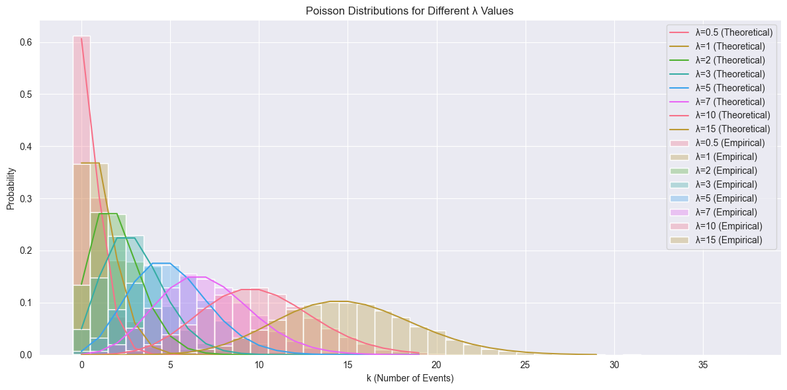
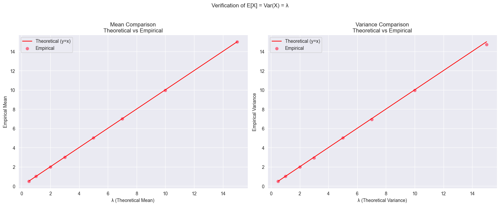

# Question: Expected Value and Variance of the Poisson Distribution

What are the expected value and the variance of of Poisson distribution?

## Solution

The Poisson distribution is one of the most important discrete probability distributions in statistics, modeling the number of events occurring in a fixed interval when these events happen at a constant average rate and independently of each other. Let's explore its properties systematically.

The Poisson distribution with parameter $λ > 0$ has probability mass function:

$P(X = k) = \frac{e^{-λ}λ^k}{k!}$

where:

- $k$ is the number of events ($k = 0, 1, 2, ...$)
- $λ$ is both the expected value and variance (as we'll prove)
- $e$ is Euler's number (≈ 2.71828)

### Expected Value Derivation

Let's derive E[X] step by step:

$E[X] = \sum_{k=0}^{\infty} k \cdot P(X = k)$

$= \sum_{k=0}^{\infty} k \cdot \frac{e^{-λ}λ^k}{k!}$

$= λe^{-λ} \sum_{k=1}^{\infty} \frac{λ^{k-1}}{(k-1)!}$

Here's the key insight: let's make a change of variable m = k-1:

$= λe^{-λ} \sum_{m=0}^{\infty} \frac{λ^m}{m!}$

The sum is now the Taylor series expansion of $e^λ$:

$= λe^{-λ} \cdot e^λ = λ$

Therefore, $E[X] = λ$

### Variance Derivation

For variance, we need $E[X^2]$ since $Var(X) = E[X^2] - (E[X])^2$

Let's find $E[X^2]$:

$E[X^2] = \sum_{k=0}^{\infty} k^2 \cdot \frac{e^{-λ}λ^k}{k!}$

$= λe^{-λ} \sum_{k=1}^{\infty} k \cdot \frac{λ^{k-1}}{(k-1)!}$

$= λe^{-λ} \sum_{k=1}^{\infty} [(k-1) + 1] \cdot \frac{λ^{k-1}}{(k-1)!}$

$= λe^{-λ} \left[λ \sum_{k=1}^{\infty} \frac{λ^{k-2}}{(k-2)!} + \sum_{k=1}^{\infty} \frac{λ^{k-1}}{(k-1)!}\right]$

$= λe^{-λ} [λe^λ + e^λ]$

$= λ^2 + λ$

Therefore:

$Var(X) = E[X^2] - (E[X])^2$
$= (λ^2 + λ) - λ^2$
$= λ$

### Intuitive Understanding

1. **Why $E[X] = λ$?**

   - λ represents the average rate of events
   - If events occur at an average rate of λ per interval, we expect to see $λ$ events in that interval
   - For example, if a store averages 5 customers per hour ($λ = 5$), we expect 5 customers in any given hour

2. **Why $Var(X) = λ$?**

   - The equality of mean and variance is a special property of the Poisson distribution
   - It indicates that the spread of the distribution increases with the mean
   - This makes sense: if we expect more events, there's more room for variation
   - For our store example: hour-to-hour variation will be larger when we expect 50 customers ($λ = 50$) than when we expect 5 ($λ = 5$)

3. **Why is this special?**
   - Most distributions don't have equal mean and variance
   - This property helps us identify whether data might follow a Poisson distribution
   - It's useful in many real-world scenarios: website visits, radioactive decay, typing errors, etc.

## Relationship to Other Distributions

The Poisson distribution has interesting connections to other distributions:

- It's the limit of a binomial distribution as $n → ∞$ and $p → 0$ while $np = λ$ remains constant
- The time between Poisson events follows an exponential distribution
- The sum of independent Poisson variables is also Poisson (with $λ$ equal to the sum of the individual $λ$s)

