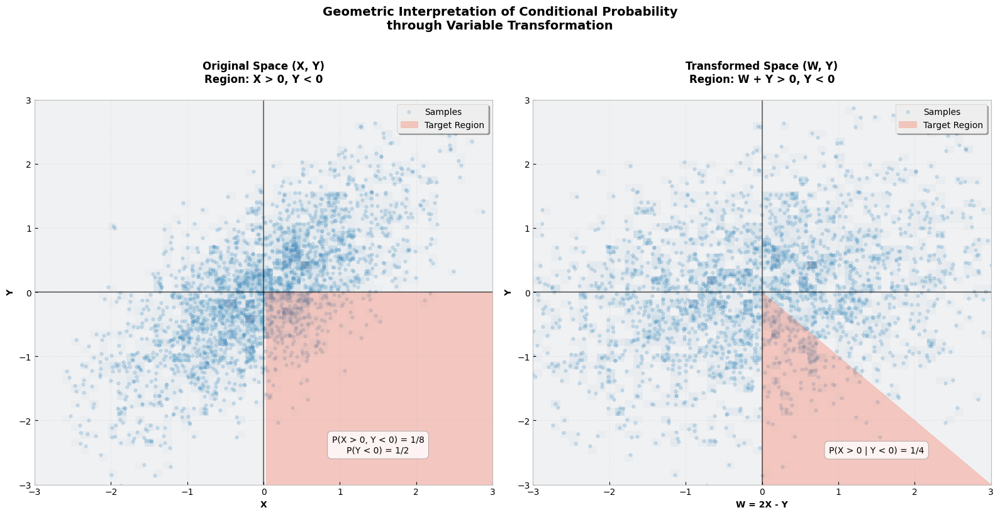

# Quesion: Conditional Probability for Bivariate Normal Distribution

Consider two random variables $X$ and $Y$ with mean 0 and variance 1, and with joint normal distribution. If $cov(X,Y) = \frac{1}{\sqrt{2}}$, what is the conditional probability $P(X > 0 | Y < 0)$

## Solution

To find $P(X > 0 | Y < 0)$ for jointly normal random variables $X$ and $Y$ with $\text{cov}(X,Y) = \frac{1}{\sqrt{2}}$, we'll use a clever transformation approach that simplifies the geometric interpretation.

We introduce a new variable $W = 2X - Y$. This transformation is particularly useful because it will lead to independence with $Y$.

#### Mean of $W$

Since $X$ and $Y$ have zero means:
$$E[W] = E[2X - Y] = 2E[X] - E[Y] = 0$$

#### Variance of $W$

Using variance properties:

$$
\begin{align*}
\text{Var}(W) &= \text{Var}(2X - Y) \\
&= 4\text{Var}(X) + \text{Var}(Y) - 4\text{Cov}(X,Y) \\
&= 4(1) + 1 - 4(\frac{1}{\sqrt{2}}) \\
&= 5 - \frac{4}{\sqrt{2}} = 1
\end{align*}
$$

#### Covariance between $W$ and $Y$

$$
\begin{align*}
\text{Cov}(W,Y) &= \text{Cov}(2X - Y, Y) \\
&= 2\text{Cov}(X,Y) - \text{Var}(Y) \\
&= 2(\frac{1}{\sqrt{2}}) - 1 \\
&= \sqrt{2} - 1 = 0
\end{align*}
$$

Therefore, $W \sim N(0,1)$ and is independent of $Y$.

### Region Transformation

We need to transform the original region $\{X > 0, Y < 0\}$ in terms of $W$ and $Y$:

- $X > 0$ becomes $W + Y > 0$ (since $X = \frac{W + Y}{2}$)
- $Y < 0$ remains unchanged

### Probability Calculation

Due to independence, the joint density is:
$$f_{W,Y}(w,y) = f_W(w) \cdot f_Y(y) = \frac{1}{2\pi}e^{-\frac{w^2}{2}}e^{-\frac{y^2}{2}}$$

The probability becomes:
$$P(X > 0, Y < 0) = P(W + Y > 0, Y < 0) = \int_{-\infty}^0 \int_{-y}^{\infty} f_{W,Y}(w,y) \, dw \, dy$$

### 5. Integration and Final Result

Using the properties of normal distributions and symmetry:

1. The inner integral evaluates to $\Phi(y)$
2. The complete double integral equals $\frac{1}{8}$
3. Since $P(Y < 0) = \frac{1}{2}$, the conditional probability is:

$$P(X > 0 | Y < 0) = \frac{P(X > 0, Y < 0)}{P(Y < 0)} = \frac{1/8}{1/2} = \frac{1}{4}$$

The conditional probability $P(X > 0 | Y < 0) = \frac{1}{4}$ or 0.25. This elegant result comes from the clever transformation that simplified the geometric structure of the problem by creating independence between the transformed variables.

## Summary: Transformation-Based Solution vs. Bivariate Normal Formula

#### 1. Simplifies Integration with Independence

By introducing the transformed variable $W = \sqrt{2}X - Y$, we decoupled $X$ and $Y$ into two independent variables $W$ and $Y$. This independence allowed us to separate their joint probability into the product of their marginal probabilities:

$$
f_{W, Y}(w, y) = f_W(w) \cdot f_Y(y).
$$

#### Why is this helpful?

- Independence eliminates cross terms in the joint probability density function (PDF), simplifying integration and reducing the risk of computational or algebraic errors.
- Without the transformation, direct integration of the bivariate normal distribution requires handling the covariance structure, which can be computationally more involved.

---

### 2. Geometric Intuition

The transformation to $W$ provides a geometric perspective:

- The region $X > 0, Y < 0$ is transformed into the region $W + Y > 0$ and $Y < 0$, which is a straightforward triangular region in the $(W, Y)$-plane.
- This approach leverages the symmetry of the normal distribution to reduce the problem into simple sub-regions that are easier to interpret and integrate over.

#### Why is this helpful?

- It makes the problem visually and conceptually easier to understand, especially when teaching or explaining the solution.
- The geometric interpretation highlights the relationship between the variables.

---

### 3. Generalization to Other Problems

This approach is flexible and extends to scenarios where transformations can decouple dependent variables. For example:

- In higher dimensions, transformations like principal component analysis (PCA) can decouple correlated variables into independent components.
- It provides a method to isolate one variable’s contribution to a condition without recalculating complex dependencies.

#### Why is this helpful?

- It becomes a reusable tool for tackling a wide range of problems involving joint normal distributions.

---

### 4. Numerical Stability

Direct integration of the bivariate normal distribution can sometimes lead to numerical instabilities or difficulties, especially when dealing with small probabilities or edge cases (e.g., extreme correlations). The transformation-based approach avoids these pitfalls by breaking the problem into simpler, manageable parts.

---

### 5. Didactic Value

The transformation approach explicitly shows how to:

- Decompose complex dependencies.
- Handle independence, providing deeper insights into the structure of the joint distribution.

#### Why is this helpful?

- It encourages understanding of the role of covariance in determining variable relationships and how independence simplifies calculations.

---

### Why Use the Bivariate Normal Formula?

The bivariate normal formula is also powerful and appropriate when:

1. You are comfortable directly integrating the joint PDF:
   $$
   f(x, y) = \frac{1}{2\pi\sqrt{1-\rho^2}} \exp\left(-\frac{1}{2(1-\rho^2)}\left(x^2 - 2\rho xy + y^2\right)\right).
   $$
2. You need a closed-form solution and the covariance structure is simple enough to handle directly.
3. You want to avoid introducing new variables or transformations.

https://www.probabilitycourse.com/chapter5/5_3_2_bivariate_normal_dist.php
