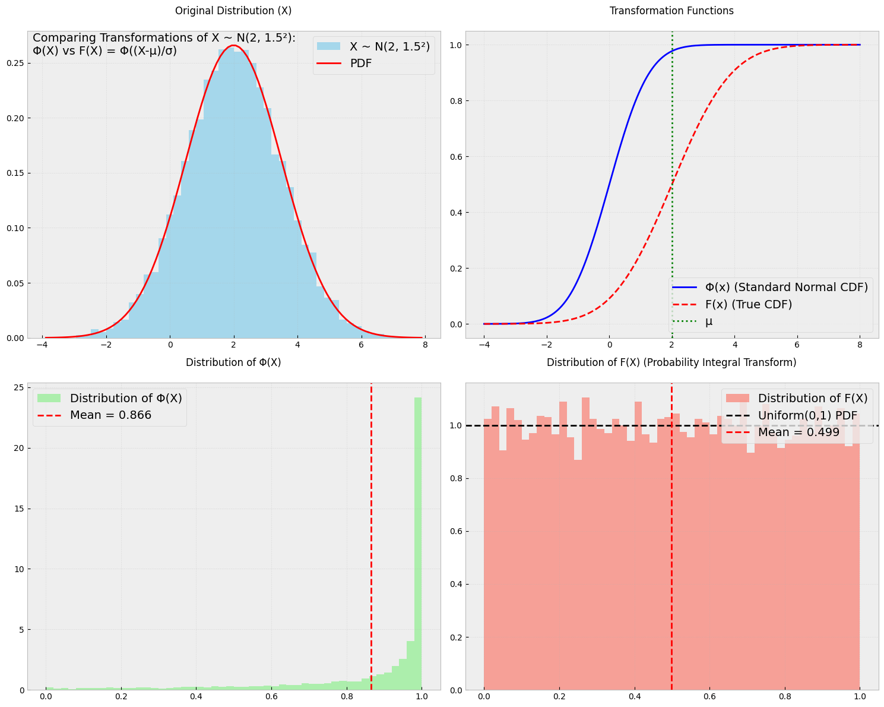
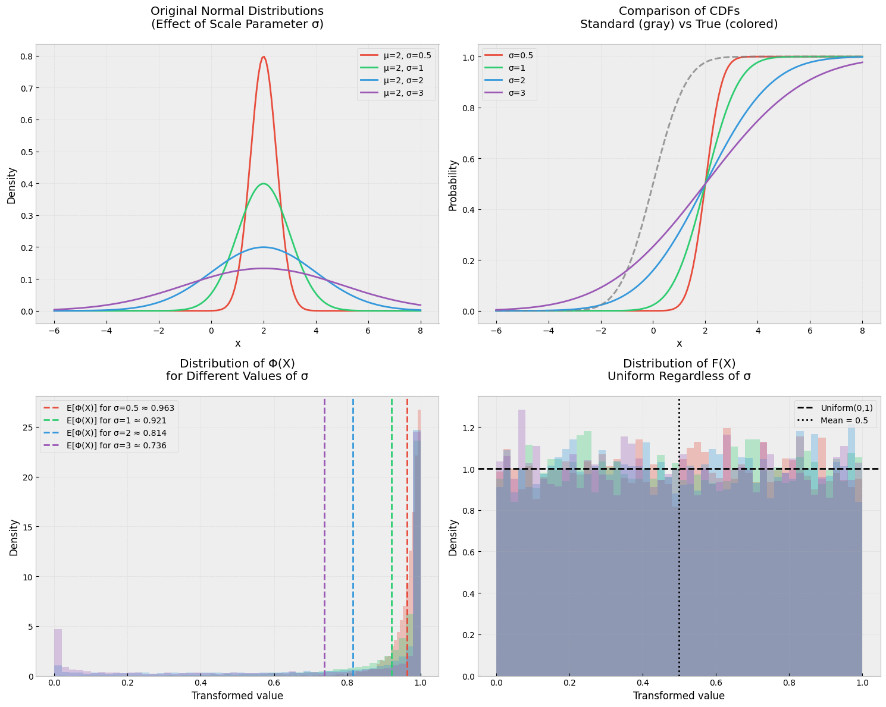

# Question: Expected Value of the Normal CDF Transformation

Let $X$ be a normal random variable with mean $\mu$ and variance $\sigma^2$, and let $\Phi$ be the cumulative distribution function of the standard normal distribution. Find the expected value of $Y = \Phi(X)$.

## Solution

We're exploring an interesting problem involving the composition of functions: what happens when we take a normal random variable and pass it through its own cumulative distribution function (CDF)? This type of transformation appears in various statistical applications, including copula theory and probability integral transforms.

Given:

- $X \sim \mathcal{N}(\mu, \sigma^2)$
- $Y = \Phi(X)$, where $\Phi$ is the standard normal CDF
- Need to find $E[Y] = E[\Phi(X)]$

First, let's express $X$ in terms of a standard normal random variable $Z$:

$X = \mu + \sigma Z$, where $Z \sim \mathcal{N}(0,1)$

Therefore:
$Y = \Phi(X) = \Phi(\mu + \sigma Z)$

The expected value we seek is:

$E[Y] = E[\Phi(\mu + \sigma Z)] = \int_{-\infty}^{\infty} \Phi(\mu + \sigma z) \phi(z) dz$

where $\phi(z)$ is the standard normal PDF.

Here's where we need a crucial insight about normal distributions. The integral we're facing is asking us to find the probability that one normal random variable is less than another.

Let's consider two independent standard normal random variables $Z_1$ and $Z_2$:

$P(Z_1 < Z_2) = \int_{-\infty}^{\infty} \Phi(z) \phi(z) dz = \frac{1}{2}$

Our problem can be reframed as:

$E[\Phi(\mu + \sigma Z)] = P(Z_1 < \frac{\mu}{\sigma} + Z_2)$

where $Z_1$ and $Z_2$ are independent standard normal variables.

Using properties of normal distributions:

$\frac{\mu}{\sigma} + Z_2 \sim \mathcal{N}(\frac{\mu}{\sigma}, 1)$

Therefore:

$E[Y] = P(Z_1 < \frac{\mu}{\sigma} + Z_2) = \Phi(\frac{\mu}{\sqrt{\sigma^2 + 1}})$

The expected value of $Y = \Phi(X)$ is:

$E[Y] = \Phi(\frac{\mu}{\sqrt{\sigma^2 + 1}})$

### Intuitive Understanding

1. When $\mu = 0$ and $\sigma = 1$, $E[Y] = \frac{1}{2}$, which makes sense as we're equally likely to be above or below the mean.

2. As $\mu$ increases:

   - $E[Y]$ approaches 1, meaning $Y$ is more likely to be close to 1
   - This aligns with the fact that $X$ is more likely to be large positive

3. As $\sigma$ increases:
   - The fraction $\frac{\mu}{\sqrt{\sigma^2 + 1}}$ approaches 0
   - $E[Y]$ approaches $\frac{1}{2}$
   - This reflects increased uncertainty in $X$

This result is particularly useful in:

- Copula theory
- Probability integral transforms
- Statistical modeling of bounded random variables
- Risk analysis where probabilities are used as risk measures

The transformation $\Phi(X)$ is also a way to convert an unbounded normal random variable into a bounded random variable on $[0,1]$, which can be useful in many applications.

---

# Understanding Probability Integral Transform vs Normal CDF Transformation

## The Key Distinction

### The Probability Integral Transform (PIT)

For any continuous random variable $X$ with CDF $F(x)$:

- If we apply its own CDF: $Y = F(X) \sim \text{Uniform}(0,1)$
- This means $E[F(X)] = \frac{1}{2}$

### Our Problem's Transformation

Given $X \sim \mathcal{N}(\mu, \sigma^2)$:

- We apply standard normal CDF: $Y = \Phi(X)$
- The actual CDF of $X$ is: $F(x) = \Phi(\frac{x-\mu}{\sigma})$
- Therefore $E[\Phi(X)] = \Phi(\frac{\mu}{\sqrt{\sigma^2 + 1}}) \neq \frac{1}{2}$ (in general)

## Mathematical Explanation

Let's express $X$ in terms of a standard normal $Z$:
$X = \mu + \sigma Z$, where $Z \sim \mathcal{N}(0,1)$

Then our transformation becomes:
$Y = \Phi(\mu + \sigma Z)$

This is fundamentally different from:
$F(X) = \Phi(\frac{X-\mu}{\sigma}) = \Phi(Z)$ which would give us Uniform(0,1)

## Understanding Through Special Cases

1. When $\mu = 0, \sigma = 1$ (standard normal):

   - $Y = \Phi(X)$ coincides with the PIT
   - Here $E[Y] = \frac{1}{2}$

2. When $\mu \neq 0$ or $\sigma \neq 1$:
   - $Y = \Phi(X)$ is measuring against standard normal scale
   - Values get "shifted" or "stretched" relative to standard normal
   - Results in non-uniform distribution

## Intuitive Visualization

Think of it this way:

- $\Phi(X)$ asks: "What's the percentile if X were standard normal?"
- $F(X)$ asks: "What's the actual percentile of X in its true distribution?"

## Practical Implications

This distinction matters in:

1. Order statistics and quantile computations
   - Need proper CDF for uniform transformation
2. Copula theory
   - Requires true CDF for probability integral transform
3. Statistical testing
   - Different transformations lead to different test statistics

## Formula Summary

For $X \sim \mathcal{N}(\mu, \sigma^2)$:

1. PIT transformation: $F(X) = \Phi(\frac{X-\mu}{\sigma}) \sim \text{Uniform}(0,1)$

   - $E[F(X)] = \frac{1}{2}$

2. Standard normal CDF transformation: $Y = \Phi(X)$
   - $E[Y] = \Phi(\frac{\mu}{\sqrt{\sigma^2 + 1}})$

This example beautifully illustrates how subtle differences in probability transformations can lead to significantly different results.

**Shape Difference:**

- $\Phi(X)$ produces a skewed distribution
- $F(X)$ produces a uniform distribution

**Mean Location:**

- $\Phi(X)$ has mean > 0.5 due to our positive $\mu$
- $F(X)$ has mean ≈ 0.5 regardless of $\mu$ and $\sigma$

**Transformation Effect:**

The difference in the CDFs (top right) explains why we get different distributions
$F(x)$ "corrects" for the location and scale of X
$\Phi(x)$ doesn't account for X's parameters

