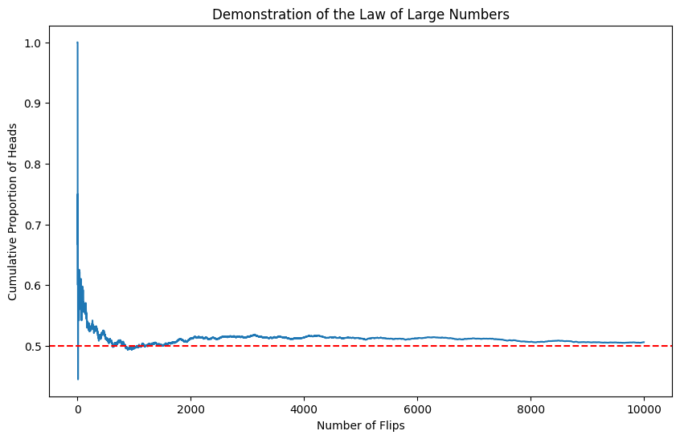

# Question: Law of Large Numbers

What is the Law of Large Numbers?

## Formal Definition

The Law of Large Numbers comes in two forms: the Weak Law and the Strong Law. Let's start with the mathematical formulation:

Let $X_1, X_2, ..., X_n$ be independent and identically distributed (i.i.d.) random variables with expected value $\mu$ and finite variance $\sigma^2$. Define the sample mean as:

$\bar{X}_n = \frac{1}{n}\sum_{i=1}^n X_i$

### Weak Law of Large Numbers (WLLN)

For any $\epsilon > 0$:

$\lim_{n \to \infty} P(|\bar{X}_n - \mu| < \epsilon) = 1$

This can also be written as:

$\bar{X}_n \xrightarrow{P} \mu$

Where $\xrightarrow{P}$ denotes convergence in probability.

### Strong Law of Large Numbers (SLLN)

$P(\lim_{n \to \infty} \bar{X}_n = \mu) = 1$

Or written more compactly:

$\bar{X}_n \xrightarrow{a.s.} \mu$

Where $\xrightarrow{a.s.}$ denotes almost sure convergence.

## Intuitive Understanding

Think of flipping a fair coin. We know the theoretical probability of getting heads is 0.5, but if we flip the coin only 10 times, we might get 7 heads and 3 tails, giving us an observed probability of 0.7. This seems far from our expected 0.5. However, as we increase the number of flips to 1000, then 10000, and beyond, the observed proportion of heads will tend to get closer and closer to 0.5.

## A Practical Example with Python

Let's simulate this coin-flipping experiment:

```python
import numpy as np
import matplotlib.pyplot as plt

def coin_flip_experiment(n_flips):
    flips = np.random.binomial(1, 0.5, n_flips)
    cumulative_mean = np.cumsum(flips) / np.arange(1, n_flips + 1)
    return cumulative_mean

n_flips = 10000
results = coin_flip_experiment(n_flips)

plt.figure(figsize=(10, 6))
plt.plot(range(1, n_flips + 1), results)
plt.axhline(y=0.5, color='r', linestyle='--')
plt.xlabel('Number of Flips')
plt.ylabel('Cumulative Proportion of Heads')
plt.title('Demonstration of the Law of Large Numbers')
```



## Differences Between Weak and Strong Laws

The distinction between the weak and strong laws lies in the type of convergence they describe:

1. The Weak Law says that for large n, the probability that the sample mean deviates from μ by more than any fixed amount can be made arbitrarily small.

2. The Strong Law says that the sample mean converges to μ almost surely, meaning the probability of the sample mean converging to μ is 1.

## Applications in Real World

The LLN has numerous practical applications:

### Insurance Industry

Insurance companies rely on the LLN to set premiums. As the number of policies increases, the average claim amount converges to the expected value, allowing for accurate pricing.

### Quality Control

In manufacturing, the LLN helps determine appropriate sample sizes for quality testing. If we measure a characteristic of products (like weight or dimension), the sample mean will converge to the true population mean.

## Mathematical Proof Sketch for WLLN

The proof relies on Chebyshev's inequality. For random variable X with mean μ and variance σ²:

$P(|\bar{X}_n - \mu| \geq \epsilon) \leq \frac{Var(\bar{X}_n)}{\epsilon^2}$

Since $Var(\bar{X}_n) = \frac{\sigma^2}{n}$ for i.i.d. variables:

$P(|\bar{X}_n - \mu| \geq \epsilon) \leq \frac{\sigma^2}{n\epsilon^2}$

As $n \to \infty$, the right side approaches 0, proving the WLLN.

## Common Misconceptions

1. The LLN does NOT guarantee that absolute deviations from the mean decrease. In fact, they typically increase but at a slower rate than n.

2. The LLN does NOT imply that previous outcomes influence future ones (the Gambler's Fallacy).

## Limitations and Considerations

The LLN requires:

- Independent observations
- Identical distribution
- Finite expected value
- For practical applications, finite variance is usually needed

When these conditions are violated, the behavior of sample means can be quite different. For instance, with infinite variance (as in a Cauchy distribution), the sample mean does not converge to any value.

## Extensions and Related Concepts

The LLN connects deeply to other fundamental results in probability theory:

1. The Central Limit Theorem (CLT) describes not just convergence of means but their distribution
2. The Law of the Iterated Logarithm provides even more detailed information about the fluctuations of sample means
3. Ergodic Theory extends these ideas to more general dynamical systems

Understanding the Law of Large Numbers provides a foundation for statistical inference and helps explain why statistical methods work in practice. It's a beautiful example of how mathematics can describe and predict real-world phenomena with remarkable accuracy.
