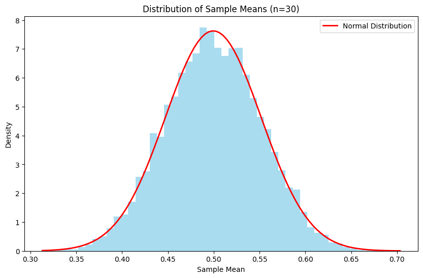

# The Central Limit Theorem

## Formal Mathematical Statement

Let's begin with the precise mathematical formulation:

Consider a sequence of independent and identically distributed random variables $X_1, X_2, ..., X_n$ with mean $\mu$ and finite variance $\sigma^2$. Define their sample mean as:

$\bar{X}_n = \frac{1}{n}\sum_{i=1}^n X_i$

Then, as $n \to \infty$:

$\frac{\bar{X}_n - \mu}{\sigma/\sqrt{n}} \xrightarrow{d} N(0,1)$

Or equivalently:

$\sqrt{n}(\bar{X}_n - \mu) \xrightarrow{d} N(0,\sigma^2)$

Where $\xrightarrow{d}$ denotes convergence in distribution, and $N(\mu,\sigma^2)$ represents the normal distribution.

## Understanding Through Intuition

Imagine you're rolling a fair six-sided die. The distribution of a single roll is discrete and uniform. Now, if you roll the die multiple times and take the average, something remarkable happens. As you increase the number of rolls, the distribution of these averages begins to look more and more like a bell curve, regardless of the original discrete, uniform distribution.

This is the essence of the CLT – it tells us that when we take many independent samples and average them, their distribution will approximate a normal distribution, regardless of the underlying distribution of the individual samples (with some conditions).

## A Practical Demonstration

Let's visualize this phenomenon using Python:

```python
import numpy as np
import matplotlib.pyplot as plt
from scipy import stats

def demonstrate_clt(distribution, n_samples, sample_size):
    # Generate many sample means
    means = np.array([
        np.mean(distribution(sample_size))
        for _ in range(n_samples)
    ])

    # Plot the histogram of means
    plt.figure(figsize=(10, 6))
    plt.hist(means, bins=50, density=True, alpha=0.7, color='skyblue')

    # Plot the theoretical normal distribution
    x = np.linspace(means.min(), means.max(), 100)
    plt.plot(x, stats.norm.pdf(x, np.mean(means), np.std(means)),
             'r-', lw=2, label='Normal Distribution')

    plt.title(f'Distribution of Sample Means (n={sample_size})')
    plt.xlabel('Sample Mean')
    plt.ylabel('Density')
    plt.legend()

# Example with uniform distribution
uniform_dist = lambda size: np.random.uniform(0, 1, size)
demonstrate_clt(uniform_dist, 10000, 30)
```

## Key Conditions and Requirements

The CLT holds under these conditions:

1. Independence: The samples must be independent of each other
2. Identical Distribution: All samples must come from the same distribution
3. Finite Variance: The underlying distribution must have a finite variance
4. Sufficient Sample Size: Generally, n ≥ 30 is considered adequate for good approximation

## Mathematical Foundations

The proof of the CLT relies on characteristic functions. For a random variable X, its characteristic function is:

$\phi_X(t) = E[e^{itX}]$

The key steps involve:

1. Expressing the characteristic function of the standardized sum
2. Using Taylor expansion
3. Taking limits as n approaches infinity

## Real-World Applications

### 1. Quality Control

When measuring product characteristics in manufacturing:

$\bar{X} \sim N(\mu, \frac{\sigma^2}{n})$

This allows us to construct control charts and confidence intervals.

### 2. Political Polling

For a binary outcome (like voting preference):

$\hat{p} \sim N(p, \frac{p(1-p)}{n})$

This helps determine margin of error in polls.

### 3. Financial Risk Assessment

For portfolio returns:

$R_{portfolio} \sim N(\mu_{portfolio}, \frac{\sigma^2_{portfolio}}{n})$

## Common Misconceptions

1. The CLT does NOT require the original distribution to be symmetric
2. The CLT does NOT guarantee that individual observations will be normally distributed
3. The CLT does NOT work equally well for all distributions with the same sample size

## Advanced Variations

### 1. Multivariate CLT

For vector-valued random variables:

$\sqrt{n}(\bar{X}_n - \mu) \xrightarrow{d} N(0,\Sigma)$

Where Σ is the covariance matrix.

### 2. Lyapunov CLT

A more general version that relaxes the identical distribution requirement:

$$\sum_{i=1}^n X_i - E[X_i]/{\sqrt{\sum_{i=1}^n Var(X_i)}} \xrightarrow{d} N(0,1)$$

## Connection to Other Statistical Concepts

The CLT connects with:

1. Confidence Intervals:
   $\bar{X} \pm z_{\alpha/2}\frac{\sigma}{\sqrt{n}}$

2. Hypothesis Testing:
   $Z = \frac{\bar{X} - \mu_0}{\sigma/\sqrt{n}}$

3. Maximum Likelihood Estimation:
   The asymptotic normality of MLEs is a consequence of the CLT

## Practical Implications

Understanding the CLT helps us:

1. Design appropriate sample sizes for studies
2. Justify the use of normal-theory methods
3. Construct valid confidence intervals
4. Perform reliable hypothesis tests
5. Understand why many natural phenomena appear normally distributed

The Central Limit Theorem truly stands as a bridge between probability theory and statistical inference, making it possible to draw reliable conclusions about populations from sample data. Its universal nature and wide applicability make it one of the most remarkable results in all of mathematics.


