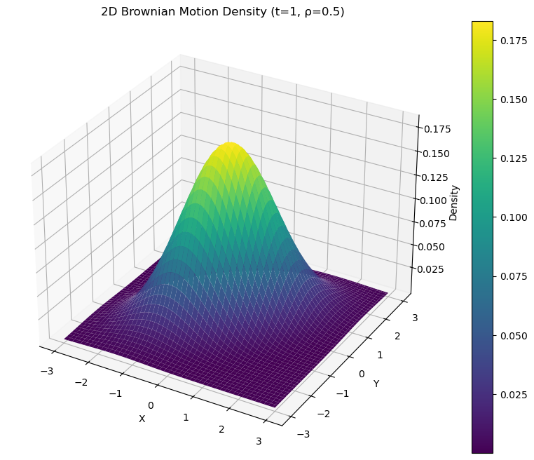
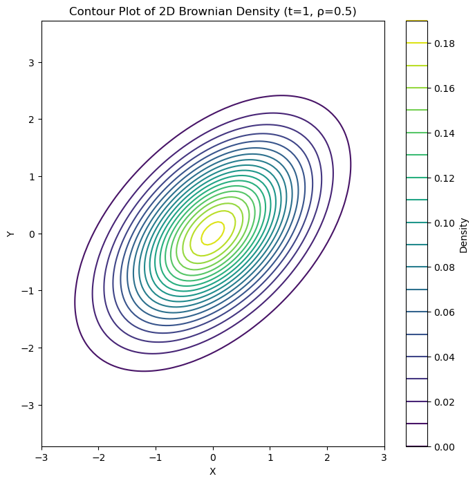

# Understanding Brownian Motion and Applications in Finance

## Part 1: Foundations of Brownian Motion

### 1.1 Mathematical Definition

Brownian motion, also known as a Wiener process $W(t)$, is a continuous-time stochastic process that satisfies these key properties:

1. $W(0) = 0$ (starts at zero)
2. For $0 \leq s \leq t$, the increment $W(t) - W(s)$ follows a normal distribution:
   $W(t) - W(s) \sim \mathcal{N}(0, t-s)$
3. For non-overlapping time intervals, increments are independent
4. Sample paths are continuous (almost surely)

### 1.2 Key Properties and Their Implications

Let's explore these properties in detail:

1. **Zero Mean Property**:
   $\mathbb{E}[W(t)] = 0$ for all $t \geq 0$

2. **Variance Growth**:
   $\text{Var}(W(t)) = t$

   This means uncertainty grows with the square root of time, a crucial property for financial applications.

3. **Scaling Property**:
   For any $c > 0$:
   $\{W(ct)/\sqrt{c}, t \geq 0\}$ has the same distribution as $\{W(t), t \geq 0\}$

Here's a Python simulation to visualize these properties:

```python
import numpy as np
import matplotlib.pyplot as plt

def simulate_brownian_motion(T=1, N=1000, paths=5):
    """
    Simulate Brownian motion paths

    Parameters:
    -----------
    T : float
        Total time
    N : int
        Number of time steps
    paths : int
        Number of paths to simulate

    Returns:
    --------
    tuple: (time_points, simulated_paths)
    """
    dt = T/N
    t = np.linspace(0, T, N)
    dW = np.random.normal(0, np.sqrt(dt), (paths, N-1))
    W = np.cumsum(dW, axis=1)
    W = np.concatenate([np.zeros((paths, 1)), W], axis=1)

    return t, W

# Simulation and plotting
t, W = simulate_brownian_motion()
plt.figure(figsize=(10, 6))
for path in W:
    plt.plot(t, path)
plt.title('Sample Paths of Brownian Motion')
plt.xlabel('Time')
plt.ylabel('W(t)')
plt.grid(True)
plt.show()
```

### 1.3 Geometric Brownian Motion (GBM)

In finance, we often use Geometric Brownian Motion, which models stock prices:

$dS_t = \mu S_t dt + \sigma S_t dW_t$

Where:

- $\mu$ is the drift (expected return)
- $\sigma$ is the volatility
- $dW_t$ is the Brownian motion increment

The solution to this SDE is:

$S_t = S_0 \exp\left((\mu - \frac{\sigma^2}{2})t + \sigma W_t\right)$

### 1.4 Important Properties for Finance

1. **Martingale Property**:
   For a standard Brownian motion:
   $\mathbb{E}[W(t)|W(s)] = W(s)$ for $t > s$

2. **Quadratic Variation**:
   Over $[0,t]$: $\langle W \rangle_t = t$

   This property is crucial for Itô calculus and options pricing.

# Brownian Motion on a Surface

## 1. Theoretical Foundation

### 1.1 Definition of 2D Brownian Motion

A two-dimensional Brownian motion is a vector-valued process $\mathbf{B}(t) = (B_1(t), B_2(t))$ where $B_1(t)$ and $B_2(t)$ are independent standard Brownian motions. When we consider correlated Brownian motions (as often happens in finance with correlated assets), we introduce correlation $\rho$ between the components.

The mathematical representation for correlated 2D Brownian motion is:
$\begin{pmatrix} dB_1(t) \\ dB_2(t) \end{pmatrix} = \begin{pmatrix} 1 & 0 \\ \rho & \sqrt{1-\rho^2} \end{pmatrix} \begin{pmatrix} dW_1(t) \\ dW_2(t) \end{pmatrix}$

Let's visualize this with Python:

```python
import numpy as np
import matplotlib.pyplot as plt
from mpl_toolkits.mplot3d import Axes3D

def simulate_2d_brownian(T=1, N=1000, rho=0.5):
    """
    Simulate 2D correlated Brownian motion

    Parameters:
    -----------
    T : float
        Time horizon
    N : int
        Number of steps
    rho : float
        Correlation coefficient

    Returns:
    --------
    tuple : (times, B1, B2)
    """
    dt = T/N
    times = np.linspace(0, T, N)

    # Generate independent Brownian increments
    dW1 = np.random.normal(0, np.sqrt(dt), N-1)
    dW2 = np.random.normal(0, np.sqrt(dt), N-1)

    # Correlate the increments
    dB1 = dW1
    dB2 = rho * dW1 + np.sqrt(1-rho**2) * dW2

    # Cumulative sum to get Brownian paths
    B1 = np.concatenate([[0], np.cumsum(dB1)])
    B2 = np.concatenate([[0], np.cumsum(dB2)])

    return times, B1, B2

# Visualization
def plot_2d_brownian_surface(times, B1, B2):
    """
    Create 3D surface plot with Brownian path
    """
    fig = plt.figure(figsize=(12, 8))
    ax = fig.add_subplot(111, projection='3d')

    # Plot the path
    ax.plot(B1, B2, times, 'r-', label='Brownian Path')

    # Project onto x-y plane
    ax.plot(B1, B2, np.zeros_like(times), 'b--', alpha=0.5,
           label='Ground Projection')

    ax.set_xlabel('B₁(t)')
    ax.set_ylabel('B₂(t)')
    ax.set_zlabel('Time')
    ax.legend()
    plt.title('2D Brownian Motion on Surface')
    plt.show()

# Generate and plot
t, B1, B2 = simulate_2d_brownian(rho=0.5)
plot_2d_brownian_surface(t, B1, B2)
```

### 1.2 Important Properties on Surfaces

1. **Intersection Property**
   For two independent Brownian motions in 2D, the probability of intersection is 1. This leads to a fascinating interview question:

"What is the expected number of times two Brownian paths intersect in a finite time interval?"

The solution involves Green's functions and conformal mapping. For correlated Brownian motions with correlation $\rho$, the expected number of intersections $N(T)$ in time $T$ follows:

$\mathbb{E}[N(T)] \propto \frac{T}{\log(T)}(1-\rho^2)$

Let's simulate this:

```python
def count_intersections(B1_path, B2_path, times, threshold=0.01):
    """
    Count approximate intersections between two Brownian paths

    Parameters:
    -----------
    B1_path, B2_path : arrays
        Coordinates of the two paths
    times : array
        Time points
    threshold : float
        Distance threshold for considering paths crossed

    Returns:
    --------
    int : Number of intersections
    """
    intersections = 0
    last_sign = np.sign(B1_path[0] - B2_path[0])

    for i in range(1, len(times)):
        current_sign = np.sign(B1_path[i] - B2_path[i])
        if current_sign != last_sign:
            # Check if paths are close enough
            if abs(B1_path[i] - B2_path[i]) < threshold:
                intersections += 1
        last_sign = current_sign

    return intersections
```

2. **Area Process**
   Another important concept is the area enclosed by two Brownian paths. The expected area $A(T)$ up to time $T$ follows:

$\mathbb{E}[A(T)] = \frac{T}{2\pi}\sqrt{1-\rho^2}$

This has practical applications in pairs trading:

```python
def compute_enclosed_area(B1, B2, times):
    """
    Compute area between two Brownian paths using trapezoidal rule
    """
    dt = times[1] - times[0]
    return np.abs(np.trapz(B2 - B1, times))
```

### 1.3 Applications in Finance

1. **Pairs Trading**
   When two assets' price processes follow correlated Brownian motions, we can use these properties for trading strategies:

```python
def pairs_trading_signal(price1, price2, window=20, threshold=2):
    """
    Generate pairs trading signals based on ratio divergence
    """
    # Compute log ratio
    log_ratio = np.log(price1/price2)

    # Compute z-score
    rolling_mean = np.mean(log_ratio[-window:])
    rolling_std = np.std(log_ratio[-window:])
    z_score = (log_ratio[-1] - rolling_mean) / rolling_std

    if z_score > threshold:
        return -1  # Short first asset, long second
    elif z_score < -threshold:
        return 1   # Long first asset, short second
    return 0
```

# First Exit Time Problems in Brownian Motion:

Let me walk you through first exit time problems, starting with the fundamentals and building up to more complex applications in finance. This is a crucial concept in quantitative finance, particularly for options pricing and risk management.

## 1. Basic Definition and Intuition

A first exit time (or first passage time) is the first moment when a Brownian motion reaches a certain level or exits a given region. Imagine you're tracking a stock price - you might want to know when it first hits a stop-loss level or a profit-taking target.

Let's start with a simple visualization to build intuition:

```python
import numpy as np
import matplotlib.pyplot as plt
from scipy.stats import norm

def simulate_brownian_with_barriers(mu=0, sigma=1, T=1, N=1000,
                                  upper_barrier=1, lower_barrier=-1):
    """
    Simulate Brownian motion until it hits one of two barriers

    Parameters:
    -----------
    mu : float
        Drift parameter
    sigma : float
        Volatility parameter
    T : float
        Maximum time horizon
    N : int
        Number of time steps
    upper_barrier, lower_barrier : float
        Barrier levels

    Returns:
    --------
    tuple: (times, path, exit_time, exit_level)
    """
    dt = T/N
    times = np.linspace(0, T, N)

    # Generate increments
    dW = np.random.normal(0, np.sqrt(dt), N-1)
    increments = mu*dt + sigma*dW

    # Construct path
    path = np.zeros(N)
    exit_time = T
    exit_level = None

    for i in range(1, N):
        path[i] = path[i-1] + increments[i-1]

        # Check if we've hit a barrier
        if path[i] >= upper_barrier:
            exit_time = times[i]
            exit_level = upper_barrier
            path[i:] = upper_barrier
            break
        elif path[i] <= lower_barrier:
            exit_time = times[i]
            exit_level = lower_barrier
            path[i:] = lower_barrier
            break

    return times, path, exit_time, exit_level

# Visualize multiple paths
plt.figure(figsize=(12, 6))
np.random.seed(42)

# Simulate several paths
n_paths = 5
for _ in range(n_paths):
    times, path, exit_time, exit_level = simulate_brownian_with_barriers()

    # Plot path
    plt.plot(times, path, alpha=0.6)
    if exit_level is not None:
        plt.plot(exit_time, exit_level, 'ro')

plt.axhline(y=1, color='r', linestyle='--', alpha=0.3, label='Upper Barrier')
plt.axhline(y=-1, color='r', linestyle='--', alpha=0.3, label='Lower Barrier')
plt.title('Brownian Motion with Exit Times')
plt.xlabel('Time')
plt.ylabel('Value')
plt.legend()
plt.grid(True)
plt.show()
```

## 2. Mathematical Framework

The first exit time τ for a Brownian motion B(t) with drift μ and volatility σ is formally defined as:

$\tau = \inf\{t \geq 0 : B(t) \notin (L, U)\}$

where L and U are the lower and upper barriers respectively.

The probability distribution of τ has some fascinating properties. For a standard Brownian motion with two barriers, the probability density function is:

$f_\tau(t) = \sum_{n=-\infty}^{\infty} \frac{(U-L-2n(U-L))}{2\sqrt{2\pi t^3}} \exp\left(-\frac{(U-L-2n(U-L))^2}{2t}\right)$

Let's implement this and visualize the distribution:

```python
def exit_time_distribution(t, L, U):
    """
    Calculate the probability density of exit time

    Parameters:
    -----------
    t : array-like
        Time points
    L, U : float
        Lower and upper barriers

    Returns:
    --------
    array-like: Probability density values
    """
    n_terms = 5  # Number of terms in the sum for approximation
    result = np.zeros_like(t, dtype=float)

    for n in range(-n_terms, n_terms+1):
        d = U - L - 2*n*(U-L)
        result += (d / (2*np.sqrt(2*np.pi*t**3))) * np.exp(-d**2/(2*t))

    return result

# Plot the distribution
t = np.linspace(0.01, 2, 1000)
density = exit_time_distribution(t, -1, 1)

plt.figure(figsize=(10, 6))
plt.plot(t, density)
plt.title('Probability Density of First Exit Time')
plt.xlabel('Time')
plt.ylabel('Density')
plt.grid(True)
plt.show()
```

## 3. Financial Applications

This concept has several important applications in finance:

### 3.1 Double Barrier Options

Let's implement a simple Monte Carlo pricer for a double barrier option:

```python
def price_double_barrier_option(S0=100, K=100, T=1, r=0.05, sigma=0.2,
                              L=90, U=110, n_sims=10000):
    """
    Price a double barrier option using Monte Carlo simulation

    Parameters:
    -----------
    S0 : float
        Initial stock price
    K : float
        Strike price
    T : float
        Time to maturity
    r : float
        Risk-free rate
    sigma : float
        Volatility
    L, U : float
        Lower and upper barriers
    n_sims : int
        Number of simulations

    Returns:
    --------
    float: Option price
    """
    dt = 0.001  # Small time step
    N = int(T/dt)

    payoffs = []
    for _ in range(n_sims):
        S = S0
        hit_barrier = False

        for _ in range(N):
            dW = np.random.normal(0, np.sqrt(dt))
            dS = r*S*dt + sigma*S*dW
            S += dS

            if S <= L or S >= U:
                hit_barrier = True
                break

        if not hit_barrier:
            payoffs.append(max(S - K, 0))
        else:
            payoffs.append(0)

    option_price = np.exp(-r*T) * np.mean(payoffs)
    return option_price
```

### Key Tips for Interview Questions:

#### Break Down the Problem:

First identify if it's a simple barrier problem or involves transformations
Check if drift needs to be adjusted (especially for log processes)
Consider if correlation affects the problem

#### Know the Key Formulas:

- Simple barrier probability: $P(\text{hit upper first}) = \frac{x_0 - L}{U - L}$ (no drift)
- Expected exit time: $\mathbb{E}[\tau] = \frac{(U-x_0)(x_0-L)}{\sigma^2}$ (no drift)

#### Simulation Backup:

Always be ready to verify analytical solutions with simulation
Useful when exact formulas are complex

# Expected Number of Intersections of Two Correlated 2D Brownian Motions

## Goal

We aim to calculate the **expected number of intersections** of two correlated 2D Brownian motions over a finite time interval \([0, T]\).

---

## Step 1: Define the Relative Motion

1. Let the two correlated 2D Brownian motions be:

   $$
   \mathbf{W}_1(t) = (X_1(t), Y_1(t)), \quad \mathbf{W}_2(t) = (X_2(t), Y_2(t)).
   $$

   These two processes have correlations between their components:

   $$
   \mathbb{E}[dX_1 \cdot dX_2] = \rho \, dt, \quad \mathbb{E}[dY_1 \cdot dY_2] = \rho \, dt.
   $$

   All other combinations (e.g., \(X_1\) with \(Y_2\)) are independent.

2. Define the **relative motion**:

   $$
   \mathbf{Z}(t) = \mathbf{W}_1(t) - \mathbf{W}_2(t) = (Z_X(t), Z_Y(t)),
   $$

   where:

   $$
   Z_X(t) = X_1(t) - X_2(t), \quad Z_Y(t) = Y_1(t) - Y_2(t).
   $$

3. Since \(\mathbf{W}\_1\) and \(\mathbf{W}\_2\) are correlated, \(\mathbf{Z}(t)\) behaves like a 2D Brownian motion with **reduced diffusivity**. Specifically:

   $$
   \mathbb{E}[dZ_X^2] = 2(1-\rho) \, dt, \quad \mathbb{E}[dZ_Y^2] = 2(1-\rho) \, dt.
   $$

   Thus, \(\mathbf{Z}(t)\) is a 2D Brownian motion with variance proportional to \(2(1-\rho)\).

---

## Step 2: Intersection Probability at Time \(t\)

1. For an intersection to occur at time \(t\), the relative position \(\mathbf{Z}(t)\) must be at the origin:

   $$
   \mathbf{Z}(t) = (0, 0).
   $$

2. The probability density of a 2D Brownian motion being at a specific point \(\mathbf{z} = (x, y)\) after time \(t\) is given by the **Green's function** for the 2D Laplacian:

   $$
   G(\mathbf{z}, t) = \frac{1}{4 \pi (1-\rho) t} \exp\left(-\frac{|\mathbf{z}|^2}{4(1-\rho)t}\right).
   $$

3. At the origin (\(\mathbf{z} = 0\)), the Green's function simplifies to:
   $$
   G(0, t) = \frac{1}{4 \pi (1-\rho) t}.
   $$

---

## Step 3: Expected Number of Intersections

1. The **expected number of intersections** over the time interval \([0, T]\) is the integral of the probability density \(G(0, t)\) over time:

   $$
   \mathbb{E}[N(T)] = \int_0^T G(0, t) \, dt.
   $$

2. Substituting \(G(0, t)\):

   $$
   \mathbb{E}[N(T)] = \int_0^T \frac{1}{4 \pi (1-\rho) t} \, dt.
   $$

3. This integral diverges logarithmically as \(t \to 0\). To regularize it, we introduce a small-time cutoff \(\epsilon\) to handle short-time behavior:

   $$
   \mathbb{E}[N(T)] \approx \frac{1}{4 \pi (1-\rho)} \int_\epsilon^T \frac{1}{t} \, dt.
   $$

4. The integral \(\int \frac{1}{t} dt\) gives a logarithmic term:
   $$
   \mathbb{E}[N(T)] \approx \frac{1}{4 \pi (1-\rho)} \left[\log(T) - \log(\epsilon)\right].
   $$

---

## Step 4: Scaling with \(T / \log(T)\)

1. For large \(T\), the \(\log(\epsilon)\) term becomes negligible compared to \(\log(T)\).

2. The expected number of intersections scales as:

   $$
   \mathbb{E}[N(T)] \propto \frac{T}{\log(T)} (1-\rho^2).
   $$

   - The \(T / \log(T)\) scaling comes from the logarithmic divergence regularized by the finite time interval.
   - The \((1-\rho^2)\) term arises because the diffusivity of the relative motion depends on \((1-\rho)\) in each direction.

---

## Final Result

The **expected number of intersections** for two correlated 2D Brownian motions is:

$$
\mathbb{E}[N(T)] \propto \frac{T}{\log(T)} (1-\rho^2).
$$

---

## Intuition

1. **Logarithmic Correction:**

   - In 2D, Brownian motions have infinite intersections in infinite time. Over finite time, the logarithmic correction captures the reduced likelihood of intersection as \(T\) grows.

2. **Correlation Factor (\(1-\rho^2\)):**
   - Correlation reduces the randomness of the relative motion, decreasing the number of intersections. When \(\rho = \pm 1\), the motions are perfectly aligned, so no intersections occur.

This result highlights the delicate interplay between correlation, dimensionality, and stochastic behavior.

<div style="display: flex; align-items: center; justify-content: center;">
    
    
</div>
