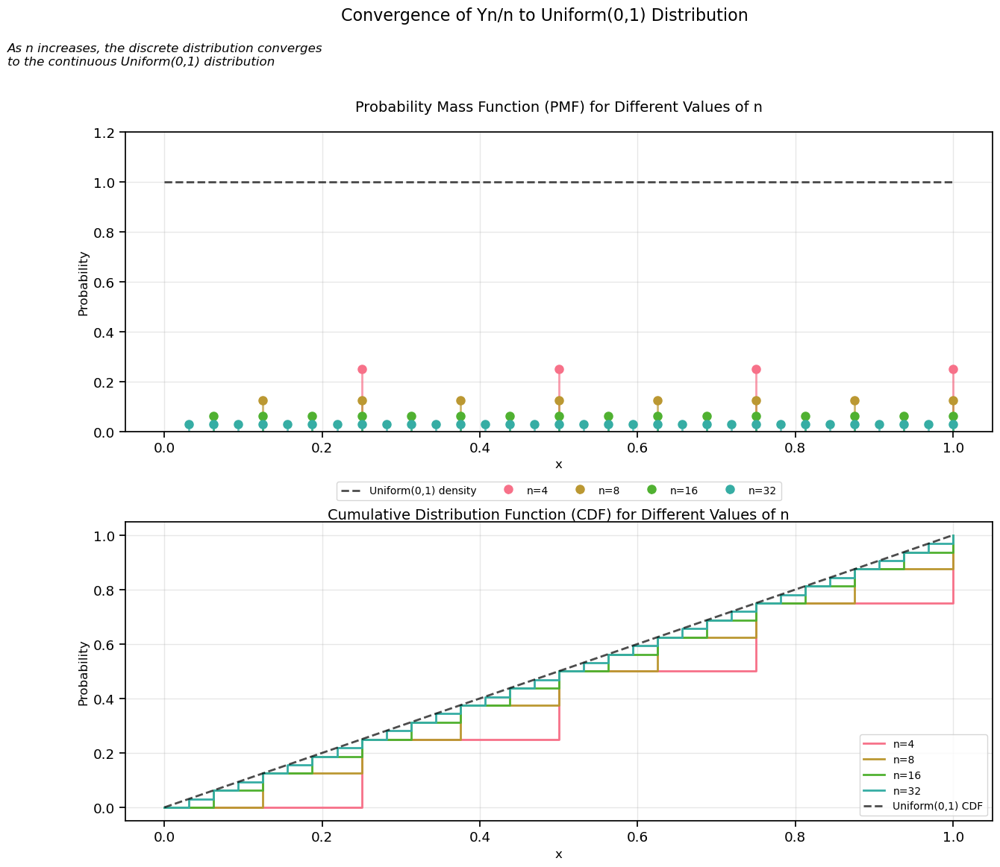

# Question 1

> A company sells lottery scratch-cards for £1 each. 1% of cards win the grand prize of £50, a further 20% win a small prize of £2, and the rest win no prize at all. Estimate how many cards the company needs to sell to be 99% sure of making an overall profit. $[\Phi(2.3263) = 0.99]$

## Solution

### 1. Analyzing Profit Structure

Let's break down the profit structure for each card:

Each card generates £1 in revenue. The prize distribution is:

- Grand prize (£50): Probability $p_1 = 0.01$
- Small prize (£2): Probability $p_2 = 0.2$
- No prize (£0): Probability $p_3 = 1 - p_1 - p_2 = 0.79$

The net profit per card category:

- Grand prize card: $1 - 50 = -£49$
- Small prize card: $1 - 2 = -£1$
- No prize card: $1 - 0 = £1$

### 2. Expected Value Calculation

Let $X$ be the random variable representing the net profit for a single card.

The expected value $E[X]$ is:
$$E[X] = (1 \times 0.79) + (-1 \times 0.2) + (-49 \times 0.01)$$
$$E[X] = 0.79 - 0.2 - 0.49 = 0.1$$

Therefore, the expected profit per card is £0.10.

### 3. Variance Calculation

The variance is calculated using $Var(X) = E[X^2] - (E[X])^2$

First, calculate $E[X^2]$:
$$E[X^2] = (1^2 \times 0.79) + ((-1)^2 \times 0.2) + ((-49)^2 \times 0.01)$$
$$E[X^2] = 0.79 + 0.2 + 24.01 = 25$$

Now calculate variance:
$$Var(X) = 25 - (0.1)^2 = 25 - 0.01 = 24.99$$

### 4. Central Limit Theorem Application

For $n$ cards, the total profit $S_n$ follows an approximately normal distribution with:

- $E[S_n] = n \cdot E[X] = 0.1n$
- $Var(S_n) = n \cdot Var(X) = 24.99n$
- $SD(S_n) = \sqrt{24.99n}$

For 99% confidence of profit:
$$E[S_n] - 2.3263 \cdot SD(S_n) > 0$$

### 5. Solving for Minimum Cards

Substituting the expressions:
$$0.1n - 2.3263\sqrt{24.99n} > 0$$

Square both sides:
$$(0.1n)^2 > (2.3263)^2 \cdot 24.99n$$
$$0.01n^2 > 135.236n$$

Solving for $n$:
$$n > \frac{135.236}{0.01} = 13,523.6$$

The company needs to sell at least **13,524 cards** to be 99% confident of making an overall profit.

# Key Quantitative Finance Lessons from the Lottery Problem

### The Power of Expected Value and Risk Analysis

The lottery card problem demonstrates fundamental concepts we use in portfolio management and risk assessment. Just as we analyzed the expected profit per card, financial analysts calculate expected returns on investments. The key insight is that even when individual outcomes can be negative (like the £50 prize), a position can still be profitable if the probability-weighted outcomes are positive.

### Law of Large Numbers in Practice

The solution shows how increasing the sample size (number of cards) helps reduce risk - a principle directly applicable to portfolio diversification. Just as the lottery company needs 13,524 cards to be 99% confident of profit, investment portfolios often require sufficient diversification across multiple positions to achieve statistical reliability.

### Confidence Intervals in Risk Management

The use of the 99% confidence interval (using $\Phi(2.3263)$) parallels Value at Risk (VaR) calculations in finance. This is exactly how we might calculate, for example, how much capital a trading desk needs to be 99% confident of covering potential losses. The methodology is similar to how banks calculate regulatory capital requirements.

### Variance and Standard Deviation

The detailed variance calculation shows how to properly account for extreme outcomes (like the £50 prize) that can significantly impact risk metrics. In finance, this teaches us to pay special attention to tail risks and not just focus on average returns. This is particularly relevant for options trading and structured products where payoff distributions can be highly skewed.

### Central Limit Theorem Applications

The solution's use of the Central Limit Theorem (CLT) is crucial for quantitative finance. We use CLT when:

- Aggregating returns across multiple trading strategies
- Modeling portfolio risk
- Calculating option prices using normal distributions
- Developing statistical arbitrage strategies

### Practical Risk-Return Tradeoff

The problem illustrates how businesses (and traders) can operate with negative possible outcomes as long as:

1. The expected value is positive
2. They have sufficient scale to allow the law of large numbers to work
3. They have enough capital to survive the worst-case scenarios

### Edge in Financial Markets

The lottery card's expected value of £0.10 profit per £1 invested represents a 10% edge. In financial markets, we similarly look for statistical edges, though they're usually much smaller (perhaps 0.1% or less), requiring higher leverage or volume to be profitable.

### Importance of Scale in Trading

The solution demonstrates why certain trading strategies require minimum capital levels to be viable. Just as the lottery company needs 13,524 cards, many statistical arbitrage strategies need minimum position sizes to overcome transaction costs and achieve statistical significance.

### Regulatory Parallels

The 99% confidence level requirement mirrors financial regulations like Basel requirements for banks. This teaches us how to think about capital adequacy and risk management from a regulatory perspective.

# Question 2:

> A list consists of 1000 non-negative numbers. The sum of the entries is 9000 and the sumof the squares of the entries of 91000. Let $X$ represent an entry picked at random fromthe list. Find the mean of $X$, the mean of $X^2$, and the variance of $X$. Using Markov’sinequality, show that the number of entries in the list greater than or equal to 50 is atmost 180. What is the corresponding bound from applying Markov’s inequality to the random variable $X2$? What is the corresponding bound using Chebyshev’s inequality?

## Solution:

### 1. Calculating Mean of X

The mean $\mu = E[X]$ is calculated from the sum of entries divided by their count:

$$\mu = E[X] = \frac{\text{Sum of entries}}{\text{Number of entries}} = \frac{9000}{1000} = 9$$

### 2. Calculating Mean of $X^2$

The mean of squared values $E[X^2]$ is given by:

$$E[X^2] = \frac{\text{Sum of squares of entries}}{\text{Number of entries}} = \frac{91000}{1000} = 91$$

### 3. Computing Variance of X

The variance $Var(X)$ is calculated using:

$$Var(X) = E[X^2] - (E[X])^2 = 91 - (9)^2 = 91 - 81 = 10$$

### 4. Applying Markov's Inequality to X

Using Markov's inequality:

$$P(X \geq a) \leq \frac{E[X]}{a}$$

For $a = 50$:

$$P(X \geq 50) \leq \frac{9}{50} = 0.18$$

Therefore, maximum number of entries $\geq 50$ is:

$$0.18 \times 1000 = 180 \text{ entries}$$

### 5. Applying Markov's Inequality to $X^2$

For $a = 50^2 = 2500$:

$$P(X^2 \geq 2500) \leq \frac{E[X^2]}{2500} = \frac{91}{2500} = 0.0364$$

Maximum number of entries with $X^2 \geq 2500$:

$$0.0364 \times 1000 = 36.4 \text{ entries} \approx \text{37 entries}$$

### 6. Applying Chebyshev's Inequality

Chebyshev's inequality states:

$$P(|X-\mu| \geq k\sigma) \leq \frac{1}{k^2}$$

Where:

- $\mu = 9$
- $\sigma = \sqrt{Var(X)} = \sqrt{10}$
- For $X \geq 50$: $X-\mu \geq 41$
- Therefore $k = \frac{41}{\sqrt{10}}$

Calculating:

$$k^2 = \left(\frac{41}{\sqrt{10}}\right)^2 = \frac{1681}{10} = 168.1$$

Thus:

$$P(X \geq 50) \leq \frac{1}{168.1} \approx 0.00595$$

Maximum number of entries $\geq 50$:

$$0.00595 \times 1000 \approx 6 \text{ entries}$$

### Summary of Results

1. Mean: $E[X] = 9$
2. Second Moment: $E[X^2] = 91$
3. Variance: $Var(X) = 10$
4. Markov bound for $X$: Maximum **180 entries** $\geq 50$
5. Markov bound for $X^2$: Maximum **37 entries** $\geq 50^2$
6. Chebyshev bound: Maximum **6 entries** $\geq 50$

### Mean vs. Variance

- The mean ($\mu$) represents the central tendency of the data, while the variance ($\sigma^2$) measures how spread out the data is.
- Knowing the mean and variance allows us to estimate probabilities and proportions using general-purpose inequalities like Markov's and Chebyshev's, without needing the exact distribution of the data.

> Insight: Variance plays a crucial role in determining the tightness of bounds. Lower variance leads to tighter bounds because the data is more concentrated around the mean.

### Markov’s Inequality is Broad but Weak

- Markov's inequality applies to any non-negative random variable and provides an upper bound for the probability that the variable exceeds a threshold. However, it is often loose because it does not account for the distribution shape or variance.
- Example: For $X\geq 50$, Markov's inequality gave a bound of 180 entries, which is likely an overestimate because it only uses the mean and assumes the "worst case" scenario.

> Takeaway: Markov’s inequality is useful when only the mean is known but tends to give conservative estimates.

### Markov’s Inequality on $X^2$ Can Be More Informative

- Applying Markov’s inequality to $X^2$ instead of $X$ provided a much stricter bound of 37 entries greater than 50. This highlights how inequalities can be more useful when applied to a transformed random variable ($X^2$) with a higher-order moment.

> Takeaway: Carefully selecting the random variable to apply the inequality to can yield tighter bounds.

### Chebyshev’s Inequality Uses Variance for Tighter Bounds

- Chebyshev's inequality takes into account both the mean and variance, making it more specific than Markov’s inequality.
- For $X\geq 50$, Chebyshev’s inequality gave a bound of 6 entries, which is much stricter than Markov’s.

> Insight: Chebyshev's inequality is especially powerful when the variance is small relative to the threshold. However, it assumes the variable is centered around the mean, so it may not perform well for highly skewed distributions.

# Question 3:

> For $\geq 1$, let $Y_n$ be uniform on $\{1,2,\dots,n\}$ (i.e. taking each value with probability $1/n$). Draw the distribution function of $Y_n/n$. Show that the sequence $Y_n/n$ converges in distribution as $n\rightarrow \infty$. What is the limit?

## Solution:

### 1. Distribution of $Y_n/n$

The random variable $Y_n$ is uniform on $\{1,2,\dots,n\}$. For a fixed $n$, the random variable $Y_n/n$ takes the values:

$$\frac{1}{n}, \frac{2}{n}, \dots, \frac{n}{n}$$

Each of these values has equal probability $\frac{1}{n}$. Thus, the probability mass function (PMF) of $Y_n/n$ is:

$$P\left(\frac{Y_n}{n}=\frac{k}{n}\right)=\frac{1}{n}, \quad k=1,2,\dots,n$$

### 2. Cumulative Distribution Function (CDF)

The cumulative distribution function (CDF) of $Y_n/n$, denoted $F_n(x)$, is:

$$F_n(x)=P\left(\frac{Y_n}{n}\leq x\right)$$

For any $x\in[0,1]$:

$$
F_n(x) = \begin{cases}
0 & \text{if } x < \frac{1}{n} \\
\frac{k}{n} & \text{if } \frac{k}{n} \leq x < \frac{k+1}{n} \\
1 & \text{if } x \geq 1
\end{cases}
$$

### 3. Distribution Function Visualization

The CDF $F_n(x)$ for $Y_n/n$ is a step function with $n$ steps between $0$ and $1$. Each step has height $\frac{1}{n}$ at points $\frac{k}{n}$ for $k=1,2,\dots,n$.

### 4. Convergence in Distribution

A sequence of random variables $X_n$ converges in distribution to a random variable $X$ if:

$$\lim_{n\to\infty} F_n(x)=F(x)$$

for all $x$ where $F(x)$ is continuous.

### 5. Limit Distribution

As $n\to\infty$, the steps of $F_n(x)$ become infinitely fine. The limiting CDF is:

$$
F(x) = \begin{cases}
0 & \text{if } x < 0 \\
x & \text{if } 0 \leq x \leq 1 \\
1 & \text{if } x > 1
\end{cases}
$$

This corresponds to a **Uniform(0,1)** distribution. We can write this convergence as:

$$\frac{Y_n}{n} \xrightarrow{d} \text{Uniform}(0,1)$$

### 6. Intuition

As $n\to\infty$, the values $\frac{Y_n}{n}$ become equally spaced over $[0,1]$ with probabilities converging to a uniform density. This demonstrates how discrete random variables can converge to a continuous random variable in distribution.

# Question 4:

> Let $X_i,i\geq 1$, be i.i.d. uniform on $[0,1]$. Let $M_n= max{X_1,...,X_n}$.
>
> - (a) Show that $M_n\rightarrow 1$ in probability as $n\rightarrow \infty$.
>
> - (b) Show that $n(1−M_n)$ converges in distribution as $n\rightarrow \infty$. What is the limit?

## Solution

### 1. Setup and Definitions

Let $X_i, i \geq 1$ be independent and identically distributed (i.i.d.) random variables following a Uniform[0,1] distribution. We define:

$$M_n = \max\{X_1, \ldots, X_n\}$$

### 2. Part (a): Convergence in Probability

First, let's derive the cumulative distribution function (CDF) of $M_n$. For any $x$:

$$F_{M_n}(x) = P(M_n \leq x) = P(X_1 \leq x, X_2 \leq x, \ldots, X_n \leq x)$$

Since the variables are independent:

$$F_{M_n}(x) = P(X_1 \leq x)^n$$

For Uniform[0,1] variables, we know that $P(X_i \leq x) = x$ for $x \in [0,1]$, giving us:

$$F_{M_n}(x) = x^n, \quad x \in [0,1]$$

The corresponding probability density function (PDF) is:

$$f_{M_n}(x) = \frac{d}{dx}F_{M_n}(x) = nx^{n-1}, \quad x \in [0,1]$$

#### Proving Convergence in Probability

To show $M_n \to 1$ in probability, we need to prove that for any $\epsilon > 0$:

$$\lim_{n \to \infty} P(|M_n - 1| \geq \epsilon) = 0$$

Note that:

$$P(|M_n - 1| \geq \epsilon) = P(M_n \leq 1-\epsilon)$$

Using our CDF:

$$P(M_n \leq 1-\epsilon) = (1-\epsilon)^n \to 0 \text{ as } n \to \infty$$

This proves convergence in probability to 1.

### 3. Part (b): Distributional Convergence

Let's define $Y_n = n(1-M_n)$ and find its limiting distribution. For any $y \geq 0$:

$$P(Y_n \leq y) = P(n(1-M_n) \leq y) = P(M_n \geq 1-\frac{y}{n})$$

Using the complement rule and our CDF:

$$P(M_n \geq 1-\frac{y}{n}) = 1 - P(M_n \leq 1-\frac{y}{n}) = 1 - (1-\frac{y}{n})^n$$

As $n \to \infty$, we can use the exponential limit:

$$(1-\frac{y}{n})^n \to e^{-y}$$

Therefore:

$$\lim_{n \to \infty} P(Y_n \leq y) = 1 - e^{-y}, \quad y \geq 0$$

This is the CDF of an Exponential(1) distribution.

### 4. Final Results

We have shown two important convergence results:

1. $M_n \xrightarrow{P} 1$ as $n \to \infty$ (convergence in probability)
2. $n(1-M_n) \xrightarrow{d} \text{Exponential}(1)$ as $n \to \infty$ (convergence in distribution)

This interesting result shows that while the maximum converges to 1, when properly scaled, the difference from 1 follows an exponential distribution in the limit.

When we look at the maximum of uniform random variables, we discover something fascinating: as we take more and more samples (as n increases), the maximum value approaches 1 with increasing certainty. This makes intuitive sense if we think about it - with more samples, we're more likely to get a value very close to 1, and once we do, that becomes our maximum.

But there's something deeper here. The convergence to 1 happens in a very specific way. The rate at which our maximum approaches 1 is precisely characterized by the exponential distribution. This tells us that even when we know the maximum is getting close to 1, there's still randomness in exactly how close it gets, and this randomness follows a predictable pattern.

> This example is part of a larger theory of extreme value distributions. Just as the Central Limit Theorem tells us about the behavior of averages, extreme value theory tells us about the behavior of maxima and minima. The fact that we get an exponential distribution in the limit is not a coincidence - it's related to the broader family of extreme value distributions that arise in different contexts.

# Question 5:

> ## Part a:
>
> What is the distribution of the sum of $n$ independent Poisson random variableseach of mean 1? Use the central limit theorem to deduce that:
>
> $$\exp\Big(n(1 +n+\frac{n^2}{2!}!+···+\frac{n^n}{n!})\Big)\rightarrow \frac{1}{2} \qquad \text{as } n \rightarrow \infty $$
>
> ## Part (b):
>
> Let $p \in (0,1) $. What is the distribution of the sum of $n $ independent Bernoulli random variables with parameter $ p$?
>
> Let $0 \leq a < b \leq 1 $. Use appropriate limit theorems to determine how the value of:
>
> $$
> \lim_{n \to \infty} \sum_{r \in \mathbb{N}: an \leq r < bn} \binom{n}{r} p^r (1-p)^{n-r}
> $$
>
> depends on $a$ and $b$.

## Solution Part a:

Let $X_1,X_2,\ldots,X_n$ be $n$ independent Poisson random variables, each with mean $\lambda=1$. The sum $S_n=X_1+X_2+\ldots+X_n$ is also a Poisson random variable. The sum of independent Poisson random variables with parameters $\lambda_1,\lambda_2,\ldots,\lambda_n$ is itself a Poisson random variable with parameter $\lambda=\lambda_1+\lambda_2+\cdots+\lambda_n$.

In this case:
$S_n\sim\text{Poisson}(\lambda=n)$

**Step 2: Central Limit Theorem (CLT) Approximation**

For large $n$, the Poisson distribution can be approximated using the Central Limit Theorem (CLT). Specifically, if $S_n\sim\text{Poisson}(n)$, then the standardized version of $S_n$:

$Z=\frac{S_n-n}{\sqrt{n}}$

approaches the standard normal distribution $N(0,1)$ as $n\to\infty$.

Thus:
$\Pr(S_n=k)\approx\frac{1}{\sqrt{2\pi n}}\exp\left(-\frac{(k-n)^2}{2n}\right)$

for $n$ large.

**Step 3: Relating the Factorial Term to the Exponential**

The probability mass function of a Poisson random variable $S_n$ with parameter $n$ is given by:

$\Pr(S_n=k)=\frac{n^ke^{-n}}{k!}$

To analyze $e^{-n}(1+n+\frac{n^2}{2!}+\cdots+\frac{n^n}{n!})$, observe that this is the cumulative probability $\Pr(S_n\leq n)$:

$e^{-n}\sum_{k=0}^n\frac{n^k}{k!}=\Pr(S_n\leq n)$

Using the CLT, standardizing $S_n$ as $Z=(S_n-n)/\sqrt{n}$, the cumulative probability can be approximated as:

$\Pr(S_n\leq n)\to\Pr(Z\leq 0)=\Phi(0)$

where $\Phi(z)$ is the cumulative distribution function of the standard normal distribution. Since $\Phi(0)=0.5$, we deduce:

$e^{-n}(1+n+\frac{n^2}{2!}+\cdots+\frac{n^n}{n!})\to\frac{1}{2}$ as $n\to\infty$

## Solution Part b:

Here's the properly formatted solution using LaTeX in Markdown:

Let $X_1,X_2,\ldots,X_n$ be $n$ independent Bernoulli random variables with parameter $p\in(0,1)$. The sum $S_n=\sum_{i=1}^n X_i$ is a Binomial random variable:

$S_n\sim\text{Binomial}(n,p)$

We evaluate:
$\lim_{n\to\infty}\sum_{r\in\mathbb{N}:an\leq r<bn}\binom{n}{r}p^r(1-p)^{n-r}$

where $0\leq a<b\leq 1$

For large $n$, the binomial distribution approximates normal:
$S_n\sim\mathcal{N}(np,np(1-p))$

where $\mu=np$ and $\sigma^2=np(1-p)$

Standardizing $S_n$:
$Z=\frac{S_n-np}{\sqrt{np(1-p)}}\sim\mathcal{N}(0,1)$

The probability mass function:
$\Pr(S_n=r)=\binom{n}{r}p^r(1-p)^{n-r}$

Therefore:
$\sum_{r\in\mathbb{N}:an\leq r<bn}\binom{n}{r}p^r(1-p)^{n-r}=\Pr(an\leq S_n<bn)$

Using CLT:
$\Pr(an\leq S_n<bn)\approx\Pr(\frac{an-np}{\sqrt{np(1-p)}}\leq Z<\frac{bn-np}{\sqrt{np(1-p)}})$

Define:
$z_a=\frac{an-np}{\sqrt{np(1-p)}}$ and $z_b=\frac{bn-np}{\sqrt{np(1-p)}}$

Then:
$\Pr(an\leq S_n<bn)\approx\Phi(z_b)-\Phi(z_a)$

where $\Phi(z)$ is the standard normal CDF.

As $n\to\infty$:

- $z_a\to\frac{a-p}{\sqrt{p(1-p)}}$
- $z_b\to\frac{b-p}{\sqrt{p(1-p)}}$

$\lim_{n\to\infty}\sum_{r\in\mathbb{N}:an\leq r<bn}\binom{n}{r}p^r(1-p)^{n-r}=\Phi(\frac{b-p}{\sqrt{p(1-p)}})-\Phi(\frac{a-p}{\sqrt{p(1-p)}})$

### Points to Learn:

- **The Universal Nature of Normal Distribution:** The problem demonstrates why the Normal distribution is so ubiquitous in statistics. We started with Bernoulli trials - perhaps the simplest possible random process (just success/failure) - yet when we look at many of them together in the right way, we get the Normal distribution. This is a manifestation of what mathematicians call "universality" - different systems often show the same behavior in their limit.

- **The Relationship Between Discrete and Continuous:** This problem beautifully illustrates how discrete probability distributions (Binomial) transition into continuous ones (Normal) as $n$ grows large. What's particularly interesting is that we're seeing this transition happen through a very specific lens - we're watching probabilities over intervals of the form $[an,bn)$ rather than just point probabilities. This connects to a broader principle in mathematics where counting discrete objects often leads to continuous measurements in the limit.

- **The Role of Scaling:** Notice how the final result includes the term $√(p(1-p))$ in the denominator. This scaling factor is crucial and tells us something profound about probability distributions - as we increase n, we need to "zoom in" at just the right rate to see meaningful structure. If we zoomed in too quickly or too slowly, we'd either see everything collapse to a point or spread out to infinity. This connects to the concept of "natural scales" in probability theory.

First, let me format the question properly using LaTeX and Markdown:

# Question 6:

> Let $\{X_n, n\geq 1\}$ be a sequence of random variables defined on the same probability space.
>
> (a) Show that if $X_n \to c$ in distribution, where $c$ is a constant, then also $X_n \to c$ in probability.
>
> (b) Show that if $E|X_n - X| \to 0$ as $n \to \infty$, then $X_n \to X$ in probability. Is the converse true?

Now, let's solve this step by step:

## Solution:

(a) First, let's show convergence in distribution implies convergence in probability when the limit is a constant.

Let's recall what convergence in distribution means:
For any continuity point $x$ of the CDF $F(x)$:
$F_n(x) \to F(x)$ as $n \to \infty$

Since $c$ is a constant, its CDF is:
$F(x) = \begin{cases} 
0 & \text{if } x < c \\
1 & \text{if } x \geq c
\end{cases}$

To prove convergence in probability, we need to show:
For any $\epsilon > 0$: $P(|X_n - c| > \epsilon) \to 0$ as $n \to \infty$

Let's write this in terms of CDFs:
$P(|X_n - c| > \epsilon) = P(X_n > c + \epsilon) + P(X_n < c - \epsilon)$
$= [1 - F_n(c + \epsilon)] + F_n(c - \epsilon)$

As $n \to \infty$:

- $F_n(c + \epsilon) \to F(c + \epsilon) = 1$
- $F_n(c - \epsilon) \to F(c - \epsilon) = 0$

Therefore: $P(|X_n - c| > \epsilon) \to 0$

(b) For the first part, we'll use Markov's inequality.

By Markov's inequality:
$P(|X_n - X| \geq \epsilon) \leq \frac{E|X_n - X|}{\epsilon}$

Since $E|X_n - X| \to 0$ as $n \to \infty$, we have:
$\lim_{n \to \infty} P(|X_n - X| \geq \epsilon) = 0$

Therefore, $X_n \to X$ in probability.

For the converse:
The converse is false. Here's a counterexample:

Let $X_n = \begin{cases}
n & \text{with probability } \frac{1}{n^2} \\
0 & \text{with probability } 1-\frac{1}{n^2}
\end{cases}$

Then:

- $P(|X_n - 0| > \epsilon) = \frac{1}{n^2} \to 0$ as $n \to \infty$, so $X_n \to 0$ in probability
- But $E|X_n - 0| = n \cdot \frac{1}{n^2} = \frac{1}{n} \not\to 0$ as $n \to \infty$

Therefore, convergence in probability does not imply convergence in mean.

This problem illustrates the hierarchy of convergence types in probability theory, showing that:

1. $L^1$ convergence implies convergence in probability
2. When the limit is a constant, convergence in distribution implies convergence in probability
3. Convergence in probability does not imply $L^1$ convergence

### Points to Understand:

Let's start with three key types of convergence we're dealing with:

- **Convergence in Distribution:** Think of this as convergence of shapes. Imagine taking photos of different mountains from the same distance. Even if they're different mountains, their silhouettes might look very similar from far away. That's like convergence in distribution - the overall pattern looks the same, even if the specific details might differ.
- **Convergence in Probability:** This is stronger than convergence in distribution. It's like saying "I'm getting closer and closer to the exact target." Imagine a game of darts where you're getting better - over time, most of your throws land very close to the bullseye.
- **Convergence in Mean ($L^1$ convergence):** This is even stronger. Not only are you getting close to the target, but your average distance from the target is also shrinking. In the dart game analogy, it means both that you're hitting near the bullseye AND that your rare bad throws aren't too far off.

### Why Part (a) Works

The first part of the question asks why convergence in distribution to a constant implies convergence in probability. Here's why this makes sense:
If you're converging to a constant (let's say 4.2), there's no randomness in the target - it's just one fixed number. So if your distribution is getting closer to looking like a spike at 4.2, you must actually be getting closer to 4.2 in a real sense.

### Why Part (b) Makes Sense

The relationship between mean convergence and probability convergence is like the relationship between "average accuracy" and "consistency":

If your average error is shrinking (mean convergence), then you must be getting more consistent (probability convergence)
But you can be consistent without having a good average - like consistently throwing darts that are slightly off-target

### The Counterexample Explained

The counterexample in part (b) is like a dart player who:

Usually throws perfectly (probability converging to perfect throws)
But occasionally makes a huge mistake, and these mistakes, though rare, are getting bigger and bigger (preventing mean convergence)

**For Time Series Analysis:**

1. If we have convergence in probability, we can use methods that rely on consistent estimation
2. If only distributional convergence, we might need more robust methods
3. Example: In financial market analysis, choosing between ARCH and GARCH models based on convergence properties

> ### The Hierarchy
>
> These types of convergence form a hierarchy:
>
> 1. Convergence in Mean ⟹ Convergence in Probability ⟹ Convergence in Distribution
> 2. The reverse implications generally don't hold
> 3. However, when converging to a constant, convergence in distribution implies convergence in probability

> [This App Demonstrates The Convergence](https://claude.site/artifacts/379f748b-7243-4a21-8ba7-ea65518c4014)
