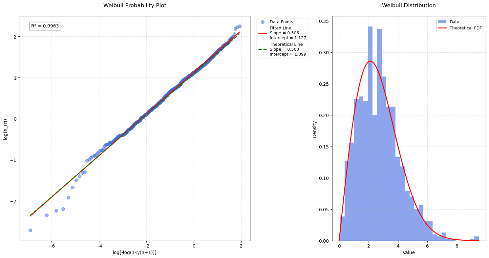
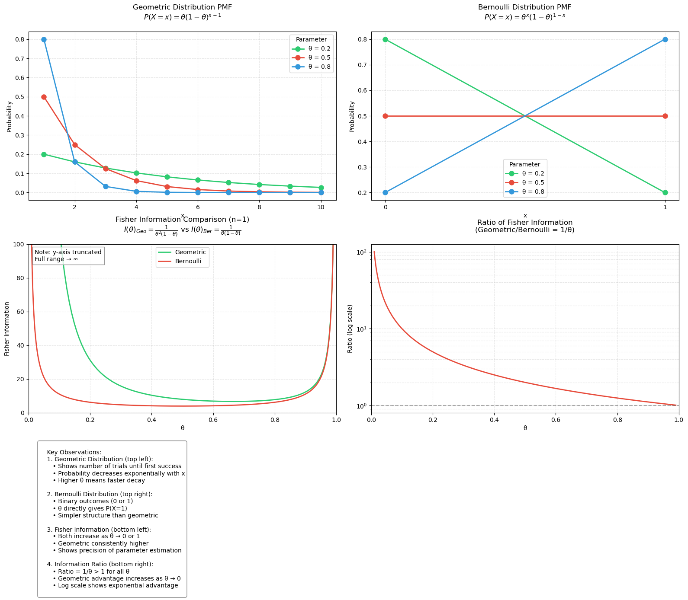
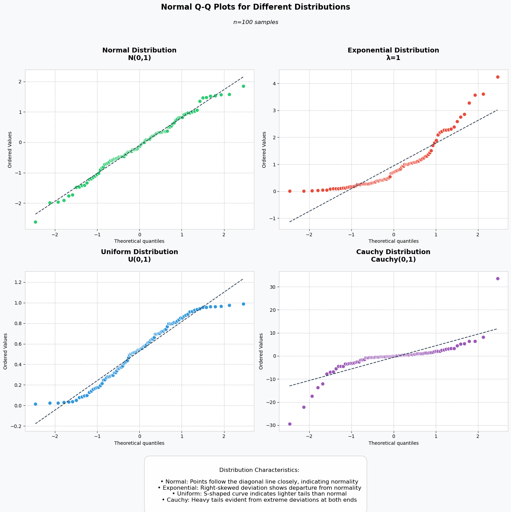
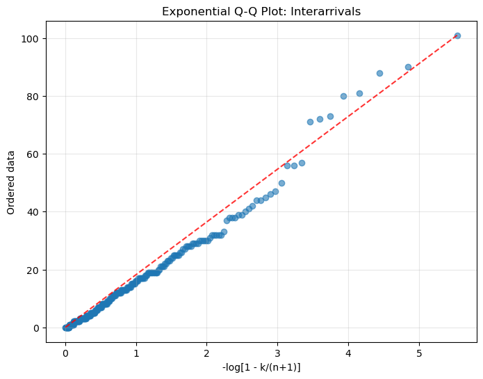
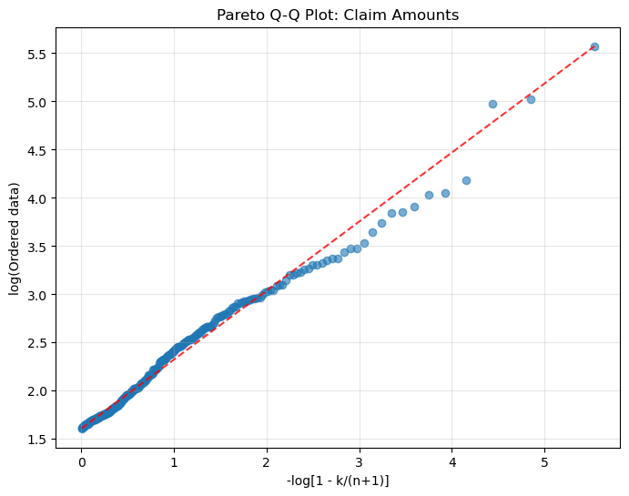

# Question 1: Maximum Likelihood Estimation and Delta Method

## Part (a):

> Suppose $X_1, \ldots, X_n$ are independent $\text{Bernoulli}(p)$ random variables. Use the delta method to find the asymptotic distribution of $\hat{p}/(1-\hat{p})$ where $\hat{p}$ is the maximum likelihood estimator of $p$. (The quantity $p/(1-p)$ is the odds of a success.)

## Solution

**MLE for p**

The MLE for p is:

$$\hat{p} = \frac{\sum_{i=1}^n X_i}{n}$$

Since $X_i \sim \text{Bernoulli}(p)$, the sum $\sum_{i=1}^n X_i \sim \text{Binomial}(n,p)$.

The asymptotic distribution of $\hat{p}$ is:

$$\hat{p} \sim_{approx} N\left(p, \frac{p(1-p)}{n}\right)$$

for large $n$ (by the Central Limit Theorem).

**Function of Interest - Odds**

The odds of success is:

$$g(p) = \frac{p}{1-p}$$

We want the asymptotic distribution of $g(\hat{p}) = \frac{\hat{p}}{1-\hat{p}}$.

**Delta Method**

The **Delta Method** helps approximate the distribution of a function of an estimator. Specifically:

- Let $\hat{p} \sim N(p, \text{Var}(\hat{p}))$, where $\text{Var}(\hat{p}) = \frac{p(1-p)}{n}$
- For a smooth function $g(p)$, the asymptotic distribution of $g(\hat{p})$ is:
  $$g(\hat{p}) \sim N(g(p), (g'(p))^2 \cdot \text{Var}(\hat{p}))$$

**Compute $g'(p)$**

The derivative of $g(p) = \frac{p}{1-p}$ is:

$$g'(p) = \frac{1}{(1-p)^2}$$

**Apply the Delta Method**

The variance of $g(\hat{p})$ is:

$$\text{Var}(g(\hat{p})) \approx (g'(p))^2 \cdot \text{Var}(\hat{p})$$

Substitute $g'(p) = \frac{1}{(1-p)^2}$ and $\text{Var}(\hat{p}) = \frac{p(1-p)}{n}$:

$$\text{Var}(g(\hat{p})) \approx \left(\frac{1}{(1-p)^2}\right)^2 \cdot \frac{p(1-p)}{n}$$

Simplify:

$$\text{Var}(g(\hat{p})) \approx \frac{p}{n(1-p)^3}$$

**Asymptotic Distribution of $g(\hat{p})$**

The asymptotic distribution is:

$$g(\hat{p}) = \frac{\hat{p}}{1-\hat{p}} \sim N\left(\frac{p}{1-p}, \frac{p}{n(1-p)^3}\right)$$

**Conclusion**

Using the Delta Method, the odds $g(\hat{p}) = \frac{\hat{p}}{1-\hat{p}}$ has the following asymptotic distribution:

$$\frac{\hat{p}}{1-\hat{p}} \sim N\left(\frac{p}{1-p}, \frac{p}{n(1-p)^3}\right)$$

where:

- The mean $\frac{p}{1-p}$ is the true odds of success
- The variance $\frac{p}{n(1-p)^3}$ decreases with $n$, reflecting the increasing precision of $\hat{p}$ as $n \to \infty$

## Part (b):

> Suppose $X_1,\dots,X_n$ are independent Poisson(λ) random variables. Find a function $g(\bar{X})$ such that the asymptotic variance of $g(\bar{X})$ does not depend on $\lambda$.

## Solution:

**1. Properties of the Sample Mean $\bar{X}$**

For $X_i \sim \text{Poisson}(\lambda)$:

- $E[\bar{X}] = \lambda$
- $\text{Var}(\bar{X}) = \frac{\lambda}{n}$

where $\bar{X} = \frac{1}{n}\sum_{i=1}^n X_i$

**2. Goal**

We need to find $g(\bar{X})$ such that its asymptotic variance does not depend on $\lambda$. Since $\text{Var}(\bar{X}) = \frac{\lambda}{n}$, we need $g(\bar{X})$ to normalize $\lambda$ appropriately.

**3. Define $g(\bar{X})$**

Let:
$$g(\bar{X}) = \sqrt{\bar{X}}$$

**4. Delta Method Application**

For large $n$, by the delta method:

$$\text{Var}(g(\bar{X})) \approx \left(\frac{\partial g(\bar{X})}{\partial \bar{X}}\right)^2 \text{Var}(\bar{X})$$

The derivative of $g(\bar{X}) = \sqrt{\bar{X}}$ is:

$$\frac{\partial g(\bar{X})}{\partial \bar{X}} = \frac{1}{2\sqrt{\bar{X}}}$$

As $n \to \infty$, $\bar{X} \to \lambda$ (by the Law of Large Numbers), so:

$$\text{Var}(g(\bar{X})) \approx \left(\frac{1}{2\sqrt{\lambda}}\right)^2 \cdot \frac{\lambda}{n} = \frac{1}{4n}$$

**5. Conclusion**
The function $g(\bar{X}) = \sqrt{\bar{X}}$ ensures that the asymptotic variance of $g(\bar{X})$ is $\frac{1}{4n}$, which does not depend on $\lambda$.

# Question 2:

> Let $X_1,...,X_n$ be a random sample from a uniform distribution with probability density function
>
> $$f(x) = \begin{cases} 1 & \text{if } 0 < x < 1 \\ 0 & \text{otherwise} \end{cases}$$
>
> Show that if $X_{(r)}$ is the $r$th order statistic, then
>
> $$E(X_{(r)}) = \frac{r}{n+1}, \quad \text{var}(X_{(r)}) = \frac{r(n+1-r)}{(n+1)^2(n+2)}$$
>
> Define the median of the random sample, distinguishing between the two cases $n$ odd and $n$ even. Show that the median has expected value $\frac{1}{2}$ if the random sample is drawn from a uniform distribution on $(0,1)$. Find its variance in the case when $n$ is odd. What is the expected value of the median if the random sample is drawn from a uniform distribution on $(a,b)$?
>
> [Hint: remember that pdfs integrate to 1, there's no need to actually do any integration in this question.]

## Solution Part a:

Let's solve this step by step for the first part of the question, showing that $E(X_{(r)}) = \frac{r}{n+1}$ and $\text{var}(X_{(r)}) = \frac{r(n+1-r)}{(n+1)^2(n+2)}$.

### 1. PDF of the r-th Order Statistic

For a sample of size $n$ from $U(0,1)$, the PDF of the $r$-th order statistic $X_{(r)}$ is:

$$f_{X_{(r)}}(x) = \frac{n!}{(r-1)!(n-r)!}x^{r-1}(1-x)^{n-r}, \quad 0 < x < 1$$

### 2. Expected Value $E[X_{(r)}]$

The expected value is given by:

$$E[X_{(r)}] = \int_0^1 x \cdot f_{X_{(r)}}(x) dx$$

Substituting the PDF:

$$E[X_{(r)}] = \int_0^1 x \cdot \frac{n!}{(r-1)!(n-r)!}x^{r-1}(1-x)^{n-r} dx$$

$$= \frac{n!}{(r-1)!(n-r)!}\int_0^1 x^r(1-x)^{n-r} dx$$

This integral is a Beta function $B(a,b)$ with $a=r+1$ and $b=n-r+1$:

$$\int_0^1 x^r(1-x)^{n-r} dx = B(r+1,n-r+1)$$

where:
$$B(a,b) = \frac{\Gamma(a)\Gamma(b)}{\Gamma(a+b)}$$

Using the relation between Beta and Gamma functions:

$$B(r+1,n-r+1) = \frac{\Gamma(r+1)\Gamma(n-r+1)}{\Gamma(n+2)}$$

Substituting back:

$$E[X_{(r)}] = \frac{n!}{(r-1)!(n-r)!} \cdot \frac{r!(n-r)!}{(n+1)!} = \frac{r}{n+1}$$

### 3. Variance $\text{Var}(X_{(r)})$

The variance is:

$$\text{Var}(X_{(r)}) = E[X_{(r)}^2] - (E[X_{(r)}])^2$$

Following similar steps for $E[X_{(r)}^2]$:

$$E[X_{(r)}^2] = \frac{n!}{(r-1)!(n-r)!}\int_0^1 x^{r+1}(1-x)^{n-r} dx$$

This gives:

$$E[X_{(r)}^2] = \frac{r(r+1)}{(n+1)(n+2)}$$

Therefore:

$$\text{Var}(X_{(r)}) = \frac{r(r+1)}{(n+1)(n+2)} - (\frac{r}{n+1})^2$$

After simplification:

$$\text{Var}(X_{(r)}) = \frac{r(n+1-r)}{(n+1)^2(n+2)}$$

Thus, we have proven both results:

- $E[X_{(r)}] = \frac{r}{n+1}$
- $\text{Var}(X_{(r)}) = \frac{r(n+1-r)}{(n+1)^2(n+2)}$

## Solution Part b: Median of Uniform Distribution Sample

Let's define the median for both cases:

**Case 1: n odd**
When $n$ is odd, let $n = 2k + 1$ for some $k \in \mathbb{N}$

- Median = $X_{(k+1)}$ (the $(k+1)$ th order statistic)

**Case 2: n even**
When $n$ is even, let $n = 2k$ for some $k \in \mathbb{N}$

- Median = $\frac{X_{(k)} + X_{(k+1)}}{2}$ (average of $k$ th and $(k+1)$ th order statistics)

### 2. Expected Value for U(0,1)

**Case 1: n odd $(n = 2k + 1)$**

Using the result from part 1, for the $(k+1)$ th order statistic:

$$E[X_{(k+1)}] = \frac{k+1}{n+1} = \frac{k+1}{2k+2} = \frac{1}{2}$$

**Case 2: n even $(n = 2k)$**
The median is the average of two order statistics:

$$E[\text{Median}] = E[\frac{X_{(k)} + X_{(k+1)}}{2}] = \frac{1}{2}(E[X_{(k)}] + E[X_{(k+1)}])$$

Using the previous result:
$$= \frac{1}{2}(\frac{k}{n+1} + \frac{k+1}{n+1}) = \frac{1}{2}(\frac{k + (k+1)}{2k+1}) = \frac{1}{2}$$

### 3. Variance for n odd

For $n = 2k + 1$, the median is $X_{(k+1)}$, so:

$$\text{Var}(X_{(k+1)}) = \frac{(k+1)(n+1-(k+1))}{(n+1)^2(n+2)}$$

Substituting $k = \frac{n-1}{2}$:

$$= \frac{(\frac{n+1}{2})(n+1-\frac{n+1}{2})}{(n+1)^2(n+2)}$$

$$= \frac{(\frac{n+1}{2})(\frac{n+1}{2})}{(n+1)^2(n+2)}$$

$$= \frac{1}{4(n+2)}$$

### 4. Expected Value for U(a,b)

For a uniform distribution on $(a,b)$, we can use the linear transformation property:

- If $X \sim U(0,1)$, then $Y = a + (b-a)X \sim U(a,b)$

Therefore:

- $E[Y_{(r)}] = a + (b-a)E[X_{(r)}]$

For the median (when $n$ is odd or even):
$$E[\text{Median}] = a + (b-a)\frac{1}{2} = \frac{a+b}{2}$$

This makes intuitive sense as it's the midpoint of the interval $(a,b)$.

Therefore:

- For $U(0,1)$: The median has expected value $\frac{1}{2}$
- For $U(a,b)$: The median has expected value $\frac{a+b}{2}$
- For odd $n$: The variance of the median is $\frac{1}{4(n+2)}$

# Question 3:

> Let $X$ be a continuous random variable with cumulative distribution function $F$ which is strictly increasing. If $Y = F(X)$, show that $Y$ is uniformly distributed on the interval $(0,1)$.
>
> The Weibull distribution with parameters $\alpha > 0$ and $\lambda > 0$ has cumulative distribution function:
>
> $$
> F(x) = \begin{cases}
> 0 & \text{if } x < 0 \\
> 1-\exp(-(x/\lambda)^\alpha) & \text{if } x > 0
> \end{cases}
> $$
>
> Explain why a probability plot for the Weibull distribution may be based on plotting the logarithm of the $r$th order statistic against $\log[-\log(1-\frac{r}{n+1})]$ and give the slope and intercept of such a plot.

## Solution: Weibull Distribution and Probability Plots

### Part 1: Uniform Distribution of $Y = F(X)$

- Since $F$ is a CDF, we know that $0 \leq F(x) \leq 1$ for all $x$
- Therefore, $Y = F(X)$ must be in $(0,1)$

For any $y \in (0,1)$:
$$P(Y \leq y) = P(F(X) \leq y)$$

Since $F$ is strictly increasing, it has an inverse $F^{-1}$:
$$P(F(X) \leq y) = P(X \leq F^{-1}(y))$$

By definition of CDF:
$$P(X \leq F^{-1}(y)) = F(F^{-1}(y)) = y$$

Therefore, $Y$ has CDF:
$$F_Y(y) = y \text{ for } y \in (0,1)$$

This is the CDF of $U(0,1)$, proving $Y \sim U(0,1)$

### Part 2: Weibull Probability Plot

For $x > 0$:
$$F(x) = 1-\exp(-(x/\lambda)^\alpha)$$

Take complement:
$$1-F(x) = \exp(-(x/\lambda)^\alpha)$$

Take log of both sides:
$$\log(1-F(x)) = -(x/\lambda)^\alpha$$

Take log again:
$$\log[-\log(1-F(x))] = \alpha\log(x) - \alpha\log(\lambda)$$

For the $r$ th order statistic:

- $E[X_{(r)}]$ represents expected value of the $r$th order statistic
- From previous results, $F(E[X_{(r)}]) \approx \frac{r}{n+1}$

Therefore:
$$\log[-\log(1-\frac{r}{n+1})] = \alpha\log(E[X_{(r)}]) - \alpha\log(\lambda)$$

Plotting $\log(X_{(r)})$ against $\log[-\log(1-\frac{r}{n+1})]$ gives:

- Slope = $\frac{1}{\alpha}$
- Intercept = $\log(\lambda)$

This creates a linear plot if the data follows a Weibull distribution, with:

- $y = \log(X_{(r)})$
- $x = \log[-\log(1-\frac{r}{n+1})]$

The resulting line has equation:
$$y = \frac{1}{\alpha}x + \log(\lambda)$$

This provides a graphical method to:

1. Verify if data follows Weibull distribution (check linearity)
2. Estimate parameters $\alpha$ and $\lambda$ from slope and intercept

# Question 4:

> Find the expected information for $\theta$, where $0 < \theta < 1$, based on a random sample $X_1,...,X_n$ from:
>
> (a) the geometric distribution
> $$f(x;\theta) = \theta(1-\theta)^{x-1}, \quad x = 1,2,...$$
>
> (b) the Bernoulli distribution
> $$f(x;\theta) = \theta^x(1-\theta)^{1-x}, \quad x = 0,1$$
>
> A statistician has a choice between observing random samples from the geometric or Bernoulli distributions with the same $\theta$. Which will give the more precise inference about $\theta$?

## Solution: Expected Information for Geometric and Bernoulli Distributions

Let's solve this step by step for both distributions.

### Part (a): Geometric Distribution

The expected information is given by:
$$I(\theta) = -E\left[\frac{\partial^2}{\partial\theta^2}\log f(X;\theta)\right]$$

$$\log f(x;\theta) = \log\theta + (x-1)\log(1-\theta)$$

$$\frac{\partial}{\partial\theta}\log f(x;\theta) = \frac{1}{\theta} - \frac{x-1}{1-\theta}$$

$$\frac{\partial^2}{\partial\theta^2}\log f(x;\theta) = -\frac{1}{\theta^2} - \frac{x-1}{(1-\theta)^2}$$

We know $E[X] = \frac{1}{\theta}$ for geometric distribution

$$I_G(\theta) = \frac{1}{\theta^2} + \frac{E[X]-1}{(1-\theta)^2}$$
$$= \frac{1}{\theta^2} + \frac{\frac{1}{\theta}-1}{(1-\theta)^2}$$
$$= \frac{1}{\theta^2} + \frac{1}{\theta(1-\theta)^2}$$
$$= \frac{1}{\theta^2(1-\theta)}$$

For n observations, multiply by n:
$$I_G(\theta) = \frac{n}{\theta^2(1-\theta)}$$

### Part (b): Bernoulli Distribution

$$\log f(x;\theta) = x\log\theta + (1-x)\log(1-\theta)$$

$$\frac{\partial}{\partial\theta}\log f(x;\theta) = \frac{x}{\theta} - \frac{1-x}{1-\theta}$$

$$\frac{\partial^2}{\partial\theta^2}\log f(x;\theta) = -\frac{x}{\theta^2} - \frac{1-x}{(1-\theta)^2}$$

For Bernoulli, $E[X] = \theta$

$$I_B(\theta) = \frac{\theta}{\theta^2} + \frac{1-\theta}{(1-\theta)^2}$$
$$= \frac{1}{\theta} + \frac{1}{1-\theta}$$
$$= \frac{1}{\theta(1-\theta)}$$

For n observations:
$$I_B(\theta) = \frac{n}{\theta(1-\theta)}$$

### Comparison and Conclusion

Comparing the two expressions:

- Geometric: $I_G(\theta) = \frac{n}{\theta^2(1-\theta)}$
- Bernoulli: $I_B(\theta) = \frac{n}{\theta(1-\theta)}$

Since $0 < \theta < 1$, we have $\frac{1}{\theta} > 1$, therefore:
$$I_G(\theta) > I_B(\theta)$$

The geometric distribution provides more information about $\theta$ and will give more precise inference. This is because each geometric observation provides more information about $\theta$ than a single Bernoulli trial, as it captures the entire sequence of trials until success.

# Question 5:

> Suppose a random sample $Y_1,...,Y_n$ from an exponential distribution with parameter $\lambda$ is rounded down to the nearest $\delta$, giving $Z_1,...,Z_n$ where $Z_j = \delta\lfloor Y_j/\delta \rfloor$. Show that the likelihood contribution from the $j$th rounded observation can be written $(1-e^{-\lambda\delta})e^{-\lambda z_j}$, and deduce that the expected information for $\lambda$ based on the entire sample is:
>
> $$\frac{n\delta^2e^{-\lambda\delta}}{(1-e^{-\lambda\delta})^2}$$
>
> Show that this has limit $n/\lambda^2$ as $\delta \to 0$, and that if $\lambda = 1$, the loss of information when data are rounded down to the nearest integer rather than recorded exactly, is less than 10%. Find the loss of information when $\delta = 0.1$, and comment briefly.

## Solution: Information Loss in Rounded Exponential Data

**Likelihood Contribution for a Rounded Observation**

Each $Y_j$ follows an exponential distribution with parameter $\lambda$, and is rounded down to the nearest $\delta$ to form $Z_j = \delta\lfloor Y_j/\delta\rfloor$. The value of $Z_j$ is a discrete multiple of $\delta$: $Z_j \in \{0,\delta,2\delta,\dots\}$.

For a specific $Z_j = z_j$ (where $z_j = k\delta$), the likelihood contribution comes from:

$$P(Z_j = z_j) = P(k\delta \leq Y_j < (k+1)\delta)$$

For an exponential random variable $Y_j$ with CDF:

$$F(y;\lambda) = 1-e^{-\lambda y}, \quad y \geq 0$$

The probability is:

$$
\begin{align*}
P(Z_j = z_j) &= P(k\delta \leq Y_j < (k+1)\delta) \\
&= F((k+1)\delta) - F(k\delta) \\
&= (1-e^{-\lambda(k+1)\delta}) - (1-e^{-\lambda k\delta}) \\
&= e^{-\lambda k\delta} - e^{-\lambda(k+1)\delta} \\
&= e^{-\lambda k\delta}(1-e^{-\lambda\delta})
\end{align*}
$$

Since $z_j = k\delta$, the likelihood contribution is:

$$P(Z_j = z_j) = (1-e^{-\lambda\delta})e^{-\lambda z_j}$$

The Fisher Information for $\lambda$ is:

$$I(\lambda) = -E[\frac{\partial^2}{\partial\lambda^2}\log L(\lambda)]$$

For a single observation $Z_j = z_j$, the log-likelihood is:

$$\log P(Z_j = z_j) = \log(1-e^{-\lambda\delta}) - \lambda z_j$$

Taking derivatives:

First derivative:
$$\frac{\partial}{\partial\lambda}\log P(Z_j = z_j) = \frac{-\delta e^{-\lambda\delta}}{1-e^{-\lambda\delta}} - z_j$$

Second derivative:
$$\frac{\partial^2}{\partial\lambda^2}\log P(Z_j = z_j) = -\frac{\delta^2 e^{-\lambda\delta}}{(1-e^{-\lambda\delta})^2}$$

Therefore, the Fisher Information for a single observation is:

$$I(\lambda) = \frac{\delta^2 e^{-\lambda\delta}}{(1-e^{-\lambda\delta})^2}$$

For a sample of size $n$:

$$I_n(\lambda) = n\cdot\frac{\delta^2 e^{-\lambda\delta}}{(1-e^{-\lambda\delta})^2}$$

Using Taylor expansion:
$$1-e^{-\lambda\delta} \approx \lambda\delta \text{ as } \delta \to 0$$

Therefore:
$$I_n(\lambda) \approx n\cdot\frac{\delta^2 e^{-\lambda\delta}}{(\lambda\delta)^2} \to \frac{n}{\lambda^2}$$

### Loss of Information Analysis

For $\delta = 1$ and $\lambda = 1$:

- $1-e^{-1} \approx 0.6321$
- $e^{-1} \approx 0.3679$
- $I_n(\lambda) \approx 0.921n$
- Loss = $1 - 0.921 = 0.079$ or 7.9%

For $\delta = 0.1$:

- $1-e^{-0.1} \approx 0.0952$
- $e^{-0.1} \approx 0.9048$
- $I_n(\lambda) \approx 0.998n$
- Loss = $1 - 0.998 = 0.002$ or 0.2%

### Comments

1. As $\delta$ decreases, the loss of information becomes negligible
2. For $\delta = 1$, the loss is small (<10%), making integer rounding reasonable
3. For $\delta = 0.1$, the loss is nearly negligible (0.2%), ensuring very precise inference

We learn the following from this question:

1. **Information loss in Data Collection:**

- Helps understand how much precision we lose when rounding measurements
- Even rounding to integers ($\delta = 1$) only loses about 8% information

2. **Fisher Information Interpretation:**

- Demonstrates how Fisher Information measures the "quality" of parameter estimation
- Helps understand the trade-off between data precision and statistical efficiency

3. **Practical Applications:**

- Data Storage: Justifies using rounded data to save storage space
- Cost-Benefit Analysis: Balance between precision and resource constraints
- Quality Control: Understanding impact of measurement precision on inference
- For exponential data, even coarse rounding retains most information
- More precise measurements (smaller $\delta$) give better parameter estimates

This concept of information loss due to rounding extends beyond just exponential distributions.The specific amount of information loss will vary by distribution. The methodology remains similar:

- Calculate likelihood for rounded data
- Find Fisher Information
- Compare with original (unrounded) Fisher Information

> Key Differences Across Distributions:
>
> - Heavy-tailed distributions might be less sensitive to rounding
> - Symmetric distributions have different patterns of information loss
> - The acceptable rounding threshold varies by distribution

# Question 6:

> Consider independent exponential random variables $X_1,...,X_n$ with parameter $\theta$. Let $\#A$ denote the number of elements of a set $A$, and consider two estimators:
>
> $$\tilde{p} = \frac{\#{i: X_i > 1}}{n} \quad \text{and} \quad \hat{p} = \bar{X}$$
>
> When $T_1$ and $T_2$ are estimators of a parameter $\theta$, the asymptotic efficiency of $T_1$ relative to $T_2$ is given by:
>
> $$\lim_{n \to \infty} \frac{\text{avar}(T_2)}{\text{avar}(T_1)}$$
>
> where $\text{avar}(T_j)$ denotes the asymptotic variance of the approximating normal distribution of $T_j$, $j = 1,2$.
>
> Find the asymptotic efficiency of $T_1 = -\log \tilde{p}$ relative to $T_2 = 1/\hat{p}$. Find the numerical value of the asymptotic efficiency when $\theta = 0.6, 1.6, 5.6$. Comment on the implications for using $T_1$ instead of $T_2$ to estimate $\theta$.

# Question 7

> The figure below shows normal Q-Q plots for randomly generated samples of size 100 from four different densities: from a $N(0,1)$ density,
> an exponential density, a uniform density, and a Cauchy density.

- Normal distribution should look most linear as it's being compared to itself
- Uniform has no tails, hence the S-shape as it's bounded
- Exponential is right-skewed, hence the upward curve
- Cauchy has the heaviest tails, hence the extreme deviations

# Question 9

## Exponential Q-Q Plot for Interarrivals:

- The first plot shows interarrival times (time between insurance claims)
- There's a noticeable deviation from the red dashed line (which represents perfect exponential fit)
- The points curve below the line, particularly for larger values

This suggests that:

- The data has lighter tails than an exponential distribution
- Very long waiting times between claims are less common than an exponential model would predict
- The actual distribution might be more "bunched up" around the mean

For claim timing (interarrivals):

- The process is not purely random (not perfectly exponential)
- Claims tend to cluster more than a pure random process would suggest
- This could indicate seasonality or other patterns in claim occurrence

## Pareto Q-Q Plot for Claim Amounts:

- This plot shows the logarithm of claim amounts
- The fit to the red line is remarkably good for most of the range
- There's only slight deviation at the very high end
- This suggests that:

  - Claim amounts follow a Pareto distribution quite well
  - This is typical for insurance claims because:

    - Most claims are for moderate amounts
    - There are progressively fewer large claims
    - But the potential for very large claims exists (heavy tail property)

The Pareto distribution is particularly good at modeling this kind of "heavy-tailed" behavior

For claim amounts:

- The Pareto fit suggests a significant probability of very large claims
- This validates the need for reinsurance to protect against extreme events
- It helps in pricing insurance policies and setting reserves
