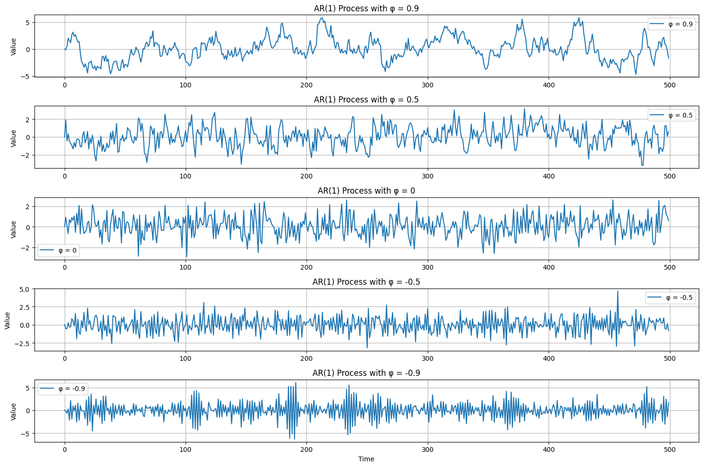
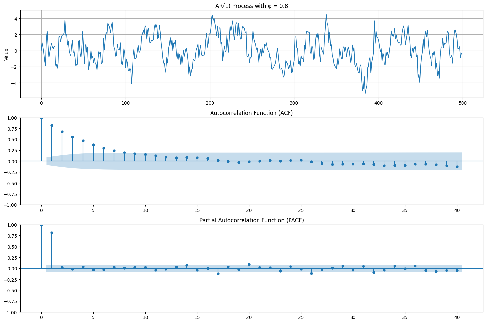
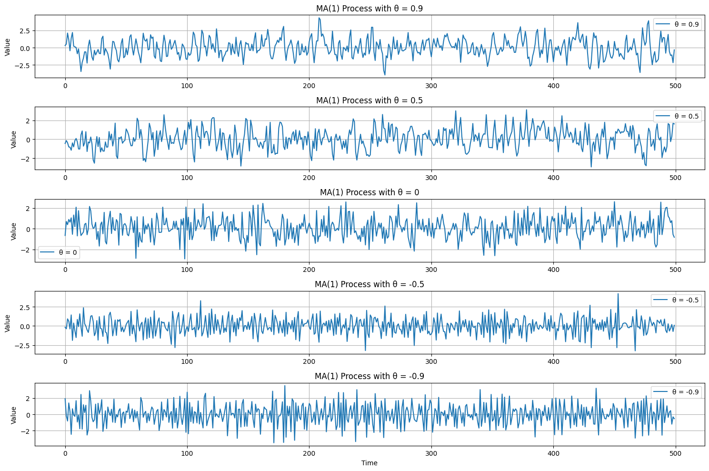
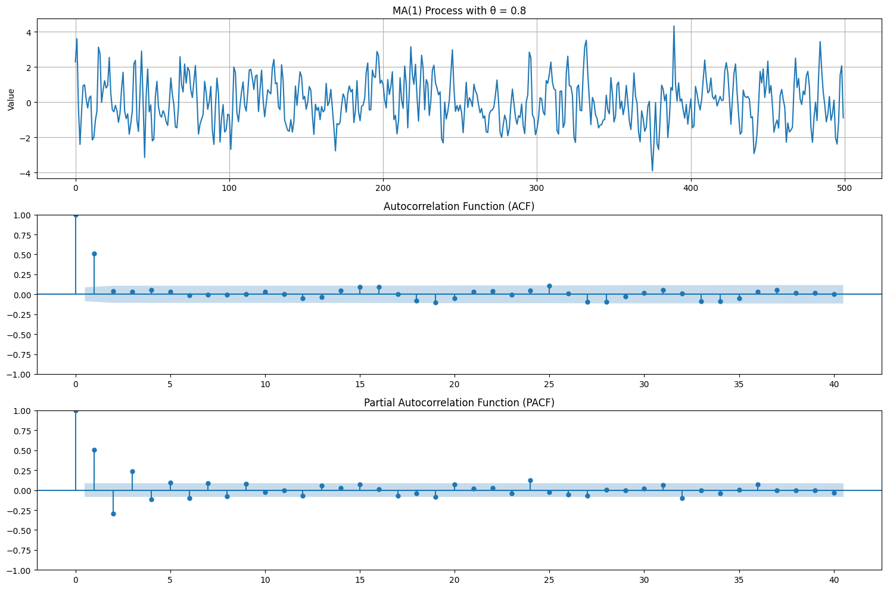
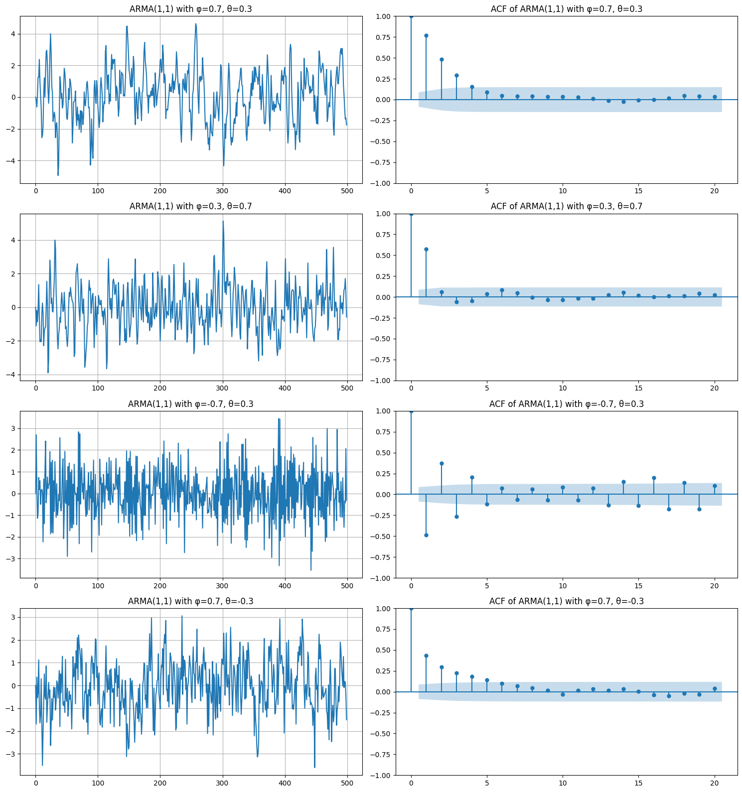
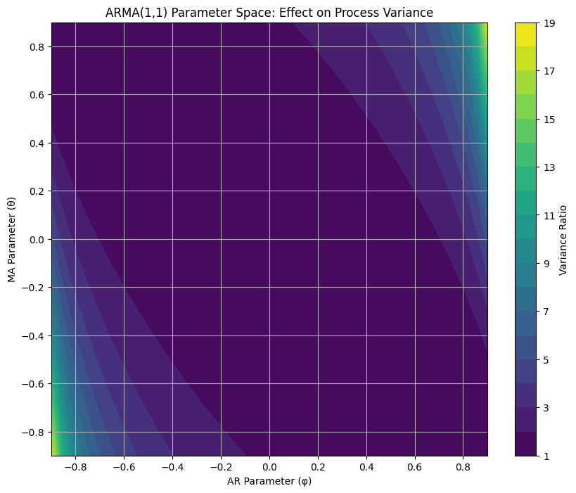
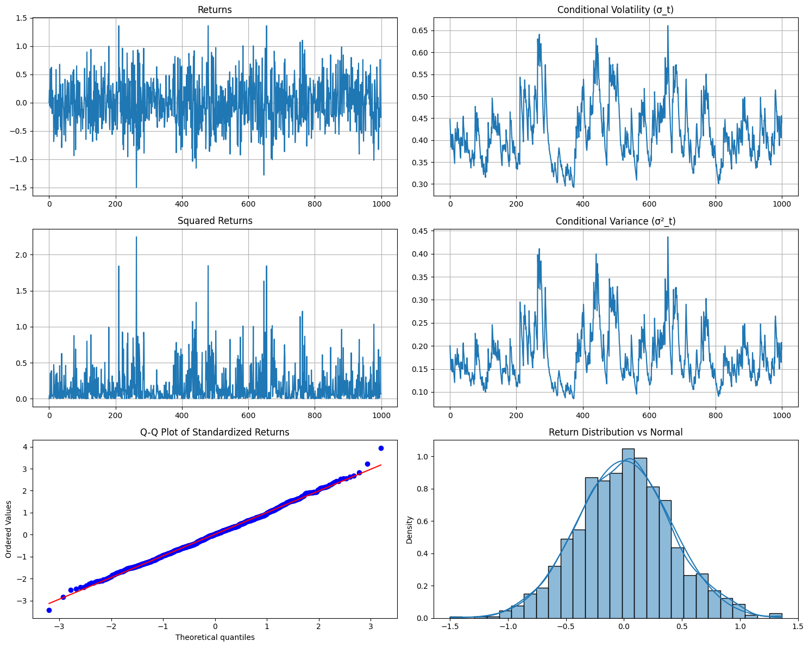
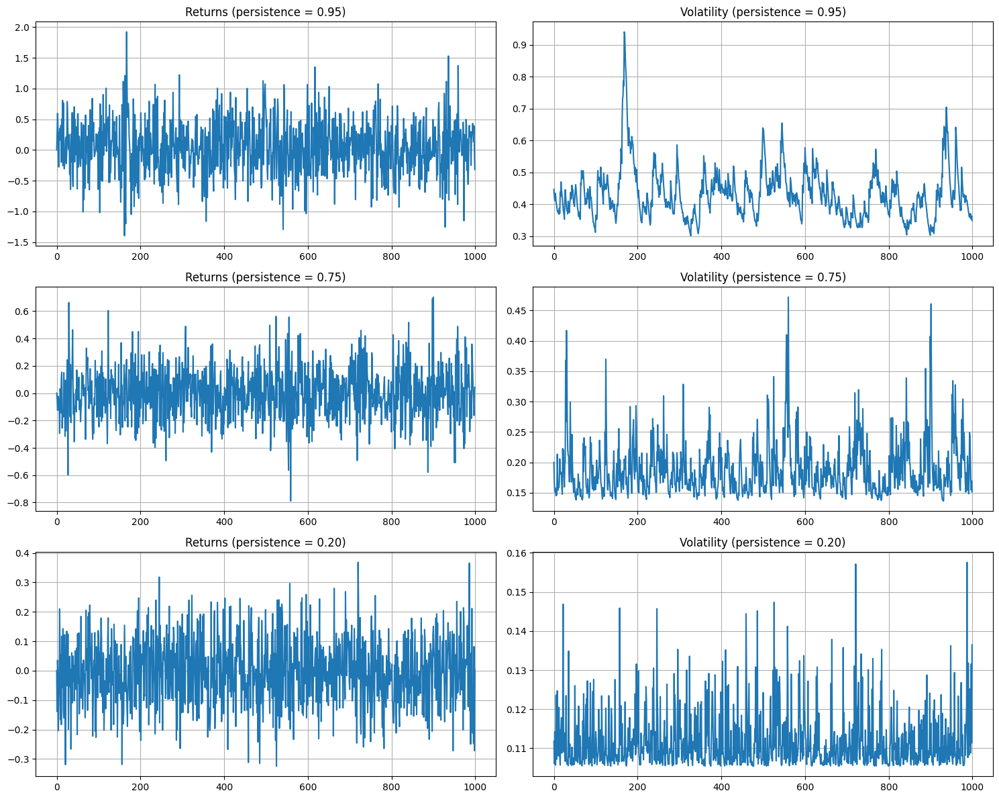
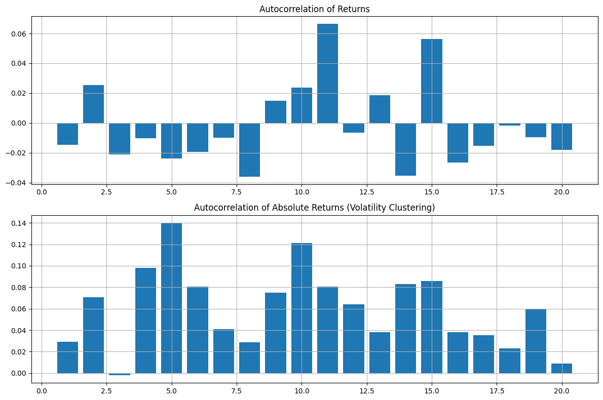

# Time Series Models:

## Introduction to Time Series

Before diving into specific models, let's understand what makes time series analysis unique. In time series data, observations are dependent on previous values, unlike regular statistical data where observations are typically assumed to be independent. This temporal dependency is what makes time series modeling both challenging and fascinating.

## Stationarity: The Foundation

A crucial concept in time series analysis is stationarity. A time series is considered stationary if its statistical properties remain constant over time.

Formally, a time series $\{X_t\}$ is strictly stationary if the joint distribution of $(X_{t_1}, ..., X_{t_k})$ is identical to $(X_{t_1+h}, ..., X_{t_k+h})$ for all $k$, all time points $t_1, ..., t_k$, and all shifts $h$.

In practice, we often work with weak (or covariance) stationarity, which requires:

1. $E[X_t] = \mu$ (constant mean)
2. $Var(X_t) = \sigma^2$ (constant variance)
3. $Cov(X_t, X_{t+h}) = \gamma_h$ (covariance depends only on lag $h$)

## Autoregressive (AR) Processes

### AR(1) Process

Let's start with the simplest autoregressive process, AR(1):

$X_t = c + \phi X_{t-1} + \epsilon_t$

where:

- $c$ is a constant
- $\phi$ is the autoregressive coefficient
- $\epsilon_t$ is white noise with variance $\sigma^2$

The process is stationary if $|\phi| < 1$. This condition ensures that past shocks decay exponentially rather than explode.

### AR(p) Process

The general form of an AR(p) process is:

$X_t = c + \phi_1 X_{t-1} + \phi_2 X_{t-2} + ... + \phi_p X_{t-p} + \epsilon_t$

Key properties:

1. The process has "memory" of length p
2. Stationarity depends on the roots of the characteristic equation:
   $1 - \phi_1 z - \phi_2 z^2 - ... - \phi_p z^p = 0$
   All roots must lie outside the unit circle for stationarity.
3. The autocorrelation function (ACF) decays exponentially
4. The partial autocorrelation function (PACF) cuts off after lag p

https://juanitorduz.github.io/arma_numpyro/

## Moving Average (MA) Processes

### MA(1) Process

The simplest moving average process is MA(1):

$X_t = \mu + \epsilon_t + \theta \epsilon_{t-1}$

where:

- $\mu$ is the mean
- $\theta$ is the moving average coefficient
- $\epsilon_t$ is white noise

### MA(q) Process

The general form is:

$X_t = \mu + \epsilon_t + \theta_1 \epsilon_{t-1} + \theta_2 \epsilon_{t-2} + ... + \theta_q \epsilon_{t-q}$

Key properties:

1. MA processes are always stationary (a major advantage over AR processes)
2. The ACF cuts off after lag q
3. The PACF decays exponentially
4. MA processes have "finite memory" - they only remember the past q periods

## ARMA(p,q) Processes

ARMA combines both AR and MA components:

$X_t = c + \sum_{i=1}^p \phi_i X_{t-i} + \sum_{j=1}^q \theta_j \epsilon_{t-j} + \epsilon_t$

Key properties:

1. Stationarity conditions are the same as for AR(p)
2. The ACF decays exponentially after lag q
3. The PACF decays exponentially after lag p
4. ARMA models are more parsimonious than pure AR or MA models

### Model Selection

To determine appropriate p and q values:

1. Plot ACF and PACF
2. Use information criteria (AIC, BIC)
3. Consider the principle of parsimony (simpler models are better)

## GARCH(p,q) Processes

While ARMA models assume constant variance, GARCH models explicitly model time-varying volatility, making them crucial for financial applications.

### GARCH(1,1)

The most common specification is GARCH(1,1):

$r_t = \mu + \epsilon_t$
$\epsilon_t = \sigma_t z_t$
$\sigma_t^2 = \omega + \alpha \epsilon_{t-1}^2 + \beta \sigma_{t-1}^2$

where:

- $r_t$ is the return
- $z_t$ is standard normal
- $\sigma_t^2$ is conditional variance
- $\omega, \alpha, \beta$ are parameters

### GARCH(p,q)

The general form has p ARCH terms and q GARCH terms:

$\sigma_t^2 = \omega + \sum_{i=1}^p \alpha_i \epsilon_{t-i}^2 + \sum_{j=1}^q \beta_j \sigma_{t-j}^2$

Key properties:

1. Captures volatility clustering
2. Models "leverage effect" (negative returns impact volatility more than positive returns)
3. Requires $\sum_{i=1}^p \alpha_i + \sum_{j=1}^q \beta_j < 1$ for stationarity
4. Unconditional variance is $\frac{\omega}{1-\sum \alpha_i - \sum \beta_j}$

## Common Interview Questions

1. How would you test for stationarity?

   - Augmented Dickey-Fuller test
   - KPSS test
   - Visual inspection of ACF/PACF plots

2. Why use ARMA over pure AR or MA?

   - More parsimonious
   - Can capture both short and long-term dependencies
   - Often provides better fit with fewer parameters

3. Why is GARCH important in finance?

   - Captures volatility clustering
   - Models risk more accurately
   - Accounts for fat tails in returns distribution

4. How do you interpret ACF/PACF plots?
   - ACF shows overall correlation structure
   - PACF shows direct correlation at each lag
   - Use both to identify potential model orders

## Practical Implementation Tips

1. Always start with data visualization

   - Plot the time series
   - Check ACF/PACF plots
   - Look for obvious patterns or seasonality

2. Test for stationarity first

   - Difference data if necessary
   - Remove trends if present
   - Consider seasonal adjustment

3. Start simple

   - Begin with low-order models
   - Increase complexity only if necessary
   - Validate using out-of-sample data

4. Diagnostic checking
   - Check residuals for whiteness
   - Verify model assumptions
   - Compare with simpler alternatives

Remember: In quant interviews, understanding the intuition behind these models is often more important than memorizing formulas. Focus on:

- When each model is appropriate
- The limitations of each approach
- How to diagnose and validate models
- Real-world applications and interpretation

# Understanding Time Series Models:

## The Big Picture

Before we dive into each model, let's understand why we need different types of time series models. Imagine you're trying to predict different patterns in financial markets. Some patterns depend on past values (like momentum in stock prices), some depend on past shocks (like market reactions to news), and some involve changing risk levels (like volatility clustering). Different models are designed to capture these different patterns.

## Autoregressive (AR) Models: The Momentum Capturer

### Intuitive Understanding

Think of AR models as capturing momentum or persistence in a system. Imagine a heavy pendulum swinging - its current position strongly influences where it will be in the next moment. This is exactly what AR models capture - situations where the current value strongly depends on previous values.

### Real-World Example

Consider a company's quarterly earnings. If a company is doing well, it tends to continue doing well in the next quarter. If it's struggling, that often continues too. This persistence is perfectly suited for AR modeling.

$X_t = c + \phi X_{t-1} + \epsilon_t$ (AR(1) process)

Here, $\phi$ tells us how strongly past values influence the present. If $\phi = 0.8$, it means 80% of the previous value's effect carries over.

### What AR Models Can't Do

AR models struggle with sudden changes or reactions to external events. They're like trying to predict a car's position just by looking at where it's been, without considering the driver's actions.

## Moving Average (MA) Models: The Shock Responder

### Intuitive Understanding

MA models are like echo systems - they show how past shocks or surprises continue to influence the present. Think of dropping a stone in a pond - the ripples (effects) gradually fade away over time.

### Real-World Example

Imagine market reactions to Fed announcements. The surprise (shock) from the announcement affects markets immediately and continues to have diminishing effects over the next few days. This is a classic MA pattern.

$X_t = \mu + \epsilon_t + \theta \epsilon_{t-1}$ (MA(1) process)

Here, $\theta$ tells us how strongly past shocks echo into the present. If $\theta = 0.5$, today's value is influenced by 50% of yesterday's shock.

### What MA Models Can't Do

MA models can't capture long-term trends or persistent patterns. They're like trying to predict weather only by looking at recent unexpected changes, without considering seasonal patterns.

## ARMA Models: The Hybrid Solution

### Intuitive Understanding

ARMA combines both momentum (AR) and shock response (MA). It's like predicting a surfer's position by considering both the underlying wave pattern (AR component) and the effect of sudden wind gusts (MA component).

### Real-World Example

Stock prices often exhibit both momentum (AR) and reaction to news (MA). The price might trend upward due to good performance (AR) while also jumping up and down due to news releases (MA).

$X_t = c + \phi X_{t-1} + \epsilon_t + \theta \epsilon_{t-1}$ (ARMA(1,1) process)

### Why ARMA is Special

ARMA models can capture complex patterns more efficiently than pure AR or MA models. It's like having both a compass and a weather report when navigating - you get more complete information.

## GARCH Models: The Risk Evolution Tracker

### Intuitive Understanding

GARCH models are fundamentally different - they model how uncertainty itself changes over time. Imagine tracking not just a car's position, but how erratic its driving becomes during different conditions.

### Real-World Example

Consider market volatility during earnings seasons. Volatility tends to cluster - highly volatile periods are often followed by more volatile periods. GARCH explicitly models this pattern.

$\sigma_t^2 = \omega + \alpha \epsilon_{t-1}^2 + \beta \sigma_{t-1}^2$ (GARCH(1,1) process)

The equation shows how today's volatility ($\sigma_t^2$) depends on both yesterday's shock ($\epsilon_{t-1}^2$) and yesterday's volatility ($\sigma_{t-1}^2$).

### Why GARCH is Revolutionary

GARCH recognizes that risk isn't constant but evolves over time. It's like having a sophisticated weather model that can predict not just rain, but also how stormy conditions might become.

## Choosing Between Models: A Decision Framework

1. If your data shows strong persistence and trends:

   - Start with AR models
   - Example: GDP growth, where past performance strongly influences future performance

2. If your data shows quick reactions to events that fade:

   - Consider MA models
   - Example: Daily returns after earnings announcements

3. If you see both persistence and reaction patterns:

   - Use ARMA models
   - Example: Currency exchange rates showing both trends and news reactions

4. If volatility clusters are important:
   - Add GARCH modeling
   - Example: Option pricing where risk levels change significantly over time

## Common Misunderstandings

1. "More complex is better"

   - False! Sometimes simple AR(1) models outperform complex specifications
   - The key is matching the model to the actual data pattern

2. "GARCH replaces ARMA"

   - False! GARCH models the variance, while ARMA models the mean
   - They often work together: ARMA-GARCH is a common combination

3. "These models predict the future"
   - Not exactly! They capture patterns and provide probabilistic forecasts
   - Think of them as sophisticated pattern recognition tools

## Interview Success Tips

1. Always start with the simplest model that could work

   - Explain why you chose it
   - Discuss what patterns you expect it to capture

2. Be ready to discuss limitations

   - Every model has weaknesses
   - Know when each model breaks down

3. Connect to real-world applications
   - Link models to actual financial phenomena
   - Explain why certain patterns require certain models

Remember: In quant interviews, showing this kind of deep understanding - knowing not just how to use these models but why they work and when they fail - is often more valuable than perfect recall of formulas.

## Volatilty Trading

Think of volatility trading like selling insurance, while stock trading is more like betting on which direction a stock will move. Here's why this distinction is important:

**Directional Risk in Stock Trading:**

When you trade stocks, you need to be right about the direction. If you buy a stock at $100, you're betting it will go up. If it drops to $90, you lose money regardless of how volatile the movement was. This is challenging because stock movements are notoriously difficult to predict consistently.

**Volatility Trading Advantage:**

Volatility trading, on the other hand, doesn't require you to predict direction. You're essentially trading the magnitude of movement, not the direction. Think about these scenarios:

- **Non-Directional Profit Opportunities:**: If you're trading volatility through options or VIX futures, you can profit whether the market goes up or down, as long as your volatility prediction is correct. For example, if you predict increased volatility and buy options straddles (both puts and calls), you can profit from big moves in either direction.

- **Mean-Reverting Nature:**: Volatility tends to be mean-reverting, unlike stock prices. This means that periods of high volatility are likely to be followed by lower volatility, and vice versa. Let me demonstrate with code:
