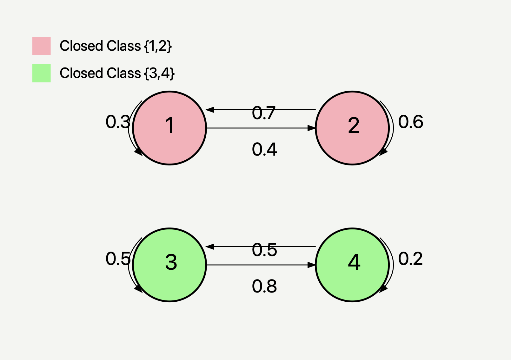
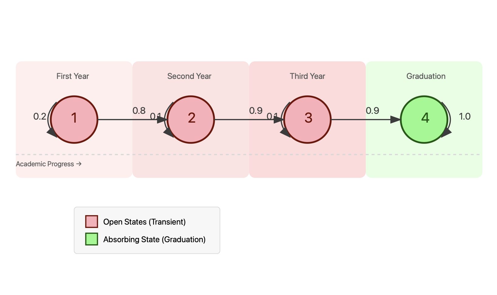
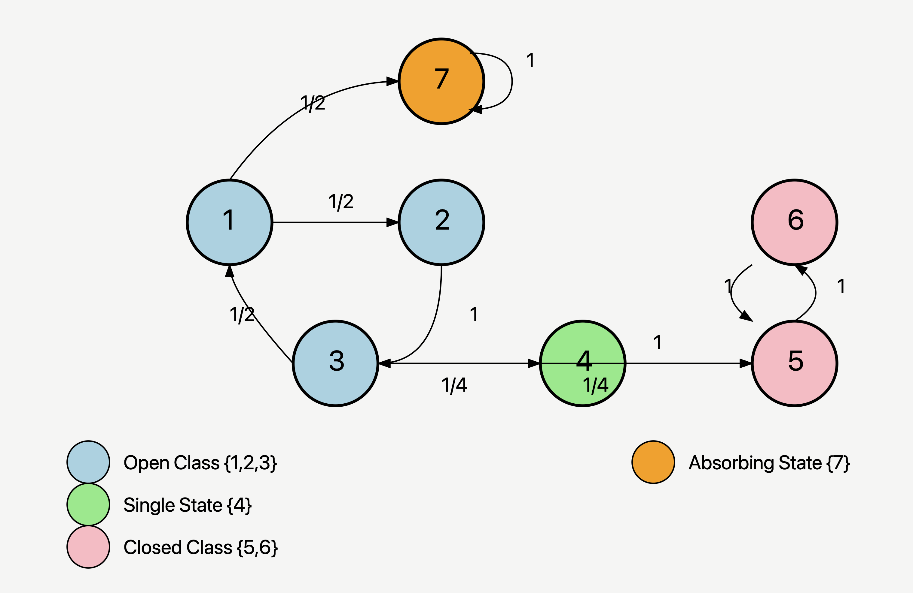

# Class Structure in Markov Chains

## 1. Introduction to Classes

The concept of classes in Markov chains helps us understand how different states relate to each other and predict long-term behavior. Let's build this understanding step by step.

### 1.1 Basic Definitions

For states $i$ and $j$, we say:

- $i$ leads to $j$ (written $i \rightarrow j$) if $P_i(X_n = j) > 0$ for some $n \geq 0$
- $i$ communicates with $j$ (written $i \leftrightarrow j$) if $i \rightarrow j$ and $j \rightarrow i$

### 1.2 Communication Classes: The Core Idea

Think of a communication class like a "club" of states where:

- Every member can reach every other member
- The relationship is symmetric and transitive
- Once defined, these classes partition our state space

## 2. Types of Classes

### 2.1 Closed Classes

A class $C$ is closed if:
$$p_{ij} = 0 \text{ whenever } i \in C, j \notin C$$

Think of a closed class as a "trap" - once you're in, you can't escape!

#### Example: Hotel California Chain

$$
P = \begin{pmatrix}
0.3 & 0.7 & 0 & 0\\
0.4 & 0.6 & 0 & 0\\
0 & 0 & 0.5 & 0.5\\
0 & 0 & 0.8 & 0.2
\end{pmatrix}
$$



Here, states {1,2} form one closed class and {3,4} form another.

### 2.2 Open Classes

A class that isn't closed is open - there's a way out!

#### Example: Student Progress Chain

Consider students moving through grades:

$$
P = \begin{pmatrix}
0.2 & 0.8 & 0 & 0\\
0 & 0.1 & 0.9 & 0\\
0 & 0 & 0.1 & 0.9\\
0 & 0 & 0 & 1
\end{pmatrix}
$$



States {1}, {2}, and {3} are open classes, while {4} (graduation) is closed.

### 2.3 Absorbing States

A state $i$ is absorbing if:
$$p_{ii} = 1$$

Think of an absorbing state as a singleton closed class - once you're there, you're stuck forever!

## 3. Real-World Applications and Intuition

### 3.1 Weather Model

Consider a simplified weather model:

- States: {Sunny, Cloudy, Rainy}
- All states communicate
- Forms a single class
- No state is absorbing

This represents a recurrent system where all states keep occurring.

### 3.2 Disease Progression

Consider stages of a disease:

- States: {Healthy, Mild, Severe, Recovery, Death}
- Death is an absorbing state
- Other states form various classes
- Some transitions are one-way

## 4. Mathematical Properties

### 4.1 Key Theorems

1. **Class Property Theorem**
   If $i \leftrightarrow j$, then:

   - $i$ is recurrent iff $j$ is recurrent
   - $i$ is transient iff $j$ is transient

2. **Closed Class Theorem**
   Every finite closed class is recurrent.

### 4.2 Finding Classes: Algorithm

```python
def find_communication_classes(P):
    n = len(P)
    classes = []
    unassigned = set(range(n))

    while unassigned:
        current = unassigned.pop()
        class_states = {current}

        # Find all states that communicate with current
        for j in range(n):
            if leads_to(P, current, j) and leads_to(P, j, current):
                class_states.add(j)

        classes.append(class_states)
        unassigned -= class_states

    return classes
```

## 5. Common Interview Questions

Q: How do you identify if a class is closed?
A: Check if there are any transitions leading outside the class. Mathematically, verify if $\sum_{j \in C} p_{ij} = 1$ for all $i \in C$.

Q: What's the difference between a closed class and an absorbing state?
A: An absorbing state is a special case of a closed class containing just one state. In a closed class, we can move between states within the class.


