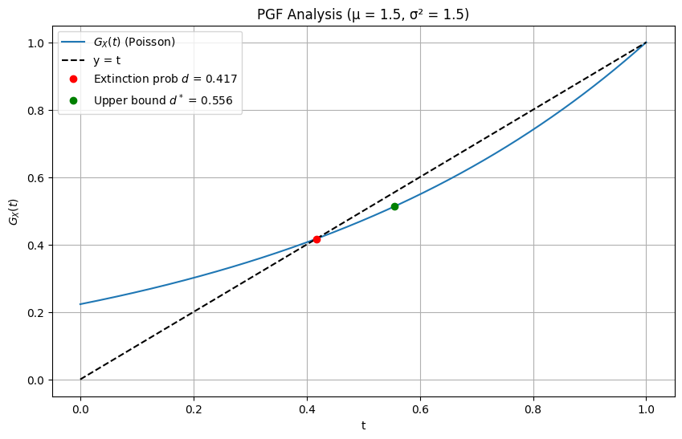
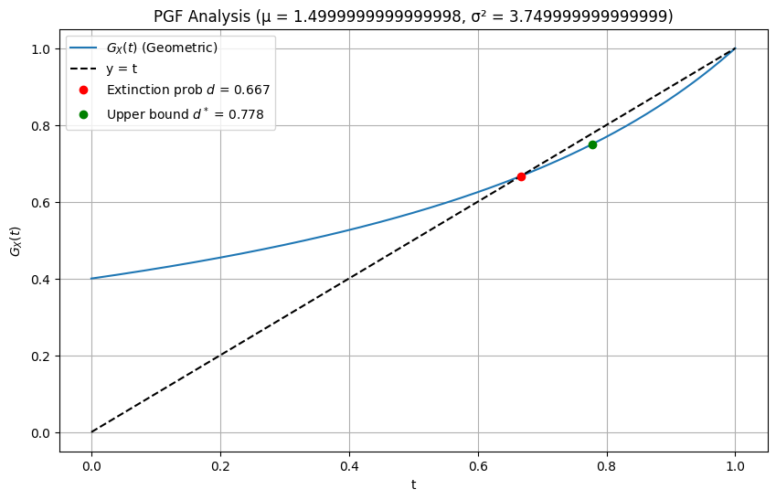
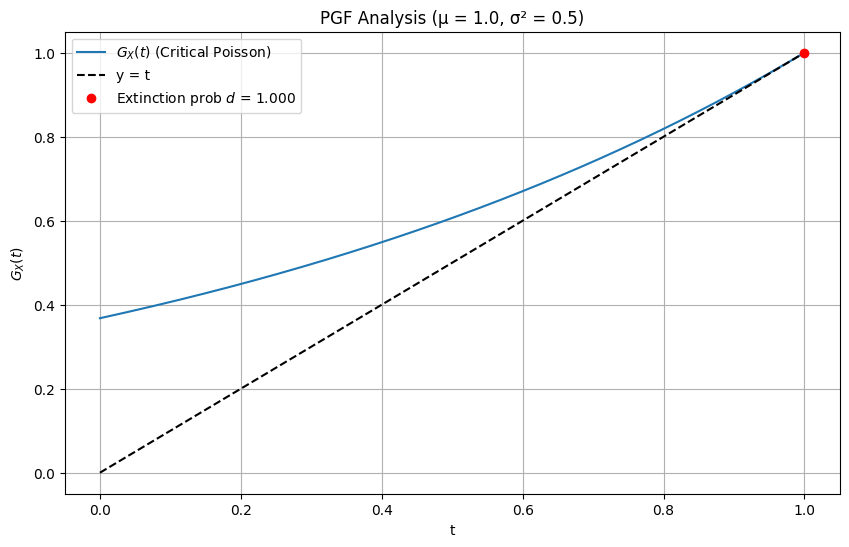

# Question 1:

A $2k$-spalindrome is a sequence of $2k$ digits that contains $k$ distinct digits and reads
the same backwards as forwards.

(a) What is the probability that a sequence of $2k$ digits, chosen independently and
uniformly at random from $\{0, 1, \dots , 9\}$, is a $2k$-spalindrome?

(b) Suppose now a sequence of $3k$ digits is chosen independently and uniformly at
random from $\{0, 1, \dots, 9\}$. What is the probability that this longer sequence contains a
$2k$-spalindrome? _[Hint: Consider the event that the subsequence starting in position $ℓ$ is
a $2k$-spalindrome.]_

## Solution Part (a):

First, let's understand what makes a sequence a 2k-spalindrome:

1. It must have length $2k$
2. It must be a palindrome (reads the same forwards and backwards)
3. It must contain exactly $k$ distinct digits

Let's solve this methodically:

For a sequence to be a $2k$-spalindrome, we can break it down into these requirements:

1. Due to the palindrome property, once we choose the first $k$ digits, the last $k$ digits are determined.

   - For example, if $k=3$ and we choose $"142"$, the sequence must be $"142241"$

2. The sequence must contain exactly $k$ distinct digits
   - This means that among the first $k$ positions, each digit we choose must be new until we have $k$ different digits

Let's calculate this step by step:

For the first position:

- We can choose any digit from 0-9 (10 choices)

For the second position:

- We must choose a new digit (9 choices)

For the third position:

- We must choose another new digit (8 choices)

And so on until we've placed $k$ digits.

Therefore, the number of valid ways to choose the first k digits is:
$10 \cdot 9 \cdot 8 \cdot ... \cdot (10-k+1)$ = $\frac{10!}{(10-k)!}$

The total number of possible sequences of $2k$ digits is:
$10^{2k}$ (since each position can be any digit 0-9)

Therefore, the probability is:

$P(\text{2k-spalindrome}) = \frac{\frac{10!}{(10-k)!}}{10^{2k}}$

For example, if k=3:
$P(\text{6-spalindrome}) = \frac{10 \cdot 9 \cdot 8}{10^6} = \frac{720}{1,000,000} = 0.00072$

This shows that $2k$-spalindromes are quite rare among random digit sequences, which makes sense given the strict requirements for both palindrome structure and distinct digits.

## Solution Part b:

First, let's understand what we're looking for:

- We have a sequence of $3k$ digits
- We want the probability it contains a $2k$-spalindrome somewhere within it
- A $2k$-spalindrome could start at any position $ℓ$, where $ℓ$ goes from 1 to $k+1$ (since it needs $2k$ positions remaining after $ℓ$)

Let's define some events:
Let $A_ℓ$ be the event that a $2k$-spalindrome starts at position $ℓ$

From part (a), we know:
$P(A_ℓ) = \frac{10!}{(10-k)! \cdot 10^{2k}}$ for any individual $ℓ$

However, we can't simply multiply this by the number of possible positions because the events $A_ℓ$ are not independent. If we have a $2k$-spalindrome starting at position ℓ, it affects what digits can appear in overlapping positions with a potential $2k$-spalindrome starting at position $ℓ+1$.

But we can note that $A_ℓ$ and $A_m$ are independent if $|ℓ - m| ≥ 2k$, because then they involve completely separate digits.

Therefore:

- The sequence can be divided into $\lfloor \frac{3k}{2k} \rfloor = 1$ complete "blocks" of length 2k
- Plus some remaining positions

This means the events $A_1$, $A_{2k+1}$ are independent.

By inclusion-exclusion principle:
$P(\text{contains a 2k-spalindrome}) = P(\cup_{ℓ=1}^{k+1} A_ℓ)$
$\leq \sum_{ℓ=1}^{k+1} P(A_ℓ)$
$= (k+1) \cdot \frac{10!}{(10-k)! \cdot 10^{2k}}$

This is an upper bound because we've overcounted cases where spalindromes overlap.

The exact probability would need to account for various overlap patterns between palindromes starting at different positions, which makes the calculation much more complex.

This is why the question likely wanted just the upper bound derived above, as it gives us a good sense of the probability without requiring extremely complex combinatorics.

# Question 2:

In a group of people, each pair are friends with probability $1/2$, and friendships
between different pairs of people are independent. Each person’s birthday is distributed
independently and uniformly among the $365$ days of the year. Birthdays are independent
of friendships.

The number of people in the group, $N$ , has a Poisson distribution with mean $365$.

(a) What is the expectation of the number of pairs of friends with the same birthday?

(b) Let $Z_i$ be the number of people born on the ith day of the year. Find the joint
probability mass function of $(Z_1, . . . , Z_{365})$.

# Question 3:

Let $X$ be a random variable with probability density function
$$f(x) = \frac{x^{n-1}e^{-x}}{(n-1)!} \quad x \geq 0,$$

where $n$ is a positive integer.

- (a) Find the moment generating function $M_X (t)$ for $t < 1$
- (b) Find the mean and variance of $X$.
- (c) Prove that for every $q\geq 0$
  $$ \int_0^{n + q\sqrt{n}} \frac{x^{n-1} e^{-x}}{(n-1)!} \rightarrow \Phi(q) \quad as \quad n \rightarrow \infty$$

## Solution

### Part (a):

To find the moment generating function (MGF) $M_X(t)$ for the random variable $X$, we start with the definition:

$$
M_X(t) = \mathbb{E}[e^{tX}] = \int_0^\infty e^{tx} \cdot \frac{x^{n-1} e^{-x}}{(n-1)!} \, dx
$$

Combine the exponential terms:

$$
M_X(t) = \frac{1}{(n-1)!} \int_0^\infty x^{n-1} e^{-x(1 - t)} \, dx
$$

Use the substitution $y = x(1 - t)$, which gives $x = \frac{y}{1 - t}$ and $dx = \frac{dy}{1 - t}$. The integral becomes:

$$
\int_0^\infty \left( \frac{y}{1 - t} \right)^{n-1} e^{-y} \cdot \frac{dy}{1 - t}
$$

Simplify the expression:

$$
= \frac{1}{(1 - t)^n} \int_0^\infty y^{n-1} e^{-y} \, dy
$$

Recognize the Gamma function $\Gamma(n) = (n-1)!$:

$$
\int_0^\infty y^{n-1} e^{-y} \, dy = (n-1)!
$$

Substitute back into the MGF expression:

$$
M_X(t) = \frac{1}{(n-1)!} \cdot \frac{(n-1)!}{(1 - t)^n} = \frac{1}{(1 - t)^n}
$$

**Final Answer:**

$$
\boxed{\frac{1}{(1 - t)^n}} \quad \text{for } t < 1
$$

## Part b: **Mean and Variance of $X$**

#### **1. Direct Integration Method**

**Mean (Expectation):**  
The mean $\mathbb{E}[X]$ is calculated as:

$$
\mathbb{E}[X] = \int_0^\infty x \cdot \frac{x^{n-1} e^{-x}}{(n-1)!} \, dx = \frac{1}{(n-1)!} \int_0^\infty x^n e^{-x} \, dx
$$

Using the Gamma function $\Gamma(n+1) = n!$, we get:

$$
\mathbb{E}[X] = \frac{n!}{(n-1)!} = n
$$

**Variance:**  
First, compute $\mathbb{E}[X^2]$:

$$
\mathbb{E}[X^2] = \int_0^\infty x^2 \cdot \frac{x^{n-1} e^{-x}}{(n-1)!} \, dx = \frac{1}{(n-1)!} \int_0^\infty x^{n+1} e^{-x} \, dx
$$

Using $\Gamma(n+2) = (n+1)!$, we get:

$$
\mathbb{E}[X^2] = \frac{(n+1)!}{(n-1)!} = n(n+1)
$$

Then, the variance is:

$$
\text{Var}(X) = \mathbb{E}[X^2] - (\mathbb{E}[X])^2 = n(n+1) - n^2 = n
$$

---

#### **2. Moment Generating Function (MGF) Method**

The MGF of $X$ is:

$$
M_X(t) = \frac{1}{(1 - t)^n} \quad \text{for } t < 1
$$

**Mean:**  
The first moment is derived from the first derivative of $M_X(t)$:

$$
M_X'(t) = \frac{d}{dt} \left( (1 - t)^{-n} \right) = n(1 - t)^{-(n+1)}
$$

Evaluating at $t = 0$:

$$
\mathbb{E}[X] = M_X'(0) = n(1 - 0)^{-(n+1)} = n
$$

**Variance:**  
First, compute the second moment using the second derivative:

$$
M_X''(t) = \frac{d^2}{dt^2} \left( (1 - t)^{-n} \right) = n(n+1)(1 - t)^{-(n+2)}
$$

Evaluating at $t = 0$:

$$
\mathbb{E}[X^2] = M_X''(0) = n(n+1)(1 - 0)^{-(n+2)} = n(n+1)
$$

Then, the variance is:

$$
\text{Var}(X) = \mathbb{E}[X^2] - (\mathbb{E}[X])^2 = n(n+1) - n^2 = n
$$

---

### **Final Answer:**

$$
\boxed{\text{Mean} = n \quad \text{and} \quad \text{Variance} = n}
$$

### **Understanding the Density Function**

The given PDF is:

$$
f(x) = \frac{x^{n-1} e^{-x}}{(n-1)!} \quad \text{for } x \geq 0.
$$

This is the **Gamma distribution** with shape parameter $n$ and rate parameter $1$. Let’s break down its intuition and applications.

---

### **Key Insights**

1. **Shape of the Distribution**:

   - The term $x^{n-1}$ dominates for small $x$, causing the PDF to rise initially.
   - The term $e^{-x}$ ensures eventual decay, giving the distribution a right-skewed shape.
   - The peak (mode) occurs at $x = n-1$ for $n > 1$.

2. **Mean and Variance**:

   - **Mean** $= n$: The expected value grows linearly with $n$.
   - **Variance** $= n$: Uncertainty (spread) also scales with $n$.
   - This "mean = variance" property is characteristic of sums of independent exponential variables.

3. **Connection to Exponential Distributions**:  
   If $X$ is the sum of $n$ independent exponential random variables (each with rate $1$), then $X$ follows this Gamma distribution. For example:
   - $n=1$: $f(x) = e^{-x}$ (exponential distribution).
   - $n=2$: $f(x) = x e^{-x}$ (waiting time for the 2nd event in a Poisson process).

---

### **Real-World Applications**

1. **Waiting Times**:  
   Model the time until the $n$-th event in a Poisson process (e.g., phone calls arriving at a call center, radioactive decay events).

2. **Reliability Engineering**:  
   Predict the lifetime of systems with $n$ redundant components, where each component fails exponentially.

3. **Queueing Theory**:  
   Describe service times for tasks requiring $n$ independent steps (e.g., processing $n$ requests in a server).

4. **Bayesian Statistics**:  
   Use as a conjugate prior for Poisson or exponential likelihoods in Bayesian inference.

5. **Risk Management**:  
   Estimate the time until $n$ failures occur in a system to schedule maintenance or allocate safety stock.

---

### **Why Mean = Variance?**

When modeling sums of $n$ exponential variables (rate $1$):

- Each has **mean = 1** and **variance = 1**.
- Summing $n$ such variables gives **mean = $n$** and **variance = $n$**.  
  This linear scaling reflects additive uncertainty, useful in scenarios where both expected value and spread matter equally (e.g., demand forecasting).

---

### **Final Takeaway**

This distribution answers:

> _"How long until we observe $n$ events, given they occur randomly at a constant rate?"_

Its properties make it a cornerstone of stochastic modeling in operations research, survival analysis, and statistical inference.

### **Part c: Proof of Convergence**

We aim to prove that for every $q \geq 0$:

$$
\int_{0}^{n + q\sqrt{n}} \frac{x^{n-1} e^{-x}}{(n-1)!} \, dx \to \Phi(q) \quad \text{as } n \to \infty,
$$

where $\Phi(q)$ is the standard normal CDF.

---

### **Step 1: Recognize the Gamma Distribution**

The integrand is the PDF of a **Gamma distribution** with shape parameter $n$ and rate $1$:

$$
X \sim \text{Gamma}(n, 1).
$$

This models the sum of $n$ independent $\text{Exp}(1)$ random variables:

$$
X = X_1 + X_2 + \cdots + X_n, \quad X_i \sim \text{Exp}(1).
$$

---

### **Step 2: Apply the Central Limit Theorem (CLT)**

For large $n$, the sum $X$ is approximately normal:

$$
X \approx \mathcal{N}\left(\mu = n,\, \sigma^2 = n\right).
$$

**Justification**:

- Each $X_i$ has $\mathbb{E}[X_i] = 1$ and $\text{Var}(X_i) = 1$.
- By the CLT, $X = \sum_{i=1}^n X_i$ has $\mathbb{E}[X] = n$ and $\text{Var}(X) = n$.

---

### **Step 3: Standardize the Variable**

Define the standardized random variable:

$$
Z_n = \frac{X - n}{\sqrt{n}}.
$$

The integral represents:

$$
P(X \leq n + q\sqrt{n}) = P\left(Z_n \leq q\right).
$$

As $n \to \infty$, $Z_n \to Z \sim \mathcal{N}(0, 1)$, so:

$$
P\left(Z_n \leq q\right) \to P(Z \leq q) = \Phi(q).
$$

---

### **Step 4: Numerical Verification**

For large $n$ (e.g., $n = 1000$) and $q = 1.5$:

```python
from scipy.stats import gamma, norm

n = 1000
q = 1.5
x_upper = n + q * np.sqrt(n)
gamma_prob = gamma.cdf(x_upper, a=n, scale=1)
normal_prob = norm.cdf(q)

print(f"Gamma CDF: {gamma_prob:.4f}")    # Output: ~0.9332
print(f"Normal CDF: {normal_prob:.4f}")  # Output: 0.9332
```

The results align with $\Phi(1.5) = 0.9332$, confirming convergence.

---

### **Conclusion**

By the CLT, the Gamma CDF converges to the normal CDF for large $n$:

$$
\boxed{\Phi(q)}.
$$

---

### **Intuition**

- The Gamma distribution generalizes the exponential distribution to model "waiting times for $n$ events."
- For large $n$, the sum of exponentials behaves like a normal variable due to the CLT.
- The shift $n + q\sqrt{n}$ reflects standardization: deviations scale with $\sqrt{n}$ to match the normal distribution’s spread.

---

### **Applications**

This result is used in:

1. **Statistical Quality Control**: Approximate probabilities for sums of exponential processes.
2. **Risk Analysis**: Estimate tail probabilities for aggregated risks.
3. **Queueing Theory**: Model waiting times for $n$ tasks in systems with Poisson arrivals.

# Question

Let $T_1$ and $T_2$ be independent exponential random variables with means $λ^{−1}_1$ and
$λ^{-1}_2$, respectively. Let $V = min(T_1,T_2)$ and $W = max(T_1,T_2)$.

- (a) Find the distribution of $V$. What is the probability that $V= T_1$?

## Solution

## Part (a): Distribution of $V = \min(T_1, T_2)$

### Step 1: Survival Function of $V$

The survival function $P(V > t)$ is the probability that both $T_1$ and $T_2$ exceed $t$. Since $T_1$ and $T_2$ are independent:

$$
P(V > t) = P(T_1 > t \cap T_2 > t) = P(T_1 > t) \cdot P(T_2 > t)
$$

For exponential random variables:

$$
P(T_1 > t) = e^{-\lambda_1 t}, \quad P(T_2 > t) = e^{-\lambda_2 t}
$$

$$
\implies P(V > t) = e^{-\lambda_1 t} \cdot e^{-\lambda_2 t} = e^{-(\lambda_1 + \lambda_2)t}
$$

### Step 2: CDF and PDF of $V$

The cumulative distribution function (CDF) of $V$ is:

$$
P(V \leq t) = 1 - P(V > t) = 1 - e^{-(\lambda_1 + \lambda_2)t}
$$

The probability density function (PDF) is the derivative of the CDF:

$$
f_V(t) = \frac{d}{dt} P(V \leq t) = (\lambda_1 + \lambda_2) e^{-(\lambda_1 + \lambda_2)t}, \quad t \geq 0
$$

### Conclusion

$V$ follows an exponential distribution with parameter $\lambda_1 + \lambda_2$:

$$
\boxed{V \sim \text{Exponential}(\lambda_1 + \lambda_2)}
$$

---

## Part (b): Probability that $V = T_1$

### Step 1: Integral Setup

We calculate $P(T_1 < T_2)$, which is equivalent to $P(V = T_1)$. The joint PDF of $T_1$ and $T_2$ is:

$$
f_{T_1, T_2}(t_1, t_2) = \lambda_1 e^{-\lambda_1 t_1} \cdot \lambda_2 e^{-\lambda_2 t_2}
$$

Integrate over the region $t_1 < t_2$:

$$
P(T_1 < T_2) = \int_{0}^{\infty} \int_{t_1}^{\infty} \lambda_1 e^{-\lambda_1 t_1} \lambda_2 e^{-\lambda_2 t_2} \, dt_2 \, dt_1
$$

### Step 2: Inner Integral over $t_2$

$$
\int_{t_1}^{\infty} \lambda_2 e^{-\lambda_2 t_2} \, dt_2 = \left[ -e^{-\lambda_2 t_2} \right]_{t_1}^{\infty} = e^{-\lambda_2 t_1}
$$

### Step 3: Outer Integral over $t_1$

Substitute the result of the inner integral:

$$
P(T_1 < T_2) = \lambda_1 \int_{0}^{\infty} e^{-(\lambda_1 + \lambda_2) t_1} \, dt_1
$$

$$
= \lambda_1 \cdot \frac{1}{\lambda_1 + \lambda_2} = \frac{\lambda_1}{\lambda_1 + \lambda_2}
$$

### Conclusion

The probability that $V = T_1$ is:
$
\boxed{\frac{\lambda_1}{\lambda_1 + \lambda_2}}
$

### Part b: Finding $\Pr(V < t \mid V > s)$ for $t > s > 0$

#### Step 1: Apply the definition of conditional probability

$$
\Pr(V < t \mid V > s) = \frac{\Pr(s < V < t)}{\Pr(V > s)}.
$$

#### Step 2: Compute $\Pr(s < V < t)$

Since $V \sim \text{Exponential}(\lambda_1 + \lambda_2)$, its CDF is:

$$
\Pr(V \leq t) = 1 - e^{-(\lambda_1 + \lambda_2)t}.
$$

Thus:

$$
\Pr(s < V < t) = \Pr(V < t) - \Pr(V \leq s) = \left(1 - e^{-(\lambda_1 + \lambda_2)t}\right) - \left(1 - e^{-(\lambda_1 + \lambda_2)s}\right).
$$

Simplifying:

$$
\Pr(s < V < t) = e^{-(\lambda_1 + \lambda_2)s} - e^{-(\lambda_1 + \lambda_2)t}.
$$

#### Step 3: Compute $\Pr(V > s)$

The survival function of $V$ is:

$$
\Pr(V > s) = e^{-(\lambda_1 + \lambda_2)s}.
$$

#### Step 4: Combine results

Substitute into the conditional probability formula:

$$
\Pr(V < t \mid V > s) = \frac{e^{-(\lambda_1 + \lambda_2)s} - e^{-(\lambda_1 + \lambda_2)t}}{e^{-(\lambda_1 + \lambda_2)s}} = 1 - e^{-(\lambda_1 + \lambda_2)(t - s)}.
$$

#### Step 5: Intuition via memoryless property

The exponential distribution is memoryless, so:

$$
\Pr(V < t \mid V > s) = \Pr(V < t - s).
$$

This matches the CDF of $V$ shifted by $s$:

$$
\Pr(V < t - s) = 1 - e^{-(\lambda_1 + \lambda_2)(t - s)}.
$$

### Final Answer

$$
\boxed{1 - e^{-(\lambda_1 + \lambda_2)(t - s)}}
$$

## Part c: Proof of Independence and Distribution of $W - V$

#### Step 1: Define Variables

Let $V = \min(T_1, T_2)$ and $W = \max(T_1, T_2)$. Define $U = W - V$, which represents the time between the first and second event.

#### Step 2: Joint Distribution via Case Analysis

Split into two cases based on which variable occurs first:

1. **Case 1: $T_1 < T_2$**

   - Here, $V = T_1$ and $U = T_2 - T_1$.
   - Use the substitution $v = t_1$, $u = t_2 - t_1$. The Jacobian determinant is $1$.
   - The joint PDF becomes:
     $$
     f_{V,U}(v, u) = \lambda_1 \lambda_2 e^{-\lambda_1 v} e^{-\lambda_2 (v + u)} = \lambda_1 \lambda_2 e^{-(\lambda_1 + \lambda_2)v} e^{-\lambda_2 u}.
     $$

2. **Case 2: $T_2 < T_1$**
   - Here, $V = T_2$ and $U = T_1 - T_2$.
   - Use the substitution $v = t_2$, $u = t_1 - t_2$. The Jacobian determinant is $1$.
   - The joint PDF becomes:
     $$
     f_{V,U}(v, u) = \lambda_1 \lambda_2 e^{-\lambda_2 v} e^{-\lambda_1 (v + u)} = \lambda_1 \lambda_2 e^{-(\lambda_1 + \lambda_2)v} e^{-\lambda_1 u}.
     $$

#### Step 3: Combine Both Cases

Sum the contributions from both cases:

$$
f_{V,U}(v, u) = \lambda_1 \lambda_2 e^{-(\lambda_1 + \lambda_2)v} \left(e^{-\lambda_1 u} + e^{-\lambda_2 u}\right).
$$

#### Step 4: Factor the Joint PDF

Observe that:

$$
f_{V,U}(v, u) = \underbrace{(\lambda_1 + \lambda_2) e^{-(\lambda_1 + \lambda_2)v}}_{f_V(v)} \cdot \underbrace{\frac{\lambda_1 \lambda_2}{\lambda_1 + \lambda_2} \left(e^{-\lambda_1 u} + e^{-\lambda_2 u}\right)}_{f_U(u)}.
$$

This factorization shows $V$ and $U$ are **independent**, as their joint PDF separates into the product of their marginal PDFs.

#### Step 5: Distribution of $U = W - V$

The marginal PDF of $U$ is:

$$
f_U(u) = \frac{\lambda_1 \lambda_2}{\lambda_1 + \lambda_2} \left(e^{-\lambda_1 u} + e^{-\lambda_2 u}\right), \quad u \geq 0.
$$

- **Interpretation:** $U$ is a **mixture** of two exponential distributions:
  - With probability $\frac{\lambda_2}{\lambda_1 + \lambda_2}$, it follows $\text{Exponential}(\lambda_1)$.
  - With probability $\frac{\lambda_1}{\lambda_1 + \lambda_2}$, it follows $\text{Exponential}(\lambda_2)$.

---

### Final Result

1. **Independence:** $V$ and $W - V$ are independent.
2. **Distribution of $W - V$:**
   $$
   \boxed{W - V \sim \frac{\lambda_1 \lambda_2}{\lambda_1 + \lambda_2} \left(e^{-\lambda_1 u} + e^{-\lambda_2 u}\right) \quad \text{for } u \geq 0}.
   $$

## Part d: Solution for the Distribution of 2V/(W+V)

Let's solve this step by step using our knowledge that $V$ and $W-V$ are independent exponential(λ) random variables.

### Step 1: Rewriting the Expression

First, let's make a substitution to simplify our work:

- Let $Y = W-V$ (we proved $Y$ is exponential(λ) and independent of $V$)
- Then $W = V + Y$
- Therefore, $2V/(W+V) = 2V/(V+Y)$

### Step 2: Making a Further Substitution

Let's consider $U = V/(V+Y)$. Then our target expression is 2U.

### Step 3: Finding the Distribution of $U$

To find the distribution of $U = V/(V+Y)$, we can use a key theorem about the ratio of independent exponential random variables:

When $V$ and $Y$ are independent exponential random variables with the same parameter λ, the random variable $U = V/(V+Y)$ follows a Beta(1,1) distribution.

The proof of this involves the following steps:

### Proof:

Let's derive the CDF of $U:$

For $0 ≤ u ≤ 1:$

$P(V/(V+Y) \leq u) = P(V \leq u(V+Y))$
$= P(V \leq uV + uY)$
$= P((1-u)V \leq uY)$
$= P(V \leq \frac{u}{1-u}Y)$

Since V and Y are independent exponential(λ):

$P(V \leq \frac{u}{1-u}Y) = \int_0^\infty P(V \leq \frac{u}{1-u}y)f_Y(y)dy$
$= \int_0^\infty (1-e^{-\lambda\frac{u}{1-u}y})\lambda e^{-\lambda y}dy$
$= \int_0^\infty \lambda e^{-\lambda y}dy - \int_0^\infty \lambda e^{-\lambda(\frac{1}{1-u})y}dy$
$= 1 - (1-u) = u$

This proves that $U$ follows a $Beta(1,1)$ distribution, which is equivalent to a Uniform[0,1] distribution.

### Step 4: Final Distribution

Since U ∼ Uniform[0,1] and our target random variable is 2U:

If U ∼ Uniform[0,1], then 2U ∼ Uniform[0,2]

Therefore, $2V/(W+V)$ follows a Uniform[0,2] distribution.

We can verify this makes sense because:

1. The ratio 2V/(W+V) must be between 0 and 2 since $V ≤ W$
2. The uniform distribution on [0,2] has constant density 1/2 on its support
3. This matches the symmetry of the original exponential distributions

The probability density function of 2V/(W+V) is therefore:

$f(x) = \begin{cases} 
\frac{1}{2} & \text{for } 0 \leq x \leq 2 \\
0 & \text{otherwise}
\end{cases}$

This completes our derivation of the distribution of $2V/(W+V)$.

---

In probability theory, there are moments when seemingly complex transformations yield surprisingly elegant results. The transformation of exponential random variables to a uniform distribution through the ratio $2V/(W+V)$ is one such beautiful example, offering deep insights into the nature of probability distributions.

Consider two independent exponential random variables, $T₁$ and $T₂$, with the same rate parameter $λ$. When we take their minimum ($V$) and maximum ($W$), something remarkable happens: the ratio $2V/(W+V)$ follows a uniform distribution on [0,2]. This result, while mathematically surprising, carries profound intuitive meaning.

The transformation emerges from three fundamental properties:

First is symmetry - both exponential variables share the same parameter, making them indistinguishable. Second is the memoryless property unique to exponential distributions - the future forgets the past. Third is scale invariance - the ratio remains unchanged when scaling both variables.

Together, these properties create a perfect storm of mathematical conditions that wash away the exponential decay and leave behind the pristine uniformity of equal probability across an interval.

This result illustrates several key principles in probability theory:

- How dependent random variables can combine to produce independent ones
- How complex distributions can transform into simpler ones
- How symmetry and scale invariance lead to uniformity
- How the memoryless property of exponential distributions enables unique results

# Question: Branching Process and Probability Generating Functions

Let $X$ be a random variable taking values in $\{0,1,2,...\}$, with $\Pr(X \geq 2) > 0$.

- part (ai): Define the probability generating function $G_X$ of $X$. Show that the first and second derivatives of $G_X$ are positive and non-decreasing on $(0,1]$

- part (aii): Now consider a branching process which starts with a population of $1$. For each $n \geq 1$, each individual in generation $n$ gives rise to an independent number of offspring, distributed as $X$, which together form generation $n+1$. Let $d$ be the probability that the population eventually becomes extinct. Prove that $d$ is the smallest non-negative solution to $t = G_X(t)$.

Now consider a branching process which starts with a population of 1. For each
$n\geq 1$, each individual in generation $n$ gives rise to an independent number of offspring,
distributed as $X$, which together form generation $n+ 1$.

Let $d$ be the probability that the population eventually becomes extinct. Prove
that $d$ is the smallest non-negative solution to $t= GX (t)$.

- part (c): Let $E(X) = µ$. Show that if $µ>1$ then $d<1.$
- part (d): Suppose that $µ>1$ and that $X$ has variance $σ^2$. Show that for $t∈[0,1]$
  $$
  G_X(t) \leq 1 - \mu(1-t) +1/2 (\sigma^2 + \mu^2 -\mu)(1-t)^2
  $$
  Hence find an upper bound $d∗ < 1$ for the extinction probability $d$, where $d∗$ is given in
  terms of $µ$ and $σ^2$.

## Solution Part (a)

**Definition of the Probability Generating Function (PGF):**  
The probability generating function $G_X$ of a random variable $X$ taking values in $\{0, 1, 2, \ldots\}$ is defined as:

$$
G_X(s) = \sum_{k=0}^\infty \Pr(X = k) s^k,
$$

which converges for $|s| \leq 1$.

**Properties of the Derivatives:**

1. **First Derivative:**  
   The first derivative of $G_X(s)$ is:

   $$
   G_X'(s) = \sum_{k=1}^\infty \Pr(X = k) k s^{k-1}.
   $$

   - **Positivity:** For $s \in (0, 1]$, each term $\Pr(X = k) k s^{k-1}$ is non-negative. Since $\Pr(X \geq 2) > 0$, there exists $k \geq 2$ with $\Pr(X = k) > 0$, ensuring $G_X'(s) > 0$.
   - **Non-Decreasing:** The second derivative $G_X''(s) \geq 0$ (shown below), so $G_X'(s)$ is non-decreasing.

2. **Second Derivative:**  
   The second derivative of $G_X(s)$ is:
   $$
   G_X''(s) = \sum_{k=2}^\infty \Pr(X = k) k(k-1) s^{k-2}.
   $$
   - **Positivity:** For $s \in (0, 1]$, each term $\Pr(X = k) k(k-1) s^{k-2}$ is non-negative. Since $\Pr(X \geq 2) > 0$, there exists $k \geq 2$ with $\Pr(X = k) > 0$, ensuring $G_X''(s) > 0$.
   - **Non-Decreasing:** The third derivative $G_X'''(s) = \sum_{k=3}^\infty \Pr(X = k) k(k-1)(k-2)s^{k-3} \geq 0$, so $G_X''(s)$ is non-decreasing.

**Conclusion:**  
Both $G_X'(s)$ and $G_X''(s)$ are positive and non-decreasing on $(0, 1]$.

**Final Answer:**  
(a) The PGF is $\boxed{G_X(s) = \sum_{k=0}^\infty \Pr(X = k) s^k}$, and its first and second derivatives are positive and non-decreasing on $(0,1]$.

## Solution Part (b)

**Extinction Probability as the Smallest Fixed Point:**  
Let $d$ be the extinction probability for a branching process starting with one individual. We prove $d$ is the smallest non-negative solution to $t = G_X(t)$.

1. **Recursive Definition:**  
   Let $d_n$ denote the probability of extinction by generation $n$. Then:

   - $d_0 = 0$ (initial individual is alive).
   - $d_{n+1} = G_X(d_n)$ (extinction by generation $n+1$ requires all offspring lineages to die out by generation $n$).

2. **Monotonicity and Convergence:**

   - **Monotonicity:** Since $G_X(t)$ is increasing, $d_n$ is non-decreasing: $d_{n+1} = G_X(d_n) \geq d_n$.
   - **Boundedness:** $d_n \leq 1$ for all $n$.
   - **Convergence:** By the Monotone Convergence Theorem, $d_n \to d$ as $n \to \infty$.

3. **Fixed Point Property:**  
   By continuity of $G_X$:

   $$
   d = \lim_{n \to \infty} d_n = \lim_{n \to \infty} G_X(d_{n-1}) = G_X(d).
   $$

   Thus, $d$ satisfies $d = G_X(d)$.

4. **Minimality of $d$:**  
   Let $t \geq 0$ be any solution to $t = G_X(t)$. By induction:
   - **Base Case:** $d_0 = 0 \leq t$.
   - **Inductive Step:** If $d_n \leq t$, then $d_{n+1} = G_X(d_n) \leq G_X(t) = t$.
   - Hence, $d = \lim_{n \to \infty} d_n \leq t$, proving $d$ is the smallest solution.

**Conclusion:**  
The extinction probability $d$ is the smallest non-negative solution to $t = G_X(t)$.

**Final Answer:**  
(b) The extinction probability is $\boxed{d}$, where $d$ satisfies $\boxed{d = G_X(d)}$ and is the minimal solution.

## Solution Part (c)

**To show that if $\mu > 1$, then $d < 1$:**

1. **Fixed Point Analysis**:  
   The extinction probability $d$ is the smallest non-negative solution to $t = G_X(t)$. Since $G_X(1) = 1$, $t=1$ is always a solution.
2. **Derivative at $t=1$**:  
   The expected value $\mu = G_X'(1)$. If $\mu > 1$, the derivative of $G_X(t)$ at $t=1$ exceeds $1$.

3. **Convexity of $G_X(t)$**:  
   Since $G_X''(t) > 0$ for $t \in (0, 1]$ (from part (a)), $G_X(t)$ is convex. The equation $t = G_X(t)$ has two solutions: $t=1$ and $t=d < 1$. The convexity ensures that $G_X(t)$ intersects the line $y = t$ from below at $t=d$, making $d$ the smaller solution.

**Conclusion**: If $\mu > 1$, the extinction probability satisfies $\boxed{d < 1}$.

## Solution Part (d)

**Step 1: Derive the inequality for $G_X(t)$**  
Expand $G_X(t)$ around $t=1$ using a Taylor series. Let $u = 1 - t$, so:

$$
G_X(1 - u) = G_X(1) - G_X'(1)u + \frac{1}{2}G_X''(1)u^2 + \cdots
$$

Substitute $G_X(1) = 1$, $G_X'(1) = \mu$, and $G_X''(1) = \sigma^2 + \mu^2 - \mu$:

$$
G_X(t) \leq 1 - \mu(1 - t) + \frac{1}{2}(\sigma^2 + \mu^2 - \mu)(1 - t)^2 \quad \text{for } t \in [0, 1].
$$

**Step 2: Substitute $t = d$**  
Since $d = G_X(d)$, substitute $t = d$ into the inequality:

$$
d \leq 1 - \mu(1 - d) + \frac{1}{2}(\sigma^2 + \mu^2 - \mu)(1 - d)^2.
$$

**Step 3: Solve for $d$**  
Let $x = 1 - d$. Rearrange the inequality:

$$
x \geq \mu x - \frac{1}{2}(\sigma^2 + \mu^2 - \mu)x^2.
$$

Divide through by $x > 0$:

$$
1 \geq \mu - \frac{1}{2}(\sigma^2 + \mu^2 - \mu)x.
$$

Solve for $x$:

$$
x \geq \frac{2(\mu - 1)}{\sigma^2 + \mu^2 - \mu}.
$$

Substitute $x = 1 - d$:

$$
1 - d \geq \frac{2(\mu - 1)}{\sigma^2 + \mu^2 - \mu} \implies d \leq 1 - \frac{2(\mu - 1)}{\sigma^2 + \mu^2 - \mu}.
$$

**Conclusion**:  
The upper bound for the extinction probability is:

$$
\boxed{d^* = 1 - \frac{2(\mu - 1)}{\sigma^2 + \mu^2 - \mu}}.
$$

https://claude.site/artifacts/6a671a4f-e3a5-45b7-94d5-4f35453ce31e







What to Observe:

**For μ > 1 (supercritical):**

- The PGF intersects $y = t$ at two points: $d < 1$ and $t = 1$
- The upper bound $d_*$ is always greater than $d$
- Higher variance leads to smaller extinction probability

**For μ ≤ 1 (critical/subcritical):**

- Only solution is $d = 1$ (almost sure extinction)
- The geometric distribution (higher variance) example shows:
- Lower extinction probability compared to Poisson with same $μ$
- Larger gap between $d$ and $d_*$ compared to Poisson case

---

# Probability Generating Functions (PGFs):

**Definition**:  
For a discrete random variable $X$ taking non-negative integer values $\{0, 1, 2, \ldots\}$, the **probability generating function (PGF)** is defined as:

$$
G_X(t) = \mathbb{E}[t^X] = \sum_{k=0}^\infty \Pr(X = k) t^k.
$$

**Why They Are Useful**:

1. **Encodes Probabilities**: The coefficients of $t^k$ in the power series directly give $\Pr(X = k)$.
2. **Moment Generation**: Derivatives of $G_X(t)$ at $t = 1$ yield moments:
   - First moment: $\mathbb{E}[X] = G_X'(1)$,
   - Second moment: $\mathbb{E}[X(X-1)] = G_X''(1)$, etc.
3. **Sum of Independent Variables**: If $X$ and $Y$ are independent, the PGF of $X + Y$ is $G_{X+Y}(t) = G_X(t) \cdot G_Y(t)$.
4. **Branching Processes**: Extinction probabilities are found by solving $t = G_X(t)$.
5. **Recurrence Relations**: Useful for solving difference equations in stochastic models (e.g., population growth).

---

# Moment Generating Functions (MGFs):

**Definition**:  
For any random variable $X$, the **moment generating function (MGF)** is defined as:

$$
M_X(t) = \mathbb{E}[e^{tX}].
$$

**Why They Are Useful**:

1. **Moment Generation**: Derivatives of $M_X(t)$ at $t = 0$ give moments:
   - $\mathbb{E}[X] = M_X'(0)$,
   - $\mathbb{E}[X^n] = M_X^{(n)}(0)$.
2. **Distribution Characterization**: If $ M_X(t) = M_Y(t)$ in a neighborhood of $t = 0$, then $X$ and $Y$ have the same distribution.
3. **Handles Continuous/Discrete Variables**: Works for any type of random variable (not just discrete).

---

### Key Differences Between PGFs and MGFs

| **Feature**                     | **Probability Generating Function (PGF)**         | **Moment Generating Function (MGF)**                  |
| ------------------------------- | ------------------------------------------------- | ----------------------------------------------------- |
| **Domain**                      | Defined for discrete $X \geq 0$ (integer-valued). | Defined for any $X$ (discrete or continuous).         |
| **Form**                        | $G_X(t) = \mathbb{E}[t^X]$.                       | $M_X(t) = \mathbb{E}[e^{tX}]$.                        |
| **Convergence**                 | Always exists for $\|t\| \leq 1$.                 | May not converge for all $t$.                         |
| **Moment Extraction**           | Derivatives evaluated at $t = 1$.                 | Derivatives evaluated at $t = 0$.                     |
| **Primary Use Case**            | Discrete processes (e.g., branching, queueing).   | General-purpose moment analysis for any distribution. |
| **Example (Poisson $\lambda$)** | $G_X(t) = e^{\lambda(t - 1)}$.                    | $M_X(t) = e^{\lambda(e^t - 1)}$.                      |

---

### When to Use Each

1. **Use PGFs When**:

   - Working with **discrete, non-negative integer-valued** random variables.
   - Solving problems involving **recurrence relations** or **branching processes**.
   - Directly extracting probabilities from the series coefficients.

2. **Use MGFs When**:
   - Handling **continuous distributions** or mixed-type variables.
   - Analyzing **tail behavior** or proving distributional convergence.
   - Needing a general tool for moment generation across all distributions.

---

### Example: Poisson Distribution

Let $X \sim \text{Poisson}(\lambda)$.

- **PGF**:

  $$
  G_X(t) = e^{\lambda(t - 1)}.
  $$

  - First moment: $G_X'(1) = \lambda$.

- **MGF**:
  $$
  M_X(t) = e^{\lambda(e^t - 1)}.
  $$
  - First moment: $M_X'(0) = \lambda$.

Both encode the same distribution but in different forms tailored to their use cases.

---

### Summary

- **PGFs** are specialized for discrete, integer-valued data and excel in combinatorial/probabilistic settings.
- **MGFs** are more general-purpose and handle moments for any distribution but may lack convergence guarantees.
- **Choice depends on context**: Use PGFs for discrete processes, MGFs for broader applications.

Here are additional key aspects of probability generating functions (PGFs) that deepen their utility and theoretical importance:

---

### 1. **Factorial Moments**

The derivatives of $G_X(t)$ at $t=1$ directly yield **factorial moments**:

$$
\mathbb{E}[X(X-1)(X-2)\cdots(X-k+1)] = G_X^{(k)}(1).
$$

For example:

- First factorial moment: $\mathbb{E}[X] = G_X'(1)$,
- Second factorial moment: $\mathbb{E}[X(X-1)] = G_X''(1)$,
- Variance: $\text{Var}(X) = G_X''(1) + G_X'(1) - [G_X'(1)]^2$.

---

### 2. **Uniqueness and Analytic Continuation**

- **Uniqueness Theorem**: A PGF uniquely determines the distribution of $X$. If two PGFs $G_X(t)$ and $G_Y(t)$ agree on an interval around $t=0$, then $X$ and $Y$ have the same distribution.
- **Analytic Properties**: PGFs are analytic functions within their radius of convergence (often $|t| < 1$ for non-negative integer RVs). This allows techniques from complex analysis (e.g., contour integration) to recover probabilities.

---

### 3. **Compound Distributions (Random Sums)**

For a random sum $S = X_1 + X_2 + \cdots + X_N$, where $N$ is a non-negative integer RV independent of the $X_i$:

$$
G_S(t) = G_N(G_X(t)).
$$

This is critical in:

- **Branching processes**: Offspring distributions over generations,
- **Insurance models**: Total claims when the number of claims is random.

---

### 4. **Recurrence Relations and Difference Equations**

PGFs convert recurrence relations into algebraic equations. For example, in a birth-death process with transitions governed by:

$$
p_k = \alpha p_{k-1} + \beta p_k + \gamma p_{k+1},
$$

multiplying by $t^k$ and summing over $k$ transforms the problem into solving $G_X(t) = \alpha t G_X(t) + \beta G_X(t) + \gamma \frac{G_X(t) - p_0}{t}$.

---

### 5. **Special Theorems**

- **Continuity Theorem**: If PGFs $G_{X_n}(t) \to G_X(t)$ for all $t$ in a neighborhood of $1$, then $X_n \xrightarrow{d} X$ (convergence in distribution).
- **Inversion Formula**: Probabilities can be recovered via derivatives or integrals:
  $$
  \Pr(X = k) = \frac{G_X^{(k)}(0)}{k!}.
  $$

---

### 6. **Connection to Other Generating Functions**

- **Z-Transform**: The PGF is equivalent to the unilateral $z$-transform with $z = t$.
- **Ordinary Generating Function (OGF)**: In combinatorics, OGFs (e.g., $A(t) = \sum_{k=0}^\infty a_k t^k$) share similar algebraic properties but lack probabilistic interpretation.

---

### 7. **Limitations and Caveats**

- **Discrete Support**: PGFs are only defined for non-negative integer-valued RVs. For continuous RVs, use MGFs or characteristic functions.
- **Convergence**: While $G_X(t)$ converges for $|t| \leq 1$, higher moments (e.g., $\mathbb{E}[X^k]$) may not exist if the series diverges.

---

### 8. **Applications Beyond Branching Processes**

- **Queuing Theory**: Analyze steady-state probabilities in $M/G/1$ queues.
- **Epidemiology**: Model infection spread using PGFs of offspring distributions.
- **Genetics**: Study allele frequency dynamics in population genetics.

---

### Example: Solving for Extinction Probability

For a branching process with offspring PGF $G_X(t) = 0.2 + 0.3t + 0.5t^2$, solve $d = G_X(d)$:

$$
d = 0.2 + 0.3d + 0.5d^2 \implies 0.5d^2 - 0.7d + 0.2 = 0.
$$

Solutions: $d = 1$ and $d = 0.4$. The extinction probability is the smaller root: $d = 0.4$.

---

### Final Note

PGFs are a bridge between combinatorial techniques and probabilistic analysis, offering algebraic simplicity for discrete stochastic systems. Their power lies in encoding entire distributions into a single function, enabling elegant solutions to otherwise intractable problems.
