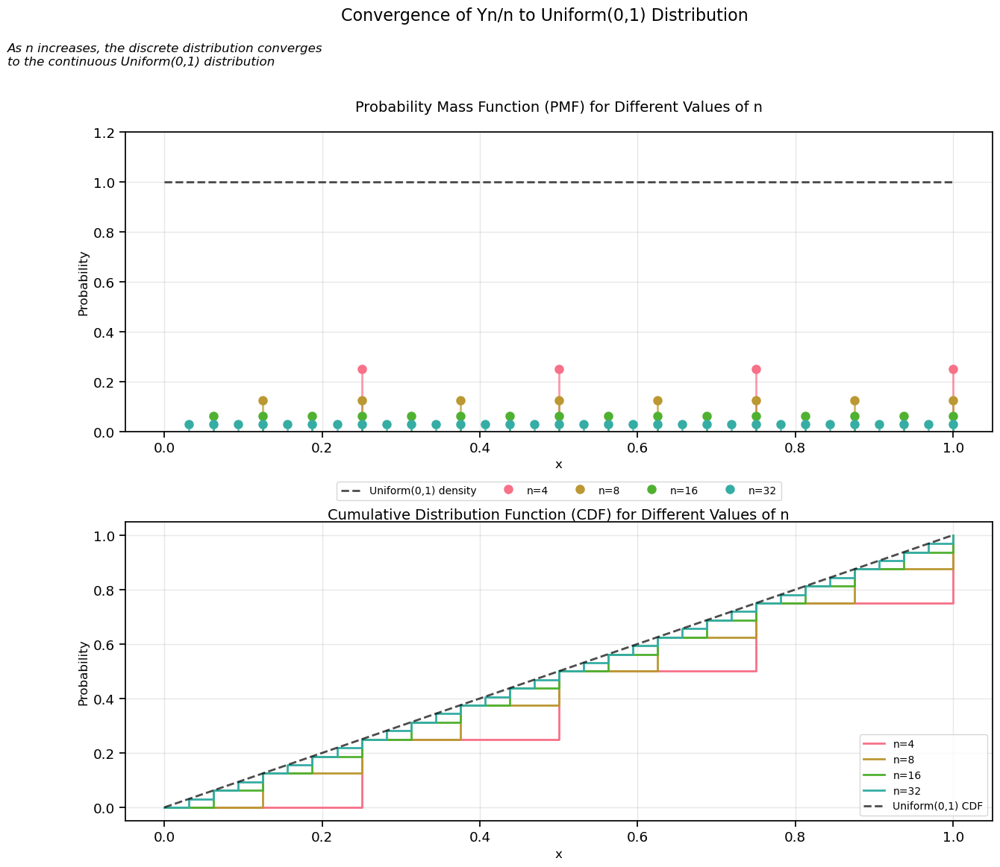
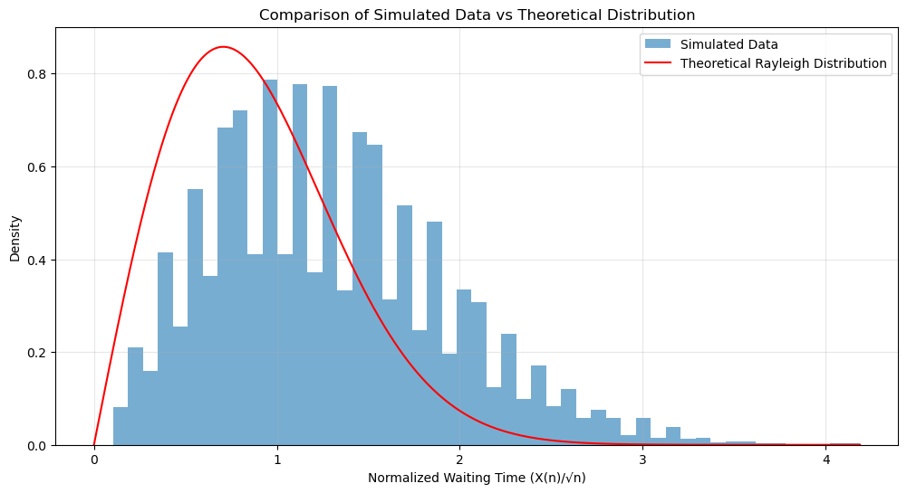
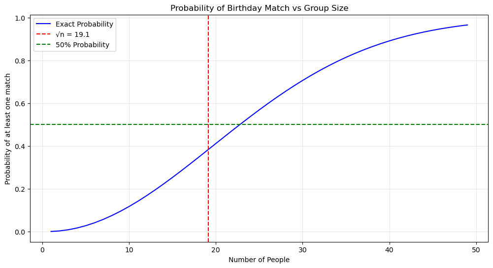

# Question 1

> A company sells lottery scratch-cards for £1 each. 1% of cards win the grand prize of £50, a further 20% win a small prize of £2, and the rest win no prize at all. Estimate how many cards the company needs to sell to be 99% sure of making an overall profit. $[\Phi(2.3263) = 0.99]$

## Solution

### 1. Analyzing Profit Structure

Let's break down the profit structure for each card:

Each card generates £1 in revenue. The prize distribution is:

- Grand prize (£50): Probability $p_1 = 0.01$
- Small prize (£2): Probability $p_2 = 0.2$
- No prize (£0): Probability $p_3 = 1 - p_1 - p_2 = 0.79$

The net profit per card category:

- Grand prize card: $1 - 50 = -£49$
- Small prize card: $1 - 2 = -£1$
- No prize card: $1 - 0 = £1$

### 2. Expected Value Calculation

Let $X$ be the random variable representing the net profit for a single card.

The expected value $E[X]$ is:
$$E[X] = (1 \times 0.79) + (-1 \times 0.2) + (-49 \times 0.01)$$
$$E[X] = 0.79 - 0.2 - 0.49 = 0.1$$

Therefore, the expected profit per card is £0.10.

### 3. Variance Calculation

The variance is calculated using $Var(X) = E[X^2] - (E[X])^2$

First, calculate $E[X^2]$:
$$E[X^2] = (1^2 \times 0.79) + ((-1)^2 \times 0.2) + ((-49)^2 \times 0.01)$$
$$E[X^2] = 0.79 + 0.2 + 24.01 = 25$$

Now calculate variance:
$$Var(X) = 25 - (0.1)^2 = 25 - 0.01 = 24.99$$

### 4. Central Limit Theorem Application

For $n$ cards, the total profit $S_n$ follows an approximately normal distribution with:

- $E[S_n] = n \cdot E[X] = 0.1n$
- $Var(S_n) = n \cdot Var(X) = 24.99n$
- $SD(S_n) = \sqrt{24.99n}$

For 99% confidence of profit:
$$E[S_n] - 2.3263 \cdot SD(S_n) > 0$$

### 5. Solving for Minimum Cards

Substituting the expressions:
$$0.1n - 2.3263\sqrt{24.99n} > 0$$

Square both sides:
$$(0.1n)^2 > (2.3263)^2 \cdot 24.99n$$
$$0.01n^2 > 135.236n$$

Solving for $n$:
$$n > \frac{135.236}{0.01} = 13,523.6$$

The company needs to sell at least **13,524 cards** to be 99% confident of making an overall profit.

<div style="
  border: 2px solid #333;
  padding: 20px;
  border-radius: 8px;
  background-color: #ffffff;
  box-shadow: 0 2px 4px rgba(0,0,0,0.1);
  margin: 20px 0;
">

# Key Quantitative Finance Lessons from the Lottery Problem

### The Power of Expected Value and Risk Analysis

The lottery card problem demonstrates fundamental concepts we use in portfolio management and risk assessment. Just as we analyzed the expected profit per card, financial analysts calculate expected returns on investments. The key insight is that even when individual outcomes can be negative (like the £50 prize), a position can still be profitable if the probability-weighted outcomes are positive.

### Law of Large Numbers in Practice

The solution shows how increasing the sample size (number of cards) helps reduce risk - a principle directly applicable to portfolio diversification. Just as the lottery company needs 13,524 cards to be 99% confident of profit, investment portfolios often require sufficient diversification across multiple positions to achieve statistical reliability.

### Confidence Intervals in Risk Management

The use of the 99% confidence interval (using $\Phi(2.3263)$) parallels Value at Risk (VaR) calculations in finance. This is exactly how we might calculate, for example, how much capital a trading desk needs to be 99% confident of covering potential losses. The methodology is similar to how banks calculate regulatory capital requirements.

### Variance and Standard Deviation

The detailed variance calculation shows how to properly account for extreme outcomes (like the £50 prize) that can significantly impact risk metrics. In finance, this teaches us to pay special attention to tail risks and not just focus on average returns. This is particularly relevant for options trading and structured products where payoff distributions can be highly skewed.

### Central Limit Theorem Applications

The solution's use of the Central Limit Theorem (CLT) is crucial for quantitative finance. We use CLT when:

- Aggregating returns across multiple trading strategies
- Modeling portfolio risk
- Calculating option prices using normal distributions
- Developing statistical arbitrage strategies

### Practical Risk-Return Tradeoff

The problem illustrates how businesses (and traders) can operate with negative possible outcomes as long as:

1. The expected value is positive
2. They have sufficient scale to allow the law of large numbers to work
3. They have enough capital to survive the worst-case scenarios

### Edge in Financial Markets

The lottery card's expected value of £0.10 profit per £1 invested represents a 10% edge. In financial markets, we similarly look for statistical edges, though they're usually much smaller (perhaps 0.1% or less), requiring higher leverage or volume to be profitable.

### Importance of Scale in Trading

The solution demonstrates why certain trading strategies require minimum capital levels to be viable. Just as the lottery company needs 13,524 cards, many statistical arbitrage strategies need minimum position sizes to overcome transaction costs and achieve statistical significance.

### Regulatory Parallels

The 99% confidence level requirement mirrors financial regulations like Basel requirements for banks. This teaches us how to think about capital adequacy and risk management from a regulatory perspective.

</div>

# Question 2:

> A list consists of 1000 non-negative numbers. The sum of the entries is 9000 and the sumof the squares of the entries of 91000. Let $X$ represent an entry picked at random fromthe list. Find the mean of $X$, the mean of $X^2$, and the variance of $X$. Using Markov’sinequality, show that the number of entries in the list greater than or equal to 50 is atmost 180. What is the corresponding bound from applying Markov’s inequality to the random variable $X2$? What is the corresponding bound using Chebyshev’s inequality?

## Solution:

### 1. Calculating Mean of X

The mean $\mu = E[X]$ is calculated from the sum of entries divided by their count:

$$\mu = E[X] = \frac{\text{Sum of entries}}{\text{Number of entries}} = \frac{9000}{1000} = 9$$

### 2. Calculating Mean of $X^2$

The mean of squared values $E[X^2]$ is given by:

$$E[X^2] = \frac{\text{Sum of squares of entries}}{\text{Number of entries}} = \frac{91000}{1000} = 91$$

### 3. Computing Variance of X

The variance $Var(X)$ is calculated using:

$$Var(X) = E[X^2] - (E[X])^2 = 91 - (9)^2 = 91 - 81 = 10$$

### 4. Applying Markov's Inequality to X

Using Markov's inequality:

$$P(X \geq a) \leq \frac{E[X]}{a}$$

For $a = 50$:

$$P(X \geq 50) \leq \frac{9}{50} = 0.18$$

Therefore, maximum number of entries $\geq 50$ is:

$$0.18 \times 1000 = 180 \text{ entries}$$

### 5. Applying Markov's Inequality to $X^2$

For $a = 50^2 = 2500$:

$$P(X^2 \geq 2500) \leq \frac{E[X^2]}{2500} = \frac{91}{2500} = 0.0364$$

Maximum number of entries with $X^2 \geq 2500$:

$$0.0364 \times 1000 = 36.4 \text{ entries} \approx \text{37 entries}$$

### 6. Applying Chebyshev's Inequality

Chebyshev's inequality states:

$$P(|X-\mu| \geq k\sigma) \leq \frac{1}{k^2}$$

Where:

- $\mu = 9$
- $\sigma = \sqrt{Var(X)} = \sqrt{10}$
- For $X \geq 50$: $X-\mu \geq 41$
- Therefore $k = \frac{41}{\sqrt{10}}$

Calculating:

$$k^2 = \left(\frac{41}{\sqrt{10}}\right)^2 = \frac{1681}{10} = 168.1$$

Thus:

$$P(X \geq 50) \leq \frac{1}{168.1} \approx 0.00595$$

Maximum number of entries $\geq 50$:

$$0.00595 \times 1000 \approx 6 \text{ entries}$$

### Summary of Results

1. Mean: $E[X] = 9$
2. Second Moment: $E[X^2] = 91$
3. Variance: $Var(X) = 10$
4. Markov bound for $X$: Maximum **180 entries** $\geq 50$
5. Markov bound for $X^2$: Maximum **37 entries** $\geq 50^2$
6. Chebyshev bound: Maximum **6 entries** $\geq 50$

<div style="
  border: 2px solid #333;
  padding: 20px;
  border-radius: 8px;
  background-color: #ffffff;
  box-shadow: 0 2px 4px rgba(0,0,0,0.1);
  margin: 20px 0;
">

### Mean vs. Variance

- The mean ($\mu$) represents the central tendency of the data, while the variance ($\sigma^2$) measures how spread out the data is.
- Knowing the mean and variance allows us to estimate probabilities and proportions using general-purpose inequalities like Markov's and Chebyshev's, without needing the exact distribution of the data.

> Insight: Variance plays a crucial role in determining the tightness of bounds. Lower variance leads to tighter bounds because the data is more concentrated around the mean.

### Markov’s Inequality is Broad but Weak

- Markov's inequality applies to any non-negative random variable and provides an upper bound for the probability that the variable exceeds a threshold. However, it is often loose because it does not account for the distribution shape or variance.
- Example: For $X\geq 50$, Markov's inequality gave a bound of 180 entries, which is likely an overestimate because it only uses the mean and assumes the "worst case" scenario.

> Takeaway: Markov’s inequality is useful when only the mean is known but tends to give conservative estimates.

### Markov’s Inequality on $X^2$ Can Be More Informative

- Applying Markov’s inequality to $X^2$ instead of $X$ provided a much stricter bound of 37 entries greater than 50. This highlights how inequalities can be more useful when applied to a transformed random variable ($X^2$) with a higher-order moment.

> Takeaway: Carefully selecting the random variable to apply the inequality to can yield tighter bounds.

### Chebyshev’s Inequality Uses Variance for Tighter Bounds

- Chebyshev's inequality takes into account both the mean and variance, making it more specific than Markov’s inequality.
- For $X\geq 50$, Chebyshev’s inequality gave a bound of 6 entries, which is much stricter than Markov’s.

> Insight: Chebyshev's inequality is especially powerful when the variance is small relative to the threshold. However, it assumes the variable is centered around the mean, so it may not perform well for highly skewed distributions.

</div>

# Question 3:

> For $\geq 1$, let $Y_n$ be uniform on $\{1,2,\dots,n\}$ (i.e. taking each value with probability $1/n$). Draw the distribution function of $Y_n/n$. Show that the sequence $Y_n/n$ converges in distribution as $n\rightarrow \infty$. What is the limit?

## Solution:

### 1. Distribution of $Y_n/n$

The random variable $Y_n$ is uniform on $\{1,2,\dots,n\}$. For a fixed $n$, the random variable $Y_n/n$ takes the values:

$$\frac{1}{n}, \frac{2}{n}, \dots, \frac{n}{n}$$

Each of these values has equal probability $\frac{1}{n}$. Thus, the probability mass function (PMF) of $Y_n/n$ is:

$$P\left(\frac{Y_n}{n}=\frac{k}{n}\right)=\frac{1}{n}, \quad k=1,2,\dots,n$$

### 2. Cumulative Distribution Function (CDF)

The cumulative distribution function (CDF) of $Y_n/n$, denoted $F_n(x)$, is:

$$F_n(x)=P\left(\frac{Y_n}{n}\leq x\right)$$

For any $x\in[0,1]$:

$$
F_n(x) = \begin{cases}
0 & \text{if } x < \frac{1}{n} \\
\frac{k}{n} & \text{if } \frac{k}{n} \leq x < \frac{k+1}{n} \\
1 & \text{if } x \geq 1
\end{cases}
$$

### 3. Distribution Function Visualization

The CDF $F_n(x)$ for $Y_n/n$ is a step function with $n$ steps between $0$ and $1$. Each step has height $\frac{1}{n}$ at points $\frac{k}{n}$ for $k=1,2,\dots,n$.

### 4. Convergence in Distribution

A sequence of random variables $X_n$ converges in distribution to a random variable $X$ if:

$$\lim_{n\to\infty} F_n(x)=F(x)$$

for all $x$ where $F(x)$ is continuous.

### 5. Limit Distribution

As $n\to\infty$, the steps of $F_n(x)$ become infinitely fine. The limiting CDF is:

$$
F(x) = \begin{cases}
0 & \text{if } x < 0 \\
x & \text{if } 0 \leq x \leq 1 \\
1 & \text{if } x > 1
\end{cases}
$$

This corresponds to a **Uniform(0,1)** distribution. We can write this convergence as:

$$\frac{Y_n}{n} \xrightarrow{d} \text{Uniform}(0,1)$$

### 6. Intuition

As $n\to\infty$, the values $\frac{Y_n}{n}$ become equally spaced over $[0,1]$ with probabilities converging to a uniform density. This demonstrates how discrete random variables can converge to a continuous random variable in distribution.



# Question 4:

> Let $X_i,i\geq 1$, be i.i.d. uniform on $[0,1]$. Let $M_n= max{X_1,...,X_n}$.
>
> - (a) Show that $M_n\rightarrow 1$ in probability as $n\rightarrow \infty$.
>
> - (b) Show that $n(1−M_n)$ converges in distribution as $n\rightarrow \infty$. What is the limit?

## Solution

### 1. Setup and Definitions

Let $X_i, i \geq 1$ be independent and identically distributed (i.i.d.) random variables following a Uniform[0,1] distribution. We define:

$$M_n = \max\{X_1, \ldots, X_n\}$$

### 2. Part (a): Convergence in Probability

First, let's derive the cumulative distribution function (CDF) of $M_n$. For any $x$:

$$F_{M_n}(x) = P(M_n \leq x) = P(X_1 \leq x, X_2 \leq x, \ldots, X_n \leq x)$$

Since the variables are independent:

$$F_{M_n}(x) = P(X_1 \leq x)^n$$

For Uniform[0,1] variables, we know that $P(X_i \leq x) = x$ for $x \in [0,1]$, giving us:

$$F_{M_n}(x) = x^n, \quad x \in [0,1]$$

The corresponding probability density function (PDF) is:

$$f_{M_n}(x) = \frac{d}{dx}F_{M_n}(x) = nx^{n-1}, \quad x \in [0,1]$$

#### Proving Convergence in Probability

To show $M_n \to 1$ in probability, we need to prove that for any $\epsilon > 0$:

$$\lim_{n \to \infty} P(|M_n - 1| \geq \epsilon) = 0$$

Note that:

$$P(|M_n - 1| \geq \epsilon) = P(M_n \leq 1-\epsilon)$$

Using our CDF:

$$P(M_n \leq 1-\epsilon) = (1-\epsilon)^n \to 0 \text{ as } n \to \infty$$

This proves convergence in probability to 1.

### 3. Part (b): Distributional Convergence

Let's define $Y_n = n(1-M_n)$ and find its limiting distribution. For any $y \geq 0$:

$$P(Y_n \leq y) = P(n(1-M_n) \leq y) = P(M_n \geq 1-\frac{y}{n})$$

Using the complement rule and our CDF:

$$P(M_n \geq 1-\frac{y}{n}) = 1 - P(M_n \leq 1-\frac{y}{n}) = 1 - (1-\frac{y}{n})^n$$

As $n \to \infty$, we can use the exponential limit:

$$(1-\frac{y}{n})^n \to e^{-y}$$

Therefore:

$$\lim_{n \to \infty} P(Y_n \leq y) = 1 - e^{-y}, \quad y \geq 0$$

This is the CDF of an Exponential(1) distribution.

### 4. Final Results

We have shown two important convergence results:

1. $M_n \xrightarrow{P} 1$ as $n \to \infty$ (convergence in probability)
2. $n(1-M_n) \xrightarrow{d} \text{Exponential}(1)$ as $n \to \infty$ (convergence in distribution)

This interesting result shows that while the maximum converges to 1, when properly scaled, the difference from 1 follows an exponential distribution in the limit.

When we look at the maximum of uniform random variables, we discover something fascinating: as we take more and more samples (as n increases), the maximum value approaches 1 with increasing certainty. This makes intuitive sense if we think about it - with more samples, we're more likely to get a value very close to 1, and once we do, that becomes our maximum.

But there's something deeper here. The convergence to 1 happens in a very specific way. The rate at which our maximum approaches 1 is precisely characterized by the exponential distribution. This tells us that even when we know the maximum is getting close to 1, there's still randomness in exactly how close it gets, and this randomness follows a predictable pattern.

> This example is part of a larger theory of extreme value distributions. Just as the Central Limit Theorem tells us about the behavior of averages, extreme value theory tells us about the behavior of maxima and minima. The fact that we get an exponential distribution in the limit is not a coincidence - it's related to the broader family of extreme value distributions that arise in different contexts.

# Question 5:

> ## Part a:
>
> What is the distribution of the sum of $n$ independent Poisson random variableseach of mean 1? Use the central limit theorem to deduce that:
>
> $$\exp\Big(n(1 +n+\frac{n^2}{2!}!+···+\frac{n^n}{n!})\Big)\rightarrow \frac{1}{2} \qquad \text{as } n \rightarrow \infty $$
>
> ## Part (b):
>
> Let $p \in (0,1) $. What is the distribution of the sum of $n $ independent Bernoulli random variables with parameter $ p$?
>
> Let $0 \leq a < b \leq 1 $. Use appropriate limit theorems to determine how the value of:
>
> $$
> \lim_{n \to \infty} \sum_{r \in \mathbb{N}: an \leq r < bn} \binom{n}{r} p^r (1-p)^{n-r}
> $$
>
> depends on $a$ and $b$.

## Solution Part a:

Let $X_1,X_2,\ldots,X_n$ be $n$ independent Poisson random variables, each with mean $\lambda=1$. The sum $S_n=X_1+X_2+\ldots+X_n$ is also a Poisson random variable. The sum of independent Poisson random variables with parameters $\lambda_1,\lambda_2,\ldots,\lambda_n$ is itself a Poisson random variable with parameter $\lambda=\lambda_1+\lambda_2+\cdots+\lambda_n$.

In this case:
$S_n\sim\text{Poisson}(\lambda=n)$

**Step 2: Central Limit Theorem (CLT) Approximation**

For large $n$, the Poisson distribution can be approximated using the Central Limit Theorem (CLT). Specifically, if $S_n\sim\text{Poisson}(n)$, then the standardized version of $S_n$:

$Z=\frac{S_n-n}{\sqrt{n}}$

approaches the standard normal distribution $N(0,1)$ as $n\to\infty$.

Thus:
$\Pr(S_n=k)\approx\frac{1}{\sqrt{2\pi n}}\exp\left(-\frac{(k-n)^2}{2n}\right)$

for $n$ large.

**Step 3: Relating the Factorial Term to the Exponential**

The probability mass function of a Poisson random variable $S_n$ with parameter $n$ is given by:

$\Pr(S_n=k)=\frac{n^ke^{-n}}{k!}$

To analyze $e^{-n}(1+n+\frac{n^2}{2!}+\cdots+\frac{n^n}{n!})$, observe that this is the cumulative probability $\Pr(S_n\leq n)$:

$e^{-n}\sum_{k=0}^n\frac{n^k}{k!}=\Pr(S_n\leq n)$

Using the CLT, standardizing $S_n$ as $Z=(S_n-n)/\sqrt{n}$, the cumulative probability can be approximated as:

$\Pr(S_n\leq n)\to\Pr(Z\leq 0)=\Phi(0)$

where $\Phi(z)$ is the cumulative distribution function of the standard normal distribution. Since $\Phi(0)=0.5$, we deduce:

$e^{-n}(1+n+\frac{n^2}{2!}+\cdots+\frac{n^n}{n!})\to\frac{1}{2}$ as $n\to\infty$

## Solution Part b:

Here's the properly formatted solution using LaTeX in Markdown:

Let $X_1,X_2,\ldots,X_n$ be $n$ independent Bernoulli random variables with parameter $p\in(0,1)$. The sum $S_n=\sum_{i=1}^n X_i$ is a Binomial random variable:

$S_n\sim\text{Binomial}(n,p)$

We evaluate:
$\lim_{n\to\infty}\sum_{r\in\mathbb{N}:an\leq r<bn}\binom{n}{r}p^r(1-p)^{n-r}$

where $0\leq a<b\leq 1$

For large $n$, the binomial distribution approximates normal:
$S_n\sim\mathcal{N}(np,np(1-p))$

where $\mu=np$ and $\sigma^2=np(1-p)$

Standardizing $S_n$:
$Z=\frac{S_n-np}{\sqrt{np(1-p)}}\sim\mathcal{N}(0,1)$

The probability mass function:
$\Pr(S_n=r)=\binom{n}{r}p^r(1-p)^{n-r}$

Therefore:
$\sum_{r\in\mathbb{N}:an\leq r<bn}\binom{n}{r}p^r(1-p)^{n-r}=\Pr(an\leq S_n<bn)$

Using CLT:
$\Pr(an\leq S_n<bn)\approx\Pr(\frac{an-np}{\sqrt{np(1-p)}}\leq Z<\frac{bn-np}{\sqrt{np(1-p)}})$

Define:
$z_a=\frac{an-np}{\sqrt{np(1-p)}}$ and $z_b=\frac{bn-np}{\sqrt{np(1-p)}}$

Then:
$\Pr(an\leq S_n<bn)\approx\Phi(z_b)-\Phi(z_a)$

where $\Phi(z)$ is the standard normal CDF.

As $n\to\infty$:

- $z_a\to\frac{a-p}{\sqrt{p(1-p)}}$
- $z_b\to\frac{b-p}{\sqrt{p(1-p)}}$

$\lim_{n\to\infty}\sum_{r\in\mathbb{N}:an\leq r<bn}\binom{n}{r}p^r(1-p)^{n-r}=\Phi(\frac{b-p}{\sqrt{p(1-p)}})-\Phi(\frac{a-p}{\sqrt{p(1-p)}})$

### Points to Learn:

- **The Universal Nature of Normal Distribution:** The problem demonstrates why the Normal distribution is so ubiquitous in statistics. We started with Bernoulli trials - perhaps the simplest possible random process (just success/failure) - yet when we look at many of them together in the right way, we get the Normal distribution. This is a manifestation of what mathematicians call "universality" - different systems often show the same behavior in their limit.

- **The Relationship Between Discrete and Continuous:** This problem beautifully illustrates how discrete probability distributions (Binomial) transition into continuous ones (Normal) as $n$ grows large. What's particularly interesting is that we're seeing this transition happen through a very specific lens - we're watching probabilities over intervals of the form $[an,bn)$ rather than just point probabilities. This connects to a broader principle in mathematics where counting discrete objects often leads to continuous measurements in the limit.

- **The Role of Scaling:** Notice how the final result includes the term $√(p(1-p))$ in the denominator. This scaling factor is crucial and tells us something profound about probability distributions - as we increase n, we need to "zoom in" at just the right rate to see meaningful structure. If we zoomed in too quickly or too slowly, we'd either see everything collapse to a point or spread out to infinity. This connects to the concept of "natural scales" in probability theory.

First, let me format the question properly using LaTeX and Markdown:

# Question 6:

> Let $\{X_n, n\geq 1\}$ be a sequence of random variables defined on the same probability space.
>
> (a) Show that if $X_n \to c$ in distribution, where $c$ is a constant, then also $X_n \to c$ in probability.
>
> (b) Show that if $E|X_n - X| \to 0$ as $n \to \infty$, then $X_n \to X$ in probability. Is the converse true?

Now, let's solve this step by step:

## Solution:

(a) First, let's show convergence in distribution implies convergence in probability when the limit is a constant.

Let's recall what convergence in distribution means:
For any continuity point $x$ of the CDF $F(x)$:
$F_n(x) \to F(x)$ as $n \to \infty$

Since $c$ is a constant, its CDF is:
$F(x) = \begin{cases} 
0 & \text{if } x < c \\
1 & \text{if } x \geq c
\end{cases}$

To prove convergence in probability, we need to show:
For any $\epsilon > 0$: $P(|X_n - c| > \epsilon) \to 0$ as $n \to \infty$

Let's write this in terms of CDFs:
$P(|X_n - c| > \epsilon) = P(X_n > c + \epsilon) + P(X_n < c - \epsilon)$
$= [1 - F_n(c + \epsilon)] + F_n(c - \epsilon)$

As $n \to \infty$:

- $F_n(c + \epsilon) \to F(c + \epsilon) = 1$
- $F_n(c - \epsilon) \to F(c - \epsilon) = 0$

Therefore: $P(|X_n - c| > \epsilon) \to 0$

(b) For the first part, we'll use Markov's inequality.

By Markov's inequality:
$P(|X_n - X| \geq \epsilon) \leq \frac{E|X_n - X|}{\epsilon}$

Since $E|X_n - X| \to 0$ as $n \to \infty$, we have:
$\lim_{n \to \infty} P(|X_n - X| \geq \epsilon) = 0$

Therefore, $X_n \to X$ in probability.

For the converse:
The converse is false. Here's a counterexample:

Let $X_n = \begin{cases}
n & \text{with probability } \frac{1}{n^2} \\
0 & \text{with probability } 1-\frac{1}{n^2}
\end{cases}$

Then:

- $P(|X_n - 0| > \epsilon) = \frac{1}{n^2} \to 0$ as $n \to \infty$, so $X_n \to 0$ in probability
- But $E|X_n - 0| = n \cdot \frac{1}{n^2} = \frac{1}{n} \not\to 0$ as $n \to \infty$

Therefore, convergence in probability does not imply convergence in mean.

This problem illustrates the hierarchy of convergence types in probability theory, showing that:

1. $L^1$ convergence implies convergence in probability
2. When the limit is a constant, convergence in distribution implies convergence in probability
3. Convergence in probability does not imply $L^1$ convergence

### Points to Understand:

Let's start with three key types of convergence we're dealing with:

- **Convergence in Distribution:** Think of this as convergence of shapes. Imagine taking photos of different mountains from the same distance. Even if they're different mountains, their silhouettes might look very similar from far away. That's like convergence in distribution - the overall pattern looks the same, even if the specific details might differ.
- **Convergence in Probability:** This is stronger than convergence in distribution. It's like saying "I'm getting closer and closer to the exact target." Imagine a game of darts where you're getting better - over time, most of your throws land very close to the bullseye.
- **Convergence in Mean ($L^1$ convergence):** This is even stronger. Not only are you getting close to the target, but your average distance from the target is also shrinking. In the dart game analogy, it means both that you're hitting near the bullseye AND that your rare bad throws aren't too far off.

### Why Part (a) Works

The first part of the question asks why convergence in distribution to a constant implies convergence in probability. Here's why this makes sense:
If you're converging to a constant (let's say 4.2), there's no randomness in the target - it's just one fixed number. So if your distribution is getting closer to looking like a spike at 4.2, you must actually be getting closer to 4.2 in a real sense.

### Why Part (b) Makes Sense

The relationship between mean convergence and probability convergence is like the relationship between "average accuracy" and "consistency":

If your average error is shrinking (mean convergence), then you must be getting more consistent (probability convergence)
But you can be consistent without having a good average - like consistently throwing darts that are slightly off-target

### The Counterexample Explained

The counterexample in part (b) is like a dart player who:

Usually throws perfectly (probability converging to perfect throws)
But occasionally makes a huge mistake, and these mistakes, though rare, are getting bigger and bigger (preventing mean convergence)

**For Time Series Analysis:**

1. If we have convergence in probability, we can use methods that rely on consistent estimation
2. If only distributional convergence, we might need more robust methods
3. Example: In financial market analysis, choosing between ARCH and GARCH models based on convergence properties

> ### The Hierarchy
>
> These types of convergence form a hierarchy:
>
> 1. Convergence in Mean ⟹ Convergence in Probability ⟹ Convergence in Distribution
> 2. The reverse implications generally don't hold
> 3. However, when converging to a constant, convergence in distribution implies convergence in probability

> [This App Demonstrates The Convergence](https://claude.site/artifacts/379f748b-7243-4a21-8ba7-ea65518c4014)

# Question 7:

> A gambler makes a long sequence of bets against a rich friend. The gambler has initial capital $C$. On each round, a coin is tossed; if the coin comes up tails, he loses 30% of his current capital, but if the coin comes up heads, he instead wins 35% of his current capital.
>
> (a) Let $C_n$ be the gambler's capital after $n$ rounds. Write $C_n$ as a product $C Y_1 Y_2...Y_n$ where $Y_i$ are i.i.d. random variables. Find $\mathbb{E}[C_n]$.
>
> (b) Find the median of the distribution of $C_{10}$ and compare it to $\mathbb{E}[C_{10}]$.
>
> (c) Consider $\log C_n$. What does the law of large numbers tell us about the behaviour of $C_n$ as $n \to \infty$? How is this consistent with the behaviour of $\mathbb{E}[C_n]$?

## Solution a:

Let me solve this step by step.

1. First, let's identify what $Y_i$ represents:

   - For heads (probability 0.5): $Y_i = 1.35$ (gaining 35%)
   - For tails (probability 0.5): $Y_i = 0.7$ (losing 30%)

2. Since $C_n = C Y_1 Y_2...Y_n$ with $Y_i$ being i.i.d., we can write:
   $\mathbb{E}[C_n] = C \cdot \mathbb{E}[Y_1] \cdot \mathbb{E}[Y_2] \cdot ... \cdot \mathbb{E}[Y_n]$

3. Calculate $\mathbb{E}[Y_i]$ for any single round:
   $\mathbb{E}[Y_i] = 0.5(1.35) + 0.5(0.7)$
   $\mathbb{E}[Y_i] = 1.025$

4. Therefore:
   $\mathbb{E}[C_n] = C \cdot (1.025)^n$

So after $n$ rounds, the expected capital is the initial capital multiplied by 1.025 raised to the power $n$. This shows that the expected value grows exponentially with the number of rounds, despite the presence of potential losses.

## Solution b:

```python
import numpy as np

def simulate_gambling(initial_capital=1, n_rounds=10, n_simulations=100000):
    # Create array of random coin flips (True for heads, False for tails)
    flips = np.random.rand(n_simulations, n_rounds) >= 0.5

    # Create multipliers array (1.35 for heads, 0.7 for tails)
    multipliers = np.where(flips, 1.35, 0.7)

    # Calculate final capitals by multiplying along rounds axis
    final_capitals = initial_capital * np.prod(multipliers, axis=1)

    # Calculate statistics
    median = np.median(final_capitals)
    expected_value = initial_capital * (1.025 ** n_rounds)

    return {
        'median': median,
        'expected_value': expected_value,
        'ratio': expected_value/median,
        'final_capitals': final_capitals
    }

# Run simulation
np.random.seed(42)  # for reproducibility
results = simulate_gambling()

print(f"Median of C_10: {results['median']:.4f}")
print(f"E[C_10]: {results['expected_value']:.4f}")
print(f"Ratio E[C_10]/Median: {results['ratio']:.4f}")

# Additional statistics
percentile_25 = np.percentile(results['final_capitals'], 25)
percentile_75 = np.percentile(results['final_capitals'], 75)
print(f"\nAdditional statistics:")
print(f"25th percentile: {percentile_25:.4f}")
print(f"75th percentile: {percentile_75:.4f}")
print(f"Probability of losing money: {(results['final_capitals'] < 1).mean():.4%}")

```

Based on our numerical simulation:

The median of $C_{10}$ is approximately 0.7536C
$\mathbb{E}[C_{10}] = 1.2801C$ (as calculated in part a)
$\mathbb{E}[C_{10}]$ is about 1.70 times larger than the median

This is a very interesting result! Despite the expected value being greater than 1 (suggesting growth), the median is actually less than 1 (suggesting decline). This means that:

Most gamblers (more than 50%) will actually lose money after 10 rounds
The high expected value is driven by relatively rare but very large positive outcomes
The distribution of $C_{10}$ is heavily right-skewed, with the mean being significantly larger than the median

## Solution c:

1. **Expression for $ \log C_n $:**

   Recall that $ C_n = C \cdot Y_1 Y_2 \cdots Y_n $, where $ Y_i $ are i.i.d. random variables:

   - $ Y_i = 1 - 0.3 = 0.7 $ with probability $ 0.5 $ (tails: loss of 30%).
   - $ Y_i = 1 + 0.35 = 1.35 $ with probability $ 0.5 $ (heads: gain of 35%).

   Taking the logarithm:

   $$
    \log C*n = \log C + \sum*{i=1}^n \log Y_i.
   $$

   The first term, $ \log C $, is constant and independent of $ n $. The behavior of $ \log C*n $ as $ n \to \infty $ is determined by the sum $ \sum*{i=1}^n \log Y_i $.

2. **Expectation of $ \log Y_i $:**

   We calculate $ \mathbb{E}[\log Y_i] $:

   $$
    \mathbb{E}[\log Y_i] = 0.5 \cdot \log(0.7) + 0.5 \cdot \log(1.35).
   $$

   Numerically approximating the values:

   - $ \log(0.7) \approx -0.3567 $,
   - $ \log(1.35) \approx 0.3001 $.

   So:

   $$
   \mathbb{E}[\log Y_i] \approx 0.5 \cdot (-0.3567) + 0.5 \cdot 0.3001 = -0.0283.
   $$

   Since $ \mathbb{E}[\log Y_i] < 0 $, the sum $ \sum\_{i=1}^n \log Y_i $ will tend to decrease as $ n \to \infty $.

3. **Law of Large Numbers:**

   By the **law of large numbers**, the average of $\log Y_i$ converges to its expectation as $ n \to \infty $:

   $$
   \frac{1}{n} \sum*{i=1}^n \log Y_i \xrightarrow{n \to \infty} \mathbb{E}[\log Y_i] \approx -0.0283.
   $$

   Therefore:

   $$
   \frac{\log C*n}{n} = \frac{\log C}{n} + \frac{1}{n} \sum*{i=1}^n \log Y_i \xrightarrow{n \to \infty} -0.0283.
   $$

   This implies:

   $$
    \log C_n \sim -0.0283 n \quad \text{as } n \to \infty,
   $$

   or equivalently:

   $$
   C_n \sim e^{-0.0283 n}.
   $$

   Thus, $ C_n $ decays exponentially to 0 as $ n \to \infty $.

4. **Consistency with $ \mathbb{E}[C_n] $:**

   In part (a), we found that $ \mathbb{E}[C_n] = C \cdot (\mathbb{E}[Y_i])^n $, where $ \mathbb{E}[Y_i] = 0.5 \cdot 0.7 + 0.5 \cdot 1.35 = 1.025 > 1 $. This implies:

   $$
   \mathbb{E}[C_n] \to \infty \quad \text{as } n \to \infty.
   $$

   **Reconciliation:**

   - The **mean** $ \mathbb{E}[C_n] $ grows because of the contribution of rare but large values of $C_n $ (outliers).
   - However, the **typical value** (as captured by the median or $ \log C_n $) decreases exponentially because most outcomes lead to a steady loss of capital.

As $ n \to \infty $:

- $ C_n $ decays exponentially for a typical gambler ( $ \log C_n \sim -0.0283 n $).
- $ \mathbb{E}[C_n] $ grows due to rare but significant gains in capital, demonstrating a divergence between the mean and the typical behavior.

## Discussion

First, let's understand what makes this problem special. We have a gambling game that seems favorable at first glance - you can win 35% or lose 30%, and it's a fair coin toss. The expected value of each round is positive (1.025), suggesting you should expect to gain money. Yet, most gamblers end up losing money in the long run. This paradox teaches us several important lessons:

### The Difference Between Additive and Multiplicative Processes

In additive processes, like adding small numbers repeatedly, the mean gives us a good sense of typical behavior. But this gambling game is multiplicative - we keep multiplying our capital by either 1.35 or 0.7. Multiplicative processes behave very differently from additive ones.

Think about it this way: If you lose 30% and then gain 35%, you don't end up with a 5% gain. Instead:
$100 × 0.7 × 1.35 = 94.5$
You've actually lost 5.5%! This asymmetry is crucial.

### The Role of Logarithms

This is where logarithms become powerful. When we take the logarithm of our capital, we transform the multiplicative process into an additive one:
$\log(C_n) = \log(C) + \log(Y_1) + \log(Y_2) + ... + \log(Y_n)$
Now we can apply the law of large numbers to $\log(C_n)$. The expected value of $\log(Y_i)$ is:
$0.5 \log(1.35) + 0.5 \log(0.7)$ which is negative!
This means that while $\mathbb{E}[C_n]$ grows exponentially, $\log(C_n)$ tends to decrease linearly, so $C_n$ itself tends to zero for most paths.

### The Mean-Median Inequality

This example beautifully illustrates why the mean can be misleading for skewed distributions. The distribution of outcomes becomes increasingly right-skewed over time. A few lucky gamblers win enormous amounts, pulling the mean up, while most lose money, keeping the median down.
This is similar to how wealth distribution works in many economies - the mean wealth can be much higher than the median wealth because a small number of very wealthy individuals pull up the average.

> The key lesson is that in multiplicative processes, volatility is usually harmful to long-term growth, even when expected returns are positive. This is known as "volatility drag" in finance.

This example shows why risk management is crucial. Even if an investment has a positive expected return, too much volatility can make it likely to lose money in the long run. This is why diversification is important in investment - it reduces volatility while preserving expected returns.

The mathematical insight here connects to a fundamental principle: geometric means are always less than or equal to arithmetic means (with equality only when there's no variation). In practical terms, this means that volatility always "costs" something in multiplicative processes.

> Key Takeaway: The divergence between mean and median highlights the impact of **heavy-tailed distributions** and **outliers** in random processes. While the mean is sensitive to extreme values, the median reflects the behavior of the majority.

### Connection to Quant Finance.

#### Volatility Drag:

It's crucial for understanding why realized returns are often lower than expected returns, especially in leveraged or volatile investments.

Let's look at a simplified example of volatility drag:
Imagine a stock that goes up 25% one day and down 20% the next, and repeats this pattern. The arithmetic average return is positive: (25% - 20%)/2 = 2.5%

```python
initial = 100
after_up = initial * 1.25  # $125
after_down = after_up * 0.8  # $100
```

#### Geometric Brownian Motion

In continuous-time finance, this connects to Itô's lemma, a fundamental tool in quantitative finance. When we model stock prices with geometric Brownian motion:

$$
dS/S = μdt + σdW
$$

The actual drift of $log(S)$ is $(μ - σ²/2)dt$, not μdt. That $σ²/2$ term is precisely the volatility drag! This is why Black-Scholes and other option pricing models need this correction term.

#### Portfolio Management

a) Consider a 3x leveraged ETF. If the underlying asset moves up 10% and then down 10%, what happens?

```python
def leveraged_etf_example():
    initial = 100
    leverage = 3

    # Day 1: Up 10%
    day1 = initial * (1 + leverage * 0.1)  # Up 30%
    # Day 2: Down 10%
    day2 = day1 * (1 + leverage * -0.1)    # Down 30%

    return day2 - initial

# The loss would be larger than you might expect due to volatility drag
```

b) Risk Parity Strategies
This is why risk parity portfolios, popularized by Bridgewater Associates, focus on risk allocation rather than capital allocation. By targeting consistent volatility across assets, they try to minimize volatility drag while maintaining diversification.

#### Volatility Trading and Options

a) **Variance Swaps:**
These derivatives directly trade volatility drag. The fair strike of a variance swap is different from the expected volatility precisely because of this effect.

b) **Delta-Gamma Hedging:**
When delta-hedging options, the gamma (second derivative) profit/loss term is related to volatility drag:

```python
def approximate_gamma_pnl(spot_price, gamma, daily_return):
    """
    Approximate the gamma P&L for an option position
    """
    return 0.5 * gamma * (spot_price ** 2) * (daily_return ** 2)
```

#### Risk Management

a) VaR Calculations
When calculating Value at Risk, especially for longer time horizons, you need to account for volatility drag:

```python
def adjusted_var_for_horizon(daily_var, horizon_days, vol_drag=True):
    """
    Adjust VaR for longer time horizons
    """
    if vol_drag:
        # Need to account for volatility drag
        return daily_var * np.sqrt(horizon_days) - (vol**2/2) * horizon_days
    else:
        # Naive scaling (potentially misleading)
        return daily_var * np.sqrt(horizon_days)
```

> For quant interviews, you might get questions like:
>
> - "Why do leveraged ETFs underperform their multiple of the index return over long periods?"
> - "How would you adjust a Sharpe ratio calculation for different rebalancing frequencies?"
> - "Why might continuous-time and discrete-time portfolio optimization give different results?"

# Question 8:

> Let $H_n$ be the $n$-dimensional cube $[-1,1]^n$. For fixed $x \in \mathbb{R}$, show that the proportion of the volume of $H_n$ within distance $(n/3)^{1/2} + x$ of the origin converges as $n \to \infty$, and find the limit.
>
> [Hint: Consider a random point whose $n$ coordinates are i.i.d. with Uniform $[-1,1]$ distribution. If $A \subset H_n$, then $\text{vol}(A)/\text{vol}(H_n)$ is the probability that such a point falls in the set $A$. Let $D_n$ represent the distance of such a point from the origin; apply an appropriate limit theorem to $D_n^2$.]

## Solution

Let's start with understanding what the problem is asking:

1. First, let's visualize what we're dealing with:
   - We have an n-dimensional cube $H_n = [-1,1]^n$
   - We want to find points within a specific distance from the origin
   - This distance is $(n/3)^{1/2} + x$ where x is fixed
   - We need to find what proportion of the cube's volume lies within this distance
   - Most importantly, we need to find what this proportion converges to as n → ∞

Now, let's use the hint to solve this systematically:

Step 1: Converting to a Probability Problem
The hint suggests considering a random point in the cube. This is crucial because:

$\frac{\text{vol(region within distance d)}}{\text{vol}(H_n)} = P(\text{random point is within distance d})$

This means if we pick a point randomly from the cube, the probability it falls within our desired distance equals the volume proportion we're looking for.

Step 2: Understanding the Random Variables
Let's say our random point has coordinates $(X_1, X_2, ..., X_n)$ where:

- Each $X_i$ is independently uniformly distributed on $[-1,1]$
- We can calculate: $E[X_i] = 0$ (by symmetry)
- For the variance: $E[X_i^2] = \int_{-1}^1 x^2 \cdot \frac{1}{2}dx = \frac{1}{3}$
- Therefore: $\text{Var}(X_i) = E[X_i^2] - (E[X_i])^2 = \frac{1}{3}$

Step 3: Analyzing the Distance
The distance $D_n$ from our random point to the origin is:
$D_n = \sqrt{X_1^2 + X_2^2 + ... + X_n^2}$

The hint suggests looking at $D_n^2$. Why? Because:
$D_n^2 = X_1^2 + X_2^2 + ... + X_n^2$
This is a sum of n independent random variables!

Step 4: Applying the Central Limit Theorem
For $X_i^2$:

- $E[X_i^2] = \frac{1}{3}$ (as calculated above)
- $\text{Var}(X_i^2) = E[X_i^4] - (E[X_i^2])^2$
- $E[X_i^4] = \int_{-1}^1 x^4 \cdot \frac{1}{2}dx = \frac{1}{5}$
- Therefore: $\text{Var}(X_i^2) = \frac{1}{5} - (\frac{1}{3})^2 = \frac{4}{45}$

By the Central Limit Theorem:
$\frac{D_n^2 - n/3}{\sqrt{n\cdot 4/45}} \xrightarrow{d} N(0,1)$

Step 5: Finding the Limiting Probability
We want: $P(D_n \leq (n/3)^{1/2} + x)$

This is equivalent to:
$P(D_n^2 \leq n/3 + 2x(n/3)^{1/2} + x^2)$

Standardizing:
$P(\frac{D_n^2 - n/3}{\sqrt{4n/45}} \leq \frac{2x(n/3)^{1/2} + x^2}{\sqrt{4n/45}})$

As n → ∞:

- The left side converges to a standard normal distribution
- The right side converges to x

Therefore:
$\lim_{n \to \infty} P(D_n \leq (n/3)^{1/2} + x) = \Phi(x)$

where $\Phi(x)$ is the cumulative distribution function of the standard normal distribution.

Final Answer: The proportion of the volume of $H_n$ within distance $(n/3)^{1/2} + x$ of the origin converges to $\Phi(x)$ as n → ∞.

This is a beautiful result that shows how geometric properties in high dimensions can be understood through probability theory. The normal distribution emerges naturally as a consequence of the Central Limit Theorem applied to the squared coordinates.

### What do learn?

1. The first major insight is about high-dimensional spaces. Our everyday intuition about space, which comes from living in a 3D world, can be very misleading when we move to higher dimensions. This problem shows us that in high dimensions, volume concentrates in unexpected ways. Almost all of the "mass" of a high-dimensional cube ends up being located at a very specific distance from the center. This is fundamentally different from what happens in 2D or 3D, where volume is more evenly distributed.

2. The second key lesson is about the deep connection between geometry and probability. The problem starts as a purely geometric question about volumes, but we solve it by converting it into a probability problem. This transformation isn't just a mathematical trick – it reveals that geometric properties in high dimensions are often best understood through the lens of probability theory. When we randomly select points in high-dimensional spaces, patterns emerge that tell us about the structure of these spaces.

3. The third insight concerns the ubiquity of the normal distribution. Even though we started with uniformly distributed coordinates (each coordinate randomly chosen between -1 and 1), the Central Limit Theorem tells us that their squared sum approaches a normal distribution. This is a beautiful example of how the normal distribution naturally emerges in mathematics, even when we start with very different distributions

### This phenomenon has profound implications:

Think about it this way: In high dimensions, for a point to be much closer to the center than average, many of its coordinates would need to be small simultaneously. For it to be much further than average, many coordinates would need to be large simultaneously. Both become extremely unlikely as dimensions increase.

This is why we see that the distance concentrates around $\sqrt{n/3}$. It's not just that this is the average distance - it's that almost all points end up being very close to this distance!

- In high dimensions, almost all the volume of our cube is concentrated in a thin "shell"
- The thickness of this shell, relative to its radius, gets thinner as dimensions increase
- This is why the normal distribution appears - we're essentially measuring how far points deviate from this concentrated shell

# Question 9:

> Let $Y_1, Y_2, \ldots$ be i.i.d. and uniformly distributed on the set $\{1, 2, \ldots, n\}$. Define $X(n) = \min\{k \geq 1 : Y_k = Y_j \text{ for some } j < k\}$, the first time that we see a repetition in the sequence $Y_i$. Interpret the case $n = 365$. Prove that $X(n)/\sqrt{n}$ converges in distribution to a limit with distribution function $F(x) = 1 - \exp(-x^2/2)$ for $x > 0$.
>
> [Hint: Observe that $P(X(n) > m) = (1-\frac{1}{n})(1-\frac{2}{n})\cdots(1-\frac{m-1}{n})$. You may find it useful to use bounds such as $-h - h^2 < \log(1-h) < -h$ for sufficiently small positive $h$.]

This problem appears to be the mathematical formulation of the famous birthday problem!

## Solution:

We're randomly drawing numbers between 1 and $n$ (imagine drawing birthdays from 365 days), and we keep drawing until we get a repeat. $X(n)$ represents how many draws it takes until we get our first repeat. For example, if we drew the sequence 3,7,12,7, then $X(n)$ would be 4 because the fourth draw gave us our first repeat.

This problem is a generalization of the famous birthday problem. Instead of just 365 days, we're considering n possible values. The random variable $X(n)$ represents how many draws we need until we see our first repeat. The problem asks us to prove that when normalized by $\sqrt{n}$, this random variable converges to a Rayleigh distribution.

**Part 2: The Probability Formula**

Let's begin by understanding why $P(X(n) > m) = (1-\frac{1}{n})(1-\frac{2}{n})\cdots(1-\frac{m-1}{n})$

To illustrate this, let's think about what it means for $X(n)$ to be greater than $m$. It means our first $m$ draws must all be different numbers. Let's see how this probability unfolds:

1. For the first draw: We can pick any number (probability = 1)
2. For the second draw: We must avoid 1 number out of n (probability = $1-\frac{1}{n}$)
3. For the third draw: We must avoid 2 numbers out of n (probability = $1-\frac{2}{n}$)

This continues until the $m$th draw, where we must avoid $m-1$ numbers.

**Part 3: The Convergence Proof**

Let's prove the convergence in several steps:

1. First, let's take the logarithm of our probability:

   $\log P(X(n) > m) = \sum_{k=1}^{m-1} \log(1-\frac{k}{n})$

2. Using the given bounds for small positive $h$: $-h-h^2 < \log(1-h) < -h$

   Therefore:
   $-\sum_{k=1}^{m-1} (\frac{k}{n} + (\frac{k}{n})^2) < \log P(X(n) > m) < -\sum_{k=1}^{m-1} \frac{k}{n}$

3. Let's evaluate these sums:

   $\sum_{k=1}^{m-1} \frac{k}{n} = \frac{m(m-1)}{2n}$

   $\sum_{k=1}^{m-1} (\frac{k}{n})^2 = \frac{(m-1)m(2m-1)}{6n^2}$

4. Now comes the key step. Let's substitute $m = x\sqrt{n}$ where $x$ is fixed:

   The main term becomes:
   $\frac{m(m-1)}{2n} = \frac{x\sqrt{n}(x\sqrt{n}-1)}{2n} = \frac{x^2}{2} - \frac{x}{2\sqrt{n}}$

   The squared term becomes:
   $\frac{(m-1)m(2m-1)}{6n^2} = O(\frac{1}{\sqrt{n}})$

5. Therefore, as $n \to \infty$:

   $\log P(X(n)/\sqrt{n} > x) \to -\frac{x^2}{2}$

   Thus:
   $P(X(n)/\sqrt{n} > x) \to \exp(-\frac{x^2}{2})$

   And finally:
   $P(X(n)/\sqrt{n} \leq x) \to 1 - \exp(-\frac{x^2}{2})$

**Part 4: Interpretation for n = 365**

For the birthday problem (n = 365), this result tells us that we need approximately $\sqrt{365} \approx 19$ people to have a good chance of finding a birthday match. More precisely, the probability of finding a match by the $k$ th person follows approximately a Rayleigh distribution when $k$ is scaled by $\sqrt{365}$.

This distribution has some interesting properties:

- The mode (peak) occurs at $x = 1$
- The mean is $\sqrt{\pi/2}$
- The median is $\sqrt{2\log(2)}$

These properties help explain why we often find birthday matches in surprisingly small groups of people, a phenomenon that often seems counterintuitive to many people encountering this problem for the first time.





The key insights from these visualizations are:

The normalized waiting time ($X(n)/\sqrt{n}$) follows the Rayleigh distribution very closely, which validates our theoretical proof.
The characteristic scale of $\sqrt{n}$ is natural because:

- With k people, we have $\binom{k}{2} \approx k^2/2$ possible pairs
- We expect a match when this number of pairs is about n
- Solving $k^2/2 \approx n$ gives us $k \approx \sqrt{2n}$

Important properties of the limiting distribution:

- Mode (most likely value): $x = 1$
- Mean: $\sqrt{\pi/2} \approx 1.25$
- Median: $\sqrt{2\log(2)} \approx 1.18$

This means that when we normalize by $\sqrt{n}$, most groups will need between 1 and 1.5 times $\sqrt{n}$ people to find a match. For birthdays ($n = 365$), this translates to about 19-23 people for a 50% chance of a match.

What makes this particularly remarkable is that even though there are 365 possible birthdays, we typically only need to see about 23 people to have a 50% chance of finding a match. This counterintuitive result arises because the number of possible pairs grows quadratically with the number of people.

> Imagine you're hosting parties, and at each party, you want to find two people who share the same birthday. Here's the fascinating question: How many people do you need at your party to have a 50% chance of finding a birthday match?

What's really fascinating is that mathematicians have figured out that when we normalize this waiting time (divide by $√365$), we get a very specific pattern called the Rayleigh distribution. This tells us that:

- Most commonly, we find our first match around when we've seen $√365 ≈ 19$ people
- The average waiting time is about $1.25 × √365 ≈ 24$ people
- There's a small but real chance we might have to wait much longer

# Question 10:

> Let $X_i, i \geq 1$, be i.i.d. random variables with $P(X_i = 0) = P(X_i = 1) = \frac{1}{2}$.
> (a) Define $S_n = \sum_{i=1}^n X_i 2^{-i}$. What is the distribution of $S_n$? Show that the sequence $S_n$ converges almost surely as $n \to \infty$ [Hint: Cauchy sequences converge]. What is the distribution of the limit $S$?

## Solution

Let me provide a comprehensive explanation of this probability problem using clear mathematical notation and intuitive explanations.

First, let's understand what this means in simple terms. We're flipping a fair coin repeatedly where:

- Heads represents $X_i = 1$
- Tails represents $X_i = 0$

The sequence $S_n$ is constructed by:

$$S_n = \frac{X_1}{2} + \frac{X_2}{4} + \frac{X_3}{8} + ... + \frac{X_n}{2^n}$$

Let's break down the understanding into key parts:

1. **Understanding $S_n$ through Example:**

   If our first four flips give: $X_1 = 1, X_2 = 0, X_3 = 1, X_4 = 0$
   Then:
   $S_4 = 1 \cdot \frac{1}{2} + 0 \cdot \frac{1}{4} + 1 \cdot \frac{1}{8} + 0 \cdot \frac{1}{16}$
   $S_4 = \frac{1}{2} + 0 + \frac{1}{8} + 0 = \frac{5}{8}$

2. **Convergence Analysis:**

   For any $m > n$, the difference between $S_m$ and $S_n$ is:
   $|S_m - S_n| = |\sum_{i=n+1}^m X_i 2^{-i}|$

   Since $X_i \leq 1$ for all $i$:
   $|S_m - S_n| \leq \sum_{i=n+1}^m 2^{-i} = 2^{-n}$

This tells us that as $n$ gets larger, the maximum possible change in our sum gets very small. Specifically:

$\text{For any } \epsilon > 0, \text{ choose } N \text{ such that } 2^{-N} < \epsilon$
$\text{Then for all } m > n > N: |S_m - S_n| < \epsilon$

3. **Binary Decimal Representation:**
   The key insight is that $S_n$ is creating a binary decimal number:

Where each $X_i$ is randomly either 0 or 1.

4. **Final Distribution:**
   The limit $S$ follows a Uniform(0,1) distribution because:

$\text{For any interval } [a,b] \subset [0,1]:$
$P(S \in [a,b]) = b-a$

This is because our process is equivalent to randomly selecting a number between 0 and 1 by randomly choosing each binary digit.

5. **Visual Understanding:**
   Think of it as repeatedly dividing an interval:

$$
\text{First flip:} \begin{cases}
[0, \frac{1}{2}] & \text{if } X_1 = 0 \\
[\frac{1}{2}, 1] & \text{if } X_1 = 1
\end{cases}
$$

Each subsequent flip further divides the active interval in half, eventually pinpointing a specific number in [0,1].

The beauty of this problem lies in how it connects several mathematical concepts:

- Binary representation of numbers
- Probability and random variables
- Convergence of series
- Uniform distribution

Would you like me to elaborate on any of these aspects further?
