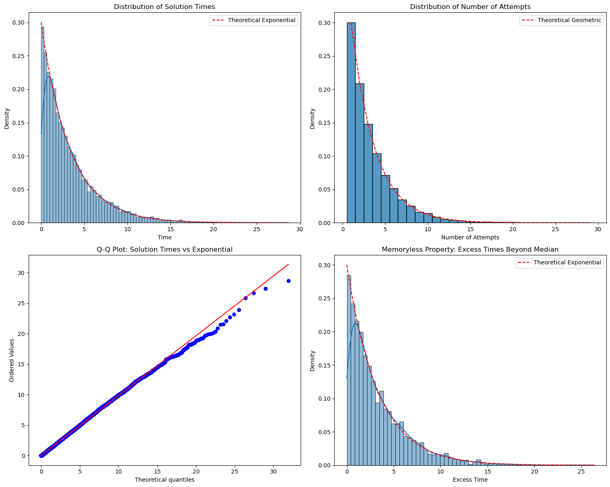

# Question 1: Joint Distribution in Polar Coordinates

Let $X$ and $Y$ be independent standard normal random variables. Define $R$ and $\Theta$ by the transformation:
$X = R\cos(\Theta)$
$Y = R\sin(\Theta)$

- part (a):
  Find the joint distribution of $R$ and $\Theta$.

- part (b):
  Given:

  - $Z = (Z_1, Z_2, ..., Z_n)$ is a vector of independent standard normal random variables
  - $A$ is an orthogonal $n \times n$ matrix (meaning $A^TA = AA^T = I$)
  - $W = AZ$ defines a linear transformation

  Find the joint distribution of $W = (W_1, W_2, ..., W_n)$

## Solution

Let's solve this step by step using the change of variables formula.

Since $X$ and $Y$ are independent standard normal variables, their joint probability density function (PDF) is:

$f_{X,Y}(x,y) = \frac{1}{2\pi} e^{-(x^2 + y^2)/2}$

To transform from $(x,y)$ to $(r,\theta)$, we need the Jacobian matrix. The partial derivatives are:

$\frac{\partial x}{\partial r} = \cos(\theta)$ &nbsp;&nbsp;&nbsp; $\frac{\partial x}{\partial \theta} = -r\sin(\theta)$

$\frac{\partial y}{\partial r} = \sin(\theta)$ &nbsp;&nbsp;&nbsp; $\frac{\partial y}{\partial \theta} = r\cos(\theta)$

The Jacobian determinant is:
$|J| = \begin{vmatrix} 
\cos(\theta) & -r\sin(\theta) \\
\sin(\theta) & r\cos(\theta)
\end{vmatrix}$

$|J| = r\cos^2(\theta) + r\sin^2(\theta) = r$

In polar coordinates:
$x^2 + y^2 = (r\cos(\theta))^2 + (r\sin(\theta))^2 = r^2(\cos^2(\theta) + \sin^2(\theta)) = r^2$

The joint PDF of $R$ and $\Theta$ is:

$f_{R,\Theta}(r,\theta) = f_{X,Y}(r\cos(\theta), r\sin(\theta)) \cdot |J|$

Substituting:

$f_{R,\Theta}(r,\theta) = \frac{1}{2\pi} e^{-r^2/2} \cdot r$

$f_{R,\Theta}(r,\theta) = \frac{r}{2\pi} e^{-r^2/2}$

where $r \geq 0$ and $0 \leq \theta < 2\pi$

Notice that the joint distribution can be factored:

$f_{R,\Theta}(r,\theta) = (r e^{-r^2/2}) \cdot (\frac{1}{2\pi})$

This factorization reveals that $R$ and $\Theta$ are independent random variables where:

1. $\Theta$ follows a uniform distribution over $[0, 2\pi)$:
   $f_{\Theta}(\theta) = \frac{1}{2\pi}$

2. $R$ follows a Rayleigh distribution:
   $f_R(r) = r e^{-r^2/2}$ for $r \geq 0$

This transformation from Cartesian to polar coordinates gives us an elegant result where the radius and angle are independent, despite starting with correlated Cartesian coordinates in the transformed space.

Let me help explain this multivariate problem and its connection to the previous part. I'll break it down step by step to build our understanding.

## Solution part b:

For independent standard normal variables, the joint PDF of $Z$ is:

$f_Z(z) = \frac{1}{(2\pi)^{n/2}} e^{-\frac{1}{2}z^Tz}$

where $z^Tz = \sum_{i=1}^n z_i^2$

Since $W = AZ$, we can write:
$Z = A^TW$ (because $A$ is orthogonal, so $A^{-1} = A^T$)

The Jacobian of this transformation is $|A^T| = 1$ (because $A$ is orthogonal)

Consider the exponent term $z^Tz$:
$z^Tz = (A^Tw)^T(A^Tw) = w^TAA^Tw = w^Tw$

The last equality holds because $AA^T = I$ for orthogonal matrices.

Therefore, the joint distribution of $W$ is:

$f_W(w) = \frac{1}{(2\pi)^{n/2}} e^{-\frac{1}{2}w^Tw}$

$f_W(w) = \frac{1}{(2\pi)^{n/2}} e^{-\frac{1}{2}\sum_{i=1}^n w_i^2}$

## Connection to Part (a)

This problem generalizes the two-dimensional case we saw earlier in several ways:

1. **Dimensionality**: Part (a) was a special case where $n=2$ and $A$ was a specific orthogonal matrix:
   $A = \begin{pmatrix} \cos(\theta) & -\sin(\theta) \\ \sin(\theta) & \cos(\theta) \end{pmatrix}$

2. **Invariance Property**: In both cases, we see that orthogonal transformations preserve the sum of squares:

   - In part (a): $x^2 + y^2 = r^2$
   - Here: $\sum_{i=1}^n z_i^2 = \sum_{i=1}^n w_i^2$

3. **Distribution Form**: Both results show that the joint distribution depends only on the sum of squares of the components, reflecting the spherical symmetry of the standard multivariate normal distribution.

4. **Independence Structure**: While the original variables ($Z_i$) were independent, the transformed variables ($W_i$) maintain the same joint distribution form but might not be independent unless $A$ is diagonal or a permutation matrix.

This generalization reveals a fundamental property of the multivariate normal distribution: its shape is preserved under orthogonal transformations, which are precisely the transformations that preserve distances and angles. This is why the standard multivariate normal distribution is said to be spherically symmetric.

---

# Question 2: Gamma Distributions

> The $Gamma(r,λ)$ distribution has density $f_{r,λ}(x) =\frac{1}{Γ(r)}λ^r x^{r−1}e^{−λ x}$ on $R_+$. Here $r$ is called the _shape parameter_ and $λ$ is called the _rate parameter_.
>
> Use moment generating functions to show that the sum of two independent Gamma-distributed random variables with the same rate parameter is also Gamma-distributed .What can you deduce about sums of exponential random variables?

## Solution:

For a random variable $X \sim \text{Gamma}(r,\lambda)$, its MGF is:

$M_X(t) = \mathbb{E}[e^{tX}] = \int_0^\infty e^{tx} \cdot \frac{1}{\Gamma(r)}\lambda^r x^{r-1}e^{-\lambda x} dx$

Collecting terms in the exponent:

$M_X(t) = \frac{\lambda^r}{\Gamma(r)} \int_0^\infty x^{r-1}e^{-(λ-t)x} dx$

This integral is a variant of the Gamma function integral. After solving:

$M_X(t) = \left(\frac{\lambda}{\lambda-t}\right)^r$ for $t < \lambda$

Consider:

- $X_1 \sim \text{Gamma}(r_1,\lambda)$
- $X_2 \sim \text{Gamma}(r_2,\lambda)$
- $X_1$ and $X_2$ are independent

Let $Y = X_1 + X_2$

The MGF of $Y$ is the product of the MGFs of $X_1$ and $X_2$ (due to independence):

$M_Y(t) = M_{X_1}(t) \cdot M_{X_2}(t)$

$M_Y(t) = \left(\frac{\lambda}{\lambda-t}\right)^{r_1} \cdot \left(\frac{\lambda}{\lambda-t}\right)^{r_2}$

$M_Y(t) = \left(\frac{\lambda}{\lambda-t}\right)^{r_1+r_2}$

The MGF we found matches the form of a Gamma distribution's MGF with:

- Rate parameter: $\lambda$ (unchanged)
- Shape parameter: $r = r_1 + r_2$

Therefore:

$Y = X_1 + X_2 \sim \text{Gamma}(r_1+r_2, \lambda)$

## Implications for Exponential Distributions

An important special case arises when considering exponential distributions, since $\text{Exp}(\lambda) = \text{Gamma}(1,\lambda)$.

For $n$ independent $\text{Exp}(\lambda)$ random variables, their sum follows a $\text{Gamma}(n,\lambda)$ distribution (also known as the Erlang distribution).

This gives us a mathematical explanation for why the sum of $n$ independent exponential waiting times with rate $\lambda$ follows a $\text{Gamma}(n,\lambda)$ distribution.

For example, if you're waiting for $n$ independent events where each wait time is exponentially distributed with the same rate $\lambda$, your total wait time follows a $\text{Gamma}(n,\lambda)$ distribution.

---

## Gamma Distribution

The Gamma distribution is fundamentally about waiting times or accumulations. Imagine you're waiting for a series of events to occur, where each event happens randomly but at some average rate. The Gamma distribution describes how long you might have to wait for a certain number of these events to happen.
Here's a concrete example: Suppose you're running a coffee shop, and customers arrive randomly throughout the day. If you want to know how long it will take for exactly 3 customers to arrive, that waiting time follows a Gamma distribution. The shape parameter (α) in this case would be 3, and the rate parameter (β) would be related to how frequently customers arrive on average.

Now let's understand each parameter:

### Shape Parameter (α)

The shape parameter determines the basic form of the distribution:

- When α = 1, the distribution is exponential (special case)
- When α < 1, the distribution is highly skewed with a peak at zero
- When α > 1, the distribution becomes more "bell-shaped" and moves away from zero
  As α increases, the distribution becomes more symmetric and starts looking more like a normal distribution

Think of the shape parameter as counting "how many events" you're waiting for. In our coffee shop example, waiting for 1 customer follows an exponential distribution (α = 1), waiting for 2 customers has a different shape (α = 2), and so on.

### Rate Parameter (β)

The rate parameter scales the distribution horizontally:

- Higher rate means events happen more frequently, making the distribution more concentrated near zero
- Lower rate means events happen more slowly, stretching the distribution to the right
- The rate parameter is like a "zoom" control on the x-axis

In our coffee shop example, a busy location would have a high rate (customers arrive frequently), while a quiet location would have a low rate (customers arrive slowly).

### Key Properties

The distribution has some useful mathematical properties:

- Mean = α/β (shape/rate)
- Variance = α/β²
- Mode = (α-1)/β (when α > 1)

### Common Applications

The Gamma distribution appears in many real-world situations:

- Waiting times for multiple events
- Insurance claim sizes
- Service times in queuing theory
- Asset pricing in financial markets

Let's break down how each distribution models a different aspect of this same process:

### Poisson Distribution:

- Models the number of events in a fixed time interval
- For example: "How many customers will arrive in the next hour?"
- If we expect an average of 3 customers per hour, some hours might see 2 customers, others 4, following the Poisson distribution
- Key property: The mean equals the variance

### Exponential Distribution:

- Models the time between consecutive events in a Poisson process
- For example: "How long until the next customer arrives?"
- It's memoryless: If you've waited 10 minutes, the probability of waiting another 5 minutes is the same as if you'd just started waiting
- It's actually a special case of the Gamma distribution where shape (α) = 1

### Gamma Distribution:

-Models the total time until a specific number of events occur

- For example: "How long until 3 customers arrive?"
- It's a generalization: When waiting for just one event (shape = 1), it becomes the exponential distribution
- The shape parameter (α) represents the number of events we're waiting for

# Question 3:

> A student makes repeated attempts to solve a problem. Suppose the ith attempt takes time $X_i$, where $X_i$ are i.i.d. exponential random variables with parameter $λ$. Each attempt is successful with probability $p$ (independently for each attempt, and independently of the durations). Use moment generating functions to show that the distribution of the total time before the problem is solved has an exponential distribution, and find its parameter

## Solution:

Let's analyze the total time until a student successfully solves a problem, where:

- Each attempt's time $X_i$ is exponentially distributed with parameter $\lambda$
- Each attempt succeeds with probability $p$, independently
- We'll use moment generating functions (MGFs) to find the distribution of the total time

1. For each attempt time $X_i$:

   - $X_i \sim \text{Exp}(\lambda)$
   - MGF: $M_{X_i}(t) = \frac{\lambda}{\lambda-t}$ for $t < \lambda$

2. Number of attempts $N$:

   - $N \sim \text{Geometric}(p)$
   - $P(N=k) = p(1-p)^{k-1}$ for $k \geq 1$

3. Total time: $T = \sum_{i=1}^N X_i$

### 1. Conditional Distribution

Given $N=k$ attempts:

- $T|N=k = \sum_{i=1}^k X_i$
- Since $X_i$ are i.i.d., $M_{T|N=k}(t) = (\frac{\lambda}{\lambda-t})^k$

### 2. Total MGF Using Law of Total Expectation

$$M_T(t) = E[e^{tT}] = \sum_{k=1}^{\infty} M_{T|N=k}(t)P(N=k)$$

$$= \sum_{k=1}^{\infty} (\frac{\lambda}{\lambda-t})^k p(1-p)^{k-1}$$

$$= p\sum_{k=1}^{\infty} (\frac{\lambda}{\lambda-t})^k (1-p)^{k-1}$$

### 3. Simplification

Let $r = \frac{\lambda}{\lambda-t}$. Then:

$$M_T(t) = p\sum_{k=1}^{\infty} r^k(1-p)^{k-1}$$

$$= p \cdot \frac{r}{1-r(1-p)}$$

Substituting back:

$$M_T(t) = p \cdot \frac{\lambda/(\lambda-t)}{1-\frac{\lambda}{\lambda-t}(1-p)}$$

$$= \frac{p\lambda}{p\lambda-t}$$

### 4. Result

The final MGF $M_T(t) = \frac{p\lambda}{p\lambda-t}$ is the MGF of an exponential distribution with parameter $p\lambda$.

The total time $T$ until successful problem solution follows an exponential distribution with parameter $p\lambda$:

$$T \sim \text{Exp}(p\lambda)$$

This means the expected time until solution is $\frac{1}{p\lambda}$, which makes intuitive sense as it's the mean attempt time $(\frac{1}{\lambda})$ multiplied by the expected number of attempts $(\frac{1}{p})$.

### What do we learn:

**1. Memoryless Property Preservation**

- The exponential distribution is known for being memoryless
- Remarkably, even after combining multiple attempts (each exponential) with a random number of trials (geometric), the final distribution is still exponential
- This preserves the memoryless property, meaning: if a student has been trying for some time without success, their expected remaining time is the same as when they started
- This is quite profound and not immediately obvious - the system "forgets" its history

**2. Parameter Interpretation**

- The new rate $p\lambda$ is the product of:

  - Original rate of each attempt ($\lambda$)
  - Probability of success ($p$)

- This means the overall rate is slower than individual attempts
  Expected time: $E[T] = \frac{1}{p\lambda}$ = $\frac{1}{\lambda} \cdot \frac{1}{p}$

  - $\frac{1}{\lambda}$ is mean attempt time
  - $\frac{1}{p}$ is mean number of attempts needed
  - Their product gives total expected time

# Question 4: Random Variables and Moment Generating Functions

> ## Part (a)
>
> Let $X$, $Y$ and $U$ be independent random variables, where $X$ and $Y$ have moment generating functions $M_X(t)$ and $M_Y(t)$, and where $U$ has the uniform distribution on $[0,1]$. Find random variables which are functions of $X$, $Y$ and $U$ and which have the following moment generating functions:
>
> (i) $M_X(t)M_Y(t)$
>
> (ii) $e^{bt}M_X(at)$
>
> (iii) $\int_0^1 M_X(tu)du$
>
> (iv) $\frac{M_X(t) + M_Y(t)}{2}$

> ## Part (b)
>
> Using characteristic functions or otherwise, find $E[\cos(tX)]$ and $E[\sin(tX)]$ when $X$ has exponential distribution with parameter $\lambda$.

> ## Part (c)
>
> Which random variables $X$ have a real-valued characteristic function?

## Solution part (a):

Let's find random variables for each of the given moment generating functions (MGFs).

### (i) For $M_X(t)M_Y(t)$

This one is straightforward - it's a fundamental property of MGFs:

- If we have independent random variables, the MGF of their sum is the product of their MGFs
- Therefore, $M_{X+Y}(t) = M_X(t)M_Y(t)$

**Answer**: The random variable $X + Y$ has this MGF.

### (ii) For $e^{bt}M_X(at)$

Let's think about this:

- The term $e^{bt}$ is the MGF of a constant $b$
- $M_X(at)$ is the MGF of $aX$

Therefore:

- If we add a constant $b$ to $aX$, we get:
- $M_{aX+b}(t) = e^{bt}M_X(at)$

**Answer**: The random variable $aX + b$ has this MGF.

### (iii) For $\int_0^1 M_X(tu)du$

This is trickier. Let's think about it:

- We have uniform random variable $U$ on $[0,1]$
- Consider the random variable $UX$
- Its MGF would be:
  $M_{UX}(t) = E[e^{tUX}] = E[E[e^{tUX}|U]]$
  $= E[M_X(tU)] = \int_0^1 M_X(tu)du$

**Answer**: The random variable $UX$ has this MGF.

### (iv) For $\frac{M_X(t) + M_Y(t)}{2}$

This represents a mixture:

- Let $I$ be a Bernoulli(1/2) random variable
- Consider the random variable $Z$ defined as:
  - $Z = X$ if $I = 1$ (probability 1/2)
  - $Z = Y$ if $I = 0$ (probability 1/2)
- The MGF of $Z$ would be:
  $M_Z(t) = \frac{1}{2}M_X(t) + \frac{1}{2}M_Y(t)$

**Answer**: The random variable $Z$ defined above has this MGF. We can construct it using $I = \mathbb{1}_{U \leq 1/2}$ where $U$ is our given uniform random variable.

### Summary of Results:

1. $X + Y$ has MGF $M_X(t)M_Y(t)$
2. $aX + b$ has MGF $e^{bt}M_X(at)$
3. $UX$ has MGF $\int_0^1 M_X(tu)du$
4. $IX + (1-I)Y$ where $I = \mathbb{1}_{U \leq 1/2}$ has MGF $\frac{M_X(t) + M_Y(t)}{2}$

Let me solve part (b) step by step.

## Part (b): Finding $E[\cos(tX)]$ and $E[\sin(tX)]$ for $X \sim \text{Exp}(\lambda)$

### Method 1: Using Characteristic Functions

1. First, recall that for an exponential distribution with parameter $\lambda$:

   - The characteristic function is: $\phi_X(t) = E[e^{itX}] = \frac{\lambda}{\lambda - it}$

2. Using Euler's formula: $e^{itX} = \cos(tX) + i\sin(tX)$

   - Therefore: $\phi_X(t) = E[\cos(tX)] + iE[\sin(tX)]$

3. Let's expand $\frac{\lambda}{\lambda - it}$:

   - $\frac{\lambda}{\lambda - it} = \frac{\lambda(\lambda + it)}{(\lambda - it)(\lambda + it)}$
   - $= \frac{\lambda^2 + i\lambda t}{\lambda^2 + t^2}$
   - $= \frac{\lambda^2}{\lambda^2 + t^2} + i\frac{\lambda t}{\lambda^2 + t^2}$

4. Therefore, by equating real and imaginary parts:
   - $E[\cos(tX)] = \frac{\lambda^2}{\lambda^2 + t^2}$
   - $E[\sin(tX)] = \frac{\lambda t}{\lambda^2 + t^2}$

### Method 2: Direct Integration

We can verify this by direct integration:

$E[\cos(tX)] = \int_0^\infty \cos(tx)\lambda e^{-\lambda x}dx$

$E[\sin(tX)] = \int_0^\infty \sin(tx)\lambda e^{-\lambda x}dx$

These integrals can be solved using integration by parts or by recognizing them as standard integrals.

### Verification

We can check our answer:

1. When $t = 0$:

   - $E[\cos(0X)] = 1$ (as expected)
   - $E[\sin(0X)] = 0$ (as expected)

2. When $t \to \infty$:

   - Both expectations go to 0 (as expected due to rapid oscillation)

3. The results maintain the proper relationship:
   - $E[\cos(tX)]^2 + E[\sin(tX)]^2 = \frac{\lambda^4 + \lambda^2t^2}{(\lambda^2 + t^2)^2} < 1$
   - This inequality is expected as expectations of sine and cosine should be damped compared to the original functions

## Interpretation

1. These expectations represent the average of oscillating functions weighted by an exponential decay.

2. The formulas show how the exponential distribution "smooths out" the oscillations of sine and cosine:
   - At low t: behavior similar to original functions
   - At high t: decay to zero due to exponential weighting

# Part (c): Identifying Random Variables with Real-Valued Characteristic Functions

1. Recall that the characteristic function is:
   $\phi_X(t) = E[e^{itX}] = E[\cos(tX)] + iE[\sin(tX)]$

2. For the characteristic function to be real-valued:
   - $E[\sin(tX)] = 0$ for all $t$
   - Only $E[\cos(tX)]$ remains

A random variable $X$ has a real-valued characteristic function if and only if $X$ is symmetric about 0 (i.e., $X$ and $-X$ have the same distribution).

### Proof

#### Forward Direction (⇒):

If $X$ has a real-valued characteristic function, then:

1. $\phi_X(t) = E[e^{itX}] = E[\cos(tX)]$ for all $t$
2. This means $E[\sin(tX)] = 0$ for all $t$
3. For any $t$:
   - $\phi_X(t) = E[\cos(tX) + i\sin(tX)] = E[\cos(tX)]$
   - $\phi_{-X}(t) = E[\cos(-tX) + i\sin(-tX)] = E[\cos(tX) - i\sin(tX)]$
4. Since $E[\sin(tX)] = 0$, we have $\phi_X(t) = \phi_{-X}(t)$
5. By the uniqueness theorem for characteristic functions, $X$ and $-X$ must have the same distribution

#### Backward Direction (⇐):

If $X$ is symmetric about 0, then:

1. For any $t$, $E[\sin(tX)] = -E[\sin(tX)]$ (due to symmetry)
2. This implies $E[\sin(tX)] = 0$
3. Therefore, $\phi_X(t) = E[\cos(tX)]$, which is real-valued

### Examples

1. **Symmetric Distributions** (have real-valued characteristic functions):

   - Normal(0, σ²)
   - Uniform(-a, a)
   - Student's t-distribution
   - Any distribution of $X$ where $P(X ≤ x) = P(X ≥ -x)$ for all $x$

2. **Asymmetric Distributions** (do not have real-valued characteristic functions):
   - Exponential(λ)
   - Log-normal
   - Chi-squared
   - Gamma

To check if a random variable has a real-valued characteristic function:

1. Test if the distribution is symmetric about 0
2. Or compute $E[\sin(tX)]$ and verify it equals 0 for all $t$
