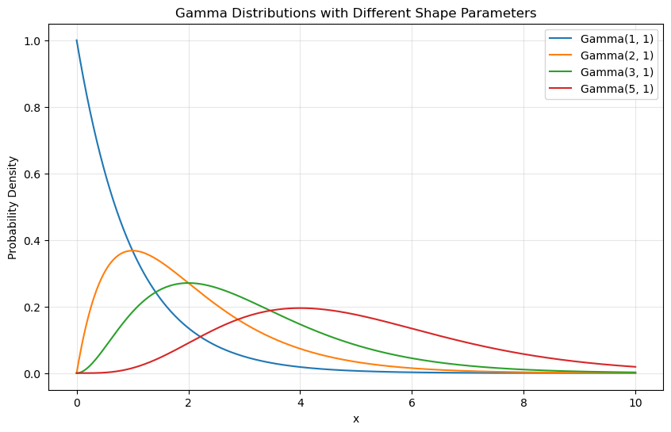
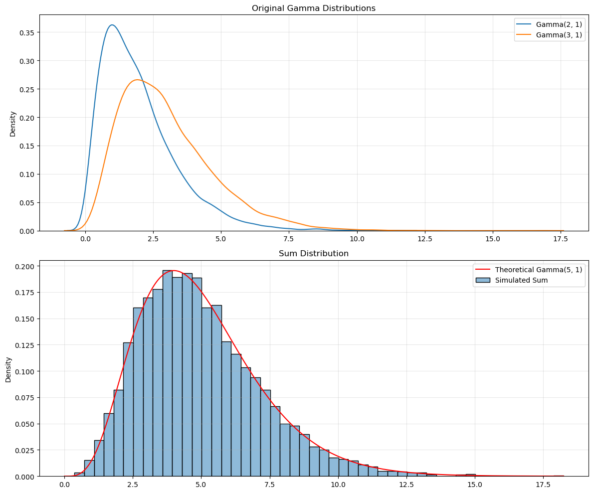
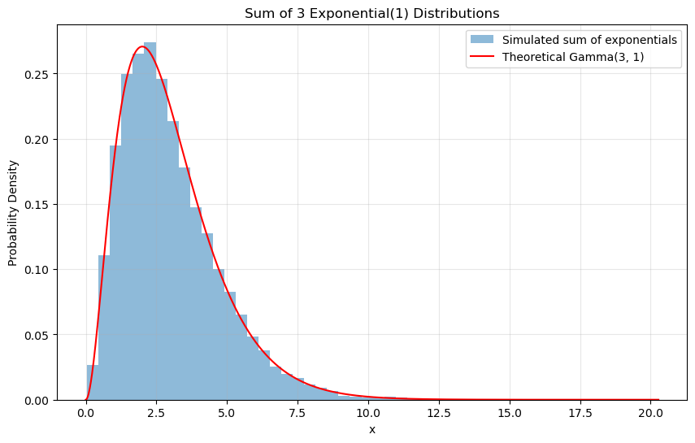
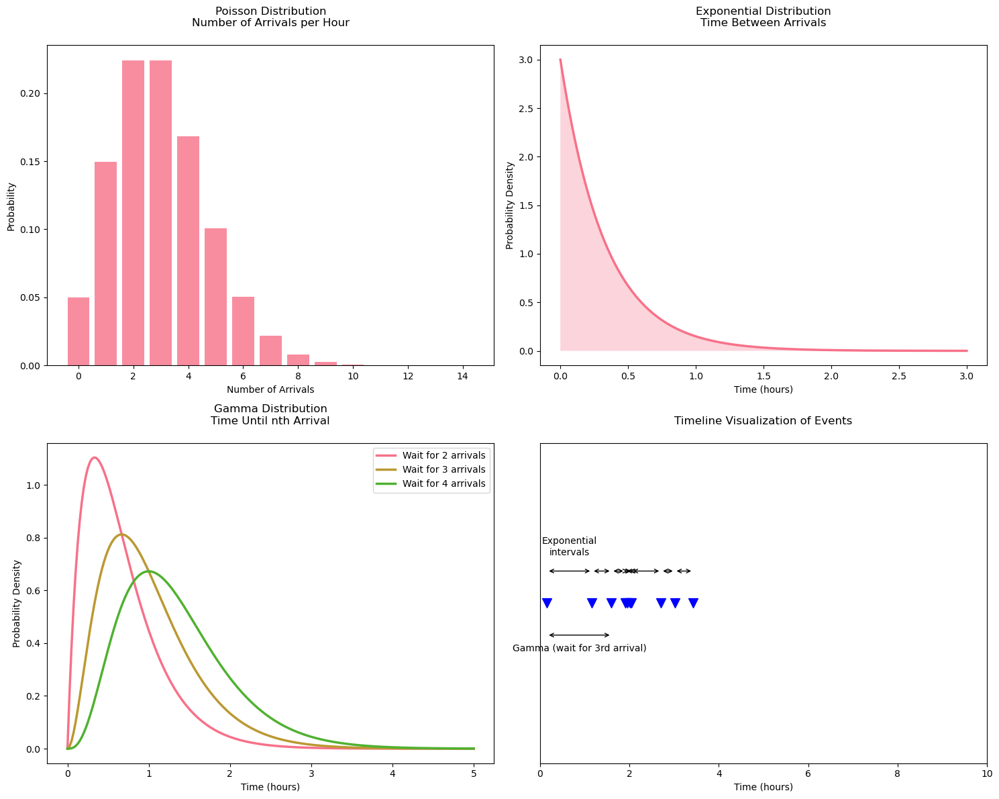

# Question 1: Joint Distribution in Polar Coordinates

Let $X$ and $Y$ be independent standard normal random variables. Define $R$ and $\Theta$ by the transformation:
$X = R\cos(\Theta)$
$Y = R\sin(\Theta)$

- part (a):
  Find the joint distribution of $R$ and $\Theta$.

- part (b):
  Given:

  - $Z = (Z_1, Z_2, ..., Z_n)$ is a vector of independent standard normal random variables
  - $A$ is an orthogonal $n \times n$ matrix (meaning $A^TA = AA^T = I$)
  - $W = AZ$ defines a linear transformation

  Find the joint distribution of $W = (W_1, W_2, ..., W_n)$

## Solution

Let's solve this step by step using the change of variables formula.

Since $X$ and $Y$ are independent standard normal variables, their joint probability density function (PDF) is:

$f_{X,Y}(x,y) = \frac{1}{2\pi} e^{-(x^2 + y^2)/2}$

To transform from $(x,y)$ to $(r,\theta)$, we need the Jacobian matrix. The partial derivatives are:

$\frac{\partial x}{\partial r} = \cos(\theta)$ &nbsp;&nbsp;&nbsp; $\frac{\partial x}{\partial \theta} = -r\sin(\theta)$

$\frac{\partial y}{\partial r} = \sin(\theta)$ &nbsp;&nbsp;&nbsp; $\frac{\partial y}{\partial \theta} = r\cos(\theta)$

The Jacobian determinant is:
$|J| = \begin{vmatrix} 
\cos(\theta) & -r\sin(\theta) \\
\sin(\theta) & r\cos(\theta)
\end{vmatrix}$

$|J| = r\cos^2(\theta) + r\sin^2(\theta) = r$

In polar coordinates:
$x^2 + y^2 = (r\cos(\theta))^2 + (r\sin(\theta))^2 = r^2(\cos^2(\theta) + \sin^2(\theta)) = r^2$

The joint PDF of $R$ and $\Theta$ is:

$f_{R,\Theta}(r,\theta) = f_{X,Y}(r\cos(\theta), r\sin(\theta)) \cdot |J|$

Substituting:

$f_{R,\Theta}(r,\theta) = \frac{1}{2\pi} e^{-r^2/2} \cdot r$

$f_{R,\Theta}(r,\theta) = \frac{r}{2\pi} e^{-r^2/2}$

where $r \geq 0$ and $0 \leq \theta < 2\pi$

Notice that the joint distribution can be factored:

$f_{R,\Theta}(r,\theta) = (r e^{-r^2/2}) \cdot (\frac{1}{2\pi})$

This factorization reveals that $R$ and $\Theta$ are independent random variables where:

1. $\Theta$ follows a uniform distribution over $[0, 2\pi)$:
   $f_{\Theta}(\theta) = \frac{1}{2\pi}$

2. $R$ follows a Rayleigh distribution:
   $f_R(r) = r e^{-r^2/2}$ for $r \geq 0$

This transformation from Cartesian to polar coordinates gives us an elegant result where the radius and angle are independent, despite starting with correlated Cartesian coordinates in the transformed space.

Let me help explain this multivariate problem and its connection to the previous part. I'll break it down step by step to build our understanding.

## Solution part b:

For independent standard normal variables, the joint PDF of $Z$ is:

$f_Z(z) = \frac{1}{(2\pi)^{n/2}} e^{-\frac{1}{2}z^Tz}$

where $z^Tz = \sum_{i=1}^n z_i^2$

Since $W = AZ$, we can write:
$Z = A^TW$ (because $A$ is orthogonal, so $A^{-1} = A^T$)

The Jacobian of this transformation is $|A^T| = 1$ (because $A$ is orthogonal)

Consider the exponent term $z^Tz$:
$z^Tz = (A^Tw)^T(A^Tw) = w^TAA^Tw = w^Tw$

The last equality holds because $AA^T = I$ for orthogonal matrices.

Therefore, the joint distribution of $W$ is:

$f_W(w) = \frac{1}{(2\pi)^{n/2}} e^{-\frac{1}{2}w^Tw}$

$f_W(w) = \frac{1}{(2\pi)^{n/2}} e^{-\frac{1}{2}\sum_{i=1}^n w_i^2}$

## Connection to Part (a)

This problem generalizes the two-dimensional case we saw earlier in several ways:

1. **Dimensionality**: Part (a) was a special case where $n=2$ and $A$ was a specific orthogonal matrix:
   $A = \begin{pmatrix} \cos(\theta) & -\sin(\theta) \\ \sin(\theta) & \cos(\theta) \end{pmatrix}$

2. **Invariance Property**: In both cases, we see that orthogonal transformations preserve the sum of squares:

   - In part (a): $x^2 + y^2 = r^2$
   - Here: $\sum_{i=1}^n z_i^2 = \sum_{i=1}^n w_i^2$

3. **Distribution Form**: Both results show that the joint distribution depends only on the sum of squares of the components, reflecting the spherical symmetry of the standard multivariate normal distribution.

4. **Independence Structure**: While the original variables ($Z_i$) were independent, the transformed variables ($W_i$) maintain the same joint distribution form but might not be independent unless $A$ is diagonal or a permutation matrix.

This generalization reveals a fundamental property of the multivariate normal distribution: its shape is preserved under orthogonal transformations, which are precisely the transformations that preserve distances and angles. This is why the standard multivariate normal distribution is said to be spherically symmetric.

---

# Question 2: Gamma Distributions

> The $Gamma(r,λ)$ distribution has density $f_{r,λ}(x) =\frac{1}{Γ(r)}λ^r x^{r−1}e^{−λ x}$ on $R_+$. Here $r$ is called the _shape parameter_ and $λ$ is called the _rate parameter_.
>
> Use moment generating functions to show that the sum of two independent Gamma-distributed random variables with the same rate parameter is also Gamma-distributed .What can you deduce about sums of exponential random variables?

## Solution:

For a random variable $X \sim \text{Gamma}(r,\lambda)$, its MGF is:

$M_X(t) = \mathbb{E}[e^{tX}] = \int_0^\infty e^{tx} \cdot \frac{1}{\Gamma(r)}\lambda^r x^{r-1}e^{-\lambda x} dx$

Collecting terms in the exponent:

$M_X(t) = \frac{\lambda^r}{\Gamma(r)} \int_0^\infty x^{r-1}e^{-(λ-t)x} dx$

This integral is a variant of the Gamma function integral. After solving:

$M_X(t) = \left(\frac{\lambda}{\lambda-t}\right)^r$ for $t < \lambda$

Consider:

- $X_1 \sim \text{Gamma}(r_1,\lambda)$
- $X_2 \sim \text{Gamma}(r_2,\lambda)$
- $X_1$ and $X_2$ are independent

Let $Y = X_1 + X_2$

The MGF of $Y$ is the product of the MGFs of $X_1$ and $X_2$ (due to independence):

$M_Y(t) = M_{X_1}(t) \cdot M_{X_2}(t)$

$M_Y(t) = \left(\frac{\lambda}{\lambda-t}\right)^{r_1} \cdot \left(\frac{\lambda}{\lambda-t}\right)^{r_2}$

$M_Y(t) = \left(\frac{\lambda}{\lambda-t}\right)^{r_1+r_2}$

The MGF we found matches the form of a Gamma distribution's MGF with:

- Rate parameter: $\lambda$ (unchanged)
- Shape parameter: $r = r_1 + r_2$

Therefore:

$Y = X_1 + X_2 \sim \text{Gamma}(r_1+r_2, \lambda)$

## Implications for Exponential Distributions

An important special case arises when considering exponential distributions, since $\text{Exp}(\lambda) = \text{Gamma}(1,\lambda)$.

For $n$ independent $\text{Exp}(\lambda)$ random variables, their sum follows a $\text{Gamma}(n,\lambda)$ distribution (also known as the Erlang distribution).

This gives us a mathematical explanation for why the sum of $n$ independent exponential waiting times with rate $\lambda$ follows a $\text{Gamma}(n,\lambda)$ distribution.

For example, if you're waiting for $n$ independent events where each wait time is exponentially distributed with the same rate $\lambda$, your total wait time follows a $\text{Gamma}(n,\lambda)$ distribution.

---

## Gamma Distribution

The Gamma distribution is fundamentally about waiting times or accumulations. Imagine you're waiting for a series of events to occur, where each event happens randomly but at some average rate. The Gamma distribution describes how long you might have to wait for a certain number of these events to happen.
Here's a concrete example: Suppose you're running a coffee shop, and customers arrive randomly throughout the day. If you want to know how long it will take for exactly 3 customers to arrive, that waiting time follows a Gamma distribution. The shape parameter (α) in this case would be 3, and the rate parameter (β) would be related to how frequently customers arrive on average.

Now let's understand each parameter:

### Shape Parameter (α)

The shape parameter determines the basic form of the distribution:

- When α = 1, the distribution is exponential (special case)
- When α < 1, the distribution is highly skewed with a peak at zero
- When α > 1, the distribution becomes more "bell-shaped" and moves away from zero
  As α increases, the distribution becomes more symmetric and starts looking more like a normal distribution

Think of the shape parameter as counting "how many events" you're waiting for. In our coffee shop example, waiting for 1 customer follows an exponential distribution (α = 1), waiting for 2 customers has a different shape (α = 2), and so on.

### Rate Parameter (β)

The rate parameter scales the distribution horizontally:

- Higher rate means events happen more frequently, making the distribution more concentrated near zero
- Lower rate means events happen more slowly, stretching the distribution to the right
- The rate parameter is like a "zoom" control on the x-axis

In our coffee shop example, a busy location would have a high rate (customers arrive frequently), while a quiet location would have a low rate (customers arrive slowly).

### Key Properties

The distribution has some useful mathematical properties:

- Mean = α/β (shape/rate)
- Variance = α/β²
- Mode = (α-1)/β (when α > 1)

### Common Applications

The Gamma distribution appears in many real-world situations:

- Waiting times for multiple events
- Insurance claim sizes
- Service times in queuing theory
- Asset pricing in financial markets

Let's break down how each distribution models a different aspect of this same process:

### Poisson Distribution:

- Models the number of events in a fixed time interval
- For example: "How many customers will arrive in the next hour?"
- If we expect an average of 3 customers per hour, some hours might see 2 customers, others 4, following the Poisson distribution
- Key property: The mean equals the variance

### Exponential Distribution:

- Models the time between consecutive events in a Poisson process
- For example: "How long until the next customer arrives?"
- It's memoryless: If you've waited 10 minutes, the probability of waiting another 5 minutes is the same as if you'd just started waiting
- It's actually a special case of the Gamma distribution where shape (α) = 1

### Gamma Distribution:

-Models the total time until a specific number of events occur

- For example: "How long until 3 customers arrive?"
- It's a generalization: When waiting for just one event (shape = 1), it becomes the exponential distribution
- The shape parameter (α) represents the number of events we're waiting for
