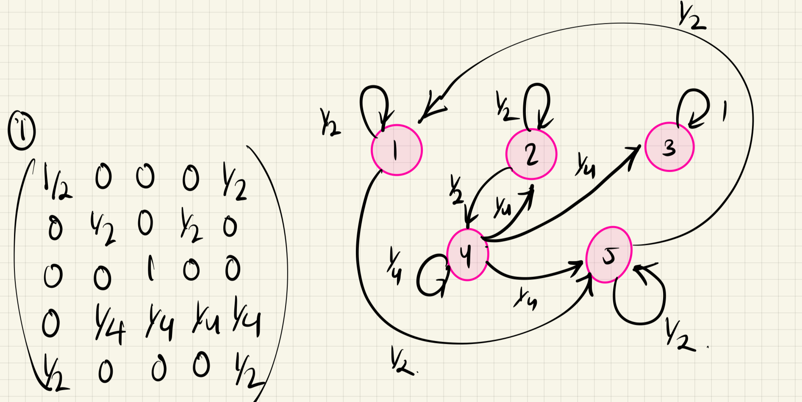
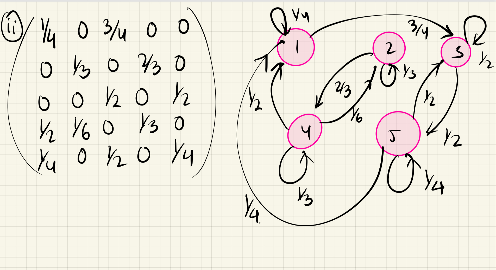
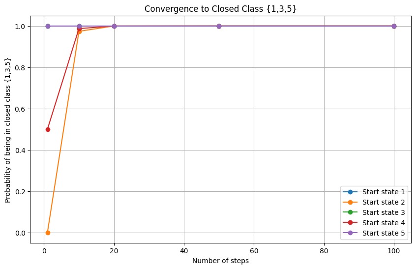

# Question 1: Markov Chain Communicating Classes

Find the communicating classes of Markov chains with the following transition matrices on the state space $\{1,2,3,4,5\}$, and in each case determine which classes are closed:

(i)

$$
P_1 = \begin{pmatrix}
\frac{1}{2} & 0 & 0 & 0 & \frac{1}{2} \\
0 & \frac{1}{2} & 0 & \frac{1}{2} & 0 \\
0 & 0 & 1 & 0 & 0 \\
0 & \frac{1}{4} & \frac{1}{4} & \frac{1}{4} & \frac{1}{4} \\
\frac{1}{2} & 0 & 0 & 0 & \frac{1}{2}
\end{pmatrix}
$$

(ii)

$$
P_2 = \begin{pmatrix}
\frac{1}{4} & 0 & \frac{3}{4} & 0 & 0 \\
0 & \frac{1}{3} & 0 & \frac{2}{3} & 0 \\
0 & 0 & \frac{1}{2} & 0 & \frac{1}{2} \\
\frac{1}{2} & \frac{1}{6} & 0 & \frac{1}{3} & 0 \\
\frac{1}{4} & 0 & \frac{1}{2} & 0 & \frac{1}{4}
\end{pmatrix}
$$

For each matrix:

1. Draw the transition diagram
2. Identify all communicating classes
3. Determine which classes are closed

If $X$ is a chain with the transition matrix in (ii), find the distribution of $X_1$ when $X_0$ has the uniform distribution on $\{1,2,3,4,5\}$, and find $P(X_2= 3|X_0= 1)$.

## Solution:

### Matrix (i)

Let's analyze the transitions for each state in $P_1$:

For state $i$, we denote the possible transitions by writing $i \to j$ if $p_{ij} > 0$.

1. From state 1: $1 \to \{1,5\}$ with probabilities $(\frac{1}{2}, \frac{1}{2})$
2. From state 2: $2 \to \{2,4\}$ with probabilities $(\frac{1}{2}, \frac{1}{2})$
3. From state 3: $3 \to \{3\}$ with probability 1
4. From state 4: $4 \to \{2,3,4,5\}$ with probabilities $(\frac{1}{4}, \frac{1}{4}, \frac{1}{4}, \frac{1}{4})$
5. From state 5: $5 \to \{1,5\}$ with probabilities $(\frac{1}{2}, \frac{1}{2})$

**Communicating Classes**

The communicating classes are:

1. $C_1 = \{1,5\}$ - This is a closed class

   - States 1 and 5 communicate: $1 \leftrightarrow 5$
   - No transitions lead outside this class

2. $C_2 = \{2,4\}$ - This is not closed

   - States 2 and 4 communicate: $2 \leftrightarrow 4$
   - Can transition to state 3 from state 4

3. $C_3 = \{3\}$ - This is a closed class
   - State 3 only transitions to itself
   - Once entered, cannot be left



## Matrix (ii)

$$
P_2 = \begin{pmatrix}
\frac{1}{4} & 0 & \frac{3}{4} & 0 & 0 \\
0 & \frac{1}{3} & 0 & \frac{2}{3} & 0 \\
0 & 0 & \frac{1}{2} & 0 & \frac{1}{2} \\
\frac{1}{2} & \frac{1}{6} & 0 & \frac{1}{3} & 0 \\
\frac{1}{4} & 0 & \frac{1}{2} & 0 & \frac{1}{4}
\end{pmatrix}
$$

The key insight is that this Markov chain naturally divides into two communicating classes with a specific relationship between them:

1. First Communicating Class: $\{1,3,5\}$

   - These states form a closed communicating class
   - Once the chain enters any of these states, it can never leave
   - States 1, 3, and 5 can all reach each other through various paths
   - This is the only closed class in the chain

2. Second Communicating Class: $\{2,4\}$
   - These states form an open communicating class
   - States 2 and 4 can reach each other
   - However, this class can transition to the closed class $\{1,3,5\}$
   - Once the chain leaves this class, it can never return

The structure shows a hierarchical relationship: the chain will eventually end up in the closed class $\{1,3,5\}$ if it starts in $\{2,4\}$. This is a key property that determines the long-term behavior of the chain.



The key difference between these matrices is that $P_1$ has multiple closed classes while $P_2$ has only one closed class which is absorbing.


## Finding Distributions in a Markov Chain

### Part 1: Finding Distribution of X₁

When $X₀$ has a uniform distribution on $\{1,2,3,4,5\}$, we need to calculate $λP$ where:

λ = $(\frac{1}{5}, \frac{1}{5}, \frac{1}{5}, \frac{1}{5}, \frac{1}{5})$

And $P$ is our transition matrix:

$$
P = \begin{pmatrix}
\frac{1}{4} & 0 & \frac{3}{4} & 0 & 0 \\
0 & \frac{1}{3} & 0 & \frac{2}{3} & 0 \\
0 & 0 & \frac{1}{2} & 0 & \frac{1}{2} \\
\frac{1}{2} & \frac{1}{6} & 0 & \frac{1}{3} & 0 \\
\frac{1}{4} & 0 & \frac{1}{2} & 0 & \frac{1}{4}
\end{pmatrix}
$$

Let's calculate each probability $P(X₁ = i):$

For state 1:
$$P(X_1 = 1) = \frac{1}{5}(\frac{1}{4}) + \frac{1}{5}(0) + \frac{1}{5}(\frac{3}{4}) + \frac{1}{5}(0) + \frac{1}{5}(0) = \frac{1}{5} = 0.2$$

For state 2:
$$P(X_1 = 2) = \frac{1}{5}(0) + \frac{1}{5}(\frac{1}{3}) + \frac{1}{5}(0) + \frac{1}{5}(\frac{2}{3}) + \frac{1}{5}(0) = \frac{1}{10} = 0.1$$

For state 3:
$$P(X_1 = 3) = \frac{1}{5}(\frac{3}{4}) + \frac{1}{5}(0) + \frac{1}{5}(\frac{1}{2}) + \frac{1}{5}(0) + \frac{1}{5}(\frac{1}{2}) = \frac{7}{20} = 0.35$$

For state 4:
$$P(X_1 = 4) = \frac{1}{5}(0) + \frac{1}{5}(\frac{2}{3}) + \frac{1}{5}(0) + \frac{1}{5}(\frac{1}{3}) + \frac{1}{5}(0) = \frac{1}{5} = 0.2$$

For state 5:
$$P(X_1 = 5) = \frac{1}{5}(0) + \frac{1}{5}(0) + \frac{1}{5}(\frac{1}{2}) + \frac{1}{5}(0) + \frac{1}{5}(\frac{1}{4}) = \frac{3}{20} = 0.15$$

### Part 2: Finding $P(X₂ = 3|X₀ = 1)$

This requires calculating the $(1,3)$ entry of $P²$. We can find this by considering all possible 2-step paths from state 1 to state 3:

1. Path through state 1: $P(1 \to 1 \to 3) = \frac{1}{4} \cdot \frac{3}{4}$
2. Path through state 3: $P(1 \to 3 \to 3) = \frac{3}{4} \cdot \frac{1}{2}$

Therefore:
$$P(X_2 = 3|X_0 = 1) = \frac{1}{4} \cdot \frac{3}{4} + \frac{3}{4} \cdot \frac{1}{2} = \frac{3}{16} + \frac{3}{8} = \frac{9}{16}= 0.56$$

The distribution of $X₁$ shows higher probabilities for states in the closed class $\{1,3,5\}$, which aligns with our understanding that the chain will eventually remain in this class.

# Question 2: Two-Urn Ball Exchange Problem

$N$ black balls and $N$ white balls are distributed between two urns, numbered $1$ and $2$,so that each urn contains $N$ balls. At each step, one ball is chosen at random from eachurn and the two chosen balls are exchanged. Let $X_n$ be the number of white balls in urn 1 after $n$ steps. Find the transition matrix for the Markov chain $X$.

## Solution:

### 1. Understanding the State Space

- $X_n$ represents the number of white balls in urn 1 after n steps
- The state space is $S = \{0, 1, 2, ..., N\}$
- In state $k$:
  - Urn 1 has $k$ white balls and $(N-k)$ black balls
  - Urn 2 has $(N-k)$ white balls and $k$ black balls

### 2. Analyzing Possible Transitions

From state $k$, we can move to:

- $k+1$ (gain a white ball in urn 1)
- $k-1$ (lose a white ball from urn 1)
- $k$ (stay in the same state)

### 3. Calculating Transition Probabilities

#### a) For $P(k \to k+1)$:

We need to select a black ball from urn 1 and a white ball from urn 2

```
P(k → k+1) = (N-k)/N × (N-k)/N = ((N-k)/N)²
```

#### b) For $P(k \to k-1)$:

We need to select a white ball from urn 1 and a black ball from urn 2

```
P(k → k-1) = k/N × k/N = (k/N)²
```

#### c) For $P(k \to k)$:

We need to select either:

- Both white balls (probability: $\frac{k}{N} \cdot \frac{N-k}{N}$)
- Both black balls (probability: $\frac{N-k}{N} \cdot \frac{k}{N}$)

```
P(k → k) = 2k(N-k)/N²
```

### 4. Transition Matrix

The transition matrix $P$ is tridiagonal with entries:

$P_{ij} = \begin{cases} 
(\frac{N-i}{N})^2 & \text{if } j=i+1 \\
(\frac{i}{N})^2 & \text{if } j=i-1 \\
\frac{2i(N-i)}{N^2} & \text{if } j=i \\
0 & \text{otherwise}
\end{cases}$

where $i, j \in \{0, 1, ..., N\}$

### 5. Properties of the Chain

1. The matrix is stochastic (row sums = 1)
2. The chain is irreducible (all states communicate)
3. The chain is aperiodic (can return to any state in consecutive steps)

## Example

For $N=3$:

State: $\{0,1,2,3\}$

$
P = \begin{pmatrix}
0 & 1 & 0 & 0 \\
1/9 & 4/9 & 4/9 & 0 \\
0 & 4/9 & 4/9 & 1/9 \\
0 & 0 & 1 & 0
\end{pmatrix}
$


**Animation**

https://claude.site/artifacts/573d1a44-f74c-4912-92f4-244066200943

# Question 3:

A die is _“fixed”_ so that each time it is rolled the score cannot be the same as the preceding score, all other scores having probablity $1/5.$ If the first score is $6$, what are $P(\text{nth score is }6)$ and $P(\text{nth score is }1)$? _[Hint: you can simplify things by selecting anappropriate state-space; do you really need a6-state chain to answer the question?]_

# Solution:

1. First, let's think about the state space carefully. To know the distribution of the next roll, we only need to know whether the previous roll was 6 or not-6. We don't actually need to track what specific non-6 value was rolled.

2. So we can use a 2-state Markov chain with states:

   - State 1: $"6"$
   - State 2: "not 6" (representing $1,2,3,4,5$)

3. Let's find the transition matrix P:

   - From state 1 (6): Must go to state 2 (probability 1)
   - From state 2 (not 6):
     - Can go to 6 with probability $1/5$
     - Stay in "not 6" with probability $4/5$

   so
   $
   P = \begin{pmatrix}
   0 & 1 \\
   1/5 & 4/5 \\
   \end{pmatrix}
   $

4. We start in state 1 (given first score is 6)

5. This is exactly like Example 5.3 in the lecture notes with $α=1$ and $β=1/5$

6. From equation (5.2) in the notes:
   $$p(n)₁₁ = β/(α+β) + [α/(α+β)](1-α-β)ⁿ$$
   where $α=1, β=1/5$

   Therefore:

   $$P(\text{nth score is }6) = 1/6 + (5/6)(-4/5)ⁿ$$

7. For $P(\text{nth score is }1)$, first note $P(\text{score is }1 | \text{not }6) = 1/5$

   So $P(\text{nth score is }1) = P(\text{nth score is not }6) × 1/5$

   $= (1 - P(\text{nth score is } 6)) × 1/5$

   $= (1 - [1/6 + (5/6)(-4/5)ⁿ]) × 1/5$

   $= (5/6 - (5/6)(-4/5)ⁿ) × 1/5$

   $= 1/6 - (1/6)(-4/5)ⁿ$

Therefore:

$P(\text{nth score is }6) = 1/6 + (5/6)(-4/5)ⁿ$

$P(\text{nth score is }1) = 1/6 - (1/6)(-4/5)ⁿ$

As $n→∞$, both probabilities converge to $1/6,$ which makes sense as this is the stationary distribution of the chain.

## Steps:

We have a 2-state Markov chain with transition matrix:

$P = \begin{bmatrix} 0 & 1 \\ \frac{1}{5} & \frac{4}{5} \end{bmatrix}$

Starting in state 1, we want to find $P(\text{nth roll is }6)$ and $P(\text{nth roll is }1)$.

### Step 1: Find Eigenvalues

The characteristic equation is:
$\det(P - \lambda I) = 0$

$\begin{vmatrix} -\lambda & 1 \\ \frac{1}{5} & \frac{4}{5}-\lambda \end{vmatrix} = 0$

$\lambda^2 - \frac{4}{5}\lambda - \frac{1}{5} = 0$

Using the quadratic formula:
$\lambda = \frac{4/5 \pm \sqrt{16/25 + 4/5}}{2} = \frac{4/5 \pm \sqrt{36/25}}{2} = \frac{4/5 \pm 6/5}{2}$

Therefore:

- $\lambda_1 = 1$
- $\lambda_2 = -\frac{1}{5}$

### Step 2: Find Eigenvectors

For $\lambda_1 = 1$:

$\begin{bmatrix} -1 & 1 \\ \frac{1}{5} & -\frac{1}{5} \end{bmatrix} \begin{bmatrix} x \\ y \end{bmatrix} = \begin{bmatrix} 0 \\ 0 \end{bmatrix}$

This gives us eigenvector:

$v_1 = \begin{bmatrix} \frac{1}{6} \\ \frac{5}{6} \end{bmatrix}$

For $\lambda_2 = -\frac{1}{5}$:

$\begin{bmatrix} \frac{1}{5} & 1 \\ \frac{1}{5} & 1 \end{bmatrix} \begin{bmatrix} x \\ y \end{bmatrix} = \begin{bmatrix} 0 \\ 0 \end{bmatrix}$

This gives us eigenvector:

$v_2 = \begin{bmatrix} 1 \\ -\frac{1}{5} \end{bmatrix}$

### Step 3: Express Initial State

Our initial state is $\begin{bmatrix} 1 \\ 0 \end{bmatrix}$

We need to find $a$ and $b$ where:

$\begin{bmatrix} 1 \\ 0 \end{bmatrix} = a\begin{bmatrix} \frac{1}{6} \\ \frac{5}{6} \end{bmatrix} + b\begin{bmatrix} 1 \\ -\frac{1}{5} \end{bmatrix}$

Solving these equations:

- $a = \frac{5}{6}$
- $b = \frac{5}{6}$

### Step 4: Final Formula

After $n-1$ steps, our distribution is:

$a(v_1)(1)^{n-1} + b(v_2)(-\frac{1}{5})^{n-1}$

$= \frac{5}{6}\begin{bmatrix} \frac{1}{6} \\ \frac{5}{6} \end{bmatrix} + \frac{5}{6}\begin{bmatrix} 1 \\ -\frac{1}{5} \end{bmatrix}(-\frac{4}{5})^{n-1}$

Therefore:

- $P(\text{nth roll is }6) = \frac{1}{6} + \frac{5}{6}(-\frac{4}{5})^{n-1}$
- $P(\text{nth roll is }1) = \frac{1}{6} - \frac{1}{6}(-\frac{4}{5})^{n-1}$

As $n \to \infty$:

- $(-\frac{4}{5})^n \to 0$ since $|-\frac{4}{5}| < 1$
- Both probabilities converge to $\frac{1}{6}$, which is the stationary distribution
- The rate of convergence is determined by the second eigenvalue $\lambda_2 = -\frac{1}{5}$

This demonstrates how eigenvalue decomposition provides both the long-term behavior and the rate of convergence for Markov chains.

> The eigenvalue 1 represents this conservation of probability - when we multiply a probability distribution by $P,$ the components must still sum to 1.

# Question 4:

Let $X_n,n\geq 1$, be i.i.d. $P(X_n= 1) =p$, $P(X_n=−1) = 1−p$, where $p ∈ (0,1)$. For each of the following, decide if $(Y_n)$ is a Markov chain. If so, find its transition probabilities.

(a) $Y_n=X_n.$

(b) $Y_n=S_n$ where $S_n=X_1+X_2+···+X_n.$

(c) $Y_n=M_n$ where $M_n= \text{max}(0,S_1,S_2,...,S_n)$.

(d) $Y_n=M_n − S_n$.

(e) $Y_n=X_n X_{n+1}$

## Solution

## Case (a): Direct Sequence $Y_n = X_n$

### Analysis

This forms a Markov chain, and more specifically, an i.i.d. sequence. Each state is independent of all previous states.

### Transition Matrix

$P = \begin{bmatrix} 
p & 1-p \\
p & 1-p
\end{bmatrix}$

For any current state $i$:

- $P(Y_{n+1} = 1 | Y_n = i) = p$
- $P(Y_{n+1} = -1 | Y_n = i) = 1-p$

## Case (b): Running Sum $Y_n = S_n = \sum_{i=1}^n X_i$

### Analysis

This forms a Markov chain because:

- $S_{n+1} = S_n + X_{n+1}$
- Future state depends only on current state and independent increment

### Transition Probabilities

For any state $i$:

- $P(S_{n+1} = i+1 | S_n = i) = p$
- $P(S_{n+1} = i-1 | S_n = i) = 1-p$

This creates a random walk on $\mathbb{Z}$ with transition matrix elements:

$$
P_{ij} = \begin{cases}
p & \text{if } j = i+1 \\
1-p & \text{if } j = i-1 \\
0 & \text{otherwise}
\end{cases}
$$

## Case (c): Running Maximum $Y_n = M_n = \max(0,S_1,S_2,...,S_n)$

### Analysis

This is not a Markov chain.

#### Counter-Example

Consider two paths reaching $M_n = 2$:

1. Path 1: $S_1 = 1, S_2 = 2$
2. Path 2: $S_1 = 2, S_2 = 1$

The probability distribution of $M_{n+1}$ differs for these paths despite having the same current state, violating the Markov property.

## Case (d): Maximum-Current Difference $Y_n = M_n - S_n$

### Analysis

This is not a Markov chain. The future behavior depends on both:

- The current difference $(M_n - S_n)$
- The actual values of $M_n$ and $S_n$

## Case (e): Product of Consecutive Terms $Y_n = X_nX_{n+1}$

### Analysis

This forms a Markov chain due to the overlap structure:

- $Y_n = X_nX_{n+1}$
- $Y_{n+1} = X_{n+1}X_{n+2}$

### Transition Probabilities

$$
P(Y_{n+1} = j | Y_n = i) = \begin{cases}
p^2 + (1-p)^2 & \text{if } i=j=1 \text{ or } i=j=-1 \\
2p(1-p) & \text{if } i \neq j
\end{cases}
$$

### Transition Matrix

$P = \begin{bmatrix} 
p^2 + (1-p)^2 & 2p(1-p) \\
2p(1-p) & p^2 + (1-p)^2
\end{bmatrix}$

This matrix is symmetric due to the identical behavior when transitioning between states 1 and -1.
