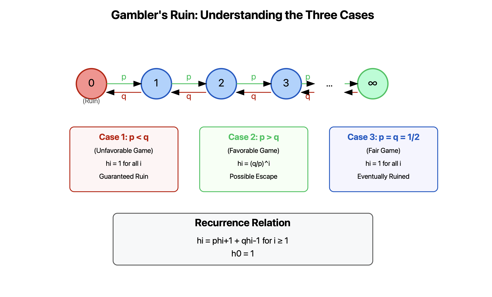

# The Gambler's Ruin Problem:

## Introduction to the Problem

The Gambler's Ruin is a classic probability problem that models a gambler playing against an infinitely wealthy casino. Let me break this down in detail.

### Basic Setup

- State space: $I = \{0, 1, 2, ...\}$
- $p$: probability of winning each bet (moving up one state)
- $q = 1-p$: probability of losing each bet (moving down one state)
- Initial state $i$: gambler's starting capital
- State 0: bankruptcy/ruin state

### Transition Probabilities

The Markov chain has the following transition probabilities:

- $p_{00} = 1$ (once broke, stay broke)
- $p_{i,i+1} = p$ for $i \geq 1$ (probability of winning)
- $p_{i,i-1} = q$ for $i \geq 1$ (probability of losing)

## Mathematical Analysis

### Hitting Probabilities

Let $h_i$ be the probability of eventually hitting state 0 (going broke) when starting from state $i$.

### System of Equations

We need to solve:

1. $h_0 = 1$ (boundary condition)
2. $h_i = ph_{i+1} + qh_{i-1}$ for $i \geq 1$ (recurrence relation)

### General Solution

When $p \neq q$, the solution has the form:
$h_i = A + B(\frac{q}{p})^i$

## Three Important Cases

### Case 1: $p < q$ (Unfavorable Game)

- Condition: Losing is more likely than winning
- Solution: $h_i = 1$ for all $i$
- Interpretation: The gambler will go broke with probability 1
- Mathematical reasoning:
  - $A + B = 1$ (from boundary condition)
  - Since $\frac{q}{p} > 1$, choose $A=1, B=0$ for minimality

### Case 2: $p > q$ (Favorable Game)

- Condition: Winning is more likely than losing
- Solution: $h_i = (\frac{q}{p})^i$
- Interpretation: There's a positive probability of never going broke
- Mathematical reasoning:
  - $A + B = 1$
  - $(\frac{q}{p})^i \to 0$ as $i \to \infty$
  - Choose $A=0, B=1$ for minimality

### Case 3: $p = q = \frac{1}{2}$ (Fair Game)

- Condition: Equal probability of winning and losing
- Solution: $h_i = 1$ for all $i$
- Interpretation: Even in a fair game, the gambler eventually goes broke
- Mathematical reasoning:
  - General solution: $h_i = A + Bi$
  - From $i=0$: $A=1$
  - Choose $B=0$ for minimality

## Important Insight

There's a beautiful multiplicative property in this problem:
$P_i(\text{hit }0) = P_i(\text{hit }i-1)P_{i-1}(\text{hit }i-2)...P_1(\text{hit }0)$

This works because:

1. The chain can only move one step at a time
2. The transition probabilities are the same at every positive level
3. Each term in the product equals the same value

## Applications Beyond Gambling

This model applies to many other situations:

- Population dynamics (birth-death processes)
- Random walks with absorption
- Queue lengths in service systems
- Particle diffusion models

The Gambler's Ruin thus serves as a fundamental template for understanding random processes with absorbing states and directional transitions.

# Deriving the Formulas

Let me add detailed derivations for the key formulas in this problem.

## Deriving the Recurrence Relation

Let's understand why $h_i = ph_{i+1} + qh_{i-1}$ for $i \geq 1$.

### Step-by-Step Derivation:

1. Starting from state $i$, the first step can be either:

   - Up to state $i+1$ with probability $p$
   - Down to state $i-1$ with probability $q$

2. By the law of total probability:
   $h_i = P(\text{hit 0 from }i)$
   $= P(\text{hit 0 from }i\text{ | first step to }i+1)P(\text{first step to }i+1)$
   $+ P(\text{hit 0 from }i\text{ | first step to }i-1)P(\text{first step to }i-1)$

3. Using the Markov property:

   - $P(\text{hit 0 from }i\text{ | first step to }i+1) = h_{i+1}$
   - $P(\text{hit 0 from }i\text{ | first step to }i-1) = h_{i-1}$

4. Therefore:
   $h_i = ph_{i+1} + qh_{i-1}$

## Solving the Recurrence Relation

### When $p \neq q$:

1. The recurrence $h_i = ph_{i+1} + qh_{i-1}$ can be rewritten as:
   $ph_{i+1} - h_i + qh_{i-1} = 0$

2. This is a second-order linear difference equation. Let's try a solution of the form $h_i = r^i$:
   $pr^{i+1} - r^i + qr^{i-1} = 0$
   $pr^2 - r + q = 0$

3. The characteristic equation $pr^2 - r + q = 0$ has roots:
   $r = 1$ and $r = \frac{q}{p}$

4. Therefore, the general solution is:
   $h_i = A + B(\frac{q}{p})^i$

### When $p = q = \frac{1}{2}$:

1. The characteristic equation becomes:
   $\frac{1}{2}r^2 - r + \frac{1}{2} = 0$
   $(r-1)^2 = 0$

2. This has a repeated root $r = 1$, leading to the general solution:
   $h_i = A + Bi$

## The Multiplicative Property

To understand why $P_i(\text{hit }0) = P_i(\text{hit }i-1)P_{i-1}(\text{hit }i-2)...P_1(\text{hit }0)$:

1. By the strong Markov property, after hitting each state $k$, the future behavior only depends on $k$.

2. For any states $j < i$:
   $P_i(\text{hit }j) = P_i(\text{hit }i-1)P_{i-1}(\text{hit }j)$

3. Applying this recursively:
   $h_i = P_i(\text{hit }0)$
   $= P_i(\text{hit }i-1)P_{i-1}(\text{hit }i-2)...P_1(\text{hit }0)$

4. Since transition probabilities are the same at every positive level:
   $P_k(\text{hit }k-1) = \text{constant}$ for all $k \geq 1$

5. Therefore:
   $h_i = \alpha^i$ for some constant $\alpha$

This gives us another way to understand why the solution should have the form we found.

