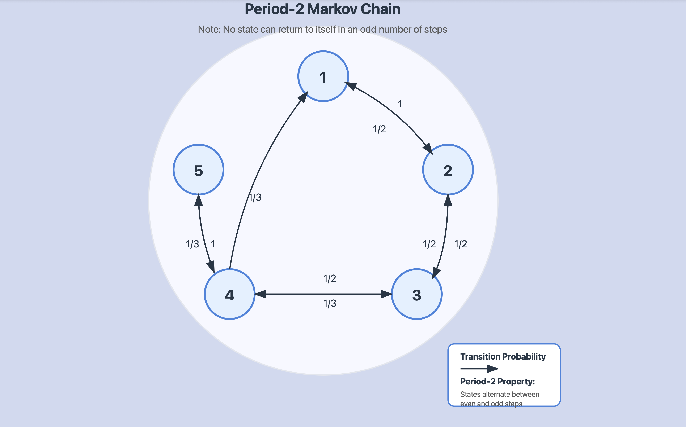

# Periodicity in Markov Chains:

## 1. Basic Concept of Period

The period of a state in a Markov chain captures a fundamental rhythmic property of the chain's behavior. Let me explain this through intuition and formal definitions.

### 1.1 Formal Definition

For a state $i \in I$, the period of state $i$ is defined as:
$$d(i) = \gcd\{n \geq 1: p_{ii}^{(n)} > 0\}$$
where $p_{ii}^{(n)}$ is the probability of returning to state $i$ after exactly $n$ steps.

### 1.2 Intuitive Understanding

Think of the period as the "rhythm" at which a state can be revisited:

- If a state has period $d$, you can only return to it in steps of $d$ or multiples of $d$
- The period is the greatest common divisor of all possible return times
- If $p_{ii}^{(n)} = 0$ for all $n > 0$, the period is undefined (state cannot be revisited)

## 2. Types of Periodicity

### 2.1 Aperiodic States

A state $i$ is aperiodic if its period is 1. This means:

- No forced "rhythm" in returns
- Can return in any sufficiently large number of steps
- Mathematically: $p_{ii}^{(n)} > 0$ for all sufficiently large $n$

### 2.2 Periodic States

A state is periodic if its period is greater than 1. This means:

- Returns must follow a strict pattern
- Can only return in steps that are multiples of the period
- Example: In a period-2 chain, returns only possible in even steps

## 3. Important Properties and Theorems

### 3.1 Class Property

All states in a communicating class have the same period. This means:

- If $i \leftrightarrow j$, then $d(i) = d(j)$
- Period is a class property, not just a state property
- Can talk about the period of an entire communicating class

### 3.2 Period-2 Example

Consider the matrix:

$$
P = \begin{pmatrix}
0 & 1 & 0 & 0 & 0 \\
\frac{1}{2} & 0 & \frac{1}{2} & 0 & 0 \\
0 & \frac{1}{2} & 0 & \frac{1}{2} & 0 \\
\frac{1}{3} & 0 & \frac{1}{3} & 0 & \frac{1}{3} \\
0 & 0 & 0 & 1 & 0
\end{pmatrix}
$$

Key observations:

- $p_{ii}^{(n)} = 0$ for all odd $n$
- Returns only possible in even number of steps
- All states have period 2

First, let's think about what $p_{ii}^{(n)}$ means: it's the probability of returning to state $i$ after exactly $n$ steps. To show this is zero for odd $n$, we'll use a crucial insight about the structure of the chain. Consider how we can return to any state i. Let's analyze the possible paths:

**From any state, look at where we can go in one step:**

- State 1 can only go to State $2$
- State 2 can go to States $1$ or $3$
- State 3 can go to States $2$ or $4$
- State 4 can go to States $1, 3, or 5$
- State 5 can only go to State $4$

**Now, let's think about the minimum number of steps to return:**

- From State 1: Must go $1→2→1$ (2 steps)
- From State 2: Must go $2→1→2$ or $2→3→2$ (2 steps)
- From State 3: Must go $3→2→3$ or $3→4→3$ (2 steps)
- From State 4: Must go $→(1,3,5)→4$ (2 steps)
- From State 5: Must go $5→4→5$ (2 steps)

**The key insight is that to return to any state i:**

- We must take an even number of steps
- Every return path requires moving to a different state and then coming back
- There are no self-loops (no $p_{ii} > 0$)
- All possible return paths involve sequences of length $2, 4, 6,$ etc.

**Therefore:**

For any odd number of steps n, $p_{ii}^{(n)} = 0$ because:

- We cannot stay in place (no self-loops)
- Every return path requires an even number of steps
- We cannot construct a return path of odd length

To verify this mathematically, we could also look at the powers of the transition matrix $P$. For odd $n$, the diagonal elements of $P^n$ will all be zero because of this structural property.

This is why we say this chain has period 2 - any return to a state must occur in an even number of steps.

## 4. Things to Remember

1. **Period Definition**: GCD of possible return times

2. **Common Periods**:

   - Period 1: Aperiodic (most flexible)
   - Period 2: Common in symmetric chains
   - Period n: Must wait n steps between possible returns

3. **Important Facts**:

   - Period is a class property
   - Absorbing states always have period 1
   - Undefined period means state cannot be revisited

4. **Checking for Periodicity**:
   - Look for patterns in transition matrix
   - Check possible return paths
   - Find all possible return times

## 5. Example Analysis

From the lecture notes' Example 5.5:

- States 1, 2, 3 have period 3
- State 4's period is undefined
- States 5, 6 have period 2
- State 7 (absorbing) has period 1

This shows how different periods can exist within the same chain but are consistent within communicating classes.
