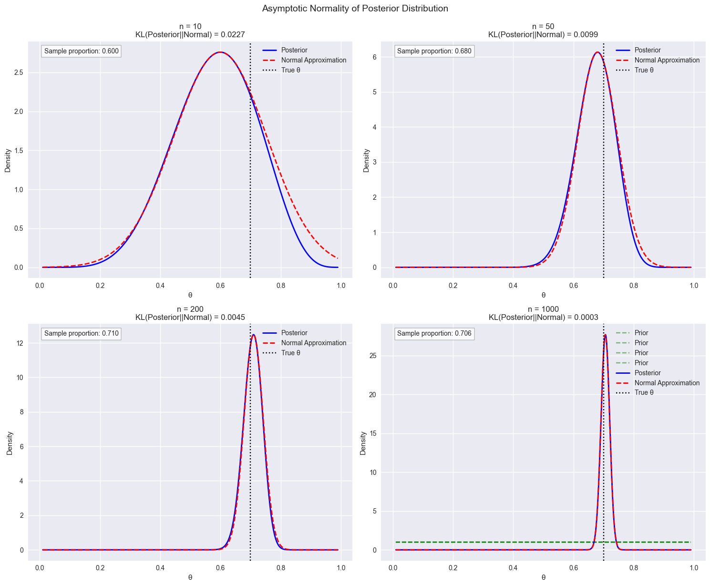

# Asymptotic Normality of Posterior Distributions

When we have a lot of data, something remarkable happens with Bayesian inference - the posterior distribution starts looking more and more like a normal distribution, regardless of what prior we started with. This is not just a mathematical curiosity; it's a deep result that connects Bayesian and frequentist approaches.

## Starting Point: The Log Posterior

The log posterior density can be written as:

$$\tilde{l}(θ) = constant + log π(θ) + ∑(log f(xᵢ|θ))$$

Let's understand why each term matters:

1. The constant term doesn't depend on $θ$
2. $log π(θ)$ represents our prior beliefs
3. $∑(log f(xᵢ|θ))$ is the log-likelihood from our data

### Key Insight: Sample Size Effect

As sample size ($n$) grows, the likelihood term becomes increasingly dominant because it's a sum of n terms, while the prior contribution remains fixed. This is why we often say "the data overwhelms the prior" with large samples.

## The Taylor Expansion Approach

Around the posterior mode ̃θ, we can approximate the log posterior using a Taylor series:

$$
\tilde{l}(θ) ≈ \tilde{l}(\tilde{θ}) + (θ - \tilde{θ})\tilde{l}'(\tilde{θ}) + ½(θ - \tilde{θ})²\tilde{l}''(\tilde{θ})
$$

Let's break down why this works:

1. $\tilde{θ}$ is the mode, so$\tilde{l}'(\tilde{\theta}) = 0$ (first derivative is zero at maximum)
2. $\tilde{l}''(\tilde{θ})$ is negative (second derivative at maximum)
3. Higher-order terms become negligible

## The Normal Approximation

After exponentiating, we get:

$$
π(θ|x) \approx exp(- \frac{1}{2}(θ - \tilde{θ})^2\tilde{J}(\tilde{θ}))
$$

This is exactly the kernel of a normal distribution with:

- Mean $= \tilde{θ}$ (posterior mode)
- Variance $= 1/\tilde{J}(\tilde{θ})$ (inverse of observed information)

Let's visualize this with Python:

## Practical Implications

### 1. Connection to Frequentist Methods

The asymptotic normality helps explain why Bayesian and frequentist methods often give similar results with large samples:

- Frequentist confidence intervals: $\hat{θ} ± 1.96/√(J{\hat{θ}})$
- Bayesian credible intervals: $\hat{θ} ± 1.96/√(J(\hat{θ}))$

### 2. Computational Advantages

This approximation is valuable for:

- Quick posterior summaries without MCMC
- Initial values for more complex algorithms
- Approximating marginal distributions in high dimensions

### 3. Important Caveats

Remember that:

- The approximation requires sufficient sample size
- It works best for well-behaved likelihoods
- The parameter space should be continuous and unbounded
- The true parameter should not be near boundaries

## Practical Tips for Using the Normal Approximation

1. **Verify Sample Size Adequacy**:

   - Plot the posterior against the normal approximation
   - Check if the likelihood dominates the prior
   - Consider parameter transformations if needed

2. **Check Assumptions**:

   - Ensure parameter space is appropriate
   - Verify posterior mode is interior point
   - Check for multimodality

3. **Use Appropriate Parameterization**:
   - Consider transformations for bounded parameters
   - Use log transforms for positive parameters
   - Apply logit transforms for probabilities

## The Bernstein-von Mises Theorem

This theorem tells us that under certain conditions, as the sample size grows large:

- The posterior distribution converges to a normal distribution
- The influence of the prior distribution diminishes
- The posterior mean approaches the maximum likelihood estimate
