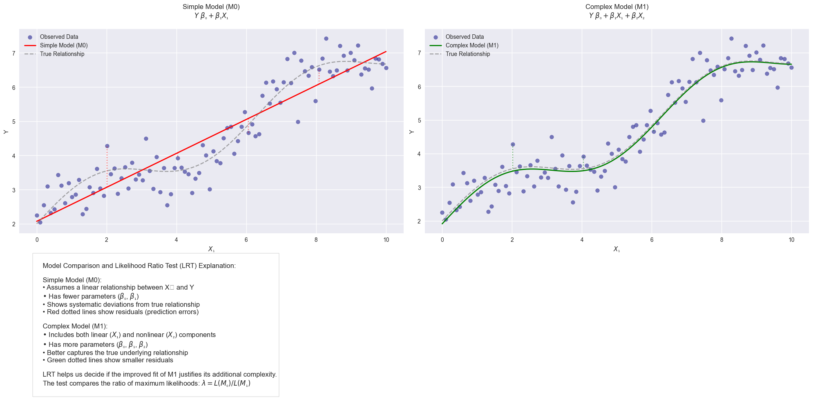
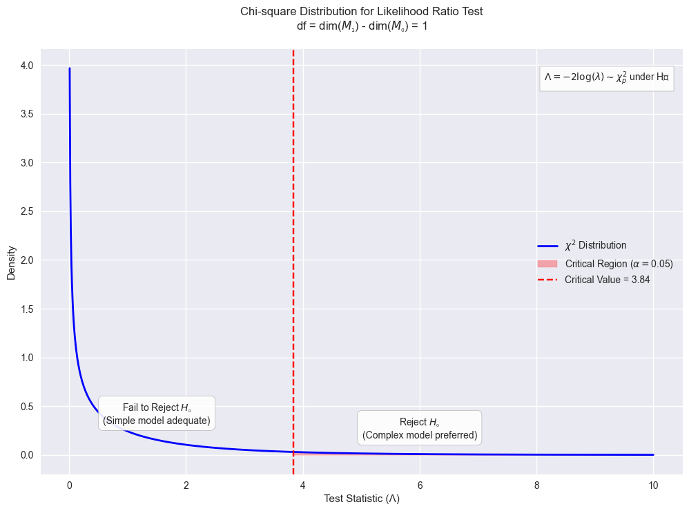
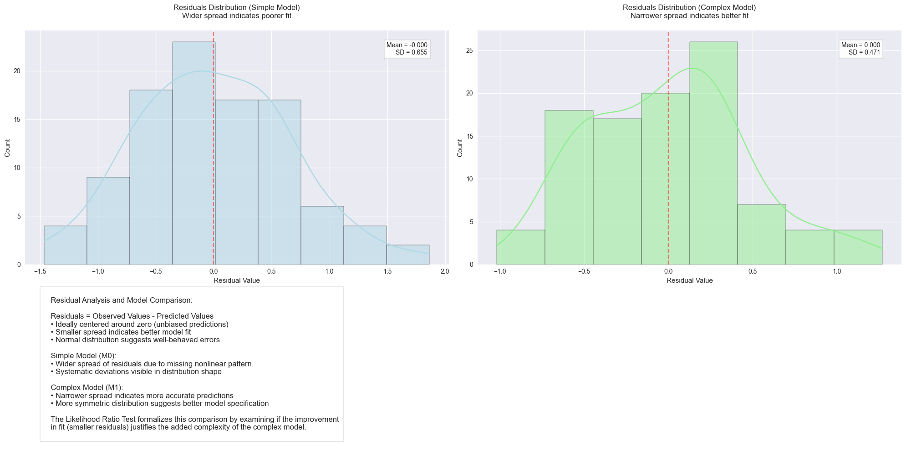
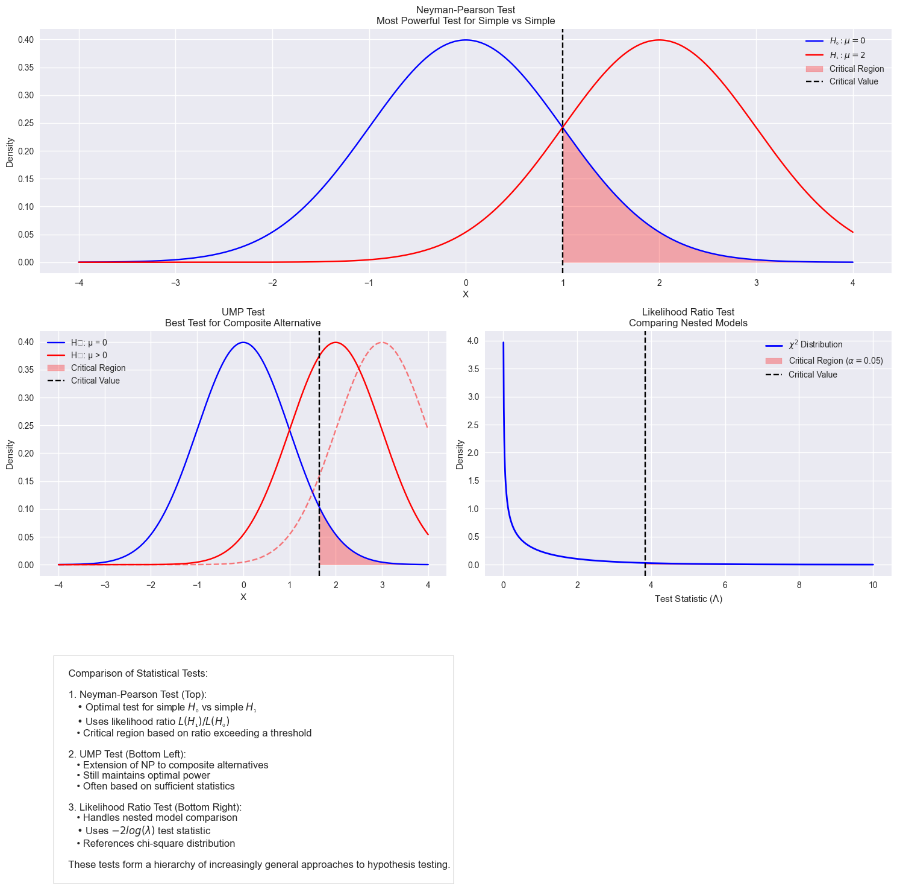
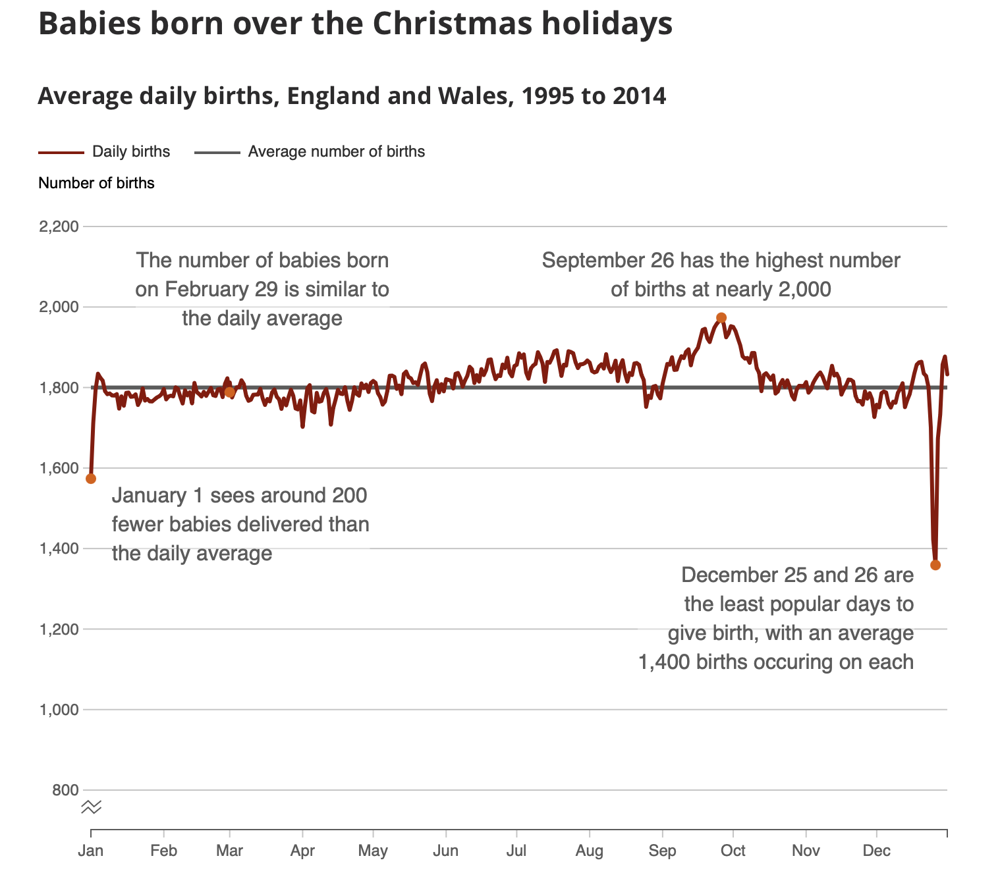
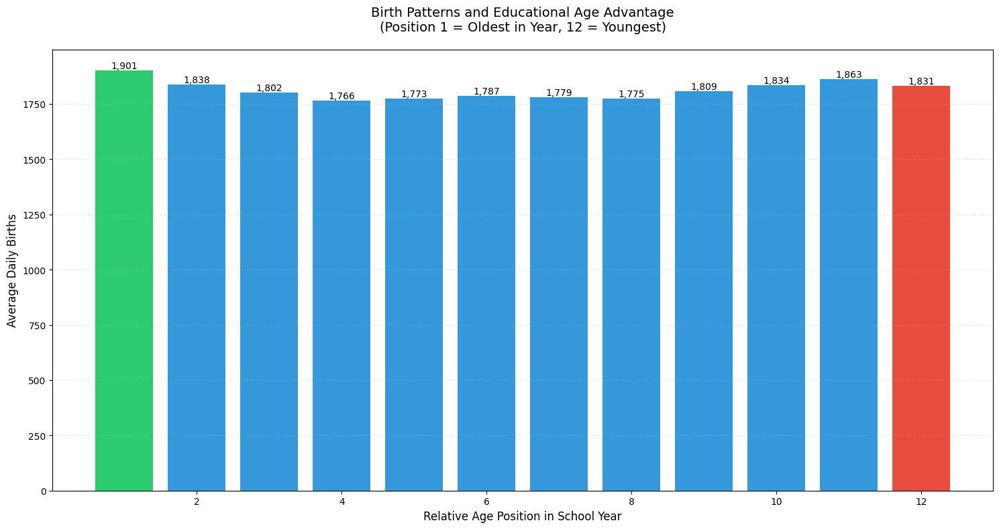
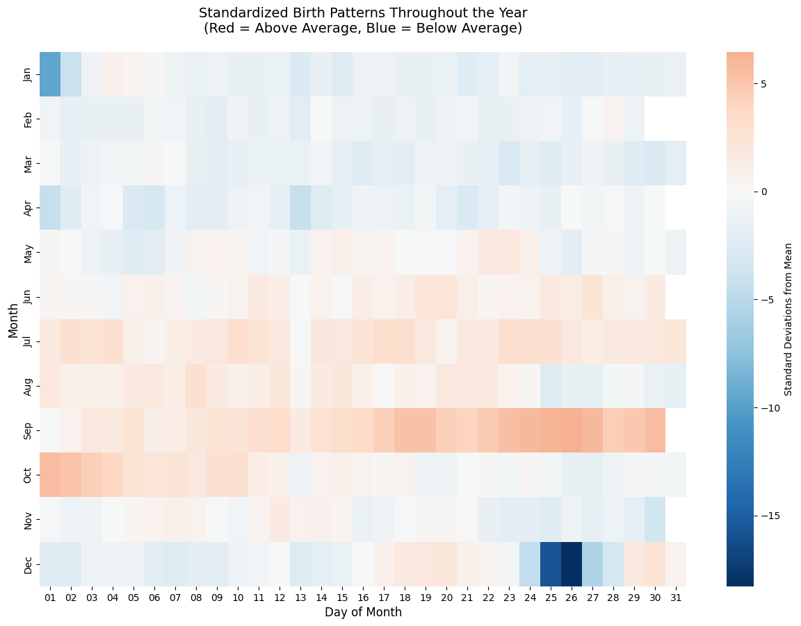

# Likelihood Ratio Tests:

## 1. Fundamental Concepts

### 1.1 The Core Idea

The Likelihood Ratio Test (LRT) is based on comparing two competing models where one model is a special case of the other. Mathematically, we have:

$H_0: \theta \in \Theta_0$ (null hypothesis)
$H_1: \theta \in \Theta$ (alternative hypothesis)

where $\Theta_0 \subset \Theta$

The likelihood ratio $\lambda(x)$ is defined as:

$$\lambda(x) = \frac{\sup_{\theta \in \Theta_0} L(\theta;x)}{\sup_{\theta \in \Theta} L(\theta;x)}$$

### 1.2 Intuitive Understanding

Think of model comparison as trying different lenses to view data:

- $\Theta_0$ is like looking through a basic lens (restricted view)
- $\Theta$ is like looking through an advanced lens (broader view)

The ratio $\lambda(x)$ tells us how much clarity we gain by using the advanced lens:

- $\lambda(x) \approx 1$: Basic lens is nearly as good
- $\lambda(x) \approx 0$: Advanced lens shows much more detail

## 2. Detailed Examples

### 2.1 Normal Distribution Mean Testing

Let's work through a complete example testing a normal distribution's mean.

**Problem Setup:**
Given $X_1, ..., X_n \stackrel{iid}{\sim} N(\mu, \sigma^2)$, test:
$H_0: \mu = \mu_0$ vs $H_1: \mu \in \mathbb{R}$ (with unknown $\sigma^2$)

**Step 1: Write the Likelihood Function**
$$L(\mu, \sigma^2) = (2\pi\sigma^2)^{-n/2}\exp\left[-\frac{1}{2\sigma^2}\sum(x_i-\mu)^2\right]$$

**Step 2: Find Maximum Under $H_0$**

- Fix $\mu = \mu_0$
- Maximize over $\sigma^2$:
  $$\hat{\sigma}_0^2 = \frac{1}{n}\sum(x_i-\mu_0)^2$$

**Step 3: Find Maximum Under $H_1$**

- Maximize over both $\mu$ and $\sigma^2$:
  $$\hat{\mu} = \bar{x}$$
  $$\hat{\sigma}^2 = \frac{1}{n}\sum(x_i-\bar{x})^2$$

**Step 4: Form Likelihood Ratio**
After simplification:
$$\lambda(x) = \left[1 + \frac{n(\bar{x}-\mu_0)^2}{\sum(x_i-\bar{x})^2}\right]^{-n/2}$$

### 2.2 Exponential Distribution Testing

Let's look at another example with exponential distributions.

**Problem Setup:**
Given $X_1, ..., X_n \stackrel{iid}{\sim} Exp(\theta)$, test:
$H_0: \theta = \theta_0$ vs $H_1: \theta > 0$

**Solution:**
The likelihood function is:
$$L(\theta) = \theta^n\exp\left(-\theta\sum_{i=1}^n x_i\right)$$

Under $H_0$: $L(\theta_0) = \theta_0^n\exp\left(-\theta_0\sum x_i\right)$

Under $H_1$: Maximum occurs at $\hat{\theta} = \frac{n}{\sum x_i}$

Therefore:
$$\lambda(x) = \left(\frac{\theta_0}{\hat{\theta}}\right)^n\exp\{n(1-\frac{\theta_0}{\hat{\theta}})\}$$

## 3. The Likelihood Ratio Statistic

### 3.1 Mathematical Theory

The likelihood ratio statistic is defined as:
$$\Lambda(X) = -2\log\lambda(X)$$

Under regularity conditions and $H_0$ true:
$$\Lambda(X) \stackrel{D}{\rightarrow} \chi^2_p$$

where $p = \dim(\Theta) - \dim(\Theta_0)$

### 3.2 Asymptotic Theory Explained

The convergence to chi-square distribution occurs because:

1. Under regularity conditions:
   $$\hat{\theta} \stackrel{approx}{\sim} N(\theta_0, [I(\theta_0)]^{-1})$$

2. Then:
   $$(\hat{\theta}-\theta_0)^2I(\theta_0) \stackrel{D}{\rightarrow} \chi^2_1$$

3. For vector parameters:
   $$(\hat{\theta}-\theta_0)^TI(\theta_0)(\hat{\theta}-\theta_0) \stackrel{D}{\rightarrow} \chi^2_p$$

## 4. Practical Applications

### 4.1 Model Selection Example

Let's start by understanding what we're comparing:

**Simple Model (M0):**

$Y = \beta_0 + \beta_1X_1 + \epsilon$ where $\epsilon \sim N(0, \sigma^2)$

**Complex Model (M1):**

$Y = \beta_0 + \beta_1X_1 + \beta_2X_2 + \epsilon$ where $\epsilon \sim N(0, \sigma^2)$

Think of this like comparing two theories:

- M0 says: "Y can be explained by just $X₁$"
- M1 says: "Y needs both $X₁$ and $X₂$ for better explanation"

The likelihood ratio test statistic is:
$$\Lambda = n\log\left(\frac{RSS_0}{RSS_1}\right)$$

where:

- RSS₀ = Residual Sum of Squares for M0 = $\sum(y_i - \hat{y}_i^{(0)})^2$
- RSS₁ = Residual Sum of Squares for M1 = $\sum(y_i - \hat{y}_i^{(1)})^2$
- n = sample size

Here's the key part about choosing critical regions:

Under H₀ (when the simple model is adequate):
$$\Lambda \sim \chi^2_p$$
where $p =$ difference in number of parameters $= 1$ in this case
($M1$ has one more parameter, $β₂$, than $M0$)

Choose $α$ (typically $0.05$ or $0.01$)

Find $c$ where $P(χ²₁ > c) = α$

Reject $H₀$ (choose complex model) if $Λ > c$

Let's work through a concrete example:

#### Practical Example

Suppose we have data:

```python
# Sample data
X1 = [1, 2, 3, 4, 5]
X2 = [2, 4, 5, 4, 5]
Y = [2.1, 4.3, 6.8, 8.2, 9.7]

# Calculate RSS for both models
RSS0 = 2.3  # From simple model
RSS1 = 1.8  # From complex model
n = 5

# Calculate test statistic
Lambda = n * log(RSS0/RSS1)
# Lambda = 5 * log(2.3/1.8) = 1.21
```

**Decision Process:**

- At $α = 0.05$, critical value from $χ²_1$ is $3.84$
- Since $1.21 < 3.84$, we fail to reject $H₀$
- Conclusion: Simple model is adequate

#### Important Considerations

**Why We Use This Approach**

- $RSS₁$ will always be $≤ RSS₀$ (complex model always fits at least as well)

- But we "penalize" complexity through the distribution's degrees of freedom

- Balance between fit and simplicity

**Power of the Test**

- The critical region also relates to the test's power:

- Larger $α →$ Larger critical region $→$ More likely to choose complex model

- Smaller $α →$ Smaller critical region $→$ More conservative about complexity

**Sample Size Effects**

- Large $n:$ Test becomes more sensitive to small differences

- Small $n:$ Need larger RSS differences to reject $H₀$

### 4.2 Genetic Testing Example

In genetic association studies:

$H_0$: No association between genetic variant and trait
$H_1$: Association exists

The LRT compares:
$$\lambda = \frac{L(\text{null model})}{L(\text{genetic model})}$$

## 5. Implementation Tips

1. **Numerical Stability**

   - Work with log-likelihoods when possible
   - Use algebraic simplifications before computation
   - Watch for underflow/overflow in exponentials

2. **Sample Size Considerations**

   - Small samples: Use exact distributions or simulation
   - Large samples: Chi-square approximation is reliable
   - Rule of thumb: n > 30p for p parameters

3. **Model Checking**
   - Verify regularity conditions
   - Check parameter identifiability
   - Assess model assumptions







---



---

# Analysis of Birth Month Distribution in Cambridge and Oxford Admissions

## Question Definition

We aim to determine whether the birth month distribution of students admitted to Cambridge and Oxford follows the general population trend. Specifically, we test the hypothesis that the admissions distribution aligns with average birth rates in the population.

### Data Provided

#### 1. General Population Birth Data

The average births per month in the general population are:

| Month | Average Births |
| ----- | -------------- |
| Sep   | 1901           |
| Oct   | 1838           |
| Nov   | 1802           |
| Dec   | 1766           |
| Jan   | 1773           |
| Feb   | 1787           |
| Mar   | 1779           |
| Apr   | 1775           |
| May   | 1809           |
| Jun   | 1834           |
| Jul   | 1863           |
| Aug   | 1831           |

#### 2. Observed Admissions Data (Cambridge & Oxford)

The observed number of admissions for each birth month is:

| Month | Admissions |
| ----- | ---------- |
| Sep   | 470        |
| Oct   | 515        |
| Nov   | 470        |
| Dec   | 457        |
| Jan   | 473        |
| Feb   | 381        |
| Mar   | 466        |
| Apr   | 457        |
| May   | 437        |
| Jun   | 396        |
| Jul   | 384        |
| Aug   | 394        |

## Hypotheses

### Null Hypothesis (\$H_0\$)

The admissions distribution follows the population birth distribution:
\$\$
\tilde{p}\_i = \frac{\text{Average Births}\_i}{\text{Total Average Births}} $$

### Alternative Hypothesis ($H_1$)

The admissions distribution does not follow the population birth distribution, i.e., there is a significant deviation.

## Methodology

We use the **Generalized Likelihood Ratio Test (GLRT)** to test the hypotheses.

### Why GLRT Instead of Chi-Squared Test?

1. **Precision of GLRT**: The GLRT directly compares the likelihoods under the null hypothesis ($$H_0$$) and the alternative hypothesis ($$H_1$$).
2. **Flexibility**: The GLRT allows for maximization of the likelihood under $$H_1$$ without assuming fixed probabilities, making it ideal for this type of problem.
3. **Chi-Squared Test Limitation**: While simpler, the chi-squared test assumes that deviations are squared and scaled by the expected values, which can lose nuance in cases where probabilities vary significantly.

### Derivation of GLRT Test Statistic Using Lagrange Multipliers

#### Likelihood Function Under $$H_1$$

Under $H_1$, the likelihood is:
$$ L(p*1, \dots, p_k) = \prod*{i=1}^{k} p_i^{n_i} $$
where $n_i$ are the observed counts for each category and $$p_i$$ are the probabilities to be estimated.

The log-likelihood is:
$$ \ell(p*1, \dots, p_k) = \sum*{i=1}^{k} n_i \log(p_i). $$

To maximize this subject to the constraint $\sum_{i=1}^{k} p_i = 1$, we use the Lagrange multiplier method. Define the Lagrangian:
$$ \mathcal{L}(p*1, \dots, p_k, \lambda) = \sum*{i=1}^{k} n*i \log(p_i) + \lambda \left( 1 - \sum*{i=1}^{k} p_i \right). $$

Differentiating with respect to $p_i$ and $\lambda$:

$$
\begin{align*}
\frac{\partial \mathcal{L}}{\partial p_i} &= \frac{n_i}{p_i} - \lambda = 0 \\
\frac{\partial \mathcal{L}}{\partial \lambda} &= 1 - \sum*{i=1}^{k} p_i = 0.
\end{align*}
$$

Solving for $p_i$, we find:
$$ \hat{p}_i = \frac{n_i}{n}, $$
where $n = \sum_{i=1}^{k} n_i$ is the total observed count.

#### Likelihood Under $$H_0$$

Under $H_0$, the probabilities $p_i$ are fixed as $\tilde{p}_i$, so the likelihood is:
$$ L(\tilde{p}_1, \dots, \tilde{p}\_k) = \prod_{i=1}^{k} \tilde{p}\_i^{n_i}. $$

The log-likelihood is:
$$ \ell(\tilde{p}_1, \dots, \tilde{p}\_k) = \sum_{i=1}^{k} n_i \log(\tilde{p}\_i). $$

#### GLRT Statistic

The GLRT statistic is:
$$ 2 \log \Lambda = 2 \left( \ell(\hat{p}\_1, \dots, \hat{p}\_k) - \ell(\tilde{p}\_1, \dots, \tilde{p}\_k) \right). $$

Substituting the maximum likelihood estimates under $H_1$ and the fixed probabilities under $H_0$:
$$ 2 \log \Lambda = 2 \sum*{i=1}^{k} n_i \log \left( \frac{n_i / n}{\tilde{p}\_i} \right) = 2 \sum*{i=1}^{k} n_i \log \left( \frac{n_i}{e_i} \right), $$
where $e_i = n \tilde{p}_i$ are the expected counts under $H_0$.

### GLRT Test Statistic

The GLRT statistic is given by:
$$ 2 \log \Lambda = 2 \sum\_{i=1}^{k} n_i \log \left( \frac{n_i}{e_i} \right) $$
where:

- $n_i$: Observed admissions for month $$i$$
- $e_i = n \tilde{p}_i$: Expected admissions for month $i$ under $H_0$
- $n = \sum_{i=1}^{k} n_i$: Total observed admissions

The statistic follows a chi-squared distribution with $k - 1$ degrees of freedom under $H_0$.

## Results

### 1. Probabilities Under $$H_0$$

Using the general population birth data:

| Month | $\tilde{p}_i$ (H0 Probability) |
| ----- | ------------------------------ |
| Sep   | 0.0842                         |
| Oct   | 0.0816                         |
| Nov   | 0.0801                         |
| Dec   | 0.0785                         |
| Jan   | 0.0789                         |
| Feb   | 0.0795                         |
| Mar   | 0.0793                         |
| Apr   | 0.0792                         |
| May   | 0.0807                         |
| Jun   | 0.0814                         |
| Jul   | 0.0827                         |
| Aug   | 0.0814                         |

### 2. Observed vs. Expected Counts

| Month | Observed Counts | Expected Counts | Difference (Observed - Expected) |
| ----- | --------------- | --------------- | -------------------------------- |
| Sep   | 470             | 463.06          | 6.94                             |
| Oct   | 515             | 447.72          | 67.28                            |
| Nov   | 470             | 438.95          | 31.05                            |
| Dec   | 457             | 430.18          | 26.82                            |
| Jan   | 473             | 431.88          | 41.12                            |
| Feb   | 381             | 438.04          | -57.04                           |
| Mar   | 466             | 437.19          | 28.81                            |
| Apr   | 457             | 436.38          | 20.62                            |
| May   | 437             | 444.49          | -7.49                            |
| Jun   | 396             | 450.80          | -54.80                           |
| Jul   | 384             | 459.11          | -75.11                           |
| Aug   | 394             | 457.92          | -63.92                           |

### 3. GLRT Statistic

Using the formula for $2 \log \Lambda$, we compute:
$$ 2 \log \Lambda = 51.85 $$

### 4. Degrees of Freedom

Degrees of freedom: $k - 1 = 12 - 1 = 11$

### 5. Critical Value and $p$-Value

- Critical value for $\chi^2_{11}(\alpha = 0.05)$: $19.68$
- $p-value: $2.9 \times 10^{-7}$

### Conclusion

Since the GLRT statistic ($51.85$) is significantly larger than the critical value ($19.68$), and the $p$-value is much smaller than 0.05, we reject the null hypothesis $H_0$. This indicates that the distribution of admissions by birth month at Cambridge and Oxford significantly deviates from the general population trend.

## Discussion

The results suggest that the admissions process is influenced by factors beyond population birth trends. Possible reasons include:

1. **Educational System Bias**:

   - Older students (e.g., September-born) may have cognitive and emotional advantages, leading to better academic performance and overrepresentation.
   - Younger students (e.g., August-born) may face relative disadvantages in standardized testing and assessments.

2. **Selection Bias in Admissions**:

   - Cambridge and Oxford's emphasis on academic excellence and extracurricular achievements may favor older students who are more mature and experienced.

3. **Socioeconomic Factors**:

   - Families of older students may have higher socioeconomic status, providing access to resources like private tutoring and better schooling.

4. **Policy Implications**:
   - These findings highlight the need to address systemic biases in education and admissions processes to ensure fairness for younger students in a cohort.

## Final Thoughts

This analysis reveals a subtle but statistically significant pattern in Cambridge and Oxford admissions. It underscores the importance of understanding how systemic factors, such as the relative age effect, can influence educational outcomes and equity. Further studies could explore interventions to mitigate these biases and promote fairness in highly competitive academic institutions.






