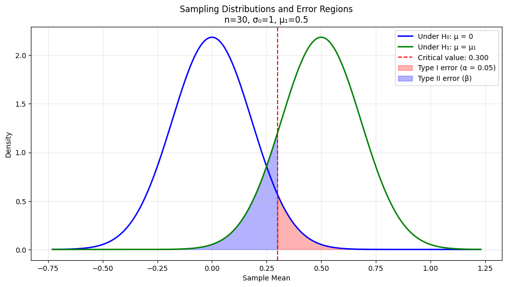
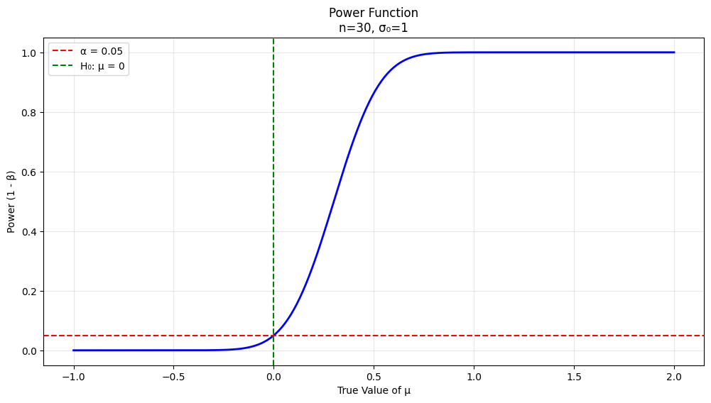
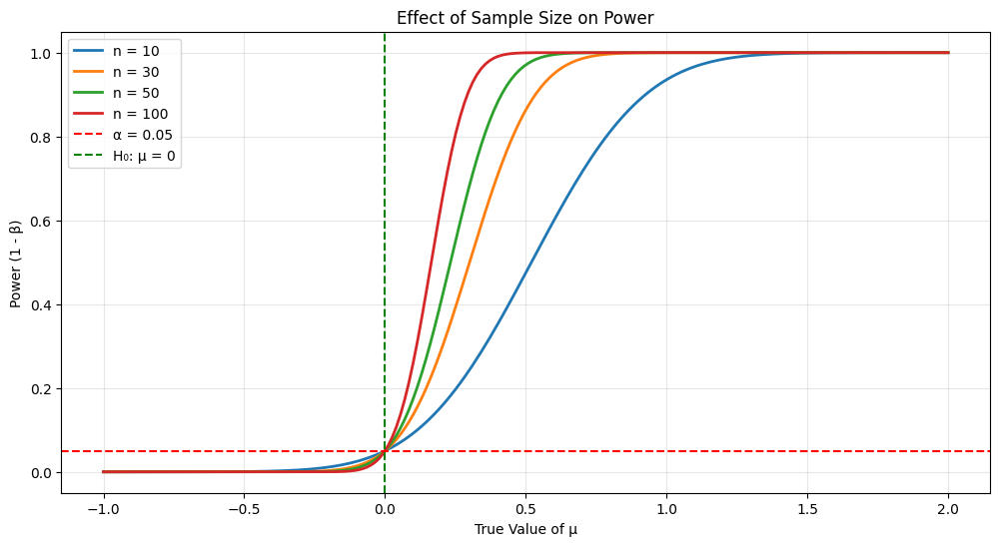
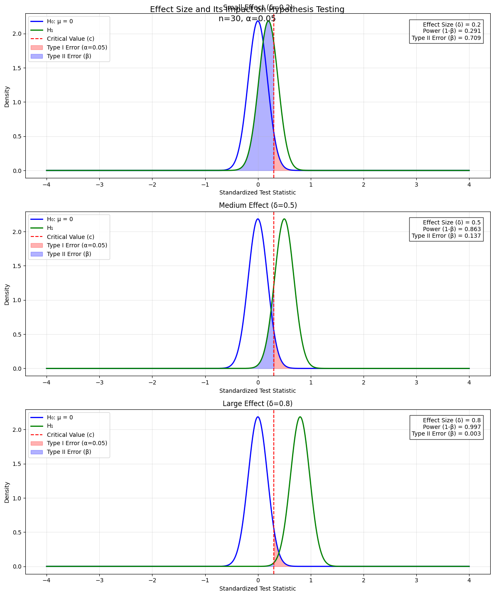
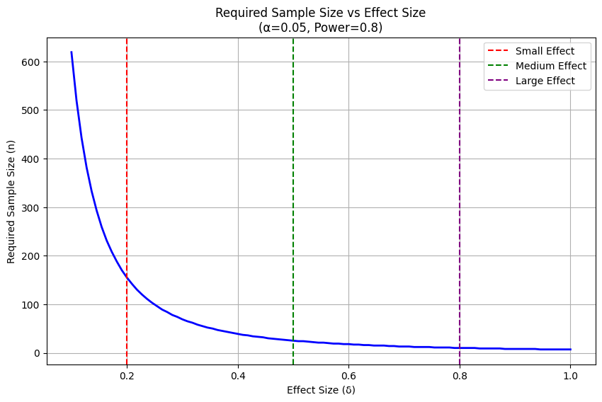

# Neyman-Pearson Lemma and Hypothesis Testing

## 1. Fundamental Concepts and Setup

### Statistical Hypothesis Testing

Before diving into the Neyman-Pearson lemma, let's understand what we're trying to achieve in hypothesis testing. We want to make decisions about populations based on sample data, while controlling our errors in a systematic way.

A statistical test involves two hypotheses:

- **Null hypothesis** ($H_0$): The default position, typically representing "no effect" or "no difference"
- **Alternative hypothesis** ($H_1$): The competing claim we're considering

### Types of Hypotheses

We need to distinguish between:

1. **Simple hypothesis**: Specifies a single value for the parameter
   - Example: $H_0: \mu = 0$ or $H_1: \mu = 2$
2. **Composite hypothesis**: Specifies a range of values
   - Example: $H_1: \mu > 0$ or $H_1: \mu \neq 0$

### Error Types

Two types of errors can occur in hypothesis testing:

1. **Type I Error** (False Positive):

   - Rejecting $H_0$ when it's actually true
   - Probability denoted by $\alpha$ (significance level)
   - $\alpha = P(\text{Reject } H_0|H_0 \text{ true})$

2. **Type II Error** (False Negative):
   - Failing to reject $H_0$ when it's actually false
   - Probability denoted by $\beta$
   - $\beta = P(\text{Fail to reject } H_0|H_1 \text{ true})$

The **power** of a test is $1-\beta$, representing the probability of correctly rejecting a false null hypothesis.

## 2. The Neyman-Pearson Lemma

### Formal Statement

For testing simple hypotheses:
$H_0: \theta = \theta_0$ versus $H_1: \theta = \theta_1$

The most powerful test of size $\alpha$ has a critical region:
$C = \{x: \frac{L(\theta_0; x)}{L(\theta_1; x)} \leq k\}$

where:

- $L(\theta; x)$ is the likelihood function
- $k$ is chosen so that $P(X \in C|H_0) = \alpha$

### Intuitive Understanding

The lemma tells us to:

1. Look at the ratio of likelihoods under both hypotheses
2. Reject $H_0$ when this ratio is small enough
3. Choose the threshold to maintain the desired significance level

This is intuitive because:

- If the likelihood ratio is small, the data is more consistent with $H_1$ than $H_0$
- This gives us the best possible power for a given significance level

## 3. Detailed Example: Normal Distribution

Let's solve this hypothesis testing problem step by step, with detailed derivations and visualizations. We'll create a complete understanding of how the Neyman-Pearson lemma leads us to the optimal test.

We have:

- Independent samples $X_1,...,X_n \sim N(\mu, \sigma^2_0)$ where $\sigma^2_0$ is known
- Testing $H_0: \mu = 0$ vs $H_1: \mu = \mu_1$ (where $\mu_1 > 0$)
- Desired significance level $\alpha$

### 1. Writing the Full Likelihood Functions

For a normal distribution, the likelihood function for any $\mu$ is:

$L(\mu; x) = (2\pi\sigma^2_0)^{-n/2}\exp[-\frac{1}{2\sigma^2_0}\sum_{i=1}^n(x_i-\mu)^2]$

Therefore:

- Under $H_0$ ($\mu = 0$): $L(0; x) = (2\pi\sigma^2_0)^{-n/2}\exp[-\frac{1}{2\sigma^2_0}\sum_{i=1}^n x_i^2]$
- Under $H_1$ ($\mu = \mu_1$): $L(\mu_1; x) = (2\pi\sigma^2_0)^{-n/2}\exp[-\frac{1}{2\sigma^2_0}\sum_{i=1}^n(x_i-\mu_1)^2]$

### 2. Forming the Likelihood Ratio

$\frac{L(0;x)}{L(\mu_1;x)} = \exp[-\frac{1}{2\sigma^2_0}(\sum_{i=1}^n x_i^2 - \sum_{i=1}^n(x_i-\mu_1)^2)]$

### 3. Expanding the Squared Terms

$\sum_{i=1}^n(x_i-\mu_1)^2 = \sum_{i=1}^n(x_i^2 - 2\mu_1x_i + \mu_1^2)$
$= \sum_{i=1}^n x_i^2 - 2\mu_1\sum_{i=1}^n x_i + n\mu_1^2$

### 4. Substituting Back

$\frac{L(0;x)}{L(\mu_1;x)} = \exp[-\frac{1}{2\sigma^2_0}(\sum_{i=1}^n x_i^2 - (\sum_{i=1}^n x_i^2 - 2\mu_1\sum_{i=1}^n x_i + n\mu_1^2))]$
$= \exp[-\frac{1}{2\sigma^2_0}(2\mu_1\sum_{i=1}^n x_i - n\mu_1^2)]$

### 5. Using Sample Mean

Note that $\sum_{i=1}^n x_i = n\bar{x}$, so:

$\frac{L(0;x)}{L(\mu_1;x)} = \exp[-\frac{1}{2\sigma^2_0}(2\mu_1n\bar{x} - n\mu_1^2)]$

### 6. Critical Region

By the Neyman-Pearson lemma, we reject $H_0$ when $\frac{L(0;x)}{L(\mu_1;x)} \leq k$ for some $k$.

Taking logarithms:
$-\frac{1}{2\sigma^2_0}(2\mu_1n\bar{x} - n\mu_1^2) \leq \log(k)$

Solving for $\bar{x}$:
$\bar{x} \geq \frac{\sigma^2_0\log(k)}{n\mu_1} + \frac{\mu_1}{2}$

Let's call the right-hand side $c$. We reject $H_0$ when $\bar{x} > c$.

### 7. Finding the Critical Value

Under $H_0$, $\bar{X} \sim N(0, \sigma^2_0/n)$. Therefore:

$\alpha = P(\bar{X} > c|H_0) = P(Z > \frac{c}{\sigma_0/\sqrt{n}})$

where $Z$ is standard normal. Thus:
$c = z_\alpha\frac{\sigma_0}{\sqrt{n}}$

### Key Insights

1. **Sample Size Effect**:

   - Larger $n$ makes the distributions narrower
   - This reduces overlap between $H_0$ and $H_1$ distributions
   - Results in higher power for the same $\alpha$

2. **Effect Size Impact**:

   - Larger $\mu_1$ (further from 0) gives higher power
   - This is because the distributions are more separated

3. **Trade-offs**:
   - Decreasing $\alpha$ (moving critical value right) reduces Type I error
   - But this increases Type II error ($\beta$)
   - This illustrates the fundamental trade-off in hypothesis testing

The Neyman-Pearson lemma guarantees that this test, based on $\bar{X}$, is the most powerful test of size $\alpha$ for these hypotheses. No other test can achieve higher power while maintaining the same significance level.

## The Trade-off Between Type I and Type II Errors in Hypothesis Testing

In statistical hypothesis testing, we face an inherent tension between two types of errors. This document explores this fundamental trade-off and its implications for statistical inference.

### Error Types

Let's begin with formal definitions:

1. **Type I Error (α)**:

   - Rejecting $H_0$ when it is true
   - Probability = $P(\text{reject }H_0|H_0 \text{ true}) = \alpha$
   - Often called the "false positive rate"

2. **Type II Error (β)**:
   - Failing to reject $H_0$ when it is false
   - Probability = $P(\text{fail to reject }H_0|H_1 \text{ true}) = \beta$
   - Related to power: Power = $1-\beta$

### For Normal Distribution Testing

Consider testing $H_0: \mu = \mu_0$ vs $H_1: \mu = \mu_1$ where $\mu_1 > \mu_0$:

The test statistic $\bar{X}$ follows:

- Under $H_0$: $\bar{X} \sim N(\mu_0, \frac{\sigma^2}{n})$
- Under $H_1$: $\bar{X} \sim N(\mu_1, \frac{\sigma^2}{n})$

For a critical value $c$, we reject $H_0$ if $\bar{X} > c$. Then:

1. Type I Error:
   $\alpha = P(\bar{X} > c|\mu = \mu_0) = 1 - \Phi(\frac{c-\mu_0}{\sigma/\sqrt{n}})$

2. Type II Error:
   $\beta = P(\bar{X} \leq c|\mu = \mu_1) = \Phi(\frac{c-\mu_1}{\sigma/\sqrt{n}})$

where $\Phi$ is the standard normal CDF.

### Understanding the Trade-off

Moving the critical value $c$ creates the trade-off:

- Increasing $c$ → Decreases $\alpha$, Increases $\beta$
- Decreasing $c$ → Increases $\alpha$, Decreases $\beta$

The relationship can be expressed as:

$\beta = \Phi(\Phi^{-1}(1-\alpha) - \frac{\mu_1-\mu_0}{\sigma/\sqrt{n}})$

Consider the overlap of two normal distributions:

1. Rejection region $R = \{x: x > c\}$
2. Type I error: Area under $H_0$ curve in $R$
3. Type II error: Area under $H_1$ curve in $R^c$

### Sample Size Effect

For fixed $\alpha$, we can reduce $\beta$ by increasing sample size $n$:

$\beta = \Phi(z_{1-\alpha} - \frac{\mu_1-\mu_0}{\sigma/\sqrt{n}})$

As $n \to \infty$:

- Distributions become more concentrated
- Overlap decreases
- Both errors can be reduced simultaneously

### Effect Size Impact

The standardized effect size is:
$\delta = \frac{\mu_1-\mu_0}{\sigma}$

Think of effect size as "how big is the difference we're trying to detect? In statistics, we don't just care about whether there's a difference - we care about how large that difference is

For fixed $n$ and $\alpha$:
$\beta = \Phi(z_{1-\alpha} - \delta\sqrt{n})$

Larger effect sizes make the trade-off less severe.

> Let's say we're testing a new medication for reducing blood pressure:
>
> - Current average (μ₀) = 140 mmHg
> - Expected with new medication (μ₁) = 130 mmHg
> - Natural variation (σ) = 20 mmHg
>
> The effect size would be:
> $\delta = \frac{130 - 140}{20} = -0.5$
> This means the treatment effect is half a standard deviation.

### The Neyman-Pearson Approach

The Neyman-Pearson lemma provides an optimal solution:

1. Fix $\alpha$ at a desired level
2. Choose critical region $C$ to minimize $\beta$
3. This leads to likelihood ratio test:

   Reject $H_0$ if $\frac{L(\mu_0;x)}{L(\mu_1;x)} \leq k$

where $k$ is chosen to achieve the desired $\alpha$.

### Optimal Power and Critical Values

For normal distribution with known variance:

1. Critical value: $c = \mu_0 + z_{1-\alpha}\frac{\sigma}{\sqrt{n}}$

2. Power function:
   $\pi(\mu) = 1 - \Phi(z_{1-\alpha} - \frac{\mu-\mu_0}{\sigma/\sqrt{n}})$

### Practical Considerations

When designing studies, consider:

1. Required power $(1-\beta)$
2. Acceptable Type I error rate $(\alpha)$
3. Minimum detectable effect size $(\delta)$

These determine the required sample size:

$n = \left(\frac{z_{1-\alpha} + z_{1-\beta}}{\delta}\right)^2$

**Why Effect Size Matters**

**Sample Size Planning:**

- Larger effects are easier to detect
- Smaller effects require larger sample sizes
- The relationship is: $n \propto \frac{1}{\delta^2}$

**Practical Significance:**

- Statistical significance tells us if an effect exists
- Effect size tells us if it matters in practice
- A tiny effect might be statistically significant but practically meaningless

Effect size directly influences our ability to detect differences:

**Large Effect Size (e.g., $δ = 0.8$):**

- Distributions are well separated
- Easier to detect differences
- Requires smaller sample sizes
- Higher power with same sample size

**Small Effect Size (e.g., $δ = 0.2$):**

- Distributions largely overlap
- Harder to detect differences
- Requires larger sample sizes
- Lower power with same sample size

### Conclusion

The trade-off between Type I and Type II errors is fundamental to statistical inference. While we cannot eliminate both types of errors simultaneously, we can:

1. Use the Neyman-Pearson approach to optimize the trade-off
2. Increase sample size to improve both error rates
3. Consider practical implications when choosing between different trade-offs

This understanding is crucial for both theoretical statistics and practical applications in research design and analysis.

I'll enhance and reorganize your notes while maintaining mathematical rigor and clarity.

# Uniformly Most Powerful (UMP) Tests

## Theoretical Foundation

The concept of Uniformly Most Powerful (UMP) Tests extends the Neyman-Pearson Lemma from simple to composite hypotheses. While the Neyman-Pearson Lemma provides the most powerful test for simple hypotheses ($H_0$ vs $H_1$), UMP tests generalize this framework to handle more complex testing scenarios.

## Definition and Properties

A test is considered Uniformly Most Powerful at significance level $\alpha$ if:

1. It maintains size $\alpha$ under $H_0$
2. For every $\theta \in \Theta_1$, it achieves the highest power among all tests of size $\alpha$
3. The critical region $C$ remains invariant across all $\theta_1 \in \Theta_1$

Mathematically, for any other test $\phi'$ of size $\alpha$:

$$\beta_{\phi}(\theta) \geq \beta_{\phi'}(\theta) \quad \forall \theta \in \Theta_1$$

where $\beta_{\phi}(\theta)$ represents the power function of test $\phi$ at $\theta$.

## Existence Conditions

UMP tests typically exist under specific circumstances:

1. One-sided alternatives:

   - $H_1: \theta > \theta_0$
   - $H_1: \theta < \theta_0$

2. Monotone likelihood ratio families
   - Exponential families often satisfy this condition
   - The test statistic exhibits stochastic ordering under the parameter

## Common Examples

### Normal Distribution

For $X_1, \ldots, X_n \sim N(\mu, \sigma^2)$ with known $\sigma^2$:

- $H_0: \mu = \mu_0$
- $H_1: \mu > \mu_0$

The UMP test rejects $H_0$ when:

$$\bar{X} > \mu_0 + z_{\alpha}\frac{\sigma}{\sqrt{n}}$$

### Poisson Distribution

For $X_1, \ldots, X_n \sim \text{Poisson}(\lambda)$:

- $H_0: \lambda = \lambda_0$
- $H_1: \lambda < \lambda_0$

The UMP test rejects $H_0$ when:

$$\sum_{i=1}^n X_i \leq k$$

where $k$ is chosen to achieve size $\alpha$.

## Power Analysis and Sample Size Determination

For UMP tests, power calculations follow these steps:

1. Specify the desired significance level $\alpha$
2. Choose the effect size of interest $\theta_1 \in \Theta_1$
3. Set target power $1-\beta$
4. Solve for required sample size $n$:

$$n = f(\alpha, \beta, \theta_0, \theta_1)$$

where $f$ depends on the specific distribution and test structure.

## Limitations

1. Two-sided alternatives:

   - UMP tests rarely exist for $H_1: \theta \neq \theta_0$
   - Power optimization creates competing objectives

2. Multiparameter problems:

   - When testing one parameter with others unknown
   - Complex composite hypotheses

3. Non-parametric settings:
   - Distribution-free methods often lack UMP tests
   - Rank-based alternatives may be needed

## Practical Considerations

1. Verification of assumptions:

   - Distribution family
   - Parameter specifications
   - Independence conditions

2. Robustness assessment:

   - Sensitivity to violations
   - Alternative procedures when assumptions fail

3. Implementation guidelines:
   - Software availability
   - Computational requirements
   - Reporting standards

This enhanced structure provides a comprehensive framework for understanding and applying UMP tests in statistical analysis.
