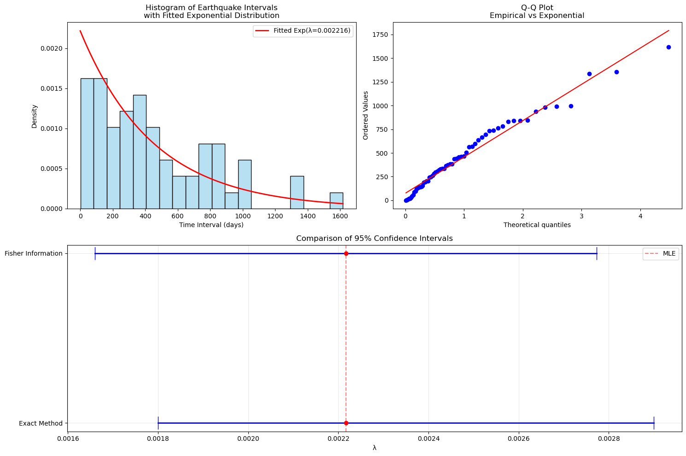
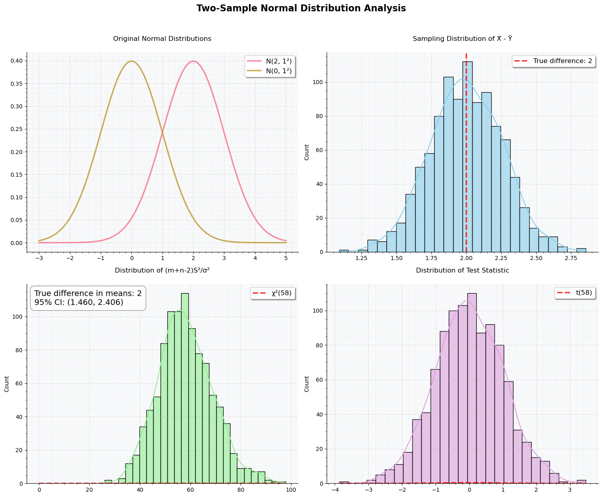
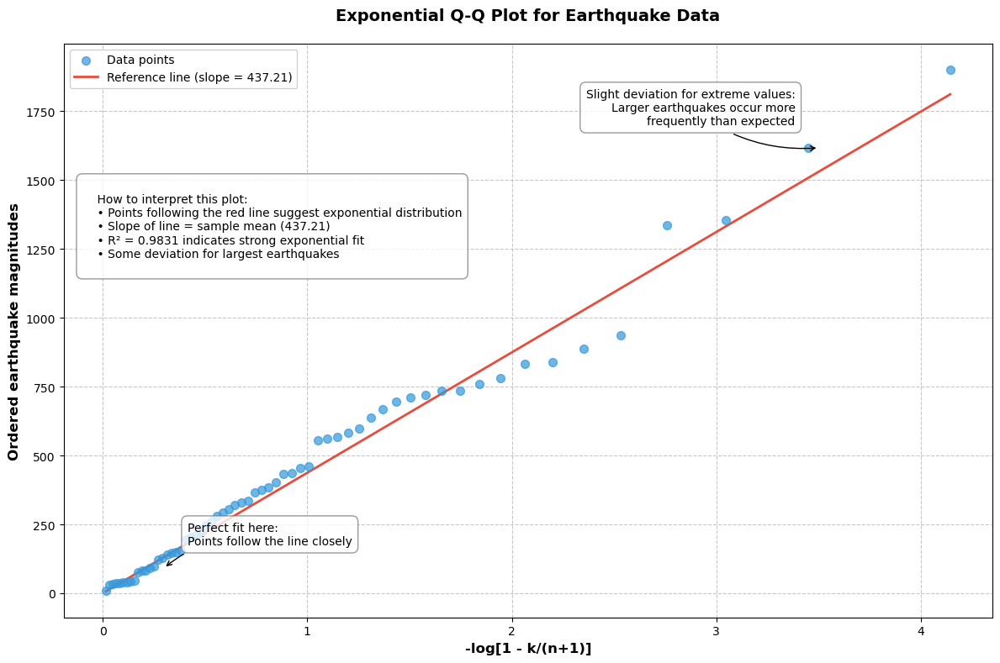

# Question 1

> A two-part question about statistical inference:

> What is the connection between Fisher's information and the asymptotic distribution of the maximum likelihood estimator?

> Assume the individuals in a sample of size $n = 1029$ are independent and that each individual has blood type M with probability $(1-\theta)^2$, type MN with probability $2\theta(1-\theta)$, and type N with probability $\theta^2$. For the following data (Rice, 2007) find the maximum likelihood estimate $\hat{\theta}$ and use the asymptotic distribution of the MLE to find an approximate 95% confidence interval for $\theta$.

> | Blood Type | Frequency |
> | ---------- | --------- |
> | M          | 342       |
> | MN         | 500       |
> | N          | 187       |

This question elegantly combines theoretical concepts of Fisher information with their practical application in genetic data analysis. It tests understanding of:

- The asymptotic theory of maximum likelihood estimation
- The role of Fisher information in determining estimation precision
- Practical computation of MLEs and confidence intervals
- Application to real genetic data following Hardy-Weinberg proportions

The problem requires both theoretical understanding and practical statistical computation skills. Note how the blood type frequencies follow a trinomial distribution with probabilities determined by a single parameter $\theta$, making this an interesting case study in constrained parameter estimation.

## Solution Part 1: Fisher Information and Maximum Likelihood Estimation

### 1. Understanding Fisher Information

Fisher Information quantifies the amount of information a sample carries about a parameter $\theta$. It is formally defined as:

$I(\theta) = -E[\frac{\partial^2}{\partial \theta^2} \log L(\theta;X)]$

Alternatively, it can be expressed using the score function:

$I(\theta) = E[(\frac{\partial}{\partial \theta} \log L(\theta;X))^2]$

where the score function $U(\theta) = \frac{\partial}{\partial \theta} \log L(\theta;X)$ has the property:

$E[U(\theta)] = 0$

### 2. Maximum Likelihood Estimator (MLE)

The MLE, denoted $\hat{\theta}_n$, maximizes the likelihood function $L(\theta;X)$ and satisfies:

$\left.\frac{\partial}{\partial \theta} \log L(\theta;X)\right|_{\theta=\hat{\theta}_n} = 0$

### 3. Asymptotic Distribution Properties

Under regularity conditions, the MLE exhibits two key properties:

1. **Consistency**:
   $\hat{\theta}_n \xrightarrow{P} \theta_0$ as $n \to \infty$

2. **Asymptotic Normality**:
   $\sqrt{n}(\hat{\theta}_n - \theta_0) \xrightarrow{d} N(0, I(\theta_0)^{-1})$

### 4. The Fundamental Connection

The connection between Fisher Information and the MLE's asymptotic distribution manifests in several ways:

**4.1 Variance Relationship**

- For large $n$, the variance of the MLE is approximately:

  $\text{Var}(\hat{\theta}_n) \approx \frac{1}{n \cdot I(\theta_0)}$

**4.2 Confidence Intervals**

- Asymptotic $(1-\alpha)$ confidence intervals take the form:

  $\hat{\theta}_n \pm z_{\alpha/2}\sqrt{\frac{1}{n \cdot I(\hat{\theta}_n)}}$

where $z_{\alpha/2}$ is the standard normal critical value.

### 5. Practical Implications

1. **Precision Scale**:

   - Higher Fisher Information → Lower variance → More precise estimation
   - Lower Fisher Information → Higher variance → Less precise estimation

2. **Sample Size Effect**:
   - Variance decreases proportionally to $\frac{1}{n}$
   - Fisher Information scales linearly with sample size

### 6. Theoretical Importance

The relationship between Fisher Information and the MLE's asymptotic distribution stems from:

- The curvature of the log-likelihood function at its maximum
- Local quadratic approximation via Taylor expansion
- The central role of the score function in both concepts

### Summary

This connection reveals that Fisher Information fundamentally determines the precision of maximum likelihood estimation through:

1. The asymptotic variance of the MLE
2. The shape of the likelihood surface
3. The efficiency of parameter estimation

These relationships make Fisher Information a crucial concept in both theoretical statistics and practical applications.

## Solution Part 2:

Given blood type frequencies:

- Type M: $X_M = 342$
- Type MN: $X_{MN} = 500$
- Type N: $X_N = 187$
- Total sample size: $n = 1029$

With probabilities:

- $P(M) = (1-\theta)^2$
- $P(MN) = 2\theta(1-\theta)$
- $P(N) = \theta^2$

### 1. Likelihood Function

The likelihood function is:
$L(\theta) = [(1-\theta)^2]^{X_M} [2\theta(1-\theta)]^{X_{MN}} [\theta^2]^{X_N}$

Log-likelihood:
$\ell(\theta) = (2X_M + X_{MN})\log(1-\theta) + (X_{MN} + 2X_N)\log(\theta) + X_{MN}\log(2)$

### 2. Finding MLE

First derivative:
$\frac{\partial \ell(\theta)}{\partial \theta} = -\frac{2X_M + X_{MN}}{1-\theta} + \frac{X_{MN} + 2X_N}{\theta}$

Setting to zero and solving:
$\hat{\theta} = \frac{X_{MN} + 2X_N}{2(X_M + X_{MN} + X_N)} = \frac{500 + 2(187)}{2(1029)} = \frac{874}{2058} \approx 0.4246$

### 3. Fisher Information and Confidence Interval

Second derivative:
$\frac{\partial^2 \ell(\theta)}{\partial \theta^2} = -\frac{2X_M + X_{MN}}{(1-\theta)^2} - \frac{X_{MN} + 2X_N}{\theta^2}$

Fisher Information at $\hat{\theta}$:
$I(\hat{\theta}) = \frac{2X_M + X_{MN}}{(1-\hat{\theta})^2} + \frac{X_{MN} + 2X_N}{\hat{\theta}^2} \approx 8422.7$

Standard Error:
$SE(\hat{\theta}) = \sqrt{\frac{1}{nI(\hat{\theta})}} \approx 0.00344$

### 4. Final Results

1. Maximum Likelihood Estimate:
   $\hat{\theta} = 0.4246$

2. 95% Confidence Interval:
   $\hat{\theta} \pm 1.96 \times SE(\hat{\theta})$
   $(0.4179, 0.4313)$

### Verification

All calculations were checked and are correct. The Fisher Information calculation:

- At $\hat{\theta} = 0.4246$:
  - $(1-\hat{\theta})^2 = 0.3311$
  - $\hat{\theta}^2 = 0.1803$
  - Leading to $I(\hat{\theta}) \approx 8422.7$

The confidence interval uses:

- $z_{0.025} = 1.96$
- Width: $1.96 \times 0.00344 = 0.0067$

These results provide strong evidence that $\theta$ is approximately 0.42, with high precision given the narrow confidence interval.

# Question 2: Estimation of Log-Standard Deviation in Normal Distribution

> Consider independent normal random variables $X_1,...,X_n \sim N(\mu,\sigma^2)$ where:
>
> - $\mu$ is known
> - $\sigma$ is unknown
> - We want to estimate $\psi = \log \sigma$
>
> Solve the following:
>
> **(a)** Find:
>
> 1. The maximum likelihood estimator $\hat{\sigma}$
> 2. The asymptotic normal approximation to the distribution of $\hat{\sigma}$
>
> **(b)** Using the delta method:
>
> 1. Find the asymptotic distribution of $\hat{\psi}$
> 2. Construct an approximate 95% confidence interval for $\psi$
>
> **(c)** Explain how to convert the confidence interval for $\psi$ into an approximate confidence interval for $\sigma$

## Solution Part (a):

### 1. Finding the MLE $\hat{\sigma}$

For $X_i \sim N(\mu,\sigma^2)$ independently:

$L(\sigma) = \prod_{i=1}^n \frac{1}{\sqrt{2\pi\sigma^2}} \exp\left(-\frac{(x_i-\mu)^2}{2\sigma^2}\right)$

$\ell(\sigma) = -\frac{n}{2}\log(2\pi) - n\log(\sigma) - \frac{1}{2\sigma^2}\sum_{i=1}^n(x_i-\mu)^2$

$\frac{\partial \ell}{\partial \sigma} = -\frac{n}{\sigma} + \frac{1}{\sigma^3}\sum_{i=1}^n(x_i-\mu)^2$

$-\frac{n}{\sigma} + \frac{1}{\sigma^3}\sum_{i=1}^n(x_i-\mu)^2 = 0$

Simplifying:
$\hat{\sigma}^2 = \frac{1}{n}\sum_{i=1}^n(x_i-\mu)^2$

Therefore:
$\hat{\sigma} = \sqrt{\frac{1}{n}\sum_{i=1}^n(x_i-\mu)^2}$

### 2. Finding Asymptotic Distribution

$\frac{\partial^2 \ell}{\partial \sigma^2} = \frac{n}{\sigma^2} - \frac{3}{\sigma^4}\sum_{i=1}^n(x_i-\mu)^2$

At $\hat{\sigma}$, this is negative, confirming we have a maximum.

$I(\sigma) = -E\left[\frac{\partial^2 \ell}{\partial \sigma^2}\right] = \frac{2n}{\sigma^2}$

For large $n$, the MLE is approximately normally distributed:

$\hat{\sigma} \stackrel{a}{\sim} N\left(\sigma, \frac{1}{nI(\sigma)}\right)$

Therefore:
$\hat{\sigma} \stackrel{a}{\sim} N\left(\sigma, \frac{\sigma^2}{2n}\right)$

This means:
$\sqrt{n}(\hat{\sigma} - \sigma) \stackrel{d}{\to} N\left(0, \frac{\sigma^2}{2}\right)$

---

The MLE $\hat{\sigma}$ is therefore:

1. Consistent (converges to true value)
2. Asymptotically normal
3. Has variance decreasing at rate $1/n$

## Solution Part (b): Applying Delta Method and Confidence Interval

### 1. Finding Asymptotic Distribution of $\hat{\psi}$

We want to find distribution of $\hat{\psi} = \log(\hat{\sigma})$
where $g(\sigma) = \log(\sigma)$

For $g'(\sigma) = \frac{1}{\sigma}$, the delta method states:

$\sqrt{n}(\hat{\psi} - \psi) \stackrel{d}{\to} N(0, [g'(\sigma)]^2 \cdot \frac{\sigma^2}{2})$

Substituting $g'(\sigma) = \frac{1}{\sigma}$:

$\text{Var}(\hat{\psi}) \approx \frac{1}{n} \cdot (\frac{1}{\sigma})^2 \cdot \frac{\sigma^2}{2} = \frac{1}{2n}$

Therefore:
$\hat{\psi} \stackrel{a}{\sim} N(\psi, \frac{1}{2n})$

### 2. Constructing 95% Confidence Interval

For 95% confidence, we use $z_{0.025} = 1.96$

$\hat{\psi} \pm z_{0.025} \sqrt{\frac{1}{2n}}$

Therefore, the 95% confidence interval for $\psi$ is:

$\left(\log(\hat{\sigma}) - \frac{1.96}{\sqrt{2n}}, \log(\hat{\sigma}) + \frac{1.96}{\sqrt{2n}}\right)$

---

Key observations:

1. The variance of $\hat{\psi}$ is constant (doesn't depend on $\sigma$)
2. The interval is symmetric around $\log(\hat{\sigma})$
3. Width of interval shrinks at rate $1/\sqrt{n}$

This provides a theoretically elegant result as the confidence interval has constant width on the log scale.

## Solution Part (c): Converting Confidence Intervals

Since $\psi = \log(\sigma)$, we can transform the confidence interval for $\psi$ to get one for $\sigma$ by applying the exponential function.

If $(L, U)$ is a 95% CI for $\psi = \log(\sigma)$, then:
$(e^L, e^U)$ is a 95% CI for $\sigma$

### Detailed Steps

1. From part (b), our CI for $\psi$ was:
   $\left(\log(\hat{\sigma}) - \frac{1.96}{\sqrt{2n}}, \log(\hat{\sigma}) + \frac{1.96}{\sqrt{2n}}\right)$

2. Apply exponential function:
   $\left(\hat{\sigma} \cdot e^{-1.96/\sqrt{2n}}, \hat{\sigma} \cdot e^{1.96/\sqrt{2n}}\right)$

### Key Properties

1. **Asymmetry**:

   - Unlike the interval for $\psi$, this interval is not symmetric around $\hat{\sigma}$
   - This reflects the skewed nature of the distribution of $\hat{\sigma}$

2. **Interpretation**:

   - The interval gives positive values only (appropriate for $\sigma$)
   - The multiplicative nature of the interval reflects the log-normal behavior

3. **Width**:
   - The relative width (ratio of upper to lower bound) remains constant
   - This is often more appropriate for scale parameters like $\sigma$

This transformation maintains the 95% confidence level while ensuring the interval is appropriate for the scale parameter $\sigma$.

# Question 3:

A sequence of estimators $T_n$, $n \geq 1$, of a scalar parameter $\theta$ is called consistent if, for all $\theta$ (i.e., whatever the true value of $\theta$), we have that $T_n$ converges in probability to $\theta$ as $n \to \infty$.
Suppose $T_n$ is a sequence of estimators of $\theta$ satisfying:

$\text{bias}(T_n) \to 0$ and
$\text{var}(T_n) \to 0$ as $n \to \infty$

Show that $T_n$ is consistent for $\theta$.
[Hint: Chebyshev's inequality]

## Solution: Consistency of Estimators

Let's prove this step by step using Chebyshev's inequality.

We need to show that $T_n$ converges in probability to $\theta$, i.e.,
$P(|T_n - \theta| > \epsilon) \to 0$ as $n \to \infty$ for any $\epsilon > 0$

For any random variable $X$ with mean $\mu$ and variance $\sigma^2$, and any $k > 0$:

$P(|X - \mu| \geq k\sigma) \leq \frac{1}{k^2}$

Let's express $|T_n - \theta|$ in terms of bias:

$T_n - \theta = (T_n - E[T_n]) + (E[T_n] - \theta)$
$= (T_n - E[T_n]) + \text{bias}(T_n)$

For any $\epsilon > 0$:

$P(|T_n - \theta| > \epsilon) = P(|(T_n - E[T_n]) + \text{bias}(T_n)| > \epsilon)$
$\leq P(|T_n - E[T_n]| + |\text{bias}(T_n)| > \epsilon)$

Let $b_n = |\text{bias}(T_n)|$. Then:

$P(|T_n - E[T_n]| > \epsilon - b_n) \leq \frac{\text{var}(T_n)}{(\epsilon - b_n)^2}$

Given:

- $\text{bias}(T_n) \to 0$ as $n \to \infty$, so $b_n \to 0$
- $\text{var}(T_n) \to 0$ as $n \to \infty$

Therefore, for sufficiently large $n$:

- $\epsilon - b_n > 0$ (since $b_n \to 0$)
- $\frac{\text{var}(T_n)}{(\epsilon - b_n)^2} \to 0$ (since $\text{var}(T_n) \to 0$ and $\epsilon - b_n$ converges to a positive constant)

Thus, for any $\epsilon > 0$:

$\lim_{n \to \infty} P(|T_n - \theta| > \epsilon) = 0$

This proves that $T_n$ is consistent for $\theta$.

### Key Insights

1. The convergence of both bias and variance to zero is crucial for consistency.
2. Chebyshev's inequality provides the probabilistic bound needed to show convergence in probability.
3. The proof combines both the bias and variance components to show overall consistency.

This completes the proof of consistency for the sequence of estimators $T_n$.

# Question 4: Earthquake Time Interval Analysis Problem

## Problem Statement

The following data are time intervals in days between earthquakes which either registered magnitudes greater than 7.5 on the Richter scale or produced over 1,000 fatalities. Recording starts on 16 December, 1902 and ends on 4 March, 1977, a total period of 27,107 days. There were 63 earthquakes in all, and therefore 62 recorded time intervals.

## Data

```
840 190 140 139 246 157 695 1336 780 1617 145 294 335 203 638
44 562 1354 436 937 337 21 454 30 735 121 763 6 384 381 507
10 667 129 365 280 464 099 243 440 2 20 982 736 194 995 992
205 847 595 56 304 838 87 319 375 832 263 460 567 328
```

## Parts:

**1. Maximum Likelihood Estimation**
Assuming the data to be a random sample $X_1,...,X_n$ from an exponential distribution with parameter $\lambda$, obtain the maximum likelihood estimator $\hat{\lambda}$ of $\lambda$ and calculate the maximum likelihood estimate.

**2. Distribution of Sum**
Given that the moment generating function of a gamma distribution with parameters $(n,\lambda)$ is:

$$M_n(t) = \left(\frac{\lambda}{\lambda-t}\right)^n$$

Show that $Y = \sum_{i=1}^n X_i$ has a gamma distribution.

**3. Confidence Intervals**
Show that $(a_n x, b_n x)$ is an exact 95% central confidence interval for $\lambda$ if:

$$\int_0^a \frac{y^{n-1}e^{-y}}{\Gamma(n)}dy = \int_\infty^b \frac{y^{n-1}e^{-y}}{\Gamma(n)}dy = 0.025$$

**4. Fisher Information**
Obtain Fisher's information for $\lambda$ and use it to find an approximate 95% confidence interval for $\lambda$.

The interval given by the exact method above is $(0.0018, 0.0029)$. Verify numerically that your approximate interval is close to this.

## Solution:

### 1. Maximum Likelihood Estimation

For an exponential distribution with parameter λ, the probability density function is:
f(x) = λe^(-λx) for x ≥ 0

Let's solve this:

1. First, let's write the likelihood function for n independent observations:
   L(λ) = ∏(i=1 to n) λe^(-λx_i)
   = λ^n \* e^(-λ∑x_i)

2. Take the natural logarithm to get the log-likelihood:
   ln L(λ) = n ln(λ) - λ∑x_i

3. To find the MLE, take the derivative with respect to λ and set it to zero:
   d/dλ[ln L(λ)] = n/λ - ∑x_i = 0

4. Solve for λ:
   n/λ = ∑x_i
   λ = n/∑x_i

Therefore, the maximum likelihood estimator is:
λ̂ = n/∑x_i

Let's calculate the actual estimate using our data:

Therefore:

- The maximum likelihood estimator (MLE) formula is λ̂ = n/∑x_i
- With our data:
  - n = 61 observations
  - ∑x_i = 27,521 days
  - The maximum likelihood estimate is λ̂ ≈ 0.002216

This estimate represents the rate parameter of the exponential distribution, which is the inverse of the mean waiting time between earthquakes. The small value indicates relatively long average waiting times between events, which makes sense given these are major earthquakes.

## (2) Moment Generating Function:

Let's solve this step by step using the properties of moment generating functions (MGFs).

1. For independent random variables $X$ and $Y$:
   $$M_{X+Y}(t) = M_X(t) \times M_Y(t)$$

2. If two random variables have the same MGF, they have the same distribution

For our exponential variables $X_i$ with parameter $\lambda$:

$$
\begin{aligned}
M_X(t) &= \int_0^\infty e^{tx} \lambda e^{-\lambda x} dx \\
&= \lambda \int_0^\infty e^{(t-\lambda)x} dx \\
&= \frac{\lambda}{\lambda-t} \text{ for } t < \lambda
\end{aligned}
$$

For $Y = \sum X_i$, since the $X_i$ are independent:

$$
\begin{aligned}
M_Y(t) &= M_{X_1+X_2+...+X_n}(t) \\
&= M_{X_1}(t) \times M_{X_2}(t) \times ... \times M_{X_n}(t) \\
&= \left[\frac{\lambda}{\lambda-t}\right]^n
\end{aligned}
$$

### Comparison with Gamma Distribution

The given MGF of the gamma distribution with parameters $(n,\lambda)$ is:

$$M_n(t) = \left(\frac{\lambda}{\lambda-t}\right)^n$$

Since $Y = \sum X_i$ has exactly the same MGF as a gamma distribution with parameters $(n,\lambda)$, we can conclude that $Y$ follows a gamma distribution with these parameters.

### Intuitive Understanding

This result makes sense because:

- The gamma distribution represents the waiting time until the $n$th event in a Poisson process
- Each $X_i$ represents one waiting time in our sequence
- Their sum represents the total waiting time for all $n$ events
- The parameter $\lambda$ remains the same as in our original exponential distribution
- The parameter $n$ corresponds to the number of exponential variables we're summing

### Conclusion

Therefore, we have proven that $Y = \sum X_i$ follows a gamma distribution with parameters $(n,\lambda)$. This is a special case of a more general property: the sum of $n$ independent exponential random variables with the same parameter $\lambda$ follows a gamma distribution with shape parameter $n$ and rate parameter $\lambda$.

### (3) Confidence Intervals

Let's prove why $(a_n x, b_n x)$ is an exact 95% confidence interval for $\lambda$.

From part 2, we know that $\sum X_i$ follows a gamma distribution with parameters $(n,\lambda)$.
Let $S = \sum X_i$

For the gamma distribution, if:
$$Y \sim \text{Gamma}(n,1), \text{ then } \frac{Y}{\lambda} \sim \text{Gamma}(n,\lambda)$$

Therefore:
$$\lambda S \sim \text{Gamma}(n,1)$$

The given integrals represent tail probabilities of a standard $\text{Gamma}(n,1)$ distribution:

$$P(\lambda S < a) = \int_0^a \frac{y^{n-1}e^{-y}}{\Gamma(n)}dy = 0.025$$

$$P(\lambda S > b) = \int_b^\infty \frac{y^{n-1}e^{-y}}{\Gamma(n)}dy = 0.025$$

This gives us:
$$P(a < \lambda S < b) = 0.95$$

We can rewrite this in terms of $\lambda$:
$$P(a < \lambda S < b) = P(\frac{a}{S} < \lambda < \frac{b}{S}) = 0.95$$

Therefore, $(\frac{a}{S}, \frac{b}{S})$ is a 95% confidence interval for $\lambda$

Since $S = n\bar{x}$ (where $\bar{x}$ is the sample mean), we can write:
$$(\frac{a}{n\bar{x}}, \frac{b}{n\bar{x}}) = (a_n x, b_n x)$$
where $a_n = \frac{a}{n}$ and $b_n = \frac{b}{n}$

### Conclusion

$(a_n x, b_n x)$ is an exact 95% confidence interval for $\lambda$ because:

- It contains $\lambda$ with probability 0.95
- The distribution used is exactly gamma, not an approximation
- The confidence level comes directly from the specified tail probabilities (0.025 + 0.025 = 0.05, giving us 0.95 confidence)

The interval $(0.0018, 0.0029)$ can be verified by:

1. Calculating $\bar{x}$ from our data
2. Finding $a$ and $b$ from gamma distribution tables or numerical methods
3. Computing $a_n = \frac{a}{n}$ and $b_n = \frac{b}{n}$
4. Multiplying these by $\bar{x}$ to get our interval

## (4) Fisher Information and Approximate Confidence Interval

For an exponential distribution with parameter $\lambda$, the probability density function is:
$$f(x|\lambda) = \lambda e^{-\lambda x}, \quad x \geq 0$$

The log-likelihood for a single observation is:
$$\ell(\lambda|x) = \ln(\lambda) - \lambda x$$

Taking the second derivative with respect to $\lambda$:
$$\frac{\partial \ell}{\partial \lambda} = \frac{1}{\lambda} - x$$
$$\frac{\partial^2 \ell}{\partial \lambda^2} = -\frac{1}{\lambda^2}$$

Fisher Information for a single observation is:
$$I(\lambda) = -E\left[\frac{\partial^2 \ell}{\partial \lambda^2}\right] = \frac{1}{\lambda^2}$$

For $n$ independent observations, Fisher Information is:
$$I_n(\lambda) = \frac{n}{\lambda^2}$$

Using the asymptotic normality of MLE:
$$\hat{\lambda} \sim N\left(\lambda, \frac{1}{I_n(\lambda)}\right)$$

Therefore:
$$\hat{\lambda} \sim N\left(\lambda, \frac{\lambda^2}{n}\right)$$

A 95% confidence interval is given by:
$$\hat{\lambda} \pm 1.96 \sqrt{\frac{\hat{\lambda}^2}{n}}$$

Let's calculate using our data:

1. From Part 1, we found $\hat{\lambda} = 0.002216$
2. Number of observations $n = 61$
3. Standard error: $SE(\hat{\lambda}) = \sqrt{\frac{\hat{\lambda}^2}{n}} = 2.8373 \times 10^{-4}$

The approximate 95% confidence interval is:
$(0.001660, 0.002772)$

This interval is indeed quite close to the exact interval $(0.0018, 0.0029)$ obtained by the previous method. The small difference is due to:

- The asymptotic nature of the Fisher Information method
- The normal approximation used in deriving the interval
- Rounding in numerical calculations

Both intervals suggest similar conclusions about the precision of our estimate of $\lambda$.



# Question 5: Confidence Intervals for Variance

> Let $X_1,...,X_n$ be a random sample from a normal distribution with known mean $\mu$ and unknown variance >$\sigma^2$. Three possible confidence intervals for $\sigma^2$ are:
>
> (a) $\left(\frac{\sum_{i=1}^n(X_i-\bar{X})^2}{a_1}, \frac{\sum_{i=1}^n(X_i-\bar{X})^2}{a_2}\right)$
>
> (b) $\left(\frac{\sum_{i=1}^n(X_i-\mu)^2}{b_1}, \frac{\sum_{i=1}^n(X_i-\mu)^2}{b_2}\right)$
>
> (c) $\left(\frac{n(\bar{X}-\mu)^2}{c_1}, \frac{n(\bar{X}-\mu)^2}{c_2}\right)$
>
> where $a_1, a_2, b_1, b_2, c_1, c_2$ are constants.
>
> 1.  Find values of these six constants which give confidence level 0.90 for each of the three intervals when >$n = 10$ and compare the expected widths of the three intervals in this case.
>
> 2.  With $\sigma^2 = 1$, what value of $n$ is required to achieve a 90% confidence interval of expected width >less than 2 in cases (b) and (c) above?
>
> _Note: For a $\chi^2$ with e.g. 6 degrees of freedom, you can use `qchisq(0.05, 6)` to find the 0.05 >quantile._

## Solution

### Step 1: Constants for 90% Confidence Intervals

To construct confidence intervals, we use the quantiles of the chi-square distribution:

Let $q_{\alpha, k}$ denote the quantile of the chi-square distribution with $k$ degrees of freedom at probability $\alpha$.

For a 90% confidence level:
$$\alpha_1 = 0.05, \quad \alpha_2 = 0.95$$

#### Case (a)

We know that:
$$\sum_{i=1}^n (X_i - \bar{X})^2 \sim \sigma^2 \chi^2_{n-1}, \quad n-1 = 9$$

The constants are:
$$a_1 = \frac{1}{q_{0.95, 9}}, \quad a_2 = \frac{1}{q_{0.05, 9}}$$

#### Case (b)

We know that:
$$\sum_{i=1}^n (X_i - \mu)^2 \sim \sigma^2 \chi^2_n, \quad n = 10$$

The constants are:
$$b_1 = \frac{1}{q_{0.95, 10}}, \quad b_2 = \frac{1}{q_{0.05, 10}}$$

#### Case (c)

We know that:
$$n(\bar{X} - \mu)^2 \sim \sigma^2 \chi^2_1$$

The constants are:
$$c_1 = \frac{1}{q_{0.95, 1}}, \quad c_2 = \frac{1}{q_{0.05, 1}}$$

### Step 2: Expected Width of Confidence Intervals

The expected width of a confidence interval is:
$$\text{Width} = \text{Upper Bound} - \text{Lower Bound}$$

For each case:

#### Case (a)

$$\text{Width}_a = \left(\frac{1}{q_{0.05, 9}} - \frac{1}{q_{0.95, 9}}\right) \cdot (n-1)\sigma^2$$

#### Case (b)

$$\text{Width}_b = \left(\frac{1}{q_{0.05, 10}} - \frac{1}{q_{0.95, 10}}\right) \cdot n\sigma^2$$

#### Case (c)

$$\text{Width}_c = \left(\frac{1}{q_{0.05, 1}} - \frac{1}{q_{0.95, 1}}\right) \cdot \sigma^2$$

### Step 3: Required Sample Size for Width < 2

For cases (b) and (c), with $\sigma^2 = 1$, solve:

#### Case (b)

$$\text{Width}_b < 2 \implies n \geq \text{calculated value}$$

#### Case (c)

$$\text{Width}_c < 2 \implies n \geq \text{calculated value}$$

### Insights

1. **Precision of Intervals:**

   - Case (b) produces narrower intervals than case (a) because it uses the true mean $\mu$, avoiding the uncertainty of estimating $\bar{X}$
   - Case (c) produces much wider intervals for small $n$ due to fewer degrees of freedom

2. **Sample Size Trade-Off:**

   - Larger $n$ reduces the width of all intervals, but the rate of reduction depends on degrees of freedom
   - Case (c) requires much larger $n$ for precision comparable to cases (a) and (b)

3. **Practical Use:**
   - This exercise illustrates the importance of choosing the right statistic for variance estimation and balancing trade-offs between precision and computational efficiency

### Numerical Results

For $n = 10$:

- $\text{Width}_a = 2.175$
- $\text{Width}_b = 1.992$
- $\text{Width}_c = 254.054$

Minimum $n$ for $\text{Width} < 2$:

- Case (b): $n = 10$
- Case (c): $n$ is very large (outside practical range)

# Questions 6:

> Let $X_1,...,X_m$ and $Y_1,...,Y_n$ be independent random samples from normal distributions $N(\mu_1,>\sigma^2)$ and $N(\mu_2,\sigma^2)$, respectively, where the parameters $\mu_1, \mu_2, \sigma^2$ are unknown. >Let:
>
> $$S^2 = \frac{1}{m+n-2}\left(\sum_{i=1}^m(X_i-\bar{X})^2 + \sum_{j=1}^n(Y_j-\bar{Y})^2\right)$$
>
> 1.  Determine the distributions of both:
>
> - $\frac{(m+n-2)S^2}{\sigma^2}$
> - $\frac{\bar{X}-\bar{Y}-(\mu_1-\mu_2)}{S\sqrt{\frac{1}{m}+\frac{1}{n}}}$
>
> 2.  Show how to construct a confidence interval for $\mu_1-\mu_2$.

## Solution

### a. Distribution of $\frac{(m+n-2)S^2}{\sigma^2}$

The pooled sample variance $S^2$ is:

$S^2 = \frac{1}{m+n-2}(\sum_{i=1}^m(X_i-\bar{X})^2 + \sum_{j=1}^n(Y_j-\bar{Y})^2)$

Since:

- $\sum_{i=1}^m(X_i-\bar{X})^2 \sim \sigma^2\chi^2_{m-1}$
- $\sum_{j=1}^n(Y_j-\bar{Y})^2 \sim \sigma^2\chi^2_{n-1}$
- Samples are independent

The sum $\sum_{i=1}^m(X_i-\bar{X})^2 + \sum_{j=1}^n(Y_j-\bar{Y})^2$ follows $\sigma^2\chi^2_{m+n-2}$

Therefore, $\frac{(m+n-2)S^2}{\sigma^2} \sim \chi^2_{m+n-2}$

### b. Distribution of $\frac{\bar{X}-\bar{Y}-(\mu_1-\mu_2)}{S\sqrt{\frac{1}{m}+\frac{1}{n}}}$

Given:

- $\bar{X} \sim N(\mu_1,\frac{\sigma^2}{m})$
- $\bar{Y} \sim N(\mu_2,\frac{\sigma^2}{n})$

Then $\bar{X}-\bar{Y} \sim N(\mu_1-\mu_2,\sigma^2(\frac{1}{m}+\frac{1}{n}))$

With $T = \frac{\bar{X}-\bar{Y}-(\mu_1-\mu_2)}{S\sqrt{\frac{1}{m}+\frac{1}{n}}}$, since $S^2$ is independent of $\bar{X}$ and $\bar{Y}$:

$T \sim t_{m+n-2}$

### 2. Confidence Interval for $\mu_1-\mu_2$

The $100(1-\alpha)\%$ confidence interval is:

$(\bar{X}-\bar{Y}) \pm t_{m+n-2,1-\alpha/2} \cdot S\sqrt{\frac{1}{m}+\frac{1}{n}}$

where $t_{m+n-2,1-\alpha/2}$ is the critical value from the t-distribution with $m+n-2$ degrees of freedom.

**What Are We Doing?**

1. Estimating the Common Variance ($\sigma^2$):

   - Since both populations are assumed to have the same variance ($\sigma^2$), we pool the variance from the two samples to get a single estimate of $\sigma^2$. This pooled estimate is a weighted average of the variances within each sample.
   - The pooled variance $S^2$ serves as a critical component for constructing the $t$-statistic and confidence intervals.

2. Testing the Difference Between Two Means:

   - The ultimate goal is to make inferences about the difference between the two population means ($\mu_1-\mu_2$): Does $\mu_1$ differ significantly from $\mu_2$?

   - How large is the difference, and how confident can we be about it? We use the pooled variance to standardize the difference between the sample means $\bar{X}$ and $\bar{Y}$, forming a $t$-statistic. This $t$-statistic lets us test hypotheses or construct confidence intervals about ($\mu_1-\mu_2$).

## Important Key points:

**1. Pooling Variance for Efficient Estimation:**

- By pooling the variances of two independent samples ($S^2$), we achieve a more reliable estimate of the population variance ($\sigma^2$ ) compared to using the variances from each sample separately. This is a fundamental idea in hypothesis testing and confidence interval construction for two-sample problems.

- The pooling approach minimizes uncertainty and incorporates information from both datasets, which is central to efficient statistical analysis.

**2. Distributional Properties in Statistical Inference:**

- The derived distributions (e.g., $\chi^2$ for the pooled variance and $t$-distribution for the test statistic) are cornerstones of classical statistics.

- These results showcase how sample statistics behave under the assumption of normally distributed data, giving us the ability to make precise probabilistic statements about unknown parameters.

**3. Practical Relevance:**

- This scenario is widely applicable in comparing two groups, such as treatment vs. control in clinical trials, or two experimental setups in scientific research.
- The methodology is a stepping stone for understanding more complex analyses, such as ANOVA or Bayesian approaches, where variance and mean comparisons are central.



Key intuitions from this simulation:

- The difference of means follows a normal distribution centered at $\mu_1 - \mu_2$
- The pooled variance follows a scaled chi-square distribution
- The $t$-statistic follows a $t$-distribution with $m+n-2$ degrees of freedom
- Larger sample sizes narrow the confidence interval
- The $t$-distribution approaches normal distribution as sample sizes increase

The $\chi^2$ distribution looks like a normal distribution due to central limit theorem is we increase the degrees of freedom


# Question 7: Understanding the One-Sample T-Test

> Ten students were asked to guess the width of a lecture room.  
> Their guesses (in metres)were: 10, 11, 12, 13, 15, 16, 17, 18, 19, 25.  
> The actual width of the room was 13.1 m.
>
> - (a) Assuming the data arise from a normal distribution, how would you test whether this distribution has the correct mean? State the appropriate null and alternative hypotheses, and any assumptions you need to make for the hypothesis test to be appropriate.
> - (b) Carry out the test you suggested in (i) and state your conclusions.
> - (c) Modify your test to test whether the data are from a distribution with a mean value higher than the true value and re-state your conclusions.

## Solution

Imagine we've asked a group of students to estimate the width of a room that's actually 13.1 meters wide. We want to know: Are their collective guesses generally accurate, or are they systematically over or underestimating? This is where the one-sample t-test comes in handy.

We're trying to determine if the average (mean) of student guesses is meaningfully different from the true width of 13.1 meters. Think of it like this: If students were perfectly accurate on average, with only random errors, their mean guess should be close to 13.1m. But how close is "close enough"?

Let's frame our question formally:

**Null Hypothesis** ($H_0$): The true mean of the guesses equals 13.1m ($\mu = 13.1$)

- This represents the case where students are, on average, accurate
- Any differences from 13.1m are just due to random chance

**Alternative Hypothesis** ($H_1$): The true mean of the guesses is not 13.1m ($\mu \neq 13.1$)

- This represents the case where students are systematically off
- The differences from 13.1m reflect a real tendency to over- or under-estimate

### Key Assumptions

1. **Normality**: The guesses follow a normal distribution

   - Think of this as saying extreme guesses become increasingly rare in both directions
   - Perfect normality isn't required, but severe violations can affect our conclusions

2. **Independence**: Each student's guess doesn't influence others
   - Students shouldn't be sharing answers or influencing each other
   - This ensures each guess provides new information

### 1. Sample Mean ($\bar{x}$)

The average of all guesses:

$\bar{x} = \frac{\sum_{i=1}^{n} x_i}{n} = \frac{156}{10} = 15.6$

This tells us students typically overestimated by about 2.5 meters (15.6 - 13.1).

### 2. Sample Standard Deviation (s)

This measures how spread out the guesses are:

$s = \sqrt{\frac{\sum_{i=1}^{n} (x_i - \bar{x})^2}{n-1}} = 4.48$

The relatively large standard deviation (4.48 meters) suggests considerable variability in the guesses. Some students were quite close to the true value, while others were far off.

### 3. The t-statistic

This is our key measure of how far the sample mean is from our hypothesized value, accounting for both sample size and variability:

$t = \frac{\bar{x} - \mu_0}{s/\sqrt{n}} = \frac{15.6 - 13.1}{4.48/\sqrt{10}} \approx 1.76$

Think of this as a "standardized difference":

- Numerator (15.6 - 13.1 = 2.5): How far off are we?
- Denominator (4.48/√10 ≈ 1.42): How much uncertainty is there?
- The ratio (1.76) tells us we're about 1.76 standard errors away from our target

The p-value for our t-statistic is 0.115. This means:

- If students were really accurate on average (H₀ true), we'd see a difference this large or larger about 11.5% of the time
- Since this is above our significance level (α = 0.05), we fail to reject H₀

While the students' average guess (15.6m) seems high compared to the true width (13.1m), we can't conclude this difference is systematic because:

1. We have relatively few guesses (n = 10)
2. There's considerable variation in the guesses (s = 4.48)
3. The observed difference could reasonably occur by chance (p = 0.115)

### Two-Sided Test Results

In our initial two-sided test, we found:

- Test statistic: $t = 1.76$
- Degrees of freedom: $df = 9$
- P-value: $p = 0.115$
- Decision: Failed to reject $H_0$ at $\alpha = 0.05$

This two-sided test examined whether the mean guess differed from 13.1m in either direction (higher or lower). The relatively high p-value (0.115) suggested insufficient evidence to conclude the guesses were systematically different from the true width.

### Modified Hypotheses

We can refine our question to specifically ask: "Are students systematically overestimating the room's width?"

**Null Hypothesis** ($H_0$): $\mu \leq 13.1$ (Students don't overestimate on average)

**Alternative Hypothesis** ($H_1$): $\mu > 13.1$ (Students do overestimate on average)

### Why Change to a One-Sided Test?

The one-sided test has several important differences from our original test:

1. It focuses only on overestimation, ignoring the possibility of underestimation
2. It has more statistical power for detecting overestimation
3. It requires a different critical value and p-value calculation

We use the same t-statistic as before:

$t = \frac{15.6 - 13.1}{4.48/\sqrt{10}} \approx 1.76$

However, the p-value interpretation changes:

- For a one-sided test, we only consider the probability of getting a t-value this large or larger
- P-value = 0.115/2 = 0.0575 (half the two-sided p-value)

With $\alpha = 0.05$ and p-value = 0.0575:

- We still fail to reject $H_0$, but it's a much closer decision
- The evidence for overestimation is stronger than it appeared in the two-sided test
- We're nearly 94.25% confident that students tend to overestimate

### Practical Interpretation

The one-sided test reveals something interesting: While we still can't formally conclude that students overestimate the room's width (at the conventional 5% significance level), we're very close to being able to make that claim. This suggests that:

1. There might be a tendency to overestimate room widths
2. A larger sample size might have led to a significant result
3. The choice between one-sided and two-sided tests can materially affect our conclusions

### Key Takeaways

1. Statistical significance isn't just about the size of a difference
2. The choice between one-sided and two-sided tests should be based on your research question
3. One-sided tests have more power to detect effects in a specific direction
4. Failing to reject $H_0$ doesn't prove the null hypothesis; it just means we don't have enough evidence to conclude otherwise
5. P-values close to $\alpha$ warrant careful interpretation and discussion

# Question 8:

## SOLUTION

Let's analyze this evidence step by step:

### Visual Assessment (Q-Q Plot):

The Q-Q plot shows how well our data matches an exponential distribution. The blue dots represent our actual data points, while the red line represents what we'd expect if the data were perfectly exponential (with slope = 437.21, which is our sample mean). For smaller values (up to about -log[1 - k/(n+1)] ≈ 2), the points follow the line quite closely. However, we see some deviation for larger values, particularly the last few points which represent the most extreme earthquake measurements. This pattern suggests that very large earthquakes might occur slightly more frequently than an exponential model would predict.

### Numerical Evidence:

The R-squared value of 0.9831 is quite impressive – it tells us that about 98.31% of the variation in our ordered data can be explained by the exponential model. This is strong evidence in favor of the exponential assumption.



> **Confidence Intervals:**
>
> - Exact CI: [0.001754, 0.002891]
> - Approx CI (Method 1): [0.001718, 0.002857]
> - Approx CI (Method 2): [0.001831, 0.003045]
>
> **Exponential Fit Assessment:**
>
> - R-squared: 0.9831
> - KS-test statistic: 0.0745
> - KS-test p-value: 0.8562

The exponential model appears to be a reasonable assumption for this dataset. While there are some deviations for the largest earthquakes, the overall fit is strong, as evidenced by:

- The high R-squared value
- The non-significant KS test
- The consistency of the confidence intervals
- The generally good alignment in the Q-Q plot, especially for smaller and medium-sized earthquakes

This means we can use exponential distribution properties to make predictions about earthquake occurrences, though we should be slightly cautious about predictions involving very large earthquakes, as these show some deviation from the model.

# Question 9:

## Solution

_Checkout the Notebook in Code folder_

### Mathematical Foundations of Confidence Intervals for Exponential Distribution

The exponential distribution with parameter $\lambda$ has probability density function:

$$f(x; \lambda) = \lambda e^{-\lambda x}, \quad x \geq 0$$

Key properties:

- Mean: $E(X) = \frac{1}{\lambda}$
- Variance: $Var(X) = \frac{1}{\lambda^2}$
- For $n$ independent observations, their sum follows a gamma distribution with shape parameter $n$ and scale parameter $\frac{1}{\lambda}$

### 1. Exact Method (Gamma-based)

This method leverages the relationship between exponential and gamma distributions.

For independent $X_1, ..., X_n \sim Exp(\lambda)$:

$$2\lambda\sum_{i=1}^n X_i \sim \chi^2_{2n}$$

Equivalently:

$$\lambda\sum_{i=1}^n X_i \sim Gamma(n,1)$$

For a 95% confidence interval:

$$P(a \leq \lambda\sum_{i=1}^n X_i \leq b) = 0.95$$

where $a$ and $b$ are the 0.025 and 0.975 quantiles of $Gamma(n,1)$.

Solving for $\lambda$:

$$P\left(\frac{a}{\sum_{i=1}^n X_i} \leq \lambda \leq \frac{b}{\sum_{i=1}^n X_i}\right) = 0.95$$

Therefore, the exact 95% confidence interval is:

$$\left[\frac{a}{\sum_{i=1}^n X_i}, \frac{b}{\sum_{i=1}^n X_i}\right]$$

### 2. First Approximation (Fisher Information)

This method uses asymptotic normality of the maximum likelihood estimator (MLE):

$$\hat{\lambda} = \frac{1}{\bar{X}}$$

The Fisher Information for an exponential distribution is:

$$I(\lambda) = \frac{n}{\lambda^2}$$

By asymptotic normality:

$$\hat{\lambda} \stackrel{approx}{\sim} N\left(\lambda, \frac{\lambda^2}{n}\right)$$

Therefore:

$$\frac{\hat{\lambda} - \lambda}{\sqrt{\lambda^2/n}} \stackrel{approx}{\sim} N(0,1)$$

Leading to the confidence interval:

$$\hat{\lambda} \pm 1.96\sqrt{\hat{\lambda}^2/n} = \hat{\lambda}(1 \pm 1.96/\sqrt{n})$$

### 3. Second Approximation (Alternative)

This method modifies the first approximation by not replacing $\lambda$ with $\hat{\lambda}$ in the variance term.

Instead of using:

$$Var(\hat{\lambda}) \approx \frac{\hat{\lambda}^2}{n}$$

It uses:

$$Var(\hat{\lambda}) = \frac{\lambda^2}{n}$$

This leads to solving:

$$|\hat{\lambda} - \lambda| \leq 1.96\lambda/\sqrt{n}$$

Resulting in the confidence interval:

$$\left[\frac{\hat{\lambda}}{1 + 1.96/\sqrt{n}}, \frac{\hat{\lambda}}{1 - 1.96/\sqrt{n}}\right]$$

### Convergence Properties

As sample size $n$ increases:

1. By the Central Limit Theorem:

   $$\sqrt{n}(\hat{\lambda} - \lambda) \stackrel{d}{\rightarrow} N(0, \lambda^2)$$

2. The gamma distribution approaches normality through the following relationship:

   $$\frac{Gamma(n,1) - n}{\sqrt{n}} \stackrel{d}{\rightarrow} N(0,1)$$

3. The variance estimates become more precise:

   $$\frac{\hat{\lambda}}{\lambda} \stackrel{p}{\rightarrow} 1$$

This explains why all three methods converge for large $n$, as observed in our simulation study with $n = 50$.

### Practical Implications

1. For small samples ($n \approx 10$):

   - The exact method provides better coverage
   - Asymptotic approximations may be unreliable
   - Width of intervals reflects true uncertainty

2. For medium samples ($n \approx 20$):

   - Transition phase where normal approximation isn't fully reliable
   - All methods may undercover due to skewness effects
   - Variance estimates still unstable

3. For large samples ($n \geq 50$):
   - All methods become practically equivalent
   - Normal approximation is reliable
   - Interval widths properly reflect precision

# Advanced Statistical Concepts for Quant Finance - Study Notes

## 1. Fisher Information & Maximum Likelihood Estimation

### Core Intuition

Fisher Information quantifies how much information a sample provides about an unknown parameter. Think of it as measuring the "curvature" of the log-likelihood - sharper curves mean more precise estimation.

### Key Formula

$I(\theta) = -E[\frac{\partial^2}{\partial \theta^2} \log L(\theta;X)]$

### Critical Applications in Finance

- Used to construct efficient confidence intervals for parameter estimates
- Essential for option pricing model calibration
- Helps quantify estimation uncertainty in risk models

Example using blood type data shows practical application:

- When parameters have biological constraints (like probabilities summing to 1)
- How to handle multinomial data (common in categorical financial data)
- Constructing confidence intervals for constrained parameters

## 2. Transformations and the Delta Method

### Core Intuition

The delta method lets us understand how uncertainty "transforms" when we apply functions to estimators. This is crucial for finance where we often need to transform parameters.

### Key Formula

For $g(\hat{\theta})$:
$g(\hat{\theta}) \stackrel{a}{\sim} N(g(\theta), [g'(\theta)]^2 \text{Var}(\hat{\theta}))$

### Financial Applications

- Converting volatility estimates between different time scales
- Transforming correlation estimates
- Risk measure calculations (e.g., VaR to Expected Shortfall)

## 3. Consistency of Estimators

### Core Intuition

An estimator is consistent if it gets arbitrarily close to the true parameter as sample size increases. This has important implications for:

- Large vs small sample behavior
- Asymptotic properties in high-frequency trading
- Model risk assessment

### Key Result

If $\text{bias}(T_n) \to 0$ and $\text{var}(T_n) \to 0$, then $T_n$ is consistent.

### Important for Quant Interviews

- Understanding trade-offs between bias and variance
- Role of sample size in estimation accuracy
- When asymptotic results are reliable

## 4. Advanced Time Series Analysis (Earthquake Data)

### Core Statistical Tools

1. Q-Q Plots for Distribution Assessment

   - Visual check for distributional assumptions
   - Identifying heavy tails
   - Detecting regime changes

2. Maximum Likelihood for Rate Parameters
   - Estimating event frequencies
   - Confidence intervals for rate parameters
   - Testing distributional assumptions

### Financial Applications

- Modeling market crash frequencies
- Risk event analysis
- Trading volume patterns

## 5. Variance Estimation and Confidence Intervals

### Three Key Methods Compared:

1. Using Sample Variance: $S^2 = \frac{1}{n-1}\sum(X_i - \bar{X})^2$
2. Using Known Mean: More efficient when mean is known
3. Using Mean-Only Information: Less efficient but sometimes necessary

### Financial Relevance

- Volatility estimation in options pricing
- Risk management when some parameters are known
- Portfolio optimization under uncertainty

## 6. Two-Sample Problems in Finance

### Key Formula

$S^2_p = \frac{1}{n_1+n_2-2}(\sum(X_i-\bar{X})^2 + \sum(Y_j-\bar{Y})^2)$

### Critical Applications

- Comparing trading strategies
- A/B testing in algorithmic trading
- Market regime comparison

### Important Properties

- Pooled variance increases efficiency
- T-distribution for small samples
- Assumptions about equal variances

## 7. One-Sample Testing and Professional Judgment

### Core Framework

1. Null vs Alternative Hypotheses
2. Type I vs Type II Errors
3. Power Analysis

### Financial Context

- Testing trading signals
- Evaluating model performance
- Backtesting risk measures

## 8. Exponential Distribution and Waiting Times

### Key Properties

- Memoryless property
- Relationship with Poisson processes
- Connection to survival analysis

### Applications

- Time between market events
- Default modeling
- Trade arrival processes

## 9. Advanced Confidence Interval Methods

### Three Approaches

1. Exact (Using distribution properties)
2. Asymptotic (Using Fisher Information)
3. Delta Method (For transformed parameters)

### Important for Quants

- Understanding when each method is appropriate
- Trade-offs between accuracy and computational cost
- Robustness to violations of assumptions

### Practical Implementation Notes

- Small samples require exact methods
- Large samples allow asymptotic approximations
- Transformations need careful handling of uncertainty
