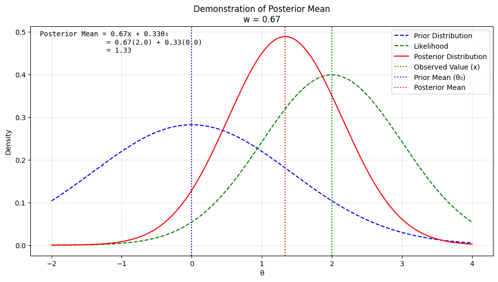
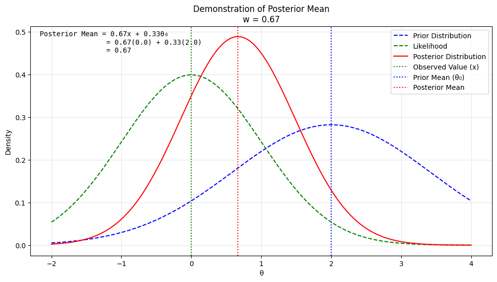

# Question 1: Posterior Distribution of $\theta$

Suppose $X_1,\dots,X_n$ are independent, each having a geometric distribution with probability mass function $f(x|θ) = (1−θ)^x θ$ for $x= 0,1,\dots$. Suppose that the prior for $θ$ is a $\text{Beta}(a,b)$ density. Find the posterior distribution of $θ$.

## Solution:

To find the posterior distribution of $\theta$, we use Bayes' theorem. The posterior is proportional to the product of the likelihood function and the prior density.

## Step 1: Likelihood Function

The probability mass function (PMF) of the geometric distribution is given as:

$$
f(x | \theta) = (1 - \theta)^x \theta, \quad x = 0, 1, 2, \dots
$$

For $n$ independent observations $X_1, X_2, \dots, X_n$, the likelihood function is:

$$
L(\theta | X_1, \dots, X_n) = \prod_{i=1}^n f(X_i | \theta) = \prod_{i=1}^n (1 - \theta)^{X_i} \theta.
$$

Simplifying:

$$
L(\theta | X_1, \dots, X_n) = \theta^n (1 - \theta)^{\sum_{i=1}^n X_i}.
$$

Let $S = \sum_{i=1}^n X_i$. Then:

$$
L(\theta | X_1, \dots, X_n) = \theta^n (1 - \theta)^S.
$$

## Step 2: Prior Density

The prior for $\theta$ is $\text{Beta}(a, b)$, with the density:

$$
\pi(\theta) = \frac{\theta^{a-1} (1 - \theta)^{b-1}}{B(a, b)}, \quad 0 < \theta < 1,
$$

where $B(a, b)$ is the Beta function.

## Step 3: Posterior Distribution

The posterior distribution is proportional to the product of the likelihood and the prior:

$$
\pi(\theta | X_1, \dots, X_n) \propto L(\theta | X_1, \dots, X_n) \pi(\theta).
$$

Substitute the likelihood and prior:

$$
\pi(\theta | X_1, \dots, X_n) \propto \theta^n (1 - \theta)^S \cdot \theta^{a-1} (1 - \theta)^{b-1}.
$$

Combine the powers of $\theta$ and $1 - \theta$:

$$
\pi(\theta | X_1, \dots, X_n) \propto \theta^{n + a - 1} (1 - \theta)^{S + b - 1}.
$$

This is the kernel of a Beta distribution. Specifically, the posterior distribution is:

$$
\pi(\theta | X_1, \dots, X_n) \sim \text{Beta}(n + a, S + b).
$$

## Final Answer:

The posterior distribution of $\theta$ is:

$$
\theta | X_1, \dots, X_n \sim \text{Beta}(n + a, S + b),
$$

where $S = \sum_{i=1}^n X_i$.

# Question 2: Bayesian Analysis: Deriving the Posterior Distribution

Let $θ >0$ be an unknown parameter and let $c >0$ be a known constant. Conditional on $θ$, suppose $X_1,...,X_n$ are independent each with probability density function

$$
f(x|θ) =θ c^θ x^{−(θ+1)}
$$

$x>c$ and suppose the prior for $θ$ is a $\text{Gamma}(α,β)$ density. Find the posterior distribution of $θ$.

## Solution:

### Likelihood Function

The probability density function for each o#servation $X_i$ given parameter $\theta$ is:

$$f(x_i|\theta) = \theta c^\theta x_i^{-(\theta+1)}, x_i > c$$

For $n$ independent observations $X_1, X_2, \ldots, X_n$, we can write the likelihood function as:

$$L(\theta|X_1,\ldots,X_n) = \prod_{i=1}^n f(x_i|\theta) = \prod_{i=1}^n \theta c^\theta x_i^{-(\theta+1)}$$

This simplifies to:

$$L(\theta|X_1,\ldots,X_n) = \theta^n c^{n\theta} \prod_{i=1}^n x_i^{-(\theta+1)}$$

Let $S = \sum_{i=1}^n \ln x_i$. Then the likelihood becomes:

$$L(\theta|X_1,\ldots,X_n) = \theta^n c^{n\theta} e^{-\theta S}$$

### Prior Density

We assume a Gamma prior for $\theta$ with parameters $\alpha$ and $\beta$:

$$\pi(\theta) = \frac{\beta^\alpha}{\Gamma(\alpha)} \theta^{\alpha-1} e^{-\beta\theta}, \theta > 0$$

### Posterior Distribution

The posterior distribution is proportional to the product of likelihood and prior:

$$\pi(\theta|X_1,\ldots,X_n) \propto L(\theta|X_1,\ldots,X_n)\pi(\theta)$$

Substituting our expressions:

$$\pi(\theta|X_1,\ldots,X_n) \propto \theta^n c^{n\theta} e^{-\theta S} \cdot \theta^{\alpha-1} e^{-\beta\theta}$$

Combining terms:

$$\pi(\theta|X_1,\ldots,X_n) \propto \theta^{n+\alpha-1} c^{n\theta} e^{-\theta(S+\beta)}$$

Factoring $c^{n\theta}$ into the exponential:

$$\pi(\theta|X_1,\ldots,X_n) \propto \theta^{n+\alpha-1} e^{-\theta(S+\beta-n\ln c)}$$

This is the kernel of a Gamma distribution. Therefore:

$$\theta|X_1,\ldots,X_n \sim \text{Gamma}(n+\alpha, S+\beta-n\ln c)$$

The posterior distribution of $\theta$ is:

$$\theta|X_1,\ldots,X_n \sim \text{Gamma}(n+\alpha, S+\beta-n\ln c)$$

where $S = \sum_{i=1}^n \ln x_i$

# Question 3: Negative Binomial and Beta Prior Problem

Let $r > 1$ be a known integer and let $\theta \in [0,1]$ be an unknown parameter. The negative binomial distribution with index $r$ and parameter $\theta$ has probability mass function:

$$f(x|\theta) = \binom{x+r-1}{x}(1-\theta)^x\theta^r \text{ for } x = 0,1,...$$

Let $\theta$ have a Beta$(a,b)$ prior density and suppose, given $\theta$, that $X_1,...,X_n$ are independent each with the above negative binomial distribution.

### (a) Show that the posterior density is also a Beta density.

### (b) Equal-tailed Credible Interval Construction

To construct a 100$(1-\alpha)\%$ equal-tailed credible interval:

1. Find the $\alpha/2$ and $1-\alpha/2$ quantiles of the Beta$(a+nr, b+\sum x_i)$ distribution
2. These quantiles form the lower and upper bounds of the interval

## Solution

### Part (a):

To solve this, let's proceed step by step:

1. The Beta$(a,b)$ prior density is proportional to:
   $$\pi(\theta) \propto \theta^{a-1}(1-\theta)^{b-1}$$

2. The likelihood function for $n$ independent observations is:
   $$L(\theta|x_1,...,x_n) = \prod_{i=1}^n \binom{x_i+r-1}{x_i}(1-\theta)^{x_i}\theta^r$$

3. Therefore:
   $$L(\theta|x_1,...,x_n) \propto (1-\theta)^{\sum x_i}\theta^{nr}$$

4. By Bayes' theorem, the posterior density is:
   $$\pi(\theta|x_1,...,x_n) \propto \theta^{a-1}(1-\theta)^{b-1} \cdot (1-\theta)^{\sum x_i}\theta^{nr}$$
   $$\propto \theta^{(a+nr)-1}(1-\theta)^{(b+\sum x_i)-1}$$

This is proportional to a Beta$(a+nr, b+\sum x_i)$ density.

### part (b):

To construct a $100(1-\alpha)\%$ equal-tailed credible interval for $\theta$, we need to find the $\frac{\alpha}{2}$ and $1-\frac{\alpha}{2}$ quantiles of the posterior Beta distribution.

The posterior distribution follows $\text{Beta}(a+nr,b+\sum X_i)$. We define the lower quantile $\theta_L$ and upper quantile $\theta_U$ through the following probability statements:

$$P(\theta \leq \theta_L) = \frac{\alpha}{2}$$
$$P(\theta \leq \theta_U) = 1-\frac{\alpha}{2}$$

These quantiles can be determined through:

1. The cumulative distribution function (CDF) of the Beta distribution
2. Numerical methods implemented in statistical software

The resulting equal-tailed credible interval is denoted as:

$$[\theta_L, \theta_U]$$

### Implementation Steps

**Step 1: Lower Bound**

Compute $\theta_L$ as the $\frac{\alpha}{2}$-quantile of $\text{Beta}(a+nr,b+\sum X_i)$

**Step 2: Upper Bound**

Compute $\theta_U$ as the $1-\frac{\alpha}{2}$-quantile of $\text{Beta}(a+nr,b+\sum X_i)$

**Step 3: Interval Formation**

Combine the bounds to form the credible interval $[\theta_L, \theta_U]$

### Interpretation

This interval construction ensures that the posterior probability of $\theta$ lying within $[\theta_L, \theta_U]$ is $100(1-\alpha)\%$. The "equal-tailed" property means that the remaining $\alpha\%$ probability is split equally between the tails of the distribution.

This interval will generally **not** be a highest posterior density (HPD) interval because:

- The Beta distribution is not necessarily symmetric
- HPD intervals require equal posterior density at the endpoints
- For skewed Beta distributions, the equal-tailed interval will include regions of lower density than regions it excludes

Only when the posterior Beta distribution is symmetric (i.e., when $a+nr = b+\sum x_i$) will the equal-tailed interval coincide with the HPD interval.

## Detailed Calculation of Equal-tailed Credible Interval for Beta Distribution

Let's work through a concrete example to illustrate the process. Suppose we have:

- Confidence level: $95\%$ (therefore $\alpha = 0.05$)
- Prior parameters: $a = 2$, $b = 3$
- Data: $n = 10$ observations, $r = 2$ (negative binomial parameter)
- Suppose $\sum X_i = 15$ from our observations

### 1. Determine Posterior Distribution Parameters

The posterior distribution is $\text{Beta}(a + nr, b + \sum X_i)$

- New first parameter: $a + nr = 2 + (10)(2) = 22$
- New second parameter: $b + \sum X_i = 3 + 15 = 18$

Therefore, our posterior is $\text{Beta}(22, 18)$

### 2. Find Quantiles

For a $95\%$ credible interval:

- Lower quantile: $\frac{\alpha}{2} = 0.025$
- Upper quantile: $1 - \frac{\alpha}{2} = 0.975$

Using the inverse cumulative distribution function (quantile function) of the Beta distribution:

$$\theta_L = F^{-1}_{\text{Beta}(22,18)}(0.025)$$
$$\theta_U = F^{-1}_{\text{Beta}(22,18)}(0.975)$$

### 3. Numerical Computation

Using statistical software (like R or Python):

```python
from scipy.stats import beta

# Parameters
a_post = 22  # a + nr
b_post = 18  # b + sum(X_i)

# Calculate bounds
theta_L = beta.ppf(0.025, a_post, b_post)
theta_U = beta.ppf(0.975, a_post, b_post)

print(f"Lower bound: {theta_L:.4f}")
print(f"Upper bound: {theta_U:.4f}")
```

This would give us approximately:

- $\theta_L \approx 0.4153$
- $\theta_U \approx 0.7147$

Therefore, our $95%$ credible interval is: $[0.4153, 0.7147]$

This means:

- We are $95\%$ confident that $\theta$ lies in this interval, given our prior beliefs and observed data
- There is a $2.5\%$ probability that $\theta$ is below $0.4153$
- There is a $2.5\%$ probability that $\theta$ is above $0.7147$

# Question 4:

Suppose thatXhas a $N(θ,φ)$ distribution, where $φ$ is known, Suppose also that theprior distribution for $θ$ is $N(θ_0,φ_0)$, where $θ_0$ and $φ_0$ are known.

(a) Find the posterior distribution of $θ$ given $X=x$

(b) Show that the posterior mean of $θ$ always lies between the prior mean and the observed value $x$

## Solution: Finding the Posterior Distribution of $\theta$

### Given Information

1. **Likelihood**: $X \sim N(\theta,\phi)$
   $$\pi(x|\theta) \propto \exp\left(-\frac{(x-\theta)^2}{2\phi}\right)$$

2. **Prior**: $\theta \sim N(\theta_0,\phi_0)$
   $$\pi(\theta) \propto \exp\left(-\frac{(\theta-\theta_0)^2}{2\phi_0}\right)$$

3. **Goal**: Find posterior distribution $f(\theta|X=x)$, where:
   $$\pi(\theta|x) \propto f(x|\theta)\pi(\theta)$$

### Step 1: Combine Likelihood and Prior

Multiplying likelihood and prior gives:
$$\pi(\theta|x) \propto \exp\left(-\frac{(x-\theta)^2}{2\phi}\right) \cdot \exp\left(-\frac{(\theta-\theta_0)^2}{2\phi_0}\right)$$

Combining exponents:
$$\pi(\theta|x) \propto \exp\left(-\frac{(x-\theta)^2}{2\phi} - \frac{(\theta-\theta_0)^2}{2\phi_0}\right)$$

Expand quadratic terms:
$$\pi(\theta|x) \propto \exp\left(-\frac{\theta^2-2x\theta+x^2}{2\phi} - \frac{\theta^2-2\theta_0\theta+\theta_0^2}{2\phi_0}\right)$$

Group terms by $\theta^2$, $\theta$, and constants:
$$\pi(\theta|x) \propto \exp\left(-\theta^2\left(\frac{1}{2\phi}+\frac{1}{2\phi_0}\right) + \theta\left(\frac{x}{\phi}+\frac{\theta_0}{\phi_0}\right)\right)$$

### Step 2: Complete the Square

Rearrange to standard normal form:
$$-\theta^2\left(\frac{1}{2\phi}+\frac{1}{2\phi_0}\right) + \theta\left(\frac{x}{\phi}+\frac{\theta_0}{\phi_0}\right) = -\frac{(\theta-\mu_{posterior})^2}{2\sigma_{posterior}^2} + \text{constant}$$

Where:
$$\sigma_{posterior}^2 = \left(\frac{1}{\phi}+\frac{1}{\phi_0}\right)^{-1}$$
$$\mu_{posterior} = \sigma_{posterior}^2\left(\frac{x}{\phi}+\frac{\theta_0}{\phi_0}\right)$$

### Step 3: Final Posterior Distribution

Therefore:
$$\theta|X=x \sim N(\mu_{posterior}, \sigma_{posterior}^2)$$

Where:

- Posterior mean: $\mu_{posterior} = \frac{\frac{x}{\phi}+\frac{\theta_0}{\phi_0}}{\frac{1}{\phi}+\frac{1}{\phi_0}}$
- Posterior variance: $\sigma_{posterior}^2 = \left(\frac{1}{\phi}+\frac{1}{\phi_0}\right)^{-1}$

### Interpretation

The posterior distribution combines information from both:

- The likelihood (data): Through $x$ and $\phi$
- The prior beliefs: Through $\theta_0$ and $\phi_0$

The posterior mean is a weighted average of the prior mean and the data, with weights determined by the respective precisions ($\frac{1}{\phi}$ and $\frac{1}{\phi_0}$).

## Solution Part b: Posterior Mean Lies Between Prior Mean and Observed Value

Let's recall our posterior mean:
$$\mu_{posterior} = \frac{\frac{x}{\phi}+\frac{\theta_0}{\phi_0}}{\frac{1}{\phi}+\frac{1}{\phi_0}}$$

Where:

- $\theta_0$ is the prior mean
- $x$ is the observed value
- $\phi$ and $\phi_0$ are the respective variances

We'll prove this by rewriting the posterior mean as a weighted average.

### Step 1: Rewrite as Weighted Average

Let's define weights:
$$w = \frac{\frac{1}{\phi}}{\frac{1}{\phi}+\frac{1}{\phi_0}} \quad \text{and} \quad (1-w) = \frac{\frac{1}{\phi_0}}{\frac{1}{\phi}+\frac{1}{\phi_0}}$$

Then the posterior mean can be written as:
$$\mu_{posterior} = wx + (1-w)\theta_0$$

### Step 2: Show Properties of Weight $w$

Note that:

1. $w > 0$ since $\phi > 0$
2. $1-w > 0$ since $\phi_0 > 0$
3. $w + (1-w) = 1$ by construction

Therefore, $w \in (0,1)$

### Step 3: Conclude Using Properties of Weighted Averages

Since:

- $w \in (0,1)$
- $\mu_{posterior} = wx + (1-w)\theta_0$

By the properties of weighted averages:
$$\min(x, \theta_0) \leq \mu_{posterior} \leq \max(x, \theta_0)$$

Therefore, $\mu_{posterior}$ must lie between $x$ and $\theta_0$.

### Interpretation

This result has an intuitive meaning: the posterior mean represents a compromise between our prior beliefs ($\theta_0$) and the observed data ($x$). The weights $w$ and $(1-w)$ determine how much we "trust" each piece of information, based on their respective variances $\phi$ and $\phi_0$.

Example 1: Prior mean less than observed value

Example 2: Prior mean greater than observed value

Example 3: More weight on prior due to smaller prior variance

