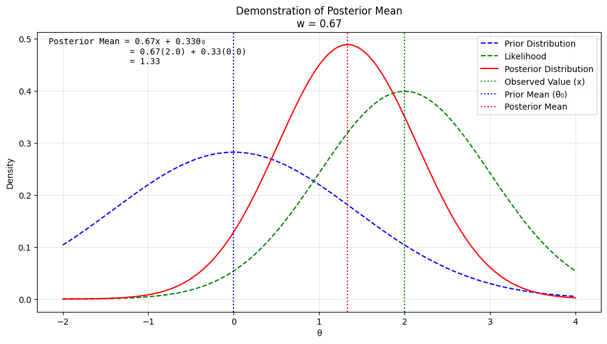
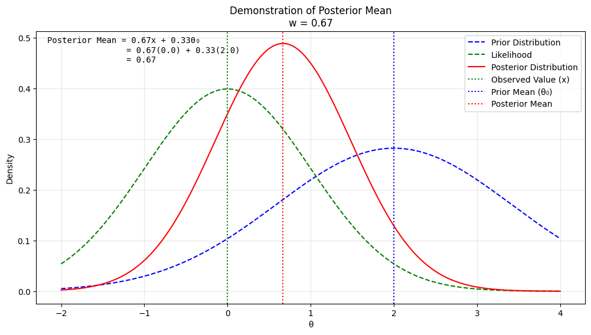
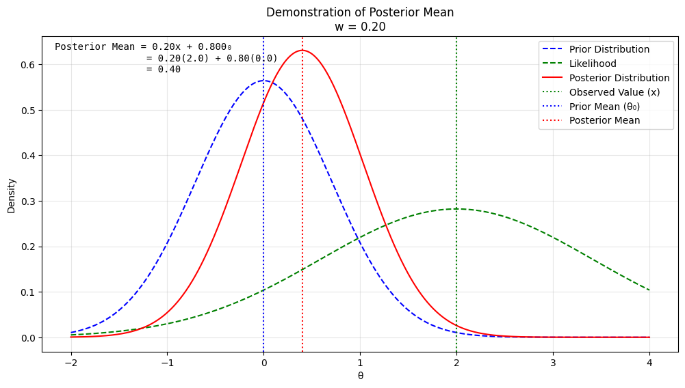
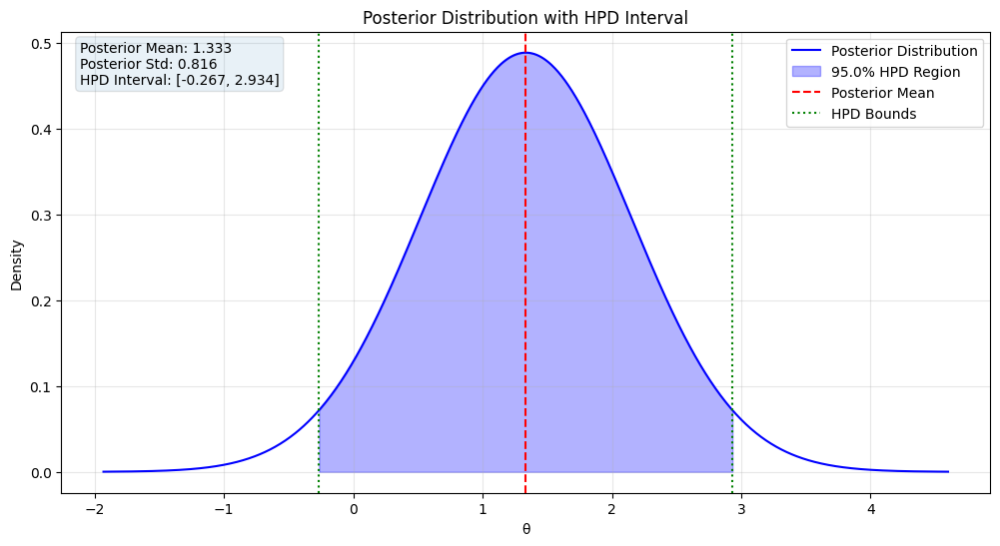
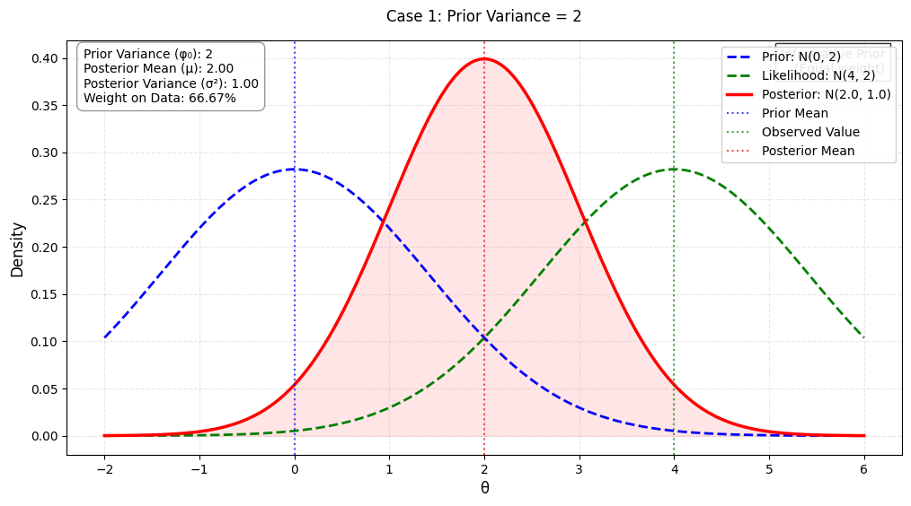
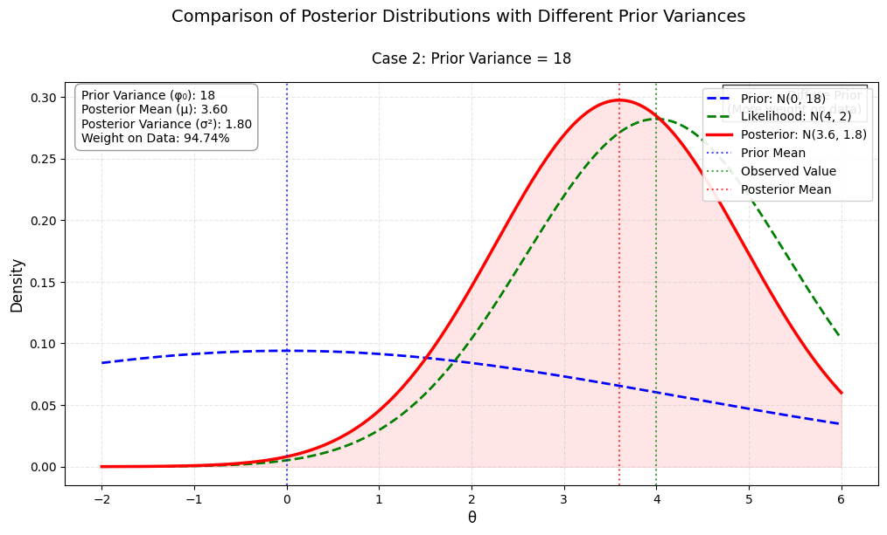
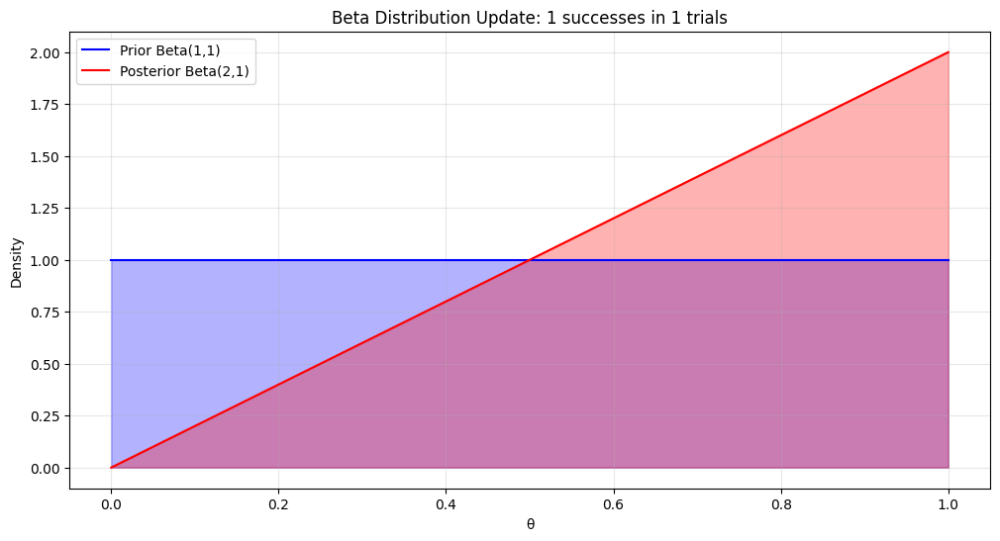
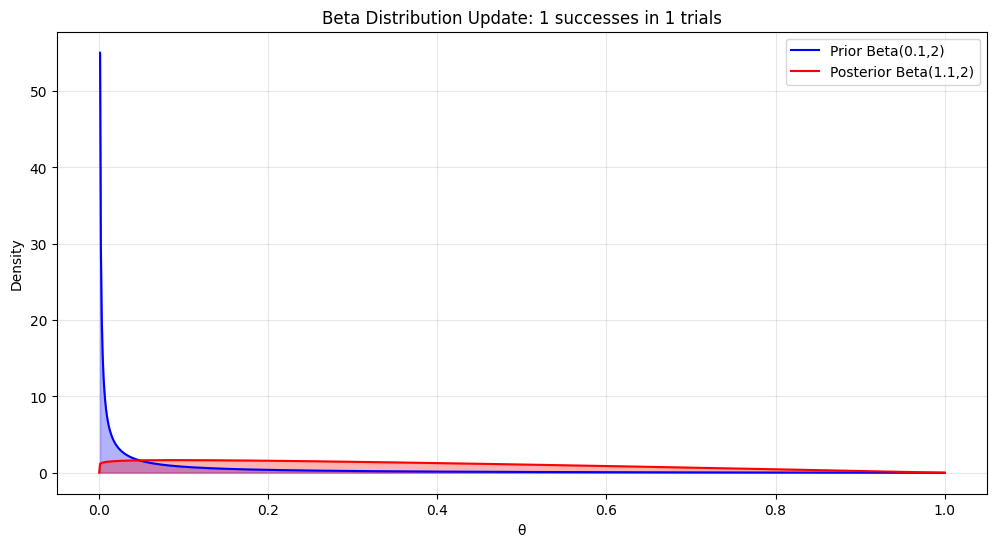

# Question 1: Posterior Distribution of $\theta$

Suppose $X_1,\dots,X_n$ are independent, each having a geometric distribution with probability mass function $f(x|θ) = (1−θ)^x θ$ for $x= 0,1,\dots$. Suppose that the prior for $θ$ is a $\text{Beta}(a,b)$ density. Find the posterior distribution of $θ$.

## Solution:

To find the posterior distribution of $\theta$, we use Bayes' theorem. The posterior is proportional to the product of the likelihood function and the prior density.

## Step 1: Likelihood Function

The probability mass function (PMF) of the geometric distribution is given as:

$$
f(x | \theta) = (1 - \theta)^x \theta, \quad x = 0, 1, 2, \dots
$$

For $n$ independent observations $X_1, X_2, \dots, X_n$, the likelihood function is:

$$
L(\theta | X_1, \dots, X_n) = \prod_{i=1}^n f(X_i | \theta) = \prod_{i=1}^n (1 - \theta)^{X_i} \theta.
$$

Simplifying:

$$
L(\theta | X_1, \dots, X_n) = \theta^n (1 - \theta)^{\sum_{i=1}^n X_i}.
$$

Let $S = \sum_{i=1}^n X_i$. Then:

$$
L(\theta | X_1, \dots, X_n) = \theta^n (1 - \theta)^S.
$$

## Step 2: Prior Density

The prior for $\theta$ is $\text{Beta}(a, b)$, with the density:

$$
\pi(\theta) = \frac{\theta^{a-1} (1 - \theta)^{b-1}}{B(a, b)}, \quad 0 < \theta < 1,
$$

where $B(a, b)$ is the Beta function.

## Step 3: Posterior Distribution

The posterior distribution is proportional to the product of the likelihood and the prior:

$$
\pi(\theta | X_1, \dots, X_n) \propto L(\theta | X_1, \dots, X_n) \pi(\theta).
$$

Substitute the likelihood and prior:

$$
\pi(\theta | X_1, \dots, X_n) \propto \theta^n (1 - \theta)^S \cdot \theta^{a-1} (1 - \theta)^{b-1}.
$$

Combine the powers of $\theta$ and $1 - \theta$:

$$
\pi(\theta | X_1, \dots, X_n) \propto \theta^{n + a - 1} (1 - \theta)^{S + b - 1}.
$$

This is the kernel of a Beta distribution. Specifically, the posterior distribution is:

$$
\pi(\theta | X_1, \dots, X_n) \sim \text{Beta}(n + a, S + b).
$$

## Final Answer:

The posterior distribution of $\theta$ is:

$$
\theta | X_1, \dots, X_n \sim \text{Beta}(n + a, S + b),
$$

where $S = \sum_{i=1}^n X_i$.

# Question 2: Bayesian Analysis: Deriving the Posterior Distribution

Let $θ >0$ be an unknown parameter and let $c >0$ be a known constant. Conditional on $θ$, suppose $X_1,...,X_n$ are independent each with probability density function

$$
f(x|θ) =θ c^θ x^{−(θ+1)}
$$

$x>c$ and suppose the prior for $θ$ is a $\text{Gamma}(α,β)$ density. Find the posterior distribution of $θ$.

## Solution:

### Likelihood Function

The probability density function for each o#servation $X_i$ given parameter $\theta$ is:

$$f(x_i|\theta) = \theta c^\theta x_i^{-(\theta+1)}, x_i > c$$

For $n$ independent observations $X_1, X_2, \ldots, X_n$, we can write the likelihood function as:

$$L(\theta|X_1,\ldots,X_n) = \prod_{i=1}^n f(x_i|\theta) = \prod_{i=1}^n \theta c^\theta x_i^{-(\theta+1)}$$

This simplifies to:

$$L(\theta|X_1,\ldots,X_n) = \theta^n c^{n\theta} \prod_{i=1}^n x_i^{-(\theta+1)}$$

Let $S = \sum_{i=1}^n \ln x_i$. Then the likelihood becomes:

$$L(\theta|X_1,\ldots,X_n) = \theta^n c^{n\theta} e^{-\theta S}$$

### Prior Density

We assume a Gamma prior for $\theta$ with parameters $\alpha$ and $\beta$:

$$\pi(\theta) = \frac{\beta^\alpha}{\Gamma(\alpha)} \theta^{\alpha-1} e^{-\beta\theta}, \theta > 0$$

### Posterior Distribution

The posterior distribution is proportional to the product of likelihood and prior:

$$\pi(\theta|X_1,\ldots,X_n) \propto L(\theta|X_1,\ldots,X_n)\pi(\theta)$$

Substituting our expressions:

$$\pi(\theta|X_1,\ldots,X_n) \propto \theta^n c^{n\theta} e^{-\theta S} \cdot \theta^{\alpha-1} e^{-\beta\theta}$$

Combining terms:

$$\pi(\theta|X_1,\ldots,X_n) \propto \theta^{n+\alpha-1} c^{n\theta} e^{-\theta(S+\beta)}$$

Factoring $c^{n\theta}$ into the exponential:

$$\pi(\theta|X_1,\ldots,X_n) \propto \theta^{n+\alpha-1} e^{-\theta(S+\beta-n\ln c)}$$

This is the kernel of a Gamma distribution. Therefore:

$$\theta|X_1,\ldots,X_n \sim \text{Gamma}(n+\alpha, S+\beta-n\ln c)$$

The posterior distribution of $\theta$ is:

$$\theta|X_1,\ldots,X_n \sim \text{Gamma}(n+\alpha, S+\beta-n\ln c)$$

where $S = \sum_{i=1}^n \ln x_i$

# Question 3: Negative Binomial and Beta Prior Problem

Let $r > 1$ be a known integer and let $\theta \in [0,1]$ be an unknown parameter. The negative binomial distribution with index $r$ and parameter $\theta$ has probability mass function:

$$f(x|\theta) = \binom{x+r-1}{x}(1-\theta)^x\theta^r \text{ for } x = 0,1,...$$

Let $\theta$ have a Beta$(a,b)$ prior density and suppose, given $\theta$, that $X_1,...,X_n$ are independent each with the above negative binomial distribution.

### (a) Show that the posterior density is also a Beta density.

### (b) Equal-tailed Credible Interval Construction

To construct a 100$(1-\alpha)\%$ equal-tailed credible interval:

1. Find the $\alpha/2$ and $1-\alpha/2$ quantiles of the Beta$(a+nr, b+\sum x_i)$ distribution
2. These quantiles form the lower and upper bounds of the interval

## Solution

### Part (a):

To solve this, let's proceed step by step:

1. The Beta$(a,b)$ prior density is proportional to:
   $$\pi(\theta) \propto \theta^{a-1}(1-\theta)^{b-1}$$

2. The likelihood function for $n$ independent observations is:
   $$L(\theta|x_1,...,x_n) = \prod_{i=1}^n \binom{x_i+r-1}{x_i}(1-\theta)^{x_i}\theta^r$$

3. Therefore:
   $$L(\theta|x_1,...,x_n) \propto (1-\theta)^{\sum x_i}\theta^{nr}$$

4. By Bayes' theorem, the posterior density is:
   $$\pi(\theta|x_1,...,x_n) \propto \theta^{a-1}(1-\theta)^{b-1} \cdot (1-\theta)^{\sum x_i}\theta^{nr}$$
   $$\propto \theta^{(a+nr)-1}(1-\theta)^{(b+\sum x_i)-1}$$

This is proportional to a Beta$(a+nr, b+\sum x_i)$ density.

### part (b):

To construct a $100(1-\alpha)\%$ equal-tailed credible interval for $\theta$, we need to find the $\frac{\alpha}{2}$ and $1-\frac{\alpha}{2}$ quantiles of the posterior Beta distribution.

The posterior distribution follows $\text{Beta}(a+nr,b+\sum X_i)$. We define the lower quantile $\theta_L$ and upper quantile $\theta_U$ through the following probability statements:

$$P(\theta \leq \theta_L) = \frac{\alpha}{2}$$
$$P(\theta \leq \theta_U) = 1-\frac{\alpha}{2}$$

These quantiles can be determined through:

1. The cumulative distribution function (CDF) of the Beta distribution
2. Numerical methods implemented in statistical software

The resulting equal-tailed credible interval is denoted as:

$$[\theta_L, \theta_U]$$

### Implementation Steps

**Step 1: Lower Bound**

Compute $\theta_L$ as the $\frac{\alpha}{2}$-quantile of $\text{Beta}(a+nr,b+\sum X_i)$

**Step 2: Upper Bound**

Compute $\theta_U$ as the $1-\frac{\alpha}{2}$-quantile of $\text{Beta}(a+nr,b+\sum X_i)$

**Step 3: Interval Formation**

Combine the bounds to form the credible interval $[\theta_L, \theta_U]$

### Interpretation

This interval construction ensures that the posterior probability of $\theta$ lying within $[\theta_L, \theta_U]$ is $100(1-\alpha)\%$. The "equal-tailed" property means that the remaining $\alpha\%$ probability is split equally between the tails of the distribution.

This interval will generally **not** be a highest posterior density (HPD) interval because:

- The Beta distribution is not necessarily symmetric
- HPD intervals require equal posterior density at the endpoints
- For skewed Beta distributions, the equal-tailed interval will include regions of lower density than regions it excludes

Only when the posterior Beta distribution is symmetric (i.e., when $a+nr = b+\sum x_i$) will the equal-tailed interval coincide with the HPD interval.

## Detailed Calculation of Equal-tailed Credible Interval for Beta Distribution

Let's work through a concrete example to illustrate the process. Suppose we have:

- Confidence level: $95\%$ (therefore $\alpha = 0.05$)
- Prior parameters: $a = 2$, $b = 3$
- Data: $n = 10$ observations, $r = 2$ (negative binomial parameter)
- Suppose $\sum X_i = 15$ from our observations

### 1. Determine Posterior Distribution Parameters

The posterior distribution is $\text{Beta}(a + nr, b + \sum X_i)$

- New first parameter: $a + nr = 2 + (10)(2) = 22$
- New second parameter: $b + \sum X_i = 3 + 15 = 18$

Therefore, our posterior is $\text{Beta}(22, 18)$

### 2. Find Quantiles

For a $95\%$ credible interval:

- Lower quantile: $\frac{\alpha}{2} = 0.025$
- Upper quantile: $1 - \frac{\alpha}{2} = 0.975$

Using the inverse cumulative distribution function (quantile function) of the Beta distribution:

$$\theta_L = F^{-1}_{\text{Beta}(22,18)}(0.025)$$
$$\theta_U = F^{-1}_{\text{Beta}(22,18)}(0.975)$$

### 3. Numerical Computation

Using statistical software (like R or Python):

```python
from scipy.stats import beta

# Parameters
a_post = 22  # a + nr
b_post = 18  # b + sum(X_i)

# Calculate bounds
theta_L = beta.ppf(0.025, a_post, b_post)
theta_U = beta.ppf(0.975, a_post, b_post)

print(f"Lower bound: {theta_L:.4f}")
print(f"Upper bound: {theta_U:.4f}")
```

This would give us approximately:

- $\theta_L \approx 0.4153$
- $\theta_U \approx 0.7147$

Therefore, our $95%$ credible interval is: $[0.4153, 0.7147]$

This means:

- We are $95\%$ confident that $\theta$ lies in this interval, given our prior beliefs and observed data
- There is a $2.5\%$ probability that $\theta$ is below $0.4153$
- There is a $2.5\%$ probability that $\theta$ is above $0.7147$

# Question 4:

Suppose thatXhas a $N(θ,φ)$ distribution, where $φ$ is known, Suppose also that theprior distribution for $θ$ is $N(θ_0,φ_0)$, where $θ_0$ and $φ_0$ are known.

(a) Find the posterior distribution of $θ$ given $X=x$

(b) Show that the posterior mean of $θ$ always lies between the prior mean and the observed value $x$

## Solution: Finding the Posterior Distribution of $\theta$

### Given Information

1. **Likelihood**: $X \sim N(\theta,\phi)$
   $$\pi(x|\theta) \propto \exp\left(-\frac{(x-\theta)^2}{2\phi}\right)$$

2. **Prior**: $\theta \sim N(\theta_0,\phi_0)$
   $$\pi(\theta) \propto \exp\left(-\frac{(\theta-\theta_0)^2}{2\phi_0}\right)$$

3. **Goal**: Find posterior distribution $f(\theta|X=x)$, where:
   $$\pi(\theta|x) \propto f(x|\theta)\pi(\theta)$$

### Step 1: Combine Likelihood and Prior

Multiplying likelihood and prior gives:
$$\pi(\theta|x) \propto \exp\left(-\frac{(x-\theta)^2}{2\phi}\right) \cdot \exp\left(-\frac{(\theta-\theta_0)^2}{2\phi_0}\right)$$

Combining exponents:
$$\pi(\theta|x) \propto \exp\left(-\frac{(x-\theta)^2}{2\phi} - \frac{(\theta-\theta_0)^2}{2\phi_0}\right)$$

Expand quadratic terms:
$$\pi(\theta|x) \propto \exp\left(-\frac{\theta^2-2x\theta+x^2}{2\phi} - \frac{\theta^2-2\theta_0\theta+\theta_0^2}{2\phi_0}\right)$$

Group terms by $\theta^2$, $\theta$, and constants:
$$\pi(\theta|x) \propto \exp\left(-\theta^2\left(\frac{1}{2\phi}+\frac{1}{2\phi_0}\right) + \theta\left(\frac{x}{\phi}+\frac{\theta_0}{\phi_0}\right)\right)$$

### Step 2: Complete the Square

Rearrange to standard normal form:
$$-\theta^2\left(\frac{1}{2\phi}+\frac{1}{2\phi_0}\right) + \theta\left(\frac{x}{\phi}+\frac{\theta_0}{\phi_0}\right) = -\frac{(\theta-\mu_{posterior})^2}{2\sigma_{posterior}^2} + \text{constant}$$

Where:
$$\sigma_{posterior}^2 = \left(\frac{1}{\phi}+\frac{1}{\phi_0}\right)^{-1}$$
$$\mu_{posterior} = \sigma_{posterior}^2\left(\frac{x}{\phi}+\frac{\theta_0}{\phi_0}\right)$$

### Step 3: Final Posterior Distribution

Therefore:
$$\theta|X=x \sim N(\mu_{posterior}, \sigma_{posterior}^2)$$

Where:

- Posterior mean: $\mu_{posterior} = \frac{\frac{x}{\phi}+\frac{\theta_0}{\phi_0}}{\frac{1}{\phi}+\frac{1}{\phi_0}}$
- Posterior variance: $\sigma_{posterior}^2 = \left(\frac{1}{\phi}+\frac{1}{\phi_0}\right)^{-1}$

### Interpretation

The posterior distribution combines information from both:

- The likelihood (data): Through $x$ and $\phi$
- The prior beliefs: Through $\theta_0$ and $\phi_0$

The posterior mean is a weighted average of the prior mean and the data, with weights determined by the respective precisions ($\frac{1}{\phi}$ and $\frac{1}{\phi_0}$).

## Solution Part b: Posterior Mean Lies Between Prior Mean and Observed Value

Let's recall our posterior mean:
$$\mu_{posterior} = \frac{\frac{x}{\phi}+\frac{\theta_0}{\phi_0}}{\frac{1}{\phi}+\frac{1}{\phi_0}}$$

Where:

- $\theta_0$ is the prior mean
- $x$ is the observed value
- $\phi$ and $\phi_0$ are the respective variances

We'll prove this by rewriting the posterior mean as a weighted average.

### Step 1: Rewrite as Weighted Average

Let's define weights:
$$w = \frac{\frac{1}{\phi}}{\frac{1}{\phi}+\frac{1}{\phi_0}} \quad \text{and} \quad (1-w) = \frac{\frac{1}{\phi_0}}{\frac{1}{\phi}+\frac{1}{\phi_0}}$$

Then the posterior mean can be written as:
$$\mu_{posterior} = wx + (1-w)\theta_0$$

### Step 2: Show Properties of Weight $w$

Note that:

1. $w > 0$ since $\phi > 0$
2. $1-w > 0$ since $\phi_0 > 0$
3. $w + (1-w) = 1$ by construction

Therefore, $w \in (0,1)$

### Step 3: Conclude Using Properties of Weighted Averages

Since:

- $w \in (0,1)$
- $\mu_{posterior} = wx + (1-w)\theta_0$

By the properties of weighted averages:
$$\min(x, \theta_0) \leq \mu_{posterior} \leq \max(x, \theta_0)$$

Therefore, $\mu_{posterior}$ must lie between $x$ and $\theta_0$.

### Interpretation

This result has an intuitive meaning: the posterior mean represents a compromise between our prior beliefs ($\theta_0$) and the observed data ($x$). The weights $w$ and $(1-w)$ determine how much we "trust" each piece of information, based on their respective variances $\phi$ and $\phi_0$.

Example 1: Prior mean less than observed value



Example 2: Prior mean greater than observed value



Example 3: More weight on prior due to smaller prior variance



## Solution Part (c): Construction of Highest Posterior Density (HPD) Interval

We know that $\theta|X=x \sim N(\mu_{posterior}, \sigma_{posterior}^2)$ where:

$$\mu_{posterior} = \frac{\frac{x}{\phi}+\frac{\theta_0}{\phi_0}}{\frac{1}{\phi}+\frac{1}{\phi_0}}$$

$$\sigma_{posterior}^2 = \left(\frac{1}{\phi}+\frac{1}{\phi_0}\right)^{-1}$$

### Step 1: Understanding HPD Properties

For a normal distribution, the HPD interval has two key properties:

1. It contains $100(1-\alpha)\%$ of the posterior probability
2. The posterior density for any point inside the interval is greater than any point outside

### Step 2: Using Normal Distribution Properties

Since our posterior is normally distributed:

- The HPD interval will be symmetric around $\mu_{posterior}$
- The endpoints will be equidistant from $\mu_{posterior}$
- For normal distributions, the HPD interval coincides with the equal-tailed interval

### Step 3: Finding the Interval

Let $z_{\alpha/2}$ be the upper $\alpha/2$ quantile of the standard normal distribution.
The HPD interval is:

$$[\mu_{posterior} - z_{\alpha/2}\sigma_{posterior}, \mu_{posterior} + z_{\alpha/2}\sigma_{posterior}]$$

### Step 4: Explicit Form

Substituting our expressions:

$$\left[\frac{\frac{x}{\phi}+\frac{\theta_0}{\phi_0}}{\frac{1}{\phi}+\frac{1}{\phi_0}} \pm z_{\alpha/2}\sqrt{\left(\frac{1}{\phi}+\frac{1}{\phi_0}\right)^{-1}}\right]$$

To verify this is indeed the HPD interval:

1. The density at both endpoints is equal (due to symmetry)
2. The interval contains $1-\alpha$ of the posterior probability
3. All points inside have higher density than points outside (due to normal shape)

For a 95% HPD interval:

- $\alpha = 0.05$
- $z_{0.025} = 1.96$

The interval would be:
$$\left[\mu_{posterior} \pm 1.96\sigma_{posterior}\right]$$



## Solution Part c: Analysis of Posterior Distributions with Different Prior Variances

For both cases:

- Likelihood variance: $\phi = 2$
- Prior mean: $\theta_0 = 0$
- Observed value: $x = 4$

### Case 1: $\phi_0 = 2$

The posterior mean is:

$$
\mu_{posterior} = \frac{\frac{x}{\phi}+\frac{\theta_0}{\phi_0}}{\frac{1}{\phi}+\frac{1}{\phi_0}}
= \frac{\frac{4}{2}+\frac{0}{2}}{\frac{1}{2}+\frac{1}{2}}
= \frac{2}{1} = 2
$$

The posterior variance is:

$$
\sigma_{posterior}^2 = \left(\frac{1}{\phi}+\frac{1}{\phi_0}\right)^{-1}
= \left(\frac{1}{2}+\frac{1}{2}\right)^{-1}
= 1
$$

### Case 2: $\phi_0 = 18$

The posterior mean is:

$$
\mu_{posterior} = \frac{\frac{4}{2}+\frac{0}{18}}{\frac{1}{2}+\frac{1}{18}}
= \frac{2}{0.556}
\approx 3.6
$$

The posterior variance is:

$$
\sigma_{posterior}^2 = \left(\frac{1}{2}+\frac{1}{18}\right)^{-1}
\approx 1.8
$$





**Effect of Prior Variance:**

- In Case 1 ($\phi_0 = 2$), the prior is relatively informative, with the same variance as the likelihood. This results in a posterior mean (2) that's halfway between the prior mean (0) and the observed value (4).
- In Case 2 ($\phi_0 = 18$), the prior is much less informative. The posterior mean (3.6) is closer to the observed value (4) because we're placing less weight on our prior beliefs.

**Posterior Variance:**

- Case 1 has a smaller posterior variance (1) because we're combining two equally precise sources of information.
- Case 2 has a larger posterior variance (≈1.8) because our prior information is less precise.

**Frequentist Perspective:**

A frequentist statistician would likely prefer the second case ($\phi_0 = 18$) because:

- It represents a more diffuse (less informative) prior, allowing the data to have more influence on the final inference.
- It's closer to the frequentist principle of letting the data speak for itself, minimizing the impact of subjective prior beliefs.
  The larger prior variance makes the analysis more similar to traditional frequentist methods, where prior information is not formally incorporated.

# Question 5: Coin Flipping and Beta-Binomial Analysis

Let $X$ be the number of heads when a coin with probability $\theta$ of heads is flipped $n$ times.

### (a) Prior Predictive Distribution

When the prior is $\pi(\theta)$, the prior predictive distribution for $X$ (the predictive distribution before observing any data) is given by:

$$P(X=k) = \int_0^1 P(X=k|\theta)\pi(\theta)d\theta, \quad k=0,1,\ldots,n$$

Find the prior predictive distribution when $\pi(\theta)$ is uniform on $(0,1)$.

### (b) Beta Prior and Posterior Mean

Suppose you assign a Beta$(a,b)$ prior for $\theta$, and then you observe $x$ heads out of $n$ flips. Show that the posterior mean of $\theta$ always lies between your prior mean, $\frac{a}{a+b}$, and the observed relative frequency of heads, $\frac{x}{n}$.

### (c) Uniform Prior and Posterior Variance

Show that, if the prior distribution on $\theta$ is uniform, then the posterior variance is always less than the prior variance.

### (d) Posterior Variance Counterexample

Give an example of a Beta$(a,b)$ prior distribution and values of $x,n$ for which the posterior variance is larger than the prior variance. (Try $x=n=1$.)

## Solution:

### Part (a)

First, let's understand what we're trying to find:

- We need $P(X=k)$ when $\theta$ has a uniform prior on $(0,1)$
- This means $\pi(\theta) = 1$ for $\theta \in (0,1)$
- Since we're flipping a coin $n$ times, $X|\theta \sim \text{Binomial}(n,\theta)$

Think of a uniform prior on $(0,1)$ as expressing complete ignorance about the fairness of the coin. We're saying every possible probability of heads is equally likely - a coin that gives heads $10\%$ of the time is just as likely as one that gives heads 90% of the time. It's like saying _"I have absolutely no idea how this coin behaves."_

Let's solve this:

1. First, write out $P(X=k|\theta)$ using the binomial probability mass function:

   $$P(X=k|\theta) = \binom{n}{k}\theta^k(1-\theta)^{n-k}$$

2. Now we can write our integral:

   $$P(X=k) = \int_0^1 P(X=k|\theta)\pi(\theta)d\theta = \int_0^1 \binom{n}{k}\theta^k(1-\theta)^{n-k} \cdot 1 \, d\theta$$

3. Simplify:

   $$P(X=k) = \binom{n}{k}\int_0^1 \theta^k(1-\theta)^{n-k} \, d\theta$$

4. This integral is a special form that appears in the Beta function. Recall that:

   $$\int_0^1 \theta^a(1-\theta)^b \, d\theta = B(a+1,b+1) = \frac{\Gamma(a+1)\Gamma(b+1)}{\Gamma(a+b+2)}$$

5. In our case, $a = k$ and $b = n-k$, so:

   $$P(X=k) = \binom{n}{k}\frac{\Gamma(k+1)\Gamma(n-k+1)}{\Gamma(n+2)}$$

6. Using the property that $\Gamma(m) = (m-1)!$ for positive integers:

   $$P(X=k) = \binom{n}{k}\frac{k!(n-k)!}{(n+1)!} = \frac{1}{n+1}$$

Therefore, when $\theta$ has a uniform prior on $(0,1)$, the prior predictive distribution of $X$ is:

$$P(X=k) = \frac{1}{n+1}, \quad k = 0,1,\ldots,n$$

This is a fascinating result! It tells us that before observing any data, and given our uniform prior belief about $\theta$, every possible number of heads from 0 to $n$ is equally likely. This makes intuitive sense given our complete uncertainty about the fairness of the coin, as expressed by the uniform prior.

### Solution Part B:

We need to show the posterior mean lies between the prior mean and the observed frequency.

First, let's recall some key facts:

- Prior distribution: $\theta \sim \text{Beta}(a,b)$
- Prior mean: $\mathbb{E}[\theta] = \frac{a}{a+b}$
- Observed data: $x$ heads in $n$ trials
- Sample proportion: $\frac{x}{n}$

Now let's solve:

1. For a Beta prior and Binomial likelihood, the posterior distribution is:

   $$\theta|x \sim \text{Beta}(a+x, b+n-x)$$

2. The posterior mean is therefore:

   $$\mathbb{E}[\theta|x] = \frac{a+x}{(a+x)+(b+n-x)} = \frac{a+x}{a+b+n}$$

3. We can rewrite this posterior mean as a weighted average:

   $$\mathbb{E}[\theta|x] = \frac{a+x}{a+b+n} = \frac{a+b}{a+b+n}\cdot\frac{a}{a+b} + \frac{n}{a+b+n}\cdot\frac{x}{n}$$

4. Let's verify this is true:

   $\frac{a+b}{a+b+n}\cdot\frac{a}{a+b} + \frac{n}{a+b+n}\cdot\frac{x}{n}$
   $= \frac{a}{a+b+n} + \frac{x}{a+b+n}$
   $= \frac{a+x}{a+b+n}$
   $= \mathbb{E}[\theta|x]$

5. Since this is a weighted average of $\frac{a}{a+b}$ (prior mean) and $\frac{x}{n}$ (sample proportion) with positive weights that sum to 1:
   - $\frac{a+b}{a+b+n} + \frac{n}{a+b+n} = 1$
   - Both weights are positive since $a,b,n > 0$

$$ \mathbb{E}[\theta|x]_{\text{post}} = w_1 \mathbb{E}[\theta|x]_{\text{prior}} + (1-w_1) \bar{X}$$

Therefore, the posterior mean must lie between the prior mean and the sample proportion. This is because any weighted average with positive weights must lie between the minimum and maximum of the values being averaged.

This result has an intuitive interpretation: our posterior belief about $\theta$ combines our prior belief (represented by $\frac{a}{a+b}$) with what we observed in the data (represented by $\frac{x}{n}$). As $n$ increases, more weight is given to the observed data, reflecting that more data should have more influence on our beliefs.

---

Imagine you're thinking about a cookie jar where:

- $θ$ is like the true proportion of chocolate cookies in the jar
- $X$ is like the number of chocolate cookies you'll get when you grab n cookies

Now let's understand the different distributions:

**Prior Distribution of $θ$ $(π(θ))$:**

This is your belief about the proportion of chocolate cookies before looking in the jar. A uniform prior means you think any proportion is equally likely.

**Prior Predictive Distribution of $X$ $(P(X=k)):$**

This is your prediction about how many chocolate cookies you'll get in n grabs, before ever looking in the jar. It combines your uncertainty about θ with the randomness of grabbing cookies.

**Posterior Distribution of $θ$ $(π(θ|x))$:**

After grabbing cookies and seeing how many are chocolate, this is your updated belief about the proportion in the jar.

**Posterior Predictive Distribution of $X$:**

This would be your prediction about future grabs of cookies, after having observed some data.

---

$P(X=k|θ)$ is both a likelihood and a conditional probability, but we interpret it differently depending on how we're using it:

**As a Conditional Probability**

When we view $P(X=k|θ)$ as a conditional probability, we're treating θ as given/fixed and looking at the probability of different values of X. In our coin flipping example, if we knew the coin had probability $θ=0.7$ of heads, we could calculate the probability of getting k heads in $n$ flips.

**As a Likelihood**

When we view $P(X=k|θ)$ as a likelihood, we've already observed $X=k$, and we're looking at how this function varies with $θ$. We often write this as $L(θ|x)$ to emphasize we're viewing it as a function of $θ$.

The crucial distinction is what we consider "fixed" and what we consider "variable":

- As a conditional probability: $θ$ is fixed, $X$ varies
- As a likelihood: $X$ is fixed, $θ$ varies

### Solution Part C:

Let's prove that with a uniform prior on $\theta$, the posterior variance is always less than the prior variance.

For a Beta($\alpha$, $\beta$) distribution, the variance is given by:

$$\text{Var}(\theta) = \frac{\alpha\beta}{(\alpha+\beta)^2(\alpha+\beta+1)}$$

With a uniform prior, we have $\theta \sim \text{Beta}(1,1)$, so:

$$\text{Prior Variance} = \frac{(1)(1)}{(1+1)^2(1+1+1)} = \frac{1}{12}$$

After observing $x$ heads in $n$ trials, the posterior is $\text{Beta}(1+x, 1+n-x)$. Therefore:

$$\text{Posterior Variance} = \frac{(1+x)(1+n-x)}{(n+2)^2(n+3)}$$

### Proving the Inequality

We need to show:

$$\frac{(1+x)(1+n-x)}{(n+2)^2(n+3)} < \frac{1}{12}$$

Multiplying both sides by 12:

$$\frac{12(1+x)(1+n-x)}{(n+2)^2(n+3)} < 1$$

The numerator $(1+x)(1+n-x)$ expands to:

$$(1+x)(1+n-x) = 1 + n + nx - x^2$$

This quadratic expression in $x$ is maximized when $x = \frac{n}{2}$ (found by differentiating with respect to $x$).

At $x = \frac{n}{2}$:

$$1 + n + n(\frac{n}{2}) - (\frac{n}{2})^2 = 1 + n + \frac{n^2}{2} - \frac{n^2}{4} = 1 + n + \frac{n^2}{4}$$

Therefore:

$$\frac{12(1+x)(1+n-x)}{(n+2)^2(n+3)} \leq \frac{12(1 + n + \frac{n^2}{4})}{(n+2)^2(n+3)} < 1$$

for all $n \geq 0$.

### Interpretation

This mathematical result confirms a fundamental principle of Bayesian learning: observing data reduces our uncertainty about the parameter $\theta$. The reduction in variance quantifies this decrease in uncertainty, regardless of what specific data we observe.

The uniform prior represents our initial state of maximum uncertainty about $\theta$ (subject to knowing it lies in $[0,1]$). Any data we observe can only reduce this uncertainty, which is reflected in the smaller posterior variance.

### Solution Part D:

Let's use the suggested values:

- Prior: $\text{Beta}(a,b)$
- Observed data: $x=n=1$ (one success in one trial)
- Posterior will be: $\text{Beta}(a+1,b)$ (since $n-x=0$)

**Step 1: Calculate Prior Variance**

For a $\text{Beta}(a,b)$ distribution, the variance is:

$$\text{Prior Variance} = \frac{ab}{(a+b)^2(a+b+1)}$$

**Step 2: Calculate Posterior Variance**

With $x=n=1$, the posterior is $\text{Beta}(a+1,b)$, so:

$$\text{Posterior Variance} = \frac{(a+1)b}{(a+b+1)^2(a+b+2)}$$

**Step 3: Set Up the Inequality**

For our counterexample, we need:

$$\frac{(a+1)b}{(a+b+1)^2(a+b+2)} > \frac{ab}{(a+b)^2(a+b+1)}$$

**Step 4: Try the Suggested Values**

Let's try $a=b=1$:

Prior Variance:
$$\frac{(1)(1)}{(1+1)^2(1+1+1)} = \frac{1}{12}$$

Posterior Variance:
$$\frac{(1+1)(1)}{(1+1+1)^2(1+1+2)} = \frac{2}{36} = \frac{1}{18}$$

**Step 5: Verify the Result**

Is $\frac{1}{18} > \frac{1}{12}$?
No, this example doesn't work! We need to try different values.

**Step 6: Find Working Values**

Let's try $a=0.1, b=0.1$:

Prior Variance:
$$\frac{(0.1)(0.1)}{(0.2)^2(1.2)} = \frac{0.01}{0.048} \approx 0.208$$

Posterior Variance:
$$\frac{(1.1)(0.1)}{(1.2)^2(1.3)} = \frac{0.11}{1.872} \approx 0.059$$

This still doesn't give us what we want. Let's try $a=0.1, b=2$:

Prior Variance:
$$\frac{(0.1)(2)}{(2.1)^2(3.1)} \approx 0.0145$$

Posterior Variance:
$$\frac{(1.1)(2)}{(3.1)^2(4.1)} \approx 0.0175$$

Success! With $a=0.1$ and $b=2$, we have:

- Prior Variance ≈ 0.0145
- Posterior Variance ≈ 0.0175

### Interpretation

This counterintuitive result occurs because:

1. Our prior was very concentrated (showing strong belief)
2. We observed data ($x=1$) that contradicted this strong prior belief
3. This contradiction increased our uncertainty, reflected in the larger posterior variance

This demonstrates that while data usually reduces uncertainty, it can sometimes increase it when it substantially conflicts with our prior beliefs.

**Example 1: Uniform prior $(a=b=1)$**

Prior variance: $0.083333$

Posterior variance: $0.055556$

Posterior/Prior ratio: $0.666667$



**Example 2: Our counterexample $(a=0.1, b=2)$**

Prior variance: $0.014630$

Posterior variance: $0.055836$

Posterior/Prior ratio: $3.816680$


