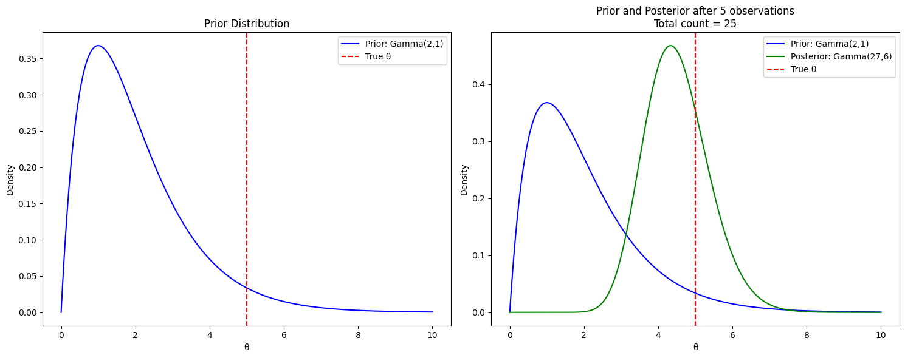

# Bayesian Inference: A Different Perspective on Statistical Analysis

## Introduction to Bayesian Statistics

The key paradigm shift in Bayesian statistics is treating unknown parameters as random variables rather than fixed constants. This contrasts with the frequentist approach we've studied previously, which views parameters as fixed and relies on repeated sampling interpretations.

## The Core Bayesian Framework

### Prior Distribution

We start with a prior distribution $π(θ)$ that represents our beliefs about the parameter $θ$ before seeing any data. This can be either:

- A probability density function (for continuous parameters)
- A probability mass function (for discrete parameters)

### Likelihood Function

We observe data $x$ and have a model $f(x|θ)$ that gives the likelihood of observing this data given a particular value of $θ$.

### Posterior Distribution

Using Bayes' Theorem, we combine the prior and likelihood to get the posterior distribution:

$π(θ|x) = f(x|θ)π(θ)/f(x)$

where $f(x) = ∫f(x|θ)π(θ)dθ$ is the marginal likelihood.

More simply, we can write:
$π(θ|x) ∝ f(x|θ) × π(θ)$

_Intuition_: The posterior distribution updates our prior beliefs about $θ$ based on the observed data. Areas of high likelihood pull the posterior in their direction, while the prior acts as a regularizing force.

## Key Examples

### Example 1: Bernoulli-Beta Model

For a sequence of Bernoulli trials with parameter θ:

- Data: $X₁,...,Xₙ \sim \text{Bernoulli}(θ)$
- Prior: $θ \sim \text{Beta}(a,b)$
- Likelihood: $f(x|θ) = θʳ(1-θ)ⁿ⁻ʳ$ where $r = Σxᵢ$
- Posterior: $θ|x \sim \textbf{Beta}(r+a, n-r+b)$

_Intuition_: The Beta distribution is conjugate to the Bernoulli likelihood, meaning the posterior has the same form as the prior. The parameters are updated by adding the number of successes $(r)$ to a and the number of failures $(n-r)$ to $b$.

**Parameter Interpretation**

- $a$ can be thought of as "prior successes"
- $b$ can be thought of as "prior failures"
- The posterior parameters combine prior and observed data:

  - $a+r:$ prior + observed successes
  - $b+n-r$: prior + observed failures

**Properties of the Model**

- Prior Mean: $E[θ] = a/(a+b)$
- Posterior Mean: $E[θ|x] = (a+r)/(a+b+n)$

- This is a weighted average between:

  - Prior mean: $a/(a+b)$
  - Sample proportion: $r/n$
  - Weights depend on relative strength of prior $(a+b)$ vs. data $(n)$

**With weak prior (small $a,b$):**

- Posterior is dominated by data
- Posterior mean ≈ sample proportion $(r/n)$

**With strong prior (large $a,b$):**

- Posterior stays closer to prior
- More data needed to shift beliefs

**As $n → ∞:$**

- Prior becomes irrelevant
- Posterior concentrates around true $θ$

**Second Set of Plots (Strong Prior)**

- Uses a $\text{Beta}(20,20)$ prior, which represents strong initial belief that θ is around 0.5
- Even with the same amount of data (100 trials), the posterior is less concentrated around 0.7
- This demonstrates how a strong prior can resist updating from data

**Prior Comparison Plot**

The following Compares four different prior choices:

- Uniform Prior ($\text{Beta}(1,1)$): Complete uncertainty
- Jeffreys Prior ($\text{Beta}(0.5,0.5)$): Noninformative, invariant prior
- Informative Prior ($\text{Beta}(5,5)$): Moderate belief centered at 0.5
- Strong Wrong Prior ($\text{Beta}(20,5)$): Strong incorrect belief

Shows how different priors lead to different posteriors with the same data

### Example 2: Poisson-Gamma Model

For Poisson count data:

- Data: $X₁,...,Xₙ \sim \text{Poisson}(θ)$
- Prior: $θ \sim \text{Gamma}(α,β)$
- Likelihood: $f(x|θ) ∝ θʳe⁻ⁿθ$ where $r = Σxᵢ$
- Posterior: $θ|x \sim \textbf{Gamma}(r+α, n+β)$

$$
Posterior ∝ Likelihood × Prior ∝ (θʳe^{-nθ}) × (θ^{\alpha -1}e^{-βθ}) ∝ θ^{r+\alpha -1}e^{-(n+β)θ}
$$

We've created two scenarios:

**Informative Prior: Starting with Gamma(10,2)**

This represents strong prior belief that θ is around 5 (since mean = α/β = 5)
The prior is quite concentrated, showing confidence in this belief

We've created two scenarios:

**Informative Prior: Starting with Gamma(10,2)**

- This represents strong prior belief that $θ$ is around $5$ (since mean $= α/β = 5$)
- The prior is quite concentrated, showing confidence in this belief

**Weak Prior: Starting with Gamma(2,1)**

- This represents weaker prior beliefs
- The distribution is much more spread out

In both cases, we observe the same data (sum of 25 counts over 5 observations), but notice how differently they update based on the prior strength.

the Gamma distribution is called the "conjugate prior" for the Poisson - it captures exactly the kind of information we learn from observing a Poisson process, in exactly the way we would want to update our beliefs.

**Gamma & Beta**

The key relationship between $\text{Beta}$ and $\text{Gamma}$ distributions comes through their definitions. Let's build this step by step:

First, imagine you have two independent Gamma random variables:

- $X₁ \sim \text{Gamma}(α, 1)$
- $X₂ \sim \text{Gamma}(β, 1)$
- Now, consider the ratio:

- $Y = X₁/(X₁ + X₂)$

This ratio Y follows a $\text{Beta}(α, β)$ distribution!

In other words, if you take two Gamma distributions and normalize one by their sum, you get a Beta distribution. This is why both distributions are so naturally suited for Bayesian analysis - they're fundamentally connected.

- Gamma distributions often model rates or scales (like events per unit time)
- Beta distributions often model proportions or probabilities
- **Beta-Binomial:** Models successes/failures (like coin flips)
- **Gamma-Poisson:** Models counts (like arrivals)

**Consider this real-world scenario:**

Imagine you're monitoring two Poisson processes:

- **Process 1:** Customers entering a store (rate $λ₁$)
- **Process 2:** Customers making purchases (rate $λ₂$)

Now consider:

- The rates $λ₁$ and $λ₂$ might each follow Gamma distributions
- The conversion rate (proportion of entrants who buy) would be $λ₂/(λ₁ + λ₂)$
- This conversion rate follows a Beta distribution!

## Making Inferences

### Point Estimates

From the posterior distribution, we can compute various summaries:

- Posterior mode (MAP estimate)
- Posterior mean: $E(θ|x)$
- Posterior median

### Interval Estimates

A $100(1-α)%$ credible interval $C$ satisfies:

$∫_a^b π(θ|x)dθ = 1-α$

Two common types:

1. Equal-tailed intervals: Put $α/2$ probability in each tail
2. Highest Posterior Density (HPD) intervals: Include the values of $θ$ with highest posterior density

_Key Insight_: Unlike frequentist confidence intervals, Bayesian credible intervals have a direct probability interpretation: "The probability that θ lies in $C$, given the data, is $1-α$."

### Example: Binomial Model with Uniform Prior

For $X \sim \text{Binomial}(n,θ)$ with $θ \sim U(0,1)$:

- Posterior: $θ|x \sim \text{Beta}(x+1, n-x+1)$
- Posterior mean: $E(θ|x) = (x+1)/(n+2)$
- Posterior mode: $x/n$ (same as MLE)

_Intuition_: Even with all successes $(x=n)$, the posterior mean is less than 1, reflecting appropriate Bayesian shrinkage toward the prior mean.

### Understanding HPD Intervals

The plot shows a $\text{Gamma}(2,2)$ distribution, which is a posterior distribution for some parameter $θ$. There are a few key things to notice:

The Shaded Region: This represents a $90\%$ HPD interval from $0.04$ to $2.0$. This means we're $90\%$ confident that $θ$ lies in this interval, given our data.
The Height Criterion: A unique feature of HPD intervals is that any point inside the interval has a higher probability density than any point outside. Think of it like a horizontal line that slices through the distribution - all points above the line are included in the interval.

