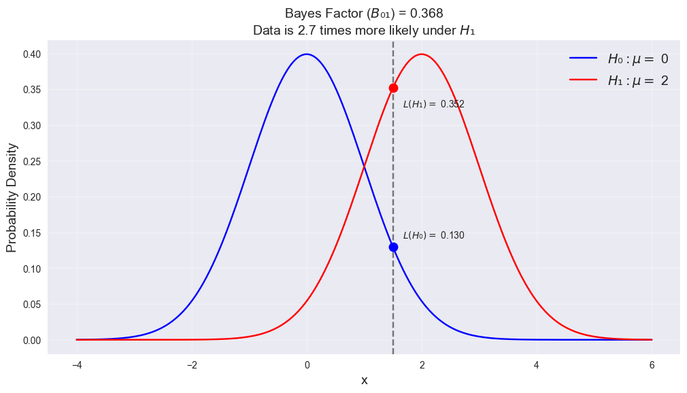

# Bayesian Hypothesis Testing and Bayes Factors

## Introduction

When comparing two competing hypotheses ($H₀$ and $H₁$), the Bayesian approach offers a fundamentally different perspective from frequentist testing. Rather than working with p-values and significance levels, Bayesian testing:

1. Treats hypotheses as having probabilities
2. Updates these probabilities based on observed data
3. Directly compares the relative evidence for competing hypotheses

## Prior and Posterior Odds

### Prior Odds

Before observing any data, we assign prior probabilities $P(H₀)$ and $P(H₁)$ to our hypotheses, where $P(H₀) + P(H₁) = 1.$ The prior odds are defined as:

$\text{Prior Odds} = \frac{P(H_0)}{P(H_1)} = \frac{P(H_0)}{1-P(H_0)}$

For example, if we believe $H₀$ and $H₁$ are equally likely before seeing data, we would set $P(H₀) = P(H₁) = 0.5,$ giving prior odds of 1.

### Posterior Odds

After observing data $x,$ we update our probabilities to get posterior probabilities $P(H₀|x)$ and $P(H₁|x)$. The posterior odds are:

$\text{Posterior Odds} = \frac{P(H_0|x)}{P(H_1|x)}$

## The Bayes Factor

The Bayes factor $(B₀₁)$ is the ratio of marginal likelihoods:

$B_{01} = \frac{P(x|H_0)}{P(x|H_1)}$

The fundamental relationship connecting prior odds, posterior odds, and the Bayes factor is:

$\text{Posterior Odds} = \text{Bayes Factor} \times \text{Prior Odds}$

### Interpretation

- $B₀₁ > 1:$ Data supports $H₀$ over $H₁$
- $B₀₁ < 1:$ Data supports $H₁$ over $H₀$
- $B₀₁ = 1:$ Data provides equal support for both hypotheses

### Standard Evidence Categories

| Bayes Factor ($B₀₁$) | $2log(B₀₁)$ | Evidence for $H₀$        |
| -------------------- | ----------- | ------------------------ |
| < 1                  | < 0         | Negative (supports $H₁$) |
| 1-3                  | 0-2         | Barely worth mentioning  |
| 3-20                 | 2-6         | Positive                 |
| 20-150               | 6-10        | Strong                   |
| > 150                | > 10        | Very strong              |

## Calculating Bayes Factors

The calculation method depends on whether the hypotheses are simple or composite:

### Simple vs Simple Hypotheses

When both $H₀: θ = θ₀$ and $H₁: θ = θ₁$ are simple:

$B_{01} = \frac{f(x|\theta_0)}{f(x|\theta_1)}$

### Composite Hypotheses

When dealing with composite hypotheses ($H₀: θ ∈ Θ₀$ and $H₁: θ ∈ Θ₁$):

$B_{01} = \frac{\int_{\Theta_0} f(x|\theta)\pi(\theta|H_0)d\theta}{\int_{\Theta_1} f(x|\theta)\pi(\theta|H_1)d\theta}$

### Mixed Case

For simple $H₀$ vs composite $H₁$:

$B_{01} = \frac{f(x|\theta_0)}{\int_{\Theta_1} f(x|\theta)\pi(\theta|H_1)d\theta}$

## Key Advantages and Properties

1. **Symmetry**: Unlike frequentist testing, Bayesian hypothesis testing treats $H₀$ and $H₁$ symmetrically.

2. **Direct Interpretation**: Bayes factors provide a direct measure of relative evidence between hypotheses.

3. **No Significance Level**: There's no need to pre-specify a significance level $α$.

4. **Sequential Testing**: Bayes factors can be updated as new data arrives without requiring adjustment for multiple testing.

**Frequentist vs Bayesian Interpretation**

In frequentist testing, a p-value of 0.03 means:

_"If $H₀$ were true, we would observe data this extreme or more extreme $3\%$ of the time"_
This is an indirect and often misinterpreted statement. It doesn't tell us what we really want to know - the probability that H₀ is true given our data.

In contrast, with Bayesian testing, if we get a Bayes factor $B₀₁ = 5$, we can directly say:

_"The data is 5 times more likely under H₀ than under $H₁$"_

If we had equal prior probabilities ($P(H₀) = P(H₁) = 0.5$), we can even say:

_"Given the data, $H₀$ is 5 times more likely to be true than $H₁$"_

**Asymmetry in Frequentist Testing**

In frequentist hypothesis testing, $H₀$ and $H₁$ are treated very differently:

- $H₀$ is given a privileged position
- We calculate probabilities assuming $H₀$ is true
- We can only reject $H₀$, never accept it
- We control error rates only for $H₀$ (Type I error)

For example, testing $H₀: μ = 0$ vs $H₁: μ ≠ 0$:

- We calculate $P(data|H₀)$
- But we don't calculate $P(data|H₁)$
- We can only conclude _"reject $H₀$"_ or _"fail to reject $H₀$"_

**Symmetry in Bayesian Testing**

Bayesian testing treats both hypotheses equally:

- Both hypotheses get prior probabilities
- We calculate $P(data|H₀)$ and $P(data|H₁)$
- The Bayes factor compares evidence for both hypotheses directly
- We can conclude in favor of either hypothesis

## Important Considerations

1. **Proper Priors**: Bayes factors require proper prior distributions - improper priors can lead to undefined Bayes factors.

2. **Sensitivity**: Results can be sensitive to prior specifications, especially with small sample sizes.

3. **Computation**: Calculating marginal likelihoods can be computationally challenging for complex models.

## Example

Suppose we're testing whether a coin is fair ($H₀: θ = 0.5$) versus biased towards heads $(H₁: θ > 0.5).$ After observing 8 heads in $10$ tosses:

- If using a point alternative $H₁: θ = 0.7:$
  $B_{01} = \frac{(0.5)^8(0.5)^2}{(0.7)^8(0.3)^2} \approx 0.037$

This Bayes factor of $0.037$ indicates strong evidence against the fair coin hypothesis, favoring the biased alternative.
