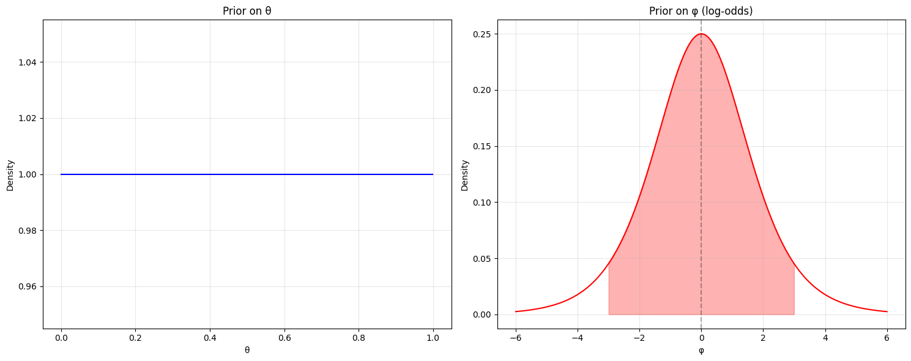

## Non-informative Priors

Let's start with what seems like a reasonable approach to expressing ignorance about a probability $θ$:

- We have a parameter $θ$ that represents a probability, so $θ ∈ (0,1)$
- We choose $π(θ) = 1$ for $θ ∈ (0,1)$, i.e., a $\text{Uniform}(0,1)$ distribution
- This seems to express "ignorance" because we're saying every value is equally likely

Now comes the clever insight: If we're truly ignorant about $θ$, shouldn't we also be ignorant about any transformation of $θ$? Let's look at the log-odds transformation:

$$φ = log(θ/(1-θ))$$

**The Paradox**

Here's where things get interesting. When we transform our uniform prior on $θ$ to the $φ$ scale, we need to use the change of variables formula:

$$p(φ) = π(θ(φ)) × |dθ/dφ|$$

Let's work through this:

- $π(θ(φ)) = 1$ (our uniform prior)
- $θ(φ) = eᶠ/(1 + eᶠ)$ (solving the log-odds equation for $θ$)
- $dθ/dφ = eᶠ/(1 + eᶠ)²$ (differentiating $θ(φ)$)

Therefore:

$$p(φ) = eᶠ/(1 + eᶠ)²$$

This means that what we thought was an "ignorant" prior about $θ$ actually implies:

- We believe values near $θ = 0.5$ are more likely
- We're quite confident $θ$ isn't very close to 0 or 1
- We have quite strong beliefs about the log-odds!

**The Deeper Lesson**

This example teaches us several important things:

- "Non-informative" priors are trickier than they seem
- Being "non-informative" in one parameterization can mean being quite informative in another
- We need to think carefully about which scale we want to be "non-informative" on

This is why statisticians often prefer other approaches to "non-informative" priors, such as:

- Jeffreys priors (which are invariant under transformation)
- Reference priors
- Maximum entropy priors

## Jeffreys Priors

Jeffreys priors are constructed to be invariant under reparameterization of the parameter space. This means that if we transform our parameter $\theta$ to a new parameter $\phi = g(\theta)$, the prior maintains its "non-informative" nature.

### Mathematical Definition

For a scalar parameter $\theta$, the Jeffreys prior is defined as:

$\pi(\theta) \propto \sqrt{I(\theta)}$

where $I(\theta)$ is the Fisher information:

$I(\theta) = E\left[-\frac{\partial^2}{\partial\theta^2}\log f(X|\theta)\right]$

### Key Properties

1. **Invariance**: If we transform $\theta$ to $\phi = g(\theta)$, the Jeffreys prior transforms properly:
   $\pi(\phi) = \pi(\theta)\left|\frac{d\theta}{d\phi}\right| = \sqrt{I(\theta)}\left|\frac{d\theta}{d\phi}\right| = \sqrt{I(\phi)}$

2. **Automatic Scale Determination**: The prior adapts to the natural scale of the parameter.

### Example: Normal Distribution

For a normal distribution with known variance $\sigma^2$, the Jeffreys prior for the mean $\mu$ is:

- $\pi(\mu) \propto \text{constant}$

For unknown variance $\sigma^2$:

- $\pi(\sigma^2) \propto \frac{1}{\sigma^2}$

## Reference Priors

Reference priors, developed by Bernardo and Berger, are designed to maximize the expected Kullback-Leibler divergence between prior and posterior distributions.

### Key Concepts

1. **Information Theory**: Based on the principle of maximizing missing information

2. **Order-Dependent**: For multiple parameters, the order matters. Parameters are ordered by importance.

3. **Limiting Process**: Defined through a sequence of increasingly large samples

### Mathematical Construction

For a model $f(x|\theta)$, let $X^{(n)}$ be a sample of size n. The reference prior maximizes:

$\lim_{n \to \infty} \int \left(\int p(\theta|x^{(n)}) \log \frac{p(\theta|x^{(n)})}{\pi(\theta)} d\theta\right) f(x^{(n)}) dx^{(n)}$

## Maximum Entropy Priors

Maximum entropy priors are based on maximizing Shannon's entropy subject to constraints that represent our actual knowledge.

### Mathematical Foundation

The entropy of a continuous distribution is:

$H(\pi) = -\int \pi(\theta)\log(\pi(\theta))d\theta$

### Construction Process

1. Maximize $H(\pi)$ subject to constraints:
   - $\int \pi(\theta)d\theta = 1$ (normalization)
   - $E[g_i(\theta)] = \mu_i$ for $i=1,\ldots,k$ (moment constraints)

### Common Examples

1. **No Constraints except Bounds**:

   - Parameter space $[a,b]$
   - Results in $\pi(\theta) = \frac{1}{b-a}$

2. **Known Mean**:

   - $E[\theta] = \mu$
   - Results in $\pi(\theta) \propto e^{-\lambda\theta}$

3. **Known Mean and Variance**:
   - $E[\theta] = \mu$, $\text{Var}(\theta) = \sigma^2$
   - Results in $\pi(\theta) \propto e^{-\lambda_1\theta - \lambda_2\theta^2}$

## Applied Example: Binomial Proportion

Consider a binomial proportion $\theta$:

1. **Jeffreys Prior**:
   $\pi(\theta) \propto [\theta(1-\theta)]^{-1/2}$

   - Beta(1/2, 1/2) distribution

2. **Reference Prior**:

   - Coincides with Jeffreys prior: $\pi(\theta) \propto [\theta(1-\theta)]^{-1/2}$

3. **Maximum Entropy Prior**:
   - With no constraints: Uniform(0,1)
   - With known mean $\mu$: $\pi(\theta) \propto e^{\lambda\theta}$, determined by solving $E[\theta] = \mu$

The posterior distributions would be:

$p(\theta|x) \propto \theta^{x+\alpha-1}(1-\theta)^{n-x+\beta-1}$

where $(\alpha,\beta)$ depends on the choice of prior:

- Jeffreys: $(\alpha,\beta) = (1/2,1/2)$
- Uniform: $(\alpha,\beta) = (1,1)$

## Examples : Location Parameters and Their Jeffreys Priors

Let's start with understanding location parameters and build our intuition about why they have such a simple Jeffreys prior.

Consider a probability model where:

- Parameter: $\theta \in \mathbb{R}$
- Density: $f(x|\theta) = g(x-\theta)$ for some function $g$

Here, $\theta$ is called a location parameter because it "shifts" or "locates" the distribution along the real line without changing its shape.

### Common Examples

1. **Normal Distribution**: $g$ could be $\phi(x) = \frac{1}{\sqrt{2\pi}}e^{-x^2/2}$ (standard normal PDF)
2. **Student's t Distribution**: $g$ could be the PDF of a $t_1$ (Cauchy distribution)

### Jeffreys Prior Result

For location parameters, Jeffreys rule gives us:
$\pi(\theta) \propto 1$ for $\theta \in \mathbb{R}$

**Intuition**: This makes sense because:

- Shifting a distribution left or right shouldn't change our prior beliefs
- The constant prior reflects this "location invariance"
- It represents complete uncertainty about where the distribution is centered

## Examples : Scale Parameters and Their Jeffreys Priors

Scale parameters control the spread or dispersion of a distribution.

### Definition and Properties

Consider a model where:

- Parameter: $\sigma > 0$
- Density: $f(x|\sigma) = \frac{1}{\sigma}g(x/\sigma)$ for some function $g$

$\sigma$ is called a scale parameter because it "stretches" or "compresses" the distribution.

### Common Examples

1. **Normal Distribution**: $\sigma$ is the standard deviation
2. **Gamma Distribution**: $\sigma = 1/\beta$ where $\beta$ is the rate parameter

### Jeffreys Prior Result

For scale parameters:
$\pi(\sigma) \propto \frac{1}{\sigma}$ for $\sigma > 0$

**Intuition**:

- This prior is invariant to scale transformations
- If we change units (e.g., meters to kilometers), our prior beliefs should transform accordingly
- The $\frac{1}{\sigma}$ form ensures this scale invariance

## Location-Scale Families

When we combine location and scale parameters, we get a rich class of distributions.

### Definition

A location-scale family has density:
$f(x|\theta,\sigma) = \frac{1}{\sigma}g(\frac{x-\theta}{\sigma})$

where:

- $\theta$ is the location parameter
- $\sigma$ is the scale parameter

### Jeffreys Prior for Independent Parameters

Under the assumption that $\theta$ and $\sigma$ are a priori independent:

$\pi(\theta,\sigma) \propto 1 \times \frac{1}{\sigma}$ for $\theta \in \mathbb{R}, \sigma > 0$

**Intuition**:

- The prior factorizes because we assume independence
- Each component maintains its individual interpretation
- Location shifts don't affect scale, and vice versa

### Example: Normal Distribution

For $X \sim N(\theta,\sigma^2)$:

- $g(z) = \frac{1}{\sqrt{2\pi}}e^{-z^2/2}$
- The Jeffreys prior becomes $\pi(\theta,\sigma) \propto \frac{1}{\sigma}$
- This gives us an improper prior, but often leads to proper posteriors

**Note**: This independence assumption, while convenient, isn't always optimal. The "full" Jeffreys prior (using the multivariate definition) can differ from this product form.
