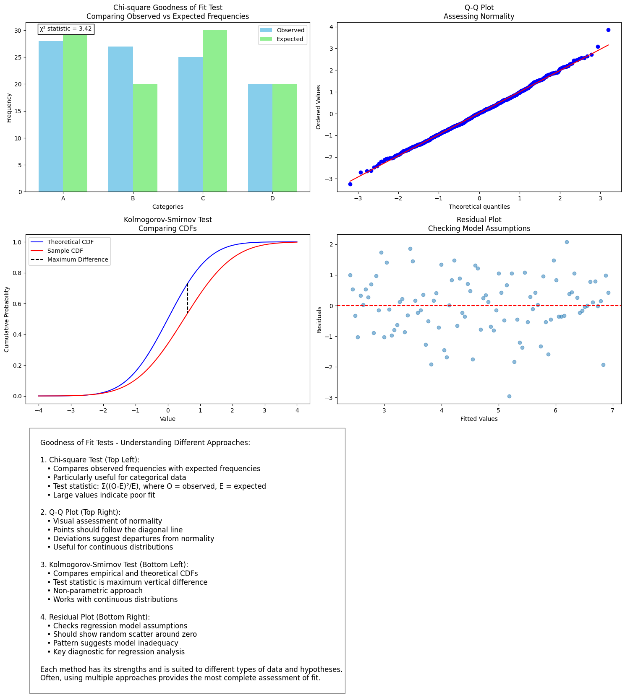

# Goodness of Fit Tests

## 1. Introduction to Multinomial Goodness of Fit Tests

### 1.1 The Basic Setup

Consider a situation where we're observing $n$ independent events, each falling into one of $k$ possible categories. This setup appears in many real-world scenarios:

- Genetic inheritance patterns
- Population distribution studies
- Quality control in manufacturing
- Ecological species distribution

For each category $i$ (where $i = 1,...,k$):

- $n_i$ = number of observations in category $i$
- $\pi_i$ = probability of an observation falling in category $i$
- Total observations: $\sum_{i=1}^k n_i = n$
- Total probability: $\sum_{i=1}^k \pi_i = 1$

### 1.2 The Multinomial Distribution

The probability of observing specific counts $n_1,...,n_k$ follows the multinomial distribution:

$L(\pi) = \frac{n!}{n_1! \cdots n_k!} \pi_1^{n_1} \cdots \pi_k^{n_k}$

Taking the log-likelihood:

$\ell(\pi) = \sum_{i=1}^k n_i \log \pi_i + \text{constant}$

## 2. Testing Framework

### 2.1 Hypotheses Structure

We want to test if our data follows a specific probability model:

$H_0: \pi_i = \pi_i(\theta)$, where $\theta \in \Theta$ (restricted model)
$H_1: \pi_i$ are unrestricted except $\sum_{i=1}^k \pi_i = 1$ (general model)

Where:

- dim($\Theta$) = $q$ < $k-1$
- dim($H_1$) = $k-1$ (general model)
- dim($H_0$) = $q$ (restricted model)

### 2.2 Likelihood Ratio Test Derivation

The key steps in deriving the test statistic:

1. **Under $H_1$ (Unrestricted Case)**:

   - Maximize $\ell(\pi) = \sum n_i \log \pi_i$ subject to $\sum \pi_i = 1$
   - Using Lagrange multiplier $\lambda$:
   - $\frac{\partial}{\partial \pi_i}[\sum n_i \log \pi_i - \lambda(\sum \pi_i - 1)] = 0$
   - Gives: $\hat{\pi}_i = \frac{n_i}{n}$

2. **Under $H_0$ (Restricted Case)**:

   - Find $\hat{\theta}$ that maximizes $\sum n_i \log \pi_i(\theta)$
   - Results in $\pi_i(\hat{\theta})$

3. **Likelihood Ratio Statistic**:

   $\Lambda = -2 \log(\frac{\sup_{H_0} L}{\sup_{H_1} L}) = 2\sum n_i \log(\frac{n_i}{n\pi_i(\hat{\theta})})$

### 2.3 Pearson's Chi-squared Approximation

The likelihood ratio statistic can be approximated:

$\Lambda \approx \sum \frac{(O_i - E_i)^2}{E_i} = P$

Where:

- $O_i = n_i$ (observed counts)
- $E_i = n\pi_i(\hat{\theta})$ (expected counts)

## 3. Example: Hardy-Weinberg Equilibrium

Consider a genetic test for alleles A and a:

**Possible Genotypes:**

- AA (homozygous dominant)
- Aa (heterozygous)
- aa (homozygous recessive)

Let $p$ = frequency of allele A. Under Hardy-Weinberg:

- $\pi_{AA} = p^2$
- $\pi_{Aa} = 2p(1-p)$
- $\pi_{aa} = (1-p)^2$

### 3.1 Analysis Steps

```python
# Example data
n_AA = 320  # Count of AA genotype
n_Aa = 490  # Count of Aa genotype
n_aa = 190  # Count of aa genotype
n_total = n_AA + n_Aa + n_aa

# Calculate observed frequencies
p_hat = (2*n_AA + n_Aa)/(2*n_total)

# Expected counts under H0
E_AA = n_total * p_hat**2
E_Aa = n_total * 2*p_hat*(1-p_hat)
E_aa = n_total * (1-p_hat)**2

# Calculate chi-square statistic
chi_square = ((n_AA - E_AA)**2/E_AA +
              (n_Aa - E_Aa)**2/E_Aa +
              (n_aa - E_aa)**2/E_aa)

# Degrees of freedom = k-1-q = 3-1-1 = 1
```

### 3.2 Decision Making

Compare $\chi^2$ statistic to critical value from $\chi^2_1$ distribution:

- If statistic > critical value: Reject $H_0$
- If statistic ≤ critical value: Fail to reject $H_0$

## 4. Practical Considerations

1. **Sample Size Requirements**:

   - Expected counts should generally be ≥ 5
   - Combine categories if necessary

2. **Power Considerations**:

   - Power increases with sample size
   - Power depends on effect size (departure from $H_0$)

3. **Model Assumptions**:
   - Independent observations
   - Fixed total sample size
   - Well-defined categories



# Two-Way Contingency Tables:

## 1. Introduction and Fundamentals

### 1.1 Basic Concept

A two-way contingency table represents the relationship between two categorical variables, where each observation falls into exactly one cell. Let's understand this through both theory and practical examples.

### 1.2 Table Structure

Consider a table with:

- $r$ rows (first categorical variable)
- $c$ columns (second categorical variable)
- $n_{ij}$ observations in cell $(i,j)$
- Total sample size $n = \sum_{i=1}^r \sum_{j=1}^c n_{ij}$

## 2. Mathematical Framework

### 2.1 Probability Model

Let $\pi_{ij}$ be the probability of an observation falling in cell $(i,j)$. The likelihood function is:

$L(\pi) = \frac{n!}{\prod_{i=1}^r \prod_{j=1}^c n_{ij}!} \prod_{i=1}^r \prod_{j=1}^c \pi_{ij}^{n_{ij}}$

Taking the log-likelihood:

$\ell(\pi) = \sum_{i=1}^r \sum_{j=1}^c n_{ij}\log(\pi_{ij}) + \text{constant}$

### 2.2 Testing Independence

The key hypotheses are:

- $H_0: \pi_{ij} = \alpha_i\beta_j$ for all $i,j$ (independence)
- $H_1:$ No restrictions on $\pi_{ij}$ except $\sum_{i}\sum_{j}\pi_{ij} = 1$

where:

- $\alpha_i$ = row probability
- $\beta_j$ = column probability
- $\sum_{i}\alpha_i = 1$ and $\sum_{j}\beta_j = 1$

## 3. Derivation of Test Statistics

### 3.1 Maximum Likelihood Estimates

Under $H_0$ (independence):

- $\hat{\alpha}_i = \frac{n_{i+}}{n}$ (row proportions)
- $\hat{\beta}_j = \frac{n_{+j}}{n}$ (column proportions)

Under $H_1$ (unrestricted):

- $\hat{\pi}_{ij} = \frac{n_{ij}}{n}$

### 3.2 Likelihood Ratio Statistic

The test statistic is:

$\Lambda = 2\sum_{i=1}^r \sum_{j=1}^c n_{ij}\log(\frac{n_{ij}n}{n_{i+}n_{+j}})$

### 3.3 Pearson's Chi-Square Statistic

An equivalent test uses:

$\chi^2 = \sum_{i=1}^r \sum_{j=1}^c \frac{(O_{ij} - E_{ij})^2}{E_{ij}}$

where:

- $O_{ij} = n_{ij}$ (observed frequencies)
- $E_{ij} = \frac{n_{i+}n_{+j}}{n}$ (expected frequencies under independence)

## 4. Practical Implementation

Here's a Python implementation with explanatory comments:

```python
import numpy as np
from scipy.stats import chi2

def analyze_contingency_table(data):
    """
    Analyze a two-way contingency table

    Parameters:
    data: numpy array of observed frequencies
    """
    # Calculate row and column totals
    row_totals = np.sum(data, axis=1)
    col_totals = np.sum(data, axis=0)
    n = np.sum(data)

    # Calculate expected frequencies under independence
    expected = np.outer(row_totals, col_totals) / n

    # Calculate chi-square statistic
    chi_square = np.sum((data - expected)**2 / expected)

    # Calculate degrees of freedom
    r, c = data.shape
    df = (r-1) * (c-1)

    # Calculate p-value
    p_value = 1 - chi2.cdf(chi_square, df)

    return {
        'chi_square': chi_square,
        'df': df,
        'p_value': p_value,
        'expected': expected
    }

# Example usage
data = np.array([
    [10, 5, 15],
    [20, 15, 25],
    [15, 10, 20]
])

results = analyze_contingency_table(data)
```

## 5. Practical Considerations and Assumptions

### 5.1 Sample Size Requirements

- Expected frequencies should generally be ≥ 5
- If not met, consider:
  - Combining categories
  - Using exact tests
  - Using simulation-based methods

### 5.2 Degrees of Freedom

The degrees of freedom are calculated as:

- $df = (r-1)(c-1)$
- This represents the number of free parameters under $H_0$

### 5.3 Interpreting Results

1. Calculate test statistic
2. Compare to critical value from $\chi^2_{(r-1)(c-1)}$ distribution
3. Examine standardized residuals:
   $r_{ij} = \frac{O_{ij} - E_{ij}}{\sqrt{E_{ij}}}$

## What is a Contingency Table?

Think of a contingency table like a special kind of spreadsheet that helps us see if two characteristics are related. Let's use a real-world example:
Imagine you own a coffee shop and want to know if the time of day (Morning, Afternoon, Evening) affects what type of coffee people order (Regular, Latte, Espresso).

| Time      | Regular   | Latte    | Espresso   | Total   |
| --------- | --------- | -------- | ---------- | ------- |
| Morning   | 45        | 30       | 25         | 100     |
| Afternoon | 40        | 45       | 15         | 100     |
| Evening   | 30        | 35       | 35         | 100     |
| --------  | --------- | -------- | ---------- | ------- |
| Total     | 115       | 110      | 75         | 300     |

We want to answer: "Does the time of day influence what coffee people order?" Or in statistical terms: "Are these variables independent?"

If time of day and coffee choice are independent, it means:

- The proportion of people ordering each type of coffee should be roughly the same regardless of the time of day
- Any differences we see are just due to chance
