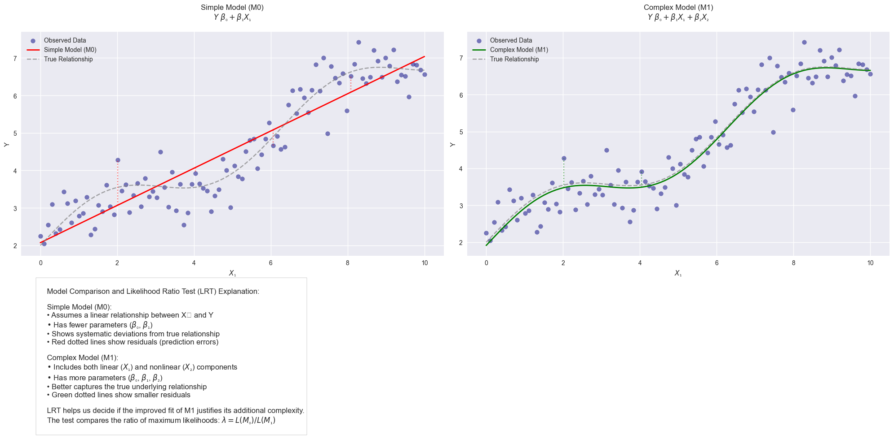
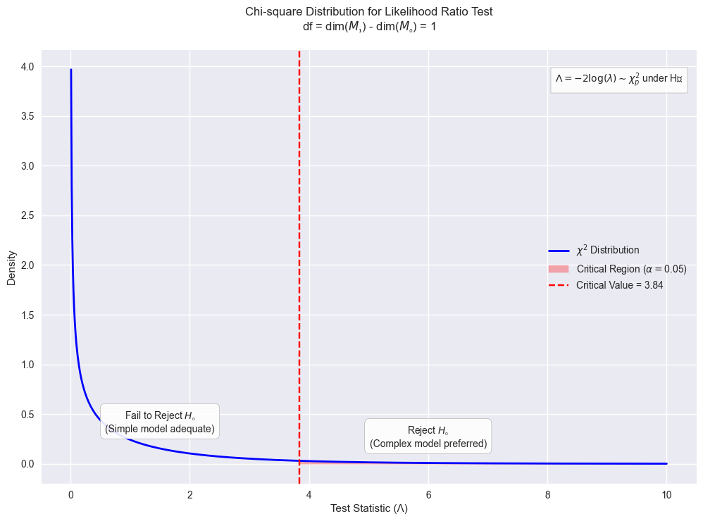
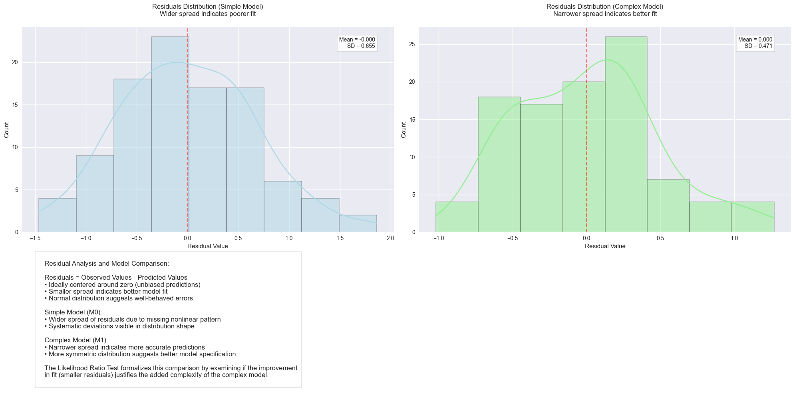
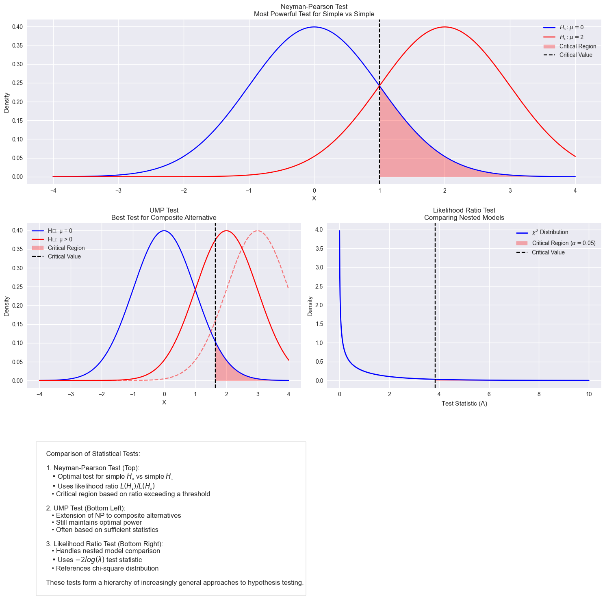

# Likelihood Ratio Tests:

## 1. Fundamental Concepts

### 1.1 The Core Idea

The Likelihood Ratio Test (LRT) is based on comparing two competing models where one model is a special case of the other. Mathematically, we have:

$H_0: \theta \in \Theta_0$ (null hypothesis)
$H_1: \theta \in \Theta$ (alternative hypothesis)

where $\Theta_0 \subset \Theta$

The likelihood ratio $\lambda(x)$ is defined as:

$$\lambda(x) = \frac{\sup_{\theta \in \Theta_0} L(\theta;x)}{\sup_{\theta \in \Theta} L(\theta;x)}$$

### 1.2 Intuitive Understanding

Think of model comparison as trying different lenses to view data:

- $\Theta_0$ is like looking through a basic lens (restricted view)
- $\Theta$ is like looking through an advanced lens (broader view)

The ratio $\lambda(x)$ tells us how much clarity we gain by using the advanced lens:

- $\lambda(x) \approx 1$: Basic lens is nearly as good
- $\lambda(x) \approx 0$: Advanced lens shows much more detail

## 2. Detailed Examples

### 2.1 Normal Distribution Mean Testing

Let's work through a complete example testing a normal distribution's mean.

**Problem Setup:**
Given $X_1, ..., X_n \stackrel{iid}{\sim} N(\mu, \sigma^2)$, test:
$H_0: \mu = \mu_0$ vs $H_1: \mu \in \mathbb{R}$ (with unknown $\sigma^2$)

**Step 1: Write the Likelihood Function**
$$L(\mu, \sigma^2) = (2\pi\sigma^2)^{-n/2}\exp\left[-\frac{1}{2\sigma^2}\sum(x_i-\mu)^2\right]$$

**Step 2: Find Maximum Under $H_0$**

- Fix $\mu = \mu_0$
- Maximize over $\sigma^2$:
  $$\hat{\sigma}_0^2 = \frac{1}{n}\sum(x_i-\mu_0)^2$$

**Step 3: Find Maximum Under $H_1$**

- Maximize over both $\mu$ and $\sigma^2$:
  $$\hat{\mu} = \bar{x}$$
  $$\hat{\sigma}^2 = \frac{1}{n}\sum(x_i-\bar{x})^2$$

**Step 4: Form Likelihood Ratio**
After simplification:
$$\lambda(x) = \left[1 + \frac{n(\bar{x}-\mu_0)^2}{\sum(x_i-\bar{x})^2}\right]^{-n/2}$$

### 2.2 Exponential Distribution Testing

Let's look at another example with exponential distributions.

**Problem Setup:**
Given $X_1, ..., X_n \stackrel{iid}{\sim} Exp(\theta)$, test:
$H_0: \theta = \theta_0$ vs $H_1: \theta > 0$

**Solution:**
The likelihood function is:
$$L(\theta) = \theta^n\exp\left(-\theta\sum_{i=1}^n x_i\right)$$

Under $H_0$: $L(\theta_0) = \theta_0^n\exp\left(-\theta_0\sum x_i\right)$

Under $H_1$: Maximum occurs at $\hat{\theta} = \frac{n}{\sum x_i}$

Therefore:
$$\lambda(x) = \left(\frac{\theta_0}{\hat{\theta}}\right)^n\exp\{n(1-\frac{\theta_0}{\hat{\theta}})\}$$

## 3. The Likelihood Ratio Statistic

### 3.1 Mathematical Theory

The likelihood ratio statistic is defined as:
$$\Lambda(X) = -2\log\lambda(X)$$

Under regularity conditions and $H_0$ true:
$$\Lambda(X) \stackrel{D}{\rightarrow} \chi^2_p$$

where $p = \dim(\Theta) - \dim(\Theta_0)$

### 3.2 Asymptotic Theory Explained

The convergence to chi-square distribution occurs because:

1. Under regularity conditions:
   $$\hat{\theta} \stackrel{approx}{\sim} N(\theta_0, [I(\theta_0)]^{-1})$$

2. Then:
   $$(\hat{\theta}-\theta_0)^2I(\theta_0) \stackrel{D}{\rightarrow} \chi^2_1$$

3. For vector parameters:
   $$(\hat{\theta}-\theta_0)^TI(\theta_0)(\hat{\theta}-\theta_0) \stackrel{D}{\rightarrow} \chi^2_p$$

## 4. Practical Applications

### 4.1 Model Selection Example

Let's start by understanding what we're comparing:

**Simple Model (M0):**

$Y = \beta_0 + \beta_1X_1 + \epsilon$ where $\epsilon \sim N(0, \sigma^2)$

**Complex Model (M1):**

$Y = \beta_0 + \beta_1X_1 + \beta_2X_2 + \epsilon$ where $\epsilon \sim N(0, \sigma^2)$

Think of this like comparing two theories:

- M0 says: "Y can be explained by just $X₁$"
- M1 says: "Y needs both $X₁$ and $X₂$ for better explanation"

The likelihood ratio test statistic is:
$$\Lambda = n\log\left(\frac{RSS_0}{RSS_1}\right)$$

where:

- RSS₀ = Residual Sum of Squares for M0 = $\sum(y_i - \hat{y}_i^{(0)})^2$
- RSS₁ = Residual Sum of Squares for M1 = $\sum(y_i - \hat{y}_i^{(1)})^2$
- n = sample size

Here's the key part about choosing critical regions:

Under H₀ (when the simple model is adequate):
$$\Lambda \sim \chi^2_p$$
where $p =$ difference in number of parameters $= 1$ in this case
($M1$ has one more parameter, $β₂$, than $M0$)

Choose $α$ (typically $0.05$ or $0.01$)

Find $c$ where $P(χ²₁ > c) = α$

Reject $H₀$ (choose complex model) if $Λ > c$

Let's work through a concrete example:

#### Practical Example

Suppose we have data:

```python
# Sample data
X1 = [1, 2, 3, 4, 5]
X2 = [2, 4, 5, 4, 5]
Y = [2.1, 4.3, 6.8, 8.2, 9.7]

# Calculate RSS for both models
RSS0 = 2.3  # From simple model
RSS1 = 1.8  # From complex model
n = 5

# Calculate test statistic
Lambda = n * log(RSS0/RSS1)
# Lambda = 5 * log(2.3/1.8) = 1.21
```

**Decision Process:**

- At $α = 0.05$, critical value from $χ²_1$ is $3.84$
- Since $1.21 < 3.84$, we fail to reject $H₀$
- Conclusion: Simple model is adequate

#### Important Considerations

**Why We Use This Approach**

- $RSS₁$ will always be $≤ RSS₀$ (complex model always fits at least as well)

- But we "penalize" complexity through the distribution's degrees of freedom

- Balance between fit and simplicity

**Power of the Test**

- The critical region also relates to the test's power:

- Larger $α →$ Larger critical region $→$ More likely to choose complex model

- Smaller $α →$ Smaller critical region $→$ More conservative about complexity

**Sample Size Effects**

- Large $n:$ Test becomes more sensitive to small differences

- Small $n:$ Need larger RSS differences to reject $H₀$

### 4.2 Genetic Testing Example

In genetic association studies:

$H_0$: No association between genetic variant and trait
$H_1$: Association exists

The LRT compares:
$$\lambda = \frac{L(\text{null model})}{L(\text{genetic model})}$$

## 5. Implementation Tips

1. **Numerical Stability**

   - Work with log-likelihoods when possible
   - Use algebraic simplifications before computation
   - Watch for underflow/overflow in exponentials

2. **Sample Size Considerations**

   - Small samples: Use exact distributions or simulation
   - Large samples: Chi-square approximation is reliable
   - Rule of thumb: n > 30p for p parameters

3. **Model Checking**
   - Verify regularity conditions
   - Check parameter identifiability
   - Assess model assumptions







---


