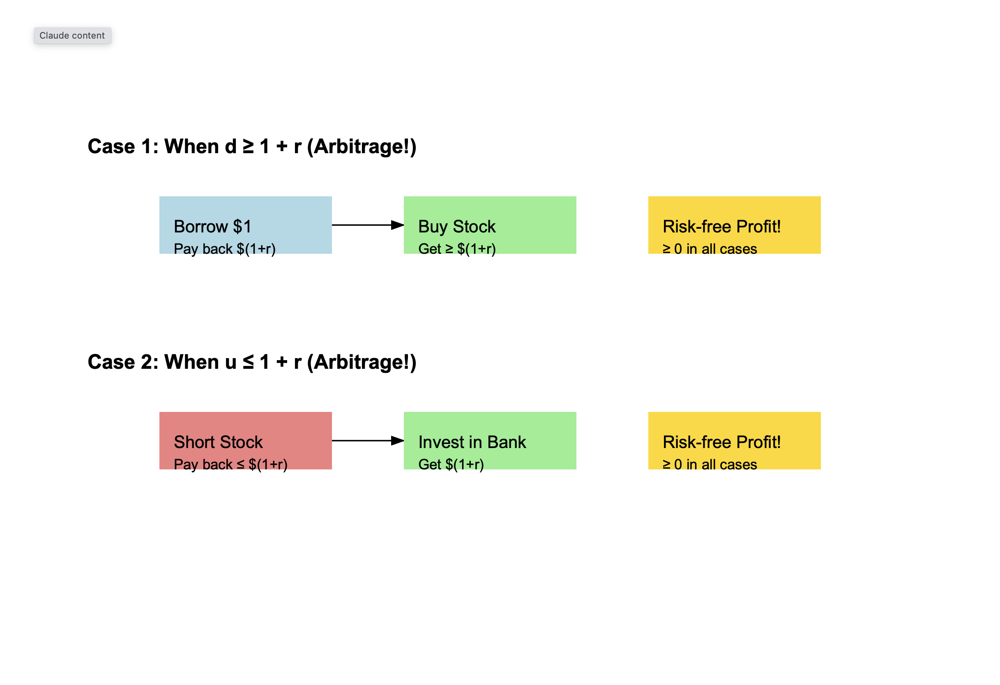
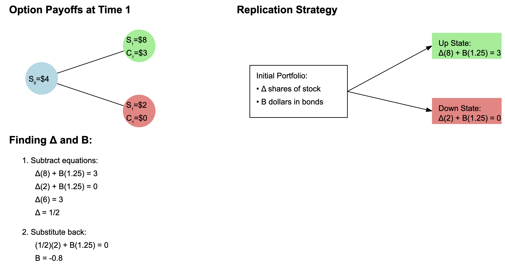
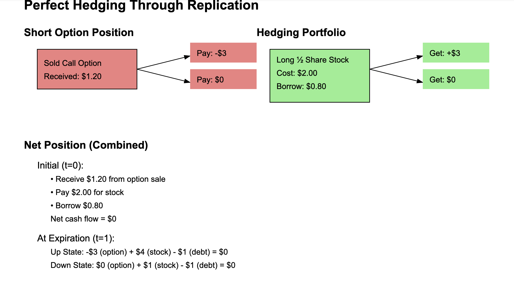

# The Binomial Model and Options Pricing:

## I. Foundation: The One-Period Model

The one-period binomial model represents the simplest framework for understanding option pricing. In this model, a stock can only move up or down over a single time period.

### Key Components

1. **Initial Stock Price (S₀)**: The known price at time zero
2. **Up Factor (u)**: Multiplier if stock moves up
3. **Down Factor (d)**: Multiplier if stock moves down
4. **Risk-free Rate (r)**: Interest rate for borrowing/lending

### Example Values

```
S₀ = $4
u = 2 (meaning up-move to $8)
d = 0.5 (meaning down-move to $2)
r = 25% (or 0.25)
```

## II. Mathematical Framework: No-Arbitrage Conditions

The foundation of option pricing rests on the principle of no-arbitrage. This means no risk-free profits should be possible.



### The No-Arbitrage Bounds

```
0 < d < 1 + r < u
```

### Understanding the Bounds

**If d ≥ 1 + r:**

- Borrow money at rate r
- Buy stock
- Guaranteed profit even in worst case

**If u ≤ 1 + r:**

- Short stock
- Invest proceeds at risk-free rate
- Guaranteed profit even in best case

## III. Replication Strategy and Perfect Hedging

The core insight of option pricing is that we can perfectly replicate an option's payoffs using a combination of stock and bonds.



### The Replication Process

1. **Calculate option payoffs at expiration:**

   ```
   Up state: max(S₁(H) - K, 0) = max(8 - 5, 0) = 3
   Down state: max(S₁(T) - K, 0) = max(2 - 5, 0) = 0
   ```

2. **Find the perfect hedge ratio (Δ):**

   ```
   Δ(8) + B(1.25) = 3
   Δ(2) + B(1.25) = 0
   Solving gives: Δ = 1/2
   ```

3. **Calculate the bond position (B):**

   ```
   (1/2)(2) + B(1.25) = 0
   Solving gives: B = -0.8
   ```

4. **Option price = Cost of replication:**

   ```
   Price = ΔS₀ + B
   = (1/2)(4) + (-0.8)
   = 2 - 0.8
   = 1.20
   ```

   

This strategy gives you perfect protection because:

- If the stock goes up and you lose money on the option, you make exactly enough on your stock position to cover it
- If the stock goes down and the option expires worthless, your stock loss is exactly offset by not having to pay anything on the option

## IV. Real-World Applications: Making Money

While perfect hedging theoretically yields zero profit, traders make money through several mechanisms:

### 1. Bid-Ask Spread

In our example, instead of selling the option at exactly $1.20, a market maker might:

- Buy options at $1.15 (bid price)
- Sell options at $1.25 (ask price)
- Capture the $0.10 spread on each transaction

### 2. VOLATILITY ARBITRAGE

Traders make money when they believe the market's implied volatility is wrong:

- If you think the market is overestimating volatility: Sell options and hedge
- If you think the market is underestimating volatility: Buy options and hedge
- Profit comes from the volatility difference, not the directional movement

### 3. Market Making

Major banks and trading firms make money by:

- Providing liquidity constantly
- Handling large volumes of trades
- Earning small spreads on each trade
- Having lower transaction costs than others

### 4. Risk Premium

Sellers of options often earn a premium because:

- Most people want to buy insurance (options) rather than sell it
- Option sellers can charge a premium for providing this insurance
- Over time, this premium tends to be profitable if properly managed

## V. Extensions and Advanced Concepts

### 1. Multi-Period Model

- Chain of one-period models
- Backward induction for pricing
- Dynamic hedging requirements
- Path independence property

### 2. Connection to Black-Scholes

- Binomial model converges to Black-Scholes
- Continuous-time limit
- Volatility becomes key parameter
- Continuous hedging requirement

### 3. Practical Considerations

- Transaction costs
- Discrete hedging
- Bid-ask spreads
- Market impact
- Risk management

## Conclusion

This framework provides the foundation for understanding not just options pricing, but many concepts in modern finance, including:

- Risk-neutral pricing
- Dynamic hedging
- Market completeness
- Financial engineering
- Derivatives pricing

### Mathematical Appendix

The key equations that drive the model:

```
Option Payoff: C(T) = max(S(T) - K, 0)
Replication Portfolio: V(t) = Δ×S(t) + B×(1+r)^t
No-Arbitrage Condition: 0 < d < 1 + r < u
Delta Calculation: Δ = (Cu - Cd)/(Su - Sd)
```

Where:

- C(T) is the call option value at expiration
- V(t) is the portfolio value at time t
- Δ is the hedge ratio
- Cu, Cd are option values in up/down states
- Su, Sd are stock prices in up/down states
